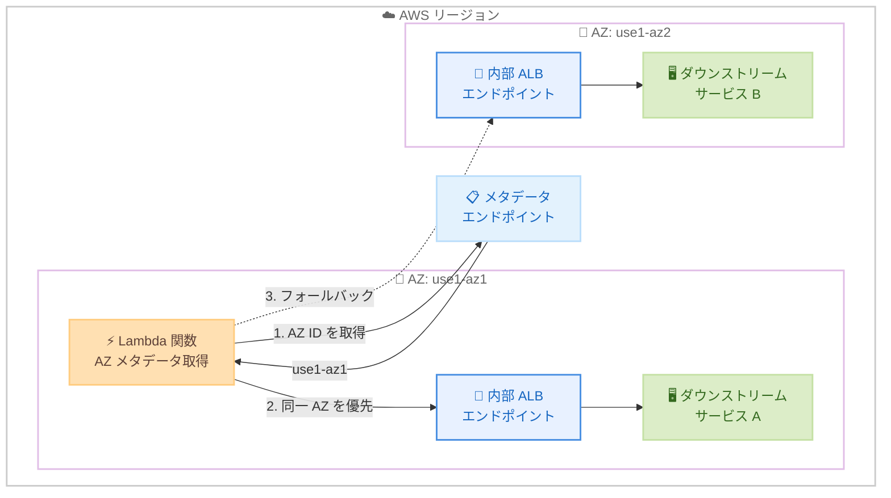

# AWS Lambda - Availability Zone メタデータのサポート

**リリース日**: 2026 年 3 月 19 日
**サービス**: AWS Lambda
**機能**: Availability Zone メタデータエンドポイント

📊 [このアップデートのインフォグラフィックを見る](https://takech9203.github.io/aws-news-summary/20260319-lambda-availability-zone-metadata.html)

## 概要

AWS Lambda が実行環境内で Availability Zone (AZ) メタデータを提供する新しいメタデータエンドポイントをサポートしました。開発者は Lambda 関数が実行されている AZ の AZ ID (例: use1-az1) を取得でき、AZ を考慮したルーティング判断が可能になります。

このアップデートにより、ダウンストリームサービスへのリクエスト時に同一 AZ のエンドポイントを優先的に選択することで、クロス AZ レイテンシーを削減できます。また、AZ 固有のフォールトインジェクションテストも実現できます。Powertools for AWS Lambda のメタデータユーティリティを使用するか、メタデータエンドポイントに直接アクセスして AZ 情報を取得できます。すべての Lambda ランタイム (カスタムランタイムやコンテナイメージを含む) でサポートされ、SnapStart やプロビジョンドコンカレンシーでも動作します。追加料金なしですべての商用 AWS リージョンで利用可能です。

**アップデート前の課題**

- Lambda 関数がどの AZ で実行されているか確認する手段がなかった
- クロス AZ 通信によるレイテンシーの増加を回避するための AZ 対応ルーティングが実装できなかった
- AZ 固有の障害をシミュレートするフォールトインジェクションテストが困難だった

**アップデート後の改善**

- メタデータエンドポイントから AZ ID を取得し、実行中の AZ を正確に特定できるようになった
- 同一 AZ のエンドポイントを優先するルーティングを実装でき、クロス AZ レイテンシーを削減できるようになった
- AZ 固有のフォールトインジェクションテストが実現可能になり、耐障害性の検証が容易になった

## アーキテクチャ図



この図は、Lambda 関数がメタデータエンドポイントから AZ ID を取得し、同一 AZ 内のダウンストリームサービスを優先的にルーティングする流れを示しています。クロス AZ へのアクセスはフォールバックとして使用されます。

## サービスアップデートの詳細

### 主要機能

1. **AZ メタデータエンドポイント**
   - Lambda 実行環境内で新しいメタデータエンドポイントを提供
   - AZ ID (例: use1-az1) を取得可能
   - AZ ID はアカウント間で一貫した物理的な AZ の識別子

2. **AZ 対応ルーティング**
   - 同一 AZ 内のエンドポイントを優先する AZ アウェアなルーティング判断が可能
   - クロス AZ レイテンシーの削減に貢献
   - ダウンストリームサービスとの通信を最適化

3. **AZ 固有のフォールトインジェクションテスト**
   - 特定の AZ に対する障害注入テストが実装可能
   - 耐障害性の検証とカオスエンジニアリングに活用
   - AWS Fault Injection Service (FIS) と組み合わせた AZ レベルの障害シミュレーション

4. **幅広いランタイムサポート**
   - すべての Lambda ランタイムで利用可能
   - カスタムランタイムおよびコンテナイメージでもサポート
   - SnapStart およびプロビジョンドコンカレンシーとの互換性

## 技術仕様

### メタデータエンドポイント

| 項目 | 詳細 |
|------|------|
| エンドポイント | Lambda 実行環境内のメタデータ API |
| 取得可能な情報 | AZ ID (例: use1-az1, apne1-az4) |
| AZ ID 形式 | リージョンプレフィックス + AZ 番号 |
| AZ Name との違い | AZ ID はアカウント間で同じ物理 AZ を指す (AZ Name はアカウントごとにマッピングが異なる) |
| サポートランタイム | すべてのランタイム (マネージド、カスタム、コンテナ) |
| SnapStart 対応 | 対応 |
| プロビジョンドコンカレンシー対応 | 対応 |

### API 変更履歴

現時点で、このアップデートに関連する Lambda API の変更は awsapichanges.com に記録されていません。メタデータは Lambda 実行環境内のローカルエンドポイントから取得するため、既存の Lambda API に対する変更は不要です。

### Powertools for AWS Lambda の使用例

```python
# Powertools for AWS Lambda (Python) を使用した AZ メタデータ取得
from aws_lambda_powertools.utilities.metadata import get_availability_zone

def lambda_handler(event, context):
    az_id = get_availability_zone()
    print(f"Current AZ: {az_id}")  # 例: use1-az1

    # AZ ID に基づいてダウンストリームエンドポイントを選択
    endpoint = select_same_az_endpoint(az_id)
    response = call_downstream_service(endpoint)
    return response
```

### メタデータエンドポイントの直接呼び出し

```python
import urllib.request
import os

def get_az_id():
    """Lambda メタデータエンドポイントから AZ ID を取得"""
    metadata_url = f"http://localhost:9001/2024-11-28/az-id"
    req = urllib.request.Request(metadata_url)
    with urllib.request.urlopen(req) as response:
        return response.read().decode("utf-8")
```

## 設定方法

### 前提条件

1. AWS Lambda 関数が作成されていること
2. 対象の Lambda 関数が商用 AWS リージョンにデプロイされていること
3. Powertools for AWS Lambda を使用する場合は、対応するバージョンがインストールされていること

### 手順

#### ステップ 1: AZ メタデータの取得方法を選択

Powertools for AWS Lambda を使用するか、メタデータエンドポイントに直接アクセスする 2 つの方法があります。Powertools を使用する場合は、Lambda Layer として追加するのが最も簡単です。

```bash
# Powertools for AWS Lambda (Python) を Lambda Layer として追加
aws lambda update-function-configuration \
  --function-name my-function \
  --layers arn:aws:lambda:us-east-1:017000801446:layer:AWSLambdaPowertoolsPythonV3:latest
```

Powertools の Lambda Layer を関数に追加します。

#### ステップ 2: AZ 対応ルーティングの実装

```python
import os
from aws_lambda_powertools.utilities.metadata import get_availability_zone

# AZ ごとのエンドポイントマッピング
AZ_ENDPOINTS = {
    "use1-az1": "https://service-az1.internal.example.com",
    "use1-az2": "https://service-az2.internal.example.com",
    "use1-az4": "https://service-az4.internal.example.com",
}
DEFAULT_ENDPOINT = "https://service.internal.example.com"

def lambda_handler(event, context):
    az_id = get_availability_zone()

    # 同一 AZ のエンドポイントを優先
    endpoint = AZ_ENDPOINTS.get(az_id, DEFAULT_ENDPOINT)

    # ダウンストリームサービスを呼び出し
    response = call_service(endpoint)
    return response
```

Lambda 関数内で AZ ID を取得し、同一 AZ 内のエンドポイントを優先的に選択するロジックを実装します。

#### ステップ 3: AZ 情報のログ出力と監視

```python
from aws_lambda_powertools import Logger
from aws_lambda_powertools.utilities.metadata import get_availability_zone

logger = Logger()

def lambda_handler(event, context):
    az_id = get_availability_zone()
    logger.append_keys(az_id=az_id)
    logger.info("Function invoked", extra={"az_id": az_id})

    # ビジネスロジック
    result = process_event(event)
    return result
```

AZ ID をログに含めることで、AZ ごとのパフォーマンスや障害パターンの分析が可能になります。

## メリット

### ビジネス面

- **レイテンシー削減**: 同一 AZ ルーティングにより、クロス AZ 通信のレイテンシーを削減し、ユーザー体験を向上できます
- **コスト最適化**: クロス AZ データ転送を削減することで、データ転送コストを最適化できます
- **耐障害性の向上**: AZ 固有のフォールトインジェクションテストにより、障害発生時のシステムの挙動を事前に検証できます

### 技術面

- **AZ アウェアアーキテクチャ**: サーバーレスアプリケーションでも AZ を意識したアーキテクチャ設計が可能になります
- **カオスエンジニアリング**: AZ レベルの障害注入テストにより、分散システムの耐障害性を体系的に検証できます
- **可観測性の向上**: AZ ID をログやメトリクスに含めることで、AZ ごとのパフォーマンス分析が可能になります
- **追加コストなし**: 既存の Lambda 関数に追加料金なしで AZ メタデータ機能を利用できます

## デメリット・制約事項

### 制限事項

- AZ ID は Lambda 実行環境の起動時に決定され、実行中に変更されることはありません
- AZ 対応ルーティングの実装は開発者が自ら行う必要があり、自動的に最適化されるわけではありません
- ダウンストリームサービスが AZ ごとにエンドポイントを分離していない場合、AZ ルーティングのメリットを活かせません

### 考慮すべき点

- AZ 対応ルーティングを実装する場合、特定の AZ に障害が発生した際のフォールバックロジックも合わせて実装する必要があります
- AZ ID はアカウント間で一貫していますが、AZ Name (us-east-1a など) はアカウントごとにマッピングが異なるため、AZ ID を使用することが重要です
- プロビジョンドコンカレンシーを使用している場合、特定の AZ に偏る可能性があるため、ルーティングの効果を監視する必要があります

## ユースケース

### ユースケース 1: 同一 AZ 優先ルーティングによるレイテンシー最適化

**シナリオ**: マイクロサービスアーキテクチャにおいて、Lambda 関数から Amazon ElastiCache や Amazon RDS などのダウンストリームサービスにアクセスする際、同一 AZ のエンドポイントを優先して低レイテンシーを実現する

**実装例**:
```python
from aws_lambda_powertools.utilities.metadata import get_availability_zone

# ElastiCache の AZ 別エンドポイント
CACHE_ENDPOINTS = {
    "use1-az1": "cache-az1.xxxxx.use1.cache.amazonaws.com",
    "use1-az2": "cache-az2.xxxxx.use1.cache.amazonaws.com",
}

def lambda_handler(event, context):
    az_id = get_availability_zone()
    cache_endpoint = CACHE_ENDPOINTS.get(az_id, list(CACHE_ENDPOINTS.values())[0])

    # 同一 AZ の ElastiCache ノードに接続
    cache_client = connect_to_cache(cache_endpoint)
    data = cache_client.get("key")
    return {"data": data, "az": az_id}
```

**効果**: クロス AZ 通信を回避することで、ネットワークレイテンシーを数ミリ秒削減し、高頻度呼び出しのアプリケーションで大きなパフォーマンス改善が期待できます

### ユースケース 2: AZ 固有のフォールトインジェクションテスト

**シナリオ**: AWS Fault Injection Service (FIS) と組み合わせて、特定の AZ で動作する Lambda 関数の障害挙動をテストする

**実装例**:
```python
import os
from aws_lambda_powertools.utilities.metadata import get_availability_zone

FAULT_INJECTION_AZ = os.environ.get("FAULT_INJECTION_AZ", "")

def lambda_handler(event, context):
    az_id = get_availability_zone()

    # フォールトインジェクション: 特定の AZ でエラーを発生させる
    if FAULT_INJECTION_AZ and az_id == FAULT_INJECTION_AZ:
        raise Exception(f"Simulated AZ failure in {az_id}")

    # 通常のビジネスロジック
    return process_event(event)
```

**効果**: AZ レベルの障害シミュレーションにより、マルチ AZ 構成の耐障害性を事前に検証し、本番環境での障害対応力を向上できます

### ユースケース 3: AZ ごとのパフォーマンスモニタリング

**シナリオ**: AZ ID をカスタムメトリクスに含め、AZ ごとのレイテンシーやエラー率を監視してパフォーマンスの偏りを検出する

**実装例**:
```python
from aws_lambda_powertools import Logger, Metrics
from aws_lambda_powertools.metrics import MetricUnit
from aws_lambda_powertools.utilities.metadata import get_availability_zone

logger = Logger()
metrics = Metrics()

@metrics.log_metrics
def lambda_handler(event, context):
    az_id = get_availability_zone()
    metrics.add_dimension(name="AvailabilityZone", value=az_id)

    import time
    start = time.time()
    result = process_event(event)
    duration = (time.time() - start) * 1000

    metrics.add_metric(
        name="ProcessingLatency",
        unit=MetricUnit.Milliseconds,
        value=duration
    )
    return result
```

**効果**: AZ ごとのパフォーマンスを可視化し、特定の AZ でのレイテンシー増加やエラー率の上昇を早期に検出できます

## 料金

AZ メタデータ機能は追加料金なしで利用可能です。通常の AWS Lambda の料金体系が適用されます。

### 料金例

| 使用量 | 月額料金 (概算) |
|--------|------------------|
| 100 万リクエスト、128MB メモリ、平均 200ms 実行 | $0.20 + $0.42 = $0.62 |
| 1,000 万リクエスト、512MB メモリ、平均 500ms 実行 | $2.00 + $41.67 = $43.67 |

※ AWS Lambda の無料利用枠 (月間 100 万リクエストと 40 万 GB-秒) が適用されます。AZ メタデータの取得に追加コストは発生しません。

## 利用可能リージョン

AZ メタデータ機能はすべての商用 AWS リージョンで利用可能です。

## 関連サービス・機能

- **Powertools for AWS Lambda**: メタデータユーティリティを通じて AZ ID を簡単に取得できるツールキット
- **AWS Fault Injection Service (FIS)**: AZ 固有のフォールトインジェクションテストと組み合わせて使用
- **Amazon CloudWatch**: AZ ごとのカスタムメトリクスやログ分析に使用
- **Elastic Load Balancing**: AZ 対応ルーティングと組み合わせた負荷分散
- **AWS Lambda SnapStart**: AZ メタデータと互換性のある高速起動機能

## 参考リンク

- 📊 [インフォグラフィック](https://takech9203.github.io/aws-news-summary/20260319-lambda-availability-zone-metadata.html)
- [公式発表 (What's New)](https://aws.amazon.com/about-aws/whats-new/2026/03/lambda-availability-zone-metadata/)
- [ドキュメント - AWS Lambda 実行環境](https://docs.aws.amazon.com/lambda/latest/dg/lambda-runtime-environment.html)
- [ドキュメント - Powertools for AWS Lambda](https://docs.powertools.aws.dev/lambda/)
- [AWS Lambda 料金ページ](https://aws.amazon.com/lambda/pricing/)

## まとめ

AWS Lambda の AZ メタデータサポートにより、サーバーレスアプリケーションでも AZ を意識したルーティング最適化とフォールトインジェクションテストが可能になりました。追加コストなしですべての商用リージョンとランタイムで利用でき、Powertools for AWS Lambda を活用すれば簡単に実装できます。クロス AZ レイテンシーの最適化やカオスエンジニアリングの実践を検討している場合は、早期の導入を推奨します。
