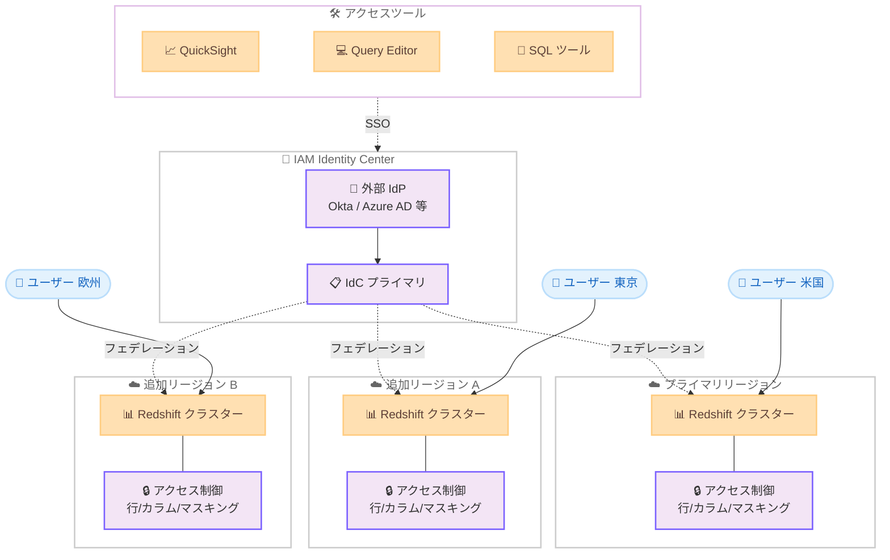

# Amazon Redshift - IAM Identity Center によるフェデレーション権限のマルチリージョン対応

**リリース日**: 2026年03月19日
**サービス**: Amazon Redshift
**機能**: IAM Identity Center を使用したフェデレーション権限のマルチリージョンサポート

[このアップデートのインフォグラフィックを見る](https://takech9203.github.io/aws-news-summary/20260319-redshift-federated-permissions-idc-mrr.html)

## 概要

Amazon Redshift のフェデレーション権限が AWS IAM Identity Center (IdC) を使用して複数の AWS リージョンで利用可能になりました。これにより、プライマリリージョンで設定した IAM Identity Center の構成を追加リージョンに拡張し、ユーザーの物理的な近さによるパフォーマンス向上と、マルチリージョン構成による信頼性の向上を実現できます。

この機能は、既存の Workforce Identity (企業のユーザー ID) を活用して、Redshift のテーブルレベルおよびカラムレベルのきめ細かなアクセス制御を簡素化します。行レベルセキュリティ、カラムレベルセキュリティ、データマスキングポリシーが自動的に適用され、Amazon QuickSight、Redshift Query Editor、サードパーティの SQL ツールからのシングルサインオンも利用可能です。

**アップデート前の課題**

- IAM Identity Center を使用した Redshift のフェデレーション権限はプライマリリージョンのみで利用可能であり、他のリージョンでは個別に認証設定を管理する必要があった
- 地理的に分散したユーザーがプライマリリージョンの Redshift にアクセスする場合、レイテンシーが発生していた
- マルチリージョン構成で一貫したアクセス制御ポリシーを維持するために手動での設定同期が必要だった

**アップデート後の改善**

- IAM Identity Center のフェデレーション権限をプライマリリージョンから追加リージョンに拡張できるようになった
- ユーザーに近いリージョンの Redshift クラスターにアクセスすることでパフォーマンスが向上した
- 複数リージョンで一貫したきめ細かなアクセス制御が自動的に適用されるようになった

## アーキテクチャ図



IAM Identity Center のプライマリリージョンから複数のリージョンにフェデレーション権限を拡張し、各リージョンの Redshift クラスターで一貫したアクセス制御を実現する構成を示しています。

## サービスアップデートの詳細

### 主要機能

1. **マルチリージョンフェデレーション権限**
   - IAM Identity Center のプライマリリージョンから追加リージョンへのフェデレーション権限の拡張
   - 各リージョンの Redshift クラスターで同一の Workforce Identity を使用したアクセス制御
   - ユーザーの地理的な近さに基づくリージョン選択によるパフォーマンス向上

2. **きめ細かなアクセス制御の統合管理**
   - テーブルレベルおよびカラムレベルのアクセス制御を既存の Workforce Identity で管理
   - 行レベルセキュリティ (RLS)、カラムレベルセキュリティ (CLS)、データマスキングポリシーが自動的に適用
   - 管理者は一元的にアクセスポリシーを設定し、全リージョンで一貫性を維持

3. **シングルサインオン対応**
   - Amazon QuickSight からの SSO アクセス
   - Redshift Query Editor v2 からの SSO アクセス
   - サードパーティの SQL ツール (DBeaver、DataGrip 等) からの SSO アクセス

## 技術仕様

### フェデレーション権限の構成要素

| 項目 | 詳細 |
|------|------|
| 認証方式 | IAM Identity Center によるフェデレーション認証 |
| サポートする IdP | Okta、Azure AD、OneLogin など SAML 2.0 対応 IdP |
| アクセス制御レベル | テーブル、カラム、行、データマスキング |
| SSO 対応ツール | QuickSight、Redshift Query Editor v2、サードパーティ SQL ツール |
| マルチリージョン | プライマリリージョンから追加リージョンへの拡張 |

### API 変更履歴

| 日付 | サービス | 変更内容 |
|------|----------|----------|
| - | - | 今回のアップデートに関連する API 変更は確認されていません |

### IAM Identity Center 統合の設定例

```json
{
  "EnabledRegions": [
    "us-east-1",
    "ap-northeast-1",
    "eu-west-1"
  ],
  "IdentityCenterConfiguration": {
    "InstanceArn": "arn:aws:sso:::instance/ssoins-xxxxxxxxx",
    "ApplicationArn": "arn:aws:sso::123456789012:application/ssoins-xxxxxxxxx/apl-xxxxxxxxx"
  },
  "RedshiftIdcApplicationConfiguration": {
    "IdcDisplayName": "Redshift-MRR",
    "IdentityNamespace": "default",
    "AuthorizedTokenIssuers": []
  }
}
```

## 設定方法

### 前提条件

1. AWS IAM Identity Center が有効化されていること
2. 外部 IdP (Okta、Azure AD 等) が IAM Identity Center と統合されていること
3. Amazon Redshift クラスターまたは Redshift Serverless ワークグループが対象リージョンに存在すること
4. IAM Identity Center のマルチリージョン機能が有効化されていること

### 手順

#### ステップ 1: IAM Identity Center のマルチリージョン有効化

```bash
# IAM Identity Center のインスタンスで追加リージョンを有効化
aws sso-admin update-instance \
  --instance-arn "arn:aws:sso:::instance/ssoins-xxxxxxxxx" \
  --name "MyOrganization"

# リージョンのオプトインステータスを確認
aws sso-admin list-instances
```

IAM Identity Center のプライマリインスタンスに追加リージョンを設定します。これにより、追加リージョンでもフェデレーション認証が利用可能になります。

#### ステップ 2: Redshift の IdC 統合を設定

```bash
# Redshift クラスターで IAM Identity Center 統合を有効化
aws redshift create-redshift-idc-application \
  --idc-instance-arn "arn:aws:sso:::instance/ssoins-xxxxxxxxx" \
  --redshift-idc-application-name "my-redshift-idc-app" \
  --idc-display-name "Redshift Analytics" \
  --identity-namespace "default"
```

Redshift クラスターと IAM Identity Center を統合するアプリケーション設定を作成します。

#### ステップ 3: きめ細かなアクセス制御の設定

```sql
-- テーブルレベルのアクセス権限を設定
GRANT SELECT ON TABLE sales_data TO "IAMR:analyst-group";

-- カラムレベルのアクセス制限
GRANT SELECT (order_id, product_name, quantity)
ON TABLE sales_data TO "IAMR:limited-analyst-group";

-- 行レベルセキュリティポリシーの作成
CREATE RLS POLICY region_filter
WITH (region VARCHAR(50))
USING (region = current_namespace);

-- データマスキングポリシーの適用
CREATE MASKING POLICY mask_email
WITH (email VARCHAR(256))
USING ('***@' || SPLIT_PART(email, '@', 2));
```

IAM Identity Center のグループを Redshift の権限に対応付け、テーブル、カラム、行レベルのアクセス制御を設定します。

## メリット

### ビジネス面

- **グローバル展開の加速**: マルチリージョンでのフェデレーション権限により、世界各地の拠点からのデータアクセスをシームレスに実現
- **管理コストの削減**: 一元化された ID 管理により、リージョンごとの個別設定が不要になり、運用オーバーヘッドを削減
- **コンプライアンス対応の強化**: データの所在地要件を満たしつつ、一貫したアクセス制御ポリシーを適用可能

### 技術面

- **レイテンシーの低減**: ユーザーに近いリージョンの Redshift クラスターにアクセスすることで、クエリのレスポンスタイムが向上
- **高可用性の実現**: マルチリージョン構成により、単一リージョンの障害時にも業務継続性を確保
- **セキュリティの一貫性**: 行レベル、カラムレベル、マスキングポリシーが全リージョンで自動適用され、セキュリティギャップを防止

## デメリット・制約事項

### 制限事項

- IAM Identity Center のマルチリージョン機能が前提となるため、IAM Identity Center 自体のマルチリージョン設定が必要
- フェデレーション権限のリージョン間同期にはわずかな伝播遅延が発生する可能性がある
- すべてのリージョンで Redshift が利用可能であることが前提

### 考慮すべき点

- マルチリージョン構成ではデータの一貫性管理 (レプリケーション設定等) を別途検討する必要がある
- リージョンごとのデータ配置とアクセスパターンに応じた適切なリージョン選択が重要
- 外部 IdP の可用性がフェデレーション認証全体の可用性に影響する

## ユースケース

### ユースケース 1: グローバル分析チームのデータアクセス

**シナリオ**: 日本、米国、欧州に分散した分析チームが、各リージョンの Redshift クラスターにアクセスしてデータ分析を行う。各チームは自身の担当地域のデータのみにアクセスできるよう制御する必要がある。

**実装例**:
```sql
-- 地域別のアクセスポリシーを設定
CREATE RLS POLICY region_access
WITH (data_region VARCHAR(50))
USING (data_region = SESSION_USER_REGION());

-- 分析チームグループにテーブルアクセスを付与
GRANT SELECT ON TABLE global_sales TO "IAMR:apac-analysts";
GRANT SELECT ON TABLE global_sales TO "IAMR:americas-analysts";
GRANT SELECT ON TABLE global_sales TO "IAMR:emea-analysts";
```

**効果**: 各リージョンの分析チームが低レイテンシーでデータにアクセスでき、行レベルセキュリティにより担当地域のデータのみが自動的にフィルタリングされる。

### ユースケース 2: QuickSight ダッシュボードの SSO アクセス

**シナリオ**: 経営層が QuickSight ダッシュボードから Redshift のデータにアクセスする際に、企業の既存認証基盤を使用してシームレスにサインインし、機密データは自動的にマスキングされる構成を実現する。

**実装例**:
```sql
-- 経営層向けのマスキングポリシー
CREATE MASKING POLICY mask_pii
WITH (customer_name VARCHAR(256))
USING (LEFT(customer_name, 1) || '***');

-- QuickSight サービスロールに適切な権限を付与
GRANT SELECT ON TABLE executive_kpis TO "IAMR:executive-group";
```

**効果**: 経営層が企業認証で QuickSight にサインインし、Redshift のデータを安全に可視化できる。PII データは自動マスキングされ、コンプライアンス要件を満たす。

### ユースケース 3: 災害復旧時のリージョンフェイルオーバー

**シナリオ**: プライマリリージョンの障害時に、セカンダリリージョンの Redshift クラスターにフェイルオーバーする。フェデレーション権限がマルチリージョンで設定されているため、ユーザーの認証とアクセス制御が即座に利用可能になる。

**実装例**:
```bash
# Route 53 によるフェイルオーバー設定
aws route53 change-resource-record-sets \
  --hosted-zone-id Z123456789 \
  --change-batch '{
    "Changes": [{
      "Action": "UPSERT",
      "ResourceRecordSet": {
        "Name": "redshift.example.com",
        "Type": "CNAME",
        "SetIdentifier": "secondary",
        "Failover": "SECONDARY",
        "TTL": 60,
        "ResourceRecords": [{"Value": "redshift-secondary.region2.redshift.amazonaws.com"}]
      }
    }]
  }'
```

**効果**: リージョン障害時にも認証基盤が維持され、ユーザーは意識することなくセカンダリリージョンの Redshift にアクセスを継続できる。RTO の大幅な短縮を実現。

## 料金

フェデレーション権限のマルチリージョンサポート自体に追加料金は発生しません。ただし、以下の料金が適用されます。

### 料金例

| 項目 | 料金 |
|------|------|
| Amazon Redshift クラスター | リージョンごとの Redshift 利用料金 (ノードタイプと台数に依存) |
| Amazon Redshift Serverless | リージョンごとの RPU 使用量に基づく従量課金 |
| IAM Identity Center | 無料 (AWS Organizations の一部) |
| データ転送 | リージョン間のデータ転送料金が発生する場合あり |

## 利用可能リージョン

IAM Identity Center のマルチリージョン機能が利用可能なすべてのリージョンで利用できます。具体的なリージョンについては、AWS のドキュメントを参照してください。Redshift がサポートされているリージョンであることが前提条件となります。

## 関連サービス・機能

- **AWS IAM Identity Center**: フェデレーション認証の基盤として使用。マルチリージョン機能が今回の前提
- **Amazon QuickSight**: SSO 対応の BI ツール。Redshift との統合により、フェデレーション認証を使用したダッシュボードアクセスが可能
- **Amazon Redshift Query Editor v2**: SSO 対応のウェブベース SQL エディタ。フェデレーション認証を使用した Redshift へのクエリ実行が可能
- **Amazon Redshift データ共有**: マルチリージョン構成でリージョン間のデータ共有を実現

## 参考リンク

- [インフォグラフィック](https://takech9203.github.io/aws-news-summary/20260319-redshift-federated-permissions-idc-mrr.html)
- [公式発表 (What's New)](https://aws.amazon.com/about-aws/whats-new/2026/03/redshift-federated-permissions-idc-mrr/)
- [Amazon Redshift と IAM Identity Center の統合ドキュメント](https://docs.aws.amazon.com/redshift/latest/mgmt/redshift-iam-access-control-idp-connect.html)
- [Amazon Redshift 料金ページ](https://aws.amazon.com/redshift/pricing/)

## まとめ

Amazon Redshift のフェデレーション権限が IAM Identity Center のマルチリージョン対応により、グローバルに分散したユーザーが低レイテンシーで安全にデータにアクセスできるようになりました。既存の Workforce Identity を活用した一元的なアクセス制御により、マルチリージョン環境での運用管理が大幅に簡素化されます。グローバル展開を進める企業や、災害復旧要件のある組織は、この機能を活用してマルチリージョンの Redshift 環境でのセキュリティとパフォーマンスの両立を検討することを推奨します。
