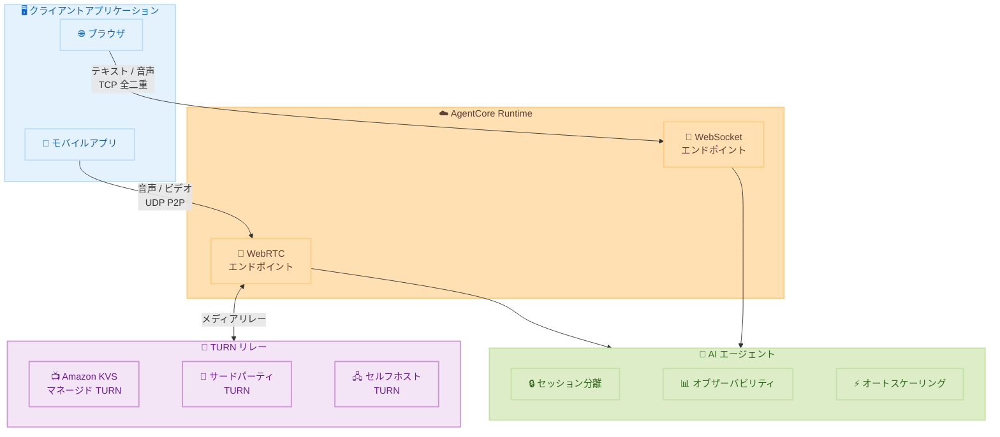

# Amazon Bedrock AgentCore Runtime - WebRTC によるリアルタイム双方向ストリーミング

**リリース日**: 2026 年 3 月 20 日
**サービス**: Amazon Bedrock AgentCore Runtime
**機能**: WebRTC リアルタイム双方向ストリーミングサポート

[このアップデートのインフォグラフィックを見る](https://takech9203.github.io/aws-news-summary/20260320-amazon-bedrock-webrtc.html)

## 概要

Amazon Bedrock AgentCore Runtime が WebRTC プロトコルをサポートし、クライアントと AI エージェント間のリアルタイム双方向ストリーミングが可能になった。これにより、既存の WebSocket プロトコルに加えて 2 つ目の双方向ストリーミングプロトコルが利用可能になり、開発者はユースケースに応じて最適なプロトコルを選択できるようになった。

WebRTC はピアツーピアの UDP ベーストランスポートを使用し、音声やビデオのリアルタイム配信に最適化されている。ブラウザおよびモバイルアプリケーション向けの音声エージェントを構築する際に、低レイテンシーで自然な会話体験を提供できる。WebRTC の利用には TURN リレーが必要であり、AgentCore Runtime は Amazon Kinesis Video Streams (KVS) マネージド TURN、サードパーティプロバイダー、セルフホスト TURN をサポートしている。

東京リージョンを含む 14 の AWS リージョンで利用可能であり、セッション分離、オブザーバビリティ、スケーリングなどの AgentCore Runtime の既存機能は両プロトコルで共通して利用できる。

**アップデート前の課題**

- AgentCore Runtime の双方向ストリーミングは WebSocket のみに限定されており、TCP ベースの通信による遅延が音声・ビデオのリアルタイム配信で課題となる場合があった
- ブラウザやモバイルアプリケーションで低レイテンシーの音声エージェントを構築するには、独自のリアルタイム通信基盤を実装する必要があった
- UDP ベースのメディアトランスポートを活用したリアルタイム会話体験の構築が AgentCore Runtime 上では実現できなかった

**アップデート後の改善**

- WebRTC による UDP ベースのピアツーピア通信で、音声・ビデオの低レイテンシー双方向ストリーミングが可能になった
- ブラウザおよびモバイルアプリケーションからネイティブの WebRTC API を使用してエージェントと直接通信できるようになった
- TURN リレーの選択肢として Amazon KVS マネージド TURN、サードパーティ、セルフホストの 3 つのオプションから選択可能になった

## アーキテクチャ図



WebSocket と WebRTC の 2 つのストリーミングプロトコルによる AgentCore Runtime のアーキテクチャを示している。WebSocket は TCP ベースの全二重通信、WebRTC は UDP ベースの P2P 通信で TURN リレーを経由する。

## サービスアップデートの詳細

### 主要機能

1. **WebRTC 双方向ストリーミング**
   - ピアツーピアの UDP ベーストランスポートによる低レイテンシー通信
   - 音声およびビデオの双方向リアルタイムストリーミング
   - ブラウザおよびモバイルアプリケーションのネイティブ WebRTC API との互換性

2. **TURN リレーサポート**
   - Amazon Kinesis Video Streams (KVS) マネージド TURN: AWS が管理する TURN インフラストラクチャを利用
   - サードパーティ TURN プロバイダー: Twilio、Cloudflare などの既存サービスとの統合
   - セルフホスト TURN: 独自の TURN サーバーを使用したカスタム構成

3. **プロトコル共通のプラットフォーム機能**
   - セッション分離: 各セッションが独立したリソースで実行
   - オブザーバビリティ: CloudWatch メトリクスやトレースによる監視
   - オートスケーリング: トラフィックに応じた自動スケーリング

## 技術仕様

### プロトコル比較

| 項目 | WebSocket | WebRTC |
|------|-----------|--------|
| トランスポート層 | TCP | UDP |
| 通信方式 | 全二重接続 | ピアツーピア |
| 主な用途 | テキスト・音声ストリーミング | リアルタイム音声・ビデオ |
| レイテンシー特性 | 安定した接続、中程度のレイテンシー | 低レイテンシー、メディア配信に最適化 |
| NAT トラバーサル | 不要 | TURN リレーが必要 |
| プロトコルサポート開始 | 初期リリースから | 2026 年 3 月 20 日から |

### TURN リレーオプション

| オプション | 説明 | 推奨ユースケース |
|-----------|------|------------------|
| Amazon KVS マネージド TURN | AWS が管理する TURN インフラストラクチャ | AWS エコシステム内での統合を重視する場合 |
| サードパーティ TURN | Twilio、Cloudflare 等の外部サービス | 既存のサードパーティ TURN インフラを活用する場合 |
| セルフホスト TURN | 独自の TURN サーバーを運用 | カスタム構成やオンプレミス統合が必要な場合 |

## 設定方法

### 前提条件

1. Amazon Bedrock AgentCore Runtime が有効化されていること
2. AgentCore Runtime にデプロイ済みのエージェントが存在すること
3. TURN リレーが設定されていること (KVS マネージド TURN の利用が推奨)

### 手順

#### ステップ 1: TURN リレーの設定 (Amazon KVS マネージド TURN の場合)

```bash
# KVS シグナリングチャネルを作成
aws kinesisvideo create-signaling-channel \
  --channel-name "agentcore-webrtc-turn" \
  --channel-type "SINGLE_MASTER" \
  --region ap-northeast-1
```

Amazon KVS のシグナリングチャネルを作成し、WebRTC 接続のシグナリングと TURN リレーに使用する。

#### ステップ 2: エージェントの WebRTC エンドポイント設定

```bash
# AgentCore Runtime のエージェントに WebRTC ストリーミングを設定
aws bedrock-agentcore update-agent-runtime \
  --agent-runtime-id "agent-runtime-id" \
  --streaming-configurations '[
    {
      "protocol": "WEBRTC",
      "turnConfiguration": {
        "turnProvider": "KVS_MANAGED",
        "kvsConfiguration": {
          "channelName": "agentcore-webrtc-turn"
        }
      }
    }
  ]' \
  --region ap-northeast-1
```

エージェントランタイムに WebRTC プロトコルと TURN リレーの設定を追加する。

#### ステップ 3: クライアント側の WebRTC 接続

```javascript
// ブラウザからの WebRTC 接続例
const peerConnection = new RTCPeerConnection({
  iceServers: turnServers // AgentCore から取得した TURN サーバー情報
});

// 音声トラックの追加
const stream = await navigator.mediaDevices.getUserMedia({ audio: true });
stream.getTracks().forEach(track => {
  peerConnection.addTrack(track, stream);
});

// エージェントからの音声トラック受信
peerConnection.ontrack = (event) => {
  const audioElement = document.getElementById('agent-audio');
  audioElement.srcObject = event.streams[0];
};

// SDP オファーの作成と送信
const offer = await peerConnection.createOffer();
await peerConnection.setLocalDescription(offer);

// AgentCore Runtime にオファーを送信してセッションを開始
const response = await fetch('/api/agentcore/webrtc/session', {
  method: 'POST',
  body: JSON.stringify({ sdp: offer.sdp })
});
```

ブラウザの標準 WebRTC API を使用してエージェントとの音声通信セッションを確立する。`getUserMedia` でマイク入力を取得し、`ontrack` イベントでエージェントからの音声を受信する。

## メリット

### ビジネス面

- **自然な会話体験の実現**: 低レイテンシーの音声通信により、電話のような自然な対話型 AI エージェントを構築可能
- **マルチチャネル対応**: ブラウザ、モバイルアプリ、デスクトップアプリなど多様なプラットフォームから統一的にエージェントにアクセス可能
- **顧客満足度の向上**: リアルタイムの音声・ビデオ対話により、チャットボットでは実現できない高品質なカスタマーサポートを提供

### 技術面

- **低レイテンシー通信**: UDP ベースのトランスポートにより、TCP ベースの WebSocket と比較してメディアストリーミングの遅延を削減
- **ネイティブブラウザサポート**: 追加のプラグインやライブラリなしで、ブラウザの標準 WebRTC API を直接利用可能
- **柔軟な TURN 構成**: 3 つの TURN オプションから要件に応じて選択でき、既存インフラとの統合が容易

## デメリット・制約事項

### 制限事項

- WebRTC の利用には TURN リレーの設定が必須であり、追加のインフラストラクチャ管理が発生する
- UDP ベースの通信のため、厳格なファイアウォール環境では接続が制限される場合がある
- WebRTC はメディアストリーミングに最適化されており、大量のテキストデータ転送には WebSocket の方が適している

### 考慮すべき点

- TURN リレーの選択はレイテンシー、コスト、運用負荷に影響するため、要件に基づいた慎重な選定が必要
- WebRTC と WebSocket のどちらを使用するかは、ユースケースに応じて判断する必要がある (音声・ビデオは WebRTC、テキスト中心は WebSocket が推奨)
- クライアント側のブラウザ互換性を確認する必要がある (主要ブラウザは対応済みだが、古いバージョンでは未対応の場合がある)

## ユースケース

### ユースケース 1: ブラウザベースの音声カスタマーサポートエージェント

**シナリオ**: EC サイトのカスタマーサポートで、ユーザーがブラウザから直接音声でエージェントと対話し、注文状況の確認や返品手続きを行う。

**実装例**:
```javascript
// ブラウザから音声エージェントに接続
const session = await agentCoreClient.createWebRTCSession({
  agentId: 'customer-support-agent',
  mediaConstraints: { audio: true, video: false }
});

session.onAgentResponse((response) => {
  // エージェントの音声応答を再生
  playAudio(response.audioStream);
  // テキストトランスクリプトを UI に表示
  displayTranscript(response.transcript);
});
```

**効果**: テキスト入力の手間を削減し、電話のような自然な対話でカスタマーサポートを提供。応答時間の短縮と顧客満足度の向上が期待できる。

### ユースケース 2: モバイルアプリの音声アシスタント

**シナリオ**: フィールドワーカー向けモバイルアプリケーションで、ハンズフリーの音声操作により作業指示の確認やレポート入力を行う。

**実装例**:
```kotlin
// Android アプリでの WebRTC 音声セッション
val peerConnection = peerConnectionFactory.createPeerConnection(
    rtcConfig, // AgentCore TURN サーバー設定を含む
    object : PeerConnection.Observer {
        override fun onTrack(transceiver: RtpTransceiver) {
            // エージェントからの音声トラックを受信
            transceiver.receiver.track()?.let { playAgentAudio(it) }
        }
    }
)
```

**効果**: 現場作業中にデバイスを操作せずに情報を取得・入力でき、作業効率と安全性が向上する。

### ユースケース 3: ビデオ対応のリモート診断エージェント

**シナリオ**: 医療機関のリモート診療プラットフォームで、患者がビデオ通話を通じて AI エージェントに症状を説明し、初期トリアージを受ける。

**実装例**:
```javascript
// ビデオ対応エージェントセッション
const session = await agentCoreClient.createWebRTCSession({
  agentId: 'medical-triage-agent',
  mediaConstraints: { audio: true, video: true },
  turnProvider: 'KVS_MANAGED'
});

session.onVideoFrame((frame) => {
  // エージェントからのビデオフレームを処理
  renderAgentVideo(frame);
});
```

**効果**: 対面診療の前段階として AI による初期トリアージを実施し、医療リソースの効率的な配分と患者の待ち時間短縮を実現する。

## 料金

Amazon Bedrock AgentCore Runtime の WebRTC ストリーミングは、既存の AgentCore Runtime の料金体系に基づいて課金される。WebRTC 固有の追加料金についての詳細は公式料金ページを参照のこと。

TURN リレーに Amazon KVS マネージド TURN を使用する場合は、Amazon Kinesis Video Streams の料金が別途発生する。

### 料金例

| 使用量 | 月額料金 (概算) |
|--------|------------------|
| AgentCore Runtime セッション (1,000 時間) | 料金ページを参照 |
| KVS マネージド TURN データ転送 (100 GB) | 約 $14.00 |

※料金は概算であり、実際の料金は使用状況やリージョンによって異なる。

## 利用可能リージョン

東京リージョンを含む 14 の AWS リージョンで利用可能。

- US East (N. Virginia)
- US East (Ohio)
- US West (Oregon)
- Canada (Central)
- Asia Pacific (Mumbai)
- Asia Pacific (Seoul)
- Asia Pacific (Singapore)
- Asia Pacific (Sydney)
- Asia Pacific (Tokyo)
- Europe (Frankfurt)
- Europe (Ireland)
- Europe (London)
- Europe (Paris)
- South America (Sao Paulo)

## 関連サービス・機能

- **Amazon Kinesis Video Streams (KVS)**: WebRTC の TURN リレーとしてマネージド TURN インフラストラクチャを提供
- **Amazon Bedrock AgentCore Runtime - AG-UI プロトコル**: エージェントとユーザーインターフェース間の標準化された通信プロトコル
- **Amazon Bedrock AgentCore Runtime - ステートフル MCP**: セッションコンテキストを維持したインタラクティブなエージェントワークフロー

## 参考リンク

- [このアップデートのインフォグラフィック](https://takech9203.github.io/aws-news-summary/20260320-amazon-bedrock-webrtc.html)
- [公式発表 (What's New)](https://aws.amazon.com/about-aws/whats-new/2026/03/amazon-bedrock-webrtc/)
- [ドキュメント - AgentCore Runtime](https://docs.aws.amazon.com/bedrock-agentcore/latest/devguide/runtime.html)
- [Amazon Kinesis Video Streams WebRTC](https://docs.aws.amazon.com/kinesisvideostreams-webrtc-dg/latest/devguide/what-is-kvswebrtc.html)

## まとめ

Amazon Bedrock AgentCore Runtime の WebRTC サポートにより、低レイテンシーの音声・ビデオ双方向ストリーミングが実現し、自然なリアルタイム会話体験を提供する AI エージェントの構築が容易になった。WebSocket と WebRTC の 2 つのプロトコルを要件に応じて選択できるようになったことで、テキスト中心のユースケースからリアルタイムメディアストリーミングまで幅広いシナリオに対応可能になっている。音声対話型のカスタマーサポートやモバイルアシスタントの構築を検討している開発者は、WebRTC オプションの評価を推奨する。
