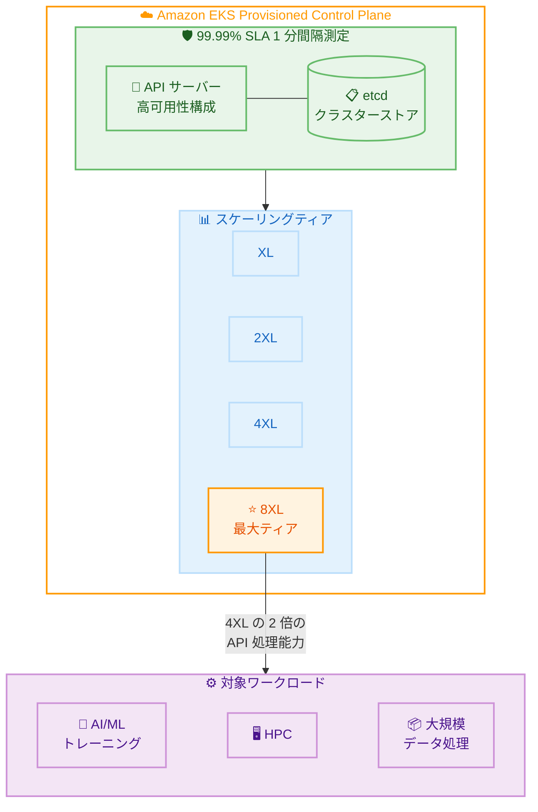

# Amazon EKS - Provisioned Control Plane の 99.99% SLA と 8XL スケーリングティア

**リリース日**: 2026 年 3 月 20 日
**サービス**: Amazon EKS (Elastic Kubernetes Service)
**機能**: Provisioned Control Plane 99.99% SLA および 8XL スケーリングティア

📊 [このアップデートのインフォグラフィックを見る](https://takech9203.github.io/aws-news-summary/20260320-amazon-eks-announces-sla-8xl-scaling-tier.html)

## 概要

Amazon EKS は、Provisioned Control Plane クラスターに対して 99.99% の SLA (Service Level Agreement) を提供開始しました。従来の 99.95% から引き上げられ、1 分間隔で測定される高精度な可用性保証を実現しています。

また、Provisioned Control Plane の最大ティアとなる 8XL スケーリングティアが新たに導入されました。8XL ティアは 4XL の 2 倍の Kubernetes API サーバーリクエスト処理能力を備え、超大規模な AI/ML トレーニング、HPC (High Performance Computing)、大規模データ処理ワークロードに対応します。これらの機能は、EKS Provisioned Control Plane が提供されている全てのリージョンで利用可能です。

**アップデート前の課題**

- Provisioned Control Plane の SLA は 99.95% であり、年間約 4.38 時間のダウンタイムが許容されていた
- 最大の Provisioned Control Plane ティアは 4XL であり、超大規模ワークロードでは API サーバーの処理能力が不足する場合があった
- 大規模な AI/ML トレーニングや HPC ワークロードでは、数千ノード規模のクラスターで API サーバーへの負荷が集中し、パフォーマンスのボトルネックとなっていた

**アップデート後の改善**

- SLA が 99.99% に向上し、年間約 52 分以下のダウンタイム保証となり、ミッションクリティカルなワークロードに対応可能になった
- SLA の測定が 1 分間隔で行われるようになり、より精密な可用性保証が提供されるようになった
- 8XL ティアの導入により、4XL の 2 倍の API サーバーリクエスト処理能力が利用可能になった
- 超大規模な AI/ML トレーニング、HPC、大規模データ処理ワークロードを単一クラスターで効率的に運用できるようになった

## アーキテクチャ図



この図は、EKS Provisioned Control Plane の 99.99% SLA と新しい 8XL スケーリングティアの位置づけ、および対象となるワークロードの関係を示しています。

## サービスアップデートの詳細

### 主要機能

1. **99.99% SLA の提供**
   - Provisioned Control Plane クラスターに対する SLA が 99.95% から 99.99% に向上
   - SLA は 1 分間隔で測定され、より精密な可用性保証を提供
   - 年間ダウンタイム許容量が約 4.38 時間から約 52 分に大幅改善

2. **8XL スケーリングティアの導入**
   - Provisioned Control Plane の最大ティアとして新たに追加
   - 4XL ティアの 2 倍の Kubernetes API サーバーリクエスト処理能力を提供
   - 超大規模クラスターでの API サーバーのボトルネックを解消

3. **大規模ワークロード対応**
   - AI/ML トレーニングワークロードでの数千ノード規模のクラスター運用をサポート
   - HPC ワークロードでの高いスループットを実現
   - 大規模データ処理ワークロードでの安定したパフォーマンスを提供

## 技術仕様

### Provisioned Control Plane スケーリングティア

| ティア | API サーバー処理能力 | 主な用途 |
|--------|----------------------|----------|
| XL | 基準 | 小〜中規模ワークロード |
| 2XL | XL の 2 倍 | 中規模ワークロード |
| 4XL | 2XL の 2 倍 | 大規模ワークロード |
| 8XL (新規) | 4XL の 2 倍 | 超大規模 AI/ML、HPC、データ処理 |

### SLA 比較

| 項目 | 従来 | 新規 |
|------|------|------|
| SLA | 99.95% | 99.99% |
| 年間ダウンタイム許容量 | 約 4.38 時間 | 約 52 分 |
| 測定間隔 | - | 1 分間隔 |
| 対象 | Provisioned Control Plane | Provisioned Control Plane |

## 設定方法

### 前提条件

1. AWS CLI v2 がインストールされていること
2. EKS クラスターを作成または管理する IAM 権限があること
3. EKS Provisioned Control Plane が利用可能なリージョンを使用すること

### 手順

#### ステップ 1: 8XL ティアで Provisioned Control Plane クラスターを作成

```bash
aws eks create-cluster \
    --name my-ultra-scale-cluster \
    --region us-east-1 \
    --kubernetes-version 1.35 \
    --compute-config '{
        "enabled": true
    }' \
    --kubernetes-network-config '{
        "elasticLoadBalancing": {
            "enabled": true
        }
    }' \
    --upgrade-policy '{
        "supportType": "STANDARD"
    }'
```

このコマンドは、Provisioned Control Plane を使用した新しい EKS クラスターを作成します。ティアの選択はクラスター作成後にコンソールまたは API から変更できます。

#### ステップ 2: 既存クラスターのティアを 8XL にアップグレード

```bash
aws eks update-cluster-config \
    --name my-existing-cluster \
    --region us-east-1 \
    --compute-config '{
        "enabled": true
    }'
```

既存の Provisioned Control Plane クラスターのティアを変更します。ティアの変更はダウンタイムなしで実施されます。

#### ステップ 3: クラスターの状態確認

```bash
aws eks describe-cluster \
    --name my-ultra-scale-cluster \
    --region us-east-1 \
    --query 'cluster.{name:name, status:status, version:version, platformVersion:platformVersion}'
```

クラスターの現在の状態、Kubernetes バージョン、プラットフォームバージョンを確認します。

## メリット

### ビジネス面

- **ミッションクリティカルワークロードの信頼性向上**: 99.99% SLA により、年間ダウンタイムが約 52 分以下に保証され、金融、医療、公共インフラなどの厳格な可用性要件を満たすことが可能
- **大規模 AI/ML プロジェクトの実現**: 8XL ティアにより、数千ノード規模のクラスターで安定した API サーバーパフォーマンスを提供し、大規模モデルトレーニングの中断リスクを低減
- **SLA ベースのコスト最適化**: より高い SLA 保証により、自前の冗長化設計やフェイルオーバー構成のコストを削減可能

### 技術面

- **API サーバースループットの大幅向上**: 8XL ティアは 4XL の 2 倍の処理能力を提供し、大量の API リクエストを安定的に処理
- **精密な SLA 測定**: 1 分間隔の測定により、短時間の障害も SLA 違反として検出可能
- **スケーラブルなコントロールプレーン**: ワークロードの成長に応じてティアをアップグレードし、コントロールプレーンのパフォーマンスをスケール可能

## デメリット・制約事項

### 制限事項

- 8XL ティアは Provisioned Control Plane でのみ利用可能であり、標準のコントロールプレーンでは選択不可
- 99.99% SLA は Provisioned Control Plane クラスターのみに適用され、標準クラスターには従来の SLA が適用される
- 8XL ティアは EKS Provisioned Control Plane が提供されているリージョンでのみ利用可能

### 考慮すべき点

- 8XL ティアはコスト増加を伴うため、ワークロードの規模と必要なパフォーマンスに基づいて適切なティアを選択する必要がある
- Provisioned Control Plane への移行には、既存クラスターの設定変更が必要となる場合がある
- SLA クレジットの適用条件や手続きについて、AWS サービスレベルアグリーメントの詳細を事前に確認することを推奨

## ユースケース

### ユースケース 1: 大規模 AI/ML モデルトレーニング

**シナリオ**: 数千 GPU ノードを使用した大規模言語モデル (LLM) のトレーニングを EKS 上で実行しており、トレーニングジョブの中断を最小化したい。

**実装例**:
```bash
# 8XL ティアの Provisioned Control Plane クラスターを作成
aws eks create-cluster \
    --name llm-training-cluster \
    --region us-east-1 \
    --kubernetes-version 1.35 \
    --compute-config '{"enabled": true}'
```

**効果**: 8XL ティアの高い API サーバー処理能力により、数千ノード規模のクラスターでも安定した Kubernetes API レスポンスを維持し、トレーニングジョブの中断リスクを低減できる。

### ユースケース 2: 金融系ミッションクリティカルアプリケーション

**シナリオ**: 金融機関が決済処理や取引システムを EKS 上で運用しており、極めて高い可用性が要求される。

**実装例**:
```bash
# 99.99% SLA 対応のクラスターを作成
aws eks create-cluster \
    --name financial-prod-cluster \
    --region us-east-1 \
    --kubernetes-version 1.35 \
    --compute-config '{"enabled": true}'
```

**効果**: 99.99% SLA により年間約 52 分以下のダウンタイム保証が得られ、金融規制の可用性要件を満たすことができる。1 分間隔の SLA 測定により、短時間の障害も検出される。

### ユースケース 3: HPC バッチ処理

**シナリオ**: 創薬シミュレーションや気象モデリングなどの HPC ワークロードを大規模な EKS クラスターで実行しており、計算ジョブのスケジューリングに大量の API リクエストが発生する。

**実装例**:
```bash
# HPC ワークロード向けの大規模クラスター
aws eks create-cluster \
    --name hpc-simulation-cluster \
    --region us-west-2 \
    --kubernetes-version 1.35 \
    --compute-config '{"enabled": true}'
```

**効果**: 8XL ティアの API サーバー処理能力により、大量のジョブスケジューリングリクエストを安定的に処理し、HPC ワークロードのスループットを最大化できる。

## 料金

Provisioned Control Plane の料金はティアに応じて異なります。8XL ティアは最大の処理能力を提供するため、他のティアよりも高い料金が設定されています。

詳細な料金情報については、[Amazon EKS 料金ページ](https://aws.amazon.com/eks/pricing/)を参照してください。

## 利用可能リージョン

EKS Provisioned Control Plane が提供されている全てのリージョンで利用可能です。

## 関連サービス・機能

- **Amazon EKS Auto Mode**: Provisioned Control Plane と組み合わせて、ノードの自動プロビジョニングとスケーリングを実現
- **Amazon EKS Hybrid Nodes**: Provisioned Control Plane のコントロールプレーンをクラウドで管理しながら、オンプレミスのノードを統合
- **AWS Fault Injection Service (FIS)**: 99.99% SLA の効果を検証するためのカオスエンジニアリングテストを実施

## 参考リンク

- 📊 [インフォグラフィック](https://takech9203.github.io/aws-news-summary/20260320-amazon-eks-announces-sla-8xl-scaling-tier.html)
- [公式発表 (What's New)](https://aws.amazon.com/about-aws/whats-new/2026/03/amazon-eks-announces-sla-8xl-scaling-tier/)
- [Amazon EKS ドキュメント](https://docs.aws.amazon.com/eks/latest/userguide/)
- [EKS Provisioned Control Plane ドキュメント](https://docs.aws.amazon.com/eks/latest/userguide/provisioned-control-plane.html)
- [Amazon EKS SLA](https://aws.amazon.com/eks/sla/)
- [料金ページ](https://aws.amazon.com/eks/pricing/)

## まとめ

Amazon EKS Provisioned Control Plane の 99.99% SLA と 8XL スケーリングティアの導入により、ミッションクリティカルなワークロードや超大規模な AI/ML トレーニング、HPC ワークロードへの対応力が大幅に強化されました。特に、1 分間隔の SLA 測定と 4XL の 2 倍の API サーバー処理能力は、大規模 Kubernetes 環境における信頼性とパフォーマンスの向上に直結します。Provisioned Control Plane を利用中の場合は、ワークロードの要件に応じたティアの見直しを検討してください。
