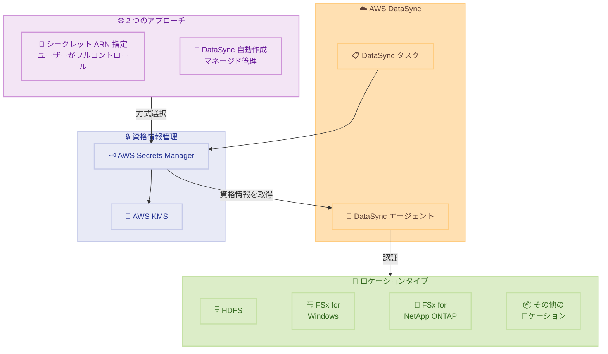

# AWS DataSync - AWS Secrets Manager による全ロケーションタイプの資格情報管理

**リリース日**: 2026 年 3 月 20 日
**サービス**: AWS DataSync
**機能**: AWS Secrets Manager による全ロケーションタイプの資格情報管理サポート

[このアップデートのインフォグラフィックを見る](https://takech9203.github.io/aws-news-summary/20260320-aws-datasync-secrets-manager.html)

## 概要

AWS DataSync が AWS Secrets Manager による資格情報管理を全ロケーションタイプでサポートするようになった。これにより、HDFS、Amazon FSx for Windows File Server、Amazon FSx for NetApp ONTAP を含むすべてのロケーションタイプで、Secrets Manager を使用した一元的な資格情報管理が可能になった。

以前は Secrets Manager の統合が一部のロケーションタイプに限定されていたため、ロケーションタイプごとに異なる資格情報管理方法を使用する必要があった。今回のアップデートにより、2 つのアプローチ (シークレット ARN の直接指定、または DataSync による自動作成・管理) から選択でき、AWS KMS カスタマーマネージドキーによる暗号化、シークレットのローテーション、監査、アクセスポリシーの一元管理が実現する。

データ移行やレプリケーションのワークロードにおいて、セキュリティとコンプライアンスの要件を満たしつつ運用負荷を軽減したい組織に適したアップデートである。

**アップデート前の課題**

- Secrets Manager の統合が一部のロケーションタイプのみに限定されており、HDFS や FSx for Windows File Server などでは利用できなかった
- ロケーションタイプごとに異なる資格情報管理方法を使用する必要があり、運用が複雑化していた
- 資格情報のローテーションや監査を一元的に管理する手段が限られており、セキュリティポリシーの統一が困難だった

**アップデート後の改善**

- 全ロケーションタイプで Secrets Manager による資格情報管理が可能になり、一貫したセキュリティモデルを適用可能になった
- シークレット ARN の指定によるフルコントロール、または DataSync による自動管理の 2 つのアプローチから選択可能になった
- AWS KMS カスタマーマネージドキーによるシークレットの暗号化、自動ローテーション、IAM ベースのアクセス制御を全ロケーションで統一的に利用可能になった

## アーキテクチャ図



DataSync が Secrets Manager から資格情報を取得し、各ロケーションタイプに対する認証に使用するアーキテクチャを示している。ユーザーはシークレット ARN の直接指定、または DataSync による自動作成の 2 つのアプローチから選択できる。

## サービスアップデートの詳細

### 主要機能

1. **全ロケーションタイプでの Secrets Manager サポート**
   - HDFS、Amazon FSx for Windows File Server、Amazon FSx for NetApp ONTAP を含む全ロケーションタイプで利用可能
   - 以前は一部のロケーションタイプのみに限定されていた機能が全面展開
   - ロケーションの作成時および更新時に Secrets Manager の統合を設定可能

2. **シークレット ARN 指定によるフルコントロール**
   - 既存の Secrets Manager シークレットの ARN を DataSync に提供
   - シークレットのライフサイクル (作成、ローテーション、削除) をユーザー側で完全に管理
   - IAM ポリシーによるきめ細かなアクセス制御と CloudTrail による監査が可能

3. **DataSync による自動シークレット管理**
   - DataSync がロケーション作成時にシークレットを自動作成・管理
   - 資格情報管理の運用負荷を最小化
   - DataSync が必要に応じてシークレットのライフサイクルを管理

4. **AWS KMS カスタマーマネージドキーによる暗号化**
   - Secrets Manager に保存されるシークレットを独自の KMS キーで暗号化可能
   - コンプライアンス要件に応じた暗号化キーの管理を実現
   - キーポリシーによるアクセス制御の強化

## 技術仕様

### 対応ロケーションタイプ

| ロケーションタイプ | Secrets Manager サポート |
|------|------|
| HDFS | 今回追加 |
| Amazon FSx for Windows File Server | 今回追加 |
| Amazon FSx for NetApp ONTAP | 今回追加 |
| Amazon S3 | 対応済み |
| Amazon EFS | 対応済み |
| NFS | 対応済み |
| SMB | 対応済み |
| オブジェクトストレージ | 対応済み |

### 資格情報管理アプローチの比較

| 項目 | シークレット ARN 指定 | DataSync 自動作成 |
|------|------|------|
| シークレット作成 | ユーザーが事前に作成 | DataSync が自動作成 |
| ローテーション管理 | ユーザーがポリシーを設定 | DataSync が管理 |
| アクセスポリシー | ユーザーがカスタマイズ可能 | DataSync がデフォルト設定 |
| 監査 | CloudTrail で完全追跡 | CloudTrail で追跡可能 |
| KMS 暗号化 | カスタマーマネージドキー対応 | カスタマーマネージドキー対応 |
| 推奨ユースケース | 厳格なセキュリティ要件がある場合 | 運用負荷を最小化したい場合 |

### IAM ポリシー例

```json
{
  "Version": "2012-10-17",
  "Statement": [
    {
      "Effect": "Allow",
      "Action": [
        "secretsmanager:GetSecretValue",
        "secretsmanager:DescribeSecret"
      ],
      "Resource": "arn:aws:secretsmanager:*:*:secret:datasync-*"
    },
    {
      "Effect": "Allow",
      "Action": [
        "kms:Decrypt",
        "kms:DescribeKey"
      ],
      "Resource": "arn:aws:kms:*:*:key/your-kms-key-id"
    }
  ]
}
```

DataSync が Secrets Manager のシークレットにアクセスするために必要な IAM ポリシーの例。`secretsmanager:GetSecretValue` で資格情報を取得し、カスタマーマネージドキーを使用する場合は `kms:Decrypt` 権限も必要となる。

## 設定方法

### 前提条件

1. AWS DataSync エージェントがデプロイ済みであること
2. AWS Secrets Manager にアクセスするための IAM ロールが設定されていること
3. カスタマーマネージドキーを使用する場合は AWS KMS キーが作成済みであること

### 手順

#### ステップ 1: Secrets Manager にシークレットを作成 (ARN 指定アプローチの場合)

```bash
# HDFS ロケーション用の資格情報をシークレットとして作成
aws secretsmanager create-secret \
  --name "datasync/hdfs-credentials" \
  --description "DataSync HDFS location credentials" \
  --secret-string '{"username":"hdfs-user","password":"your-password"}' \
  --kms-key-id "alias/datasync-secrets-key" \
  --region ap-northeast-1
```

Secrets Manager にデータ転送先の資格情報を保存する。`--kms-key-id` でカスタマーマネージドキーを指定して暗号化する。

#### ステップ 2: DataSync ロケーションの作成 (シークレット ARN 指定)

```bash
# シークレット ARN を指定して HDFS ロケーションを作成
aws datasync create-location-hdfs \
  --name-nodes '[{"Hostname":"namenode.example.com","Port":8020}]' \
  --authentication-type "SIMPLE" \
  --secret-manager-arn "arn:aws:secretsmanager:ap-northeast-1:123456789012:secret:datasync/hdfs-credentials-AbCdEf" \
  --agent-arns '["arn:aws:datasync:ap-northeast-1:123456789012:agent/agent-01234567890abcdef"]' \
  --region ap-northeast-1
```

`--secret-manager-arn` パラメータを使用して、ステップ 1 で作成したシークレットの ARN を指定する。DataSync はこのシークレットから資格情報を取得して HDFS に接続する。

#### ステップ 3: DataSync ロケーションの作成 (自動管理アプローチ)

```bash
# DataSync にシークレットの自動作成・管理を委任して FSx for Windows ロケーションを作成
aws datasync create-location-fsx-windows \
  --fsx-filesystem-arn "arn:aws:fsx:ap-northeast-1:123456789012:file-system/fs-01234567890abcdef" \
  --security-group-arns '["arn:aws:ec2:ap-northeast-1:123456789012:security-group/sg-01234567890abcdef"]' \
  --user "admin" \
  --password "your-password" \
  --region ap-northeast-1
```

パスワードを直接指定する代わりに、DataSync が自動的に Secrets Manager にシークレットを作成して管理する。この方式では DataSync がシークレットのライフサイクルを管理するため、運用負荷が軽減される。

## メリット

### ビジネス面

- **セキュリティコンプライアンスの向上**: 全ロケーションタイプで一貫したシークレット管理ポリシーを適用でき、監査要件への対応が容易になる
- **運用コストの削減**: 資格情報の一元管理により、複数の管理方式を維持する必要がなくなり、運用チームの負担が軽減される
- **リスク軽減**: 資格情報の自動ローテーションと暗号化により、セキュリティインシデントのリスクを低減できる

### 技術面

- **一元的な資格情報管理**: Secrets Manager を単一のコントロールプレーンとして使用し、全ロケーションの資格情報を統一的に管理可能
- **柔軟な暗号化オプション**: AWS KMS カスタマーマネージドキーにより、暗号化キーの管理をユーザー側で完全にコントロール可能
- **自動ローテーション対応**: Secrets Manager のローテーション機能を活用して、定期的な資格情報の更新を自動化可能

## デメリット・制約事項

### 制限事項

- Secrets Manager にシークレットを保存するため、Secrets Manager の料金 (シークレットあたり月額 $0.40、API コールあたり $0.05/10,000 回) が追加で発生する
- カスタマーマネージドキーを使用する場合は、KMS キーの管理とキーポリシーの設定が必要となる
- シークレットの自動ローテーションを設定する場合は、Lambda 関数によるローテーションロジックの実装が必要な場合がある

### 考慮すべき点

- 既存の DataSync ロケーションを Secrets Manager 統合に移行する場合は、ロケーションの再作成が必要となる可能性がある
- シークレット ARN 指定と自動管理のどちらのアプローチを採用するかは、組織のセキュリティポリシーと運用要件に基づいて判断する必要がある
- Secrets Manager のシークレットが削除された場合、DataSync タスクの実行が失敗するため、シークレットのライフサイクル管理に注意が必要

## ユースケース

### ユースケース 1: オンプレミス HDFS からのデータ移行

**シナリオ**: オンプレミスの Hadoop クラスタから AWS へのデータ移行プロジェクトで、HDFS の資格情報を安全に管理しながら定期的なデータ転送を実行する。

**実装例**:
```bash
# HDFS 資格情報をシークレットとして作成 (ローテーション付き)
aws secretsmanager create-secret \
  --name "datasync/hdfs-migration" \
  --secret-string '{"username":"hdfs-admin","password":"secure-password"}' \
  --kms-key-id "alias/migration-key"

# ローテーションを設定
aws secretsmanager rotate-secret \
  --secret-id "datasync/hdfs-migration" \
  --rotation-lambda-arn "arn:aws:lambda:ap-northeast-1:123456789012:function:rotate-hdfs-creds" \
  --rotation-rules '{"AutomaticallyAfterDays":30}'
```

**効果**: 資格情報の定期ローテーションにより、長期間のデータ移行プロジェクトにおけるセキュリティリスクを最小化できる。

### ユースケース 2: FSx for Windows File Server の定期バックアップ

**シナリオ**: 企業の Windows ファイルサーバーのデータを定期的にバックアップするために、FSx for Windows File Server と S3 間の DataSync タスクを自動実行する。

**実装例**:
```bash
# DataSync による自動シークレット管理で FSx ロケーションを作成
aws datasync create-location-fsx-windows \
  --fsx-filesystem-arn "arn:aws:fsx:ap-northeast-1:123456789012:file-system/fs-backup" \
  --security-group-arns '["arn:aws:ec2:ap-northeast-1:123456789012:security-group/sg-backup"]' \
  --user "backup-service-account" \
  --password "service-account-password"

# 定期実行タスクの作成
aws datasync create-task \
  --source-location-arn "arn:aws:datasync:ap-northeast-1:123456789012:location/loc-fsx" \
  --destination-location-arn "arn:aws:datasync:ap-northeast-1:123456789012:location/loc-s3" \
  --schedule '{"ScheduleExpression":"cron(0 2 * * ? *)"}'
```

**効果**: DataSync の自動シークレット管理により、バックアップ運用における資格情報管理の負担をなくし、定期バックアップの信頼性を向上させる。

### ユースケース 3: マルチプロトコル環境でのデータレプリケーション

**シナリオ**: FSx for NetApp ONTAP を使用したマルチプロトコル環境で、NFS と SMB の両方の資格情報を Secrets Manager で一元管理しながらデータレプリケーションを実行する。

**実装例**:
```bash
# FSx for NetApp ONTAP ロケーションをシークレット ARN で作成
aws datasync create-location-fsx-ontap \
  --storage-virtual-machine-arn "arn:aws:fsx:ap-northeast-1:123456789012:storage-virtual-machine/svm-01234567890" \
  --protocol '{"SMB":{"SecretManagerArn":"arn:aws:secretsmanager:ap-northeast-1:123456789012:secret:datasync/ontap-smb-creds"}}' \
  --security-group-arns '["arn:aws:ec2:ap-northeast-1:123456789012:security-group/sg-ontap"]'
```

**効果**: Secrets Manager での一元管理により、マルチプロトコル環境での資格情報の一貫性を確保し、セキュリティ監査への対応を簡素化する。

## 料金

AWS DataSync 自体のデータ転送料金に加え、Secrets Manager の利用料金が発生する。DataSync のデータ転送料金はコピーされたデータ量に基づいて課金される。

### 料金例

| 項目 | 月額料金 (概算) |
|--------|------------------|
| DataSync データ転送 (1 TB) | 約 $25.00 |
| Secrets Manager シークレット (5 個) | $2.00 |
| Secrets Manager API コール (10,000 回) | $0.05 |
| KMS カスタマーマネージドキー (1 個) | $1.00 |

※料金は概算であり、実際の料金はリージョンや使用状況によって異なる。最新の料金は各サービスの料金ページを参照のこと。

## 利用可能リージョン

AWS DataSync が利用可能な全リージョンで、Secrets Manager 統合が利用可能。DataSync は東京リージョンを含む主要な AWS リージョンで提供されている。

## 関連サービス・機能

- **AWS Secrets Manager**: シークレットの保存、取得、ローテーション、監査を提供する資格情報管理サービス
- **AWS KMS**: シークレットの暗号化に使用するカスタマーマネージドキーの作成と管理
- **AWS CloudTrail**: Secrets Manager API コールの記録と監査ログの提供
- **Amazon FSx**: Windows File Server および NetApp ONTAP のマネージドファイルシステムサービス

## 参考リンク

- [インフォグラフィック](https://takech9203.github.io/aws-news-summary/20260320-aws-datasync-secrets-manager.html)
- [公式発表 (What's New)](https://aws.amazon.com/about-aws/whats-new/2026/03/aws-datasync-secrets-manager/)
- [ドキュメント - AWS DataSync](https://docs.aws.amazon.com/datasync/latest/userguide/what-is-datasync.html)
- [料金ページ - AWS DataSync](https://aws.amazon.com/datasync/pricing/)
- [料金ページ - AWS Secrets Manager](https://aws.amazon.com/secrets-manager/pricing/)

## まとめ

AWS DataSync の全ロケーションタイプでの Secrets Manager サポートにより、HDFS、FSx for Windows File Server、FSx for NetApp ONTAP を含むすべてのデータ転送先で一貫した資格情報管理が可能になった。シークレット ARN 指定によるフルコントロールと DataSync による自動管理の 2 つのアプローチから選択でき、組織のセキュリティ要件に応じた柔軟な運用が実現する。データ移行やレプリケーションのワークロードで複数のロケーションタイプを使用している場合は、Secrets Manager 統合への移行を検討することを推奨する。
