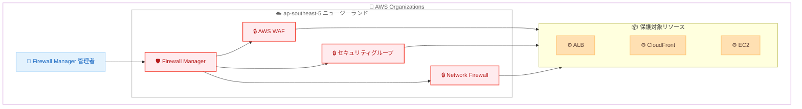

# AWS Firewall Manager - アジアパシフィック (ニュージーランド) リージョンでの提供開始

**リリース日**: 2026年3月20日
**サービス**: AWS Firewall Manager
**機能**: アジアパシフィック (ニュージーランド) リージョンでの利用可能化

[このアップデートのインフォグラフィックを見る](https://takech9203.github.io/aws-news-summary/20260320-aws-firewall-manager-launches-ap-nz.html)

## 概要

AWS Firewall Manager がアジアパシフィック (ニュージーランド) リージョン (ap-southeast-5) で利用可能になりました。これにより、ニュージーランドおよびオセアニア地域のクラウドセキュリティ管理者や SRE は、同リージョン内でファイアウォールポリシーの一元管理が可能になります。

AWS Firewall Manager は、AWS Organizations 全体でセキュリティポリシーを一元的に設定・管理するためのセキュリティ管理サービスです。AWS WAF ルール、AWS Shield Advanced 保護、Amazon VPC セキュリティグループ、AWS Network Firewall ルール、Amazon Route 53 Resolver DNS Firewall ルールなどを一括して適用できます。

今回のリージョン拡張により、ニュージーランドリージョンにデプロイされたアプリケーションに対して、運用オーバーヘッドを削減しながら多層防御を実現できるようになります。

**アップデート前の課題**

- ニュージーランドリージョンにデプロイされたリソースに対して、Firewall Manager によるセキュリティポリシーの一元管理ができなかった
- ニュージーランドリージョンのリソースを保護するには、個別にセキュリティ設定を管理する必要があった
- オセアニア地域でのセキュリティ管理において、リージョン選択肢が限られていた

**アップデート後の改善**

- ニュージーランドリージョンのリソースに対して Firewall Manager のセキュリティポリシーを適用可能になった
- 既存の AWS Organizations 全体のセキュリティポリシーをニュージーランドリージョンにも展開できるようになった
- ニュージーランドリージョンで AWS WAF、Shield Advanced、VPC セキュリティグループなどの一元管理が可能になった

## アーキテクチャ図



この図は、AWS Firewall Manager がニュージーランドリージョンでセキュリティポリシーを一元管理し、AWS WAF、セキュリティグループ、Network Firewall を通じて保護対象リソースを保護する構成を示しています。

## サービスアップデートの詳細

### 主要機能

1. **セキュリティポリシーの一元管理**
   - AWS Organizations 全体でファイアウォールルールやセキュリティポリシーを一括設定
   - 新しいアカウントやリソースが追加された際に、自動的にポリシーを適用
   - ニュージーランドリージョンのリソースも管理対象に含められるようになった

2. **多層防御の実現**
   - AWS WAF によるウェブアプリケーション保護
   - AWS Shield Advanced による DDoS 対策
   - VPC セキュリティグループによるネットワークレベルの制御
   - AWS Network Firewall によるトラフィックフィルタリング

3. **コンプライアンス監視**
   - ポリシーに準拠していないリソースの自動検出
   - 非準拠リソースに対する自動修復アクションの設定
   - AWS Security Hub との統合によるセキュリティ状態の可視化

## 技術仕様

### リージョン情報

| 項目 | 詳細 |
|------|------|
| リージョン名 | アジアパシフィック (ニュージーランド) |
| リージョンコード | ap-southeast-5 |
| サービス | AWS Firewall Manager |

### Firewall Manager で管理可能なサービス

| サービス | 用途 |
|----------|------|
| AWS WAF | ウェブアプリケーションの保護 |
| AWS Shield Advanced | DDoS 攻撃からの保護 |
| VPC セキュリティグループ | ネットワークアクセス制御 |
| AWS Network Firewall | VPC トラフィックのフィルタリング |
| Amazon Route 53 Resolver DNS Firewall | DNS クエリのフィルタリング |
| サードパーティファイアウォール | Palo Alto Networks 等のサードパーティ製品 |

## 設定方法

### 前提条件

1. AWS Organizations が有効化されていること
2. Firewall Manager の管理者アカウントが設定されていること
3. ニュージーランドリージョン (ap-southeast-5) が Organizations で有効化されていること

### 手順

#### ステップ 1: Firewall Manager 管理者の確認

```bash
aws fms get-admin-account --region ap-southeast-5
```

Firewall Manager の管理者アカウントがニュージーランドリージョンで認識されているか確認します。

#### ステップ 2: セキュリティポリシーの作成

```bash
aws fms put-policy \
  --region ap-southeast-5 \
  --policy '{
    "PolicyName": "nz-waf-policy",
    "RemediationEnabled": true,
    "ResourceType": "AWS::ElasticLoadBalancingV2::LoadBalancer",
    "SecurityServicePolicyData": {
      "Type": "WAF",
      "ManagedServiceData": "{\"type\":\"WAF\",\"defaultAction\":{\"type\":\"ALLOW\"},\"overrideCustomerWebACLAssociation\":false}"
    },
    "IncludeMap": {
      "ACCOUNT": ["123456789012"]
    }
  }'
```

ニュージーランドリージョンの ALB に対して AWS WAF ポリシーを作成します。`RemediationEnabled` を `true` に設定すると、非準拠リソースが自動的に修復されます。

#### ステップ 3: ポリシーの準拠状況確認

```bash
aws fms get-compliance-detail \
  --region ap-southeast-5 \
  --policy-id "policy-id" \
  --member-account "123456789012"
```

作成したポリシーに対するリソースの準拠状況を確認します。

## メリット

### ビジネス面

- **コンプライアンス対応**: ニュージーランド国内のデータ保護規制やセキュリティ要件への対応が容易になる
- **運用コスト削減**: セキュリティポリシーの一元管理により、個別設定の運用オーバーヘッドを削減
- **セキュリティガバナンス強化**: Organizations 全体で一貫したセキュリティポリシーをニュージーランドリージョンにも適用可能

### 技術面

- **自動化**: 新規リソースへのセキュリティポリシーの自動適用により、設定漏れを防止
- **多層防御**: WAF、Shield Advanced、Network Firewall を組み合わせた包括的なセキュリティ対策が可能
- **可視化**: 非準拠リソースの自動検出と Security Hub との統合により、セキュリティ状態を一元的に把握可能

## デメリット・制約事項

### 制限事項

- AWS Firewall Manager の利用には AWS Organizations の有効化が必須
- Firewall Manager 自体の利用料に加えて、管理対象の各セキュリティサービスの料金が別途発生する
- 一部の管理対象サービスがニュージーランドリージョンで未提供の場合、そのサービスのポリシーは適用できない

### 考慮すべき点

- Firewall Manager の管理者アカウントは Organizations 全体で 1 つのため、既存環境への影響を事前に確認すること
- ニュージーランドリージョンが新しいため、サービスクォータのデフォルト値が他リージョンと異なる場合がある

## 料金

AWS Firewall Manager の料金はポリシーごとに課金されます。各リージョンの各ポリシーに対して月額料金が発生します。

### 料金例

| 項目 | 月額料金 |
|------|----------|
| Firewall Manager ポリシー | $100/ポリシー/リージョン |

※ 上記は Firewall Manager 自体の料金です。AWS WAF、Shield Advanced、Network Firewall など管理対象サービスの料金は別途発生します。正確な料金は [AWS Firewall Manager 料金ページ](https://aws.amazon.com/firewall-manager/pricing/) を参照してください。

## 利用可能リージョン

今回のアップデートにより、AWS Firewall Manager はアジアパシフィック (ニュージーランド) リージョン (ap-southeast-5) で利用可能になりました。Firewall Manager は既に多くの AWS リージョンで提供されており、今回の拡張によりオセアニア地域でのカバレッジが強化されました。

## 関連サービス・機能

- **AWS WAF**: ウェブアプリケーションを一般的なウェブエクスプロイトから保護するサービス。Firewall Manager で一元管理可能
- **AWS Shield Advanced**: DDoS 攻撃に対する高度な保護を提供するサービス。Firewall Manager で保護対象リソースを一括設定可能
- **AWS Network Firewall**: VPC トラフィックのフィルタリングと監視を行うマネージドファイアウォールサービス
- **AWS Security Hub**: セキュリティアラートの集約と準拠状況の確認。Firewall Manager の検出結果を統合可能

## 参考リンク

- [インフォグラフィック](https://takech9203.github.io/aws-news-summary/20260320-aws-firewall-manager-launches-ap-nz.html)
- [公式発表 (What's New)](https://aws.amazon.com/about-aws/whats-new/2026/03/aws-firewall-manager-launches-ap-nz/)
- [AWS Firewall Manager ドキュメント](https://docs.aws.amazon.com/waf/latest/developerguide/fms-chapter.html)
- [AWS Firewall Manager 料金ページ](https://aws.amazon.com/firewall-manager/pricing/)

## まとめ

AWS Firewall Manager がアジアパシフィック (ニュージーランド) リージョンで利用可能になったことで、同リージョンにデプロイされたアプリケーションに対するセキュリティポリシーの一元管理が可能になりました。AWS Organizations を活用して、WAF ルールやセキュリティグループなどを一括管理することで、運用オーバーヘッドを削減しながら多層防御を実現できます。ニュージーランドリージョンでワークロードを運用している場合は、Firewall Manager を活用してセキュリティガバナンスの強化を検討してください。
