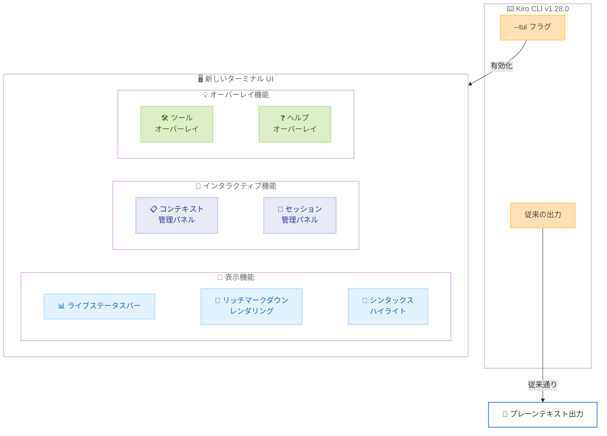

# Kiro CLI - ターミナル UI の刷新

**リリース日**: 2026年3月20日
**サービス**: Kiro
**機能**: Refreshed Terminal UI for Kiro CLI

[このアップデートのインフォグラフィックを見る](https://takech9203.github.io/aws-news-summary/20260320-kiro-changelog-2026-03-20.html)

## 概要

Kiro CLI (AWS が提供する AI 搭載 IDE のコマンドラインインターフェース) において、実験的な新しいターミナル UI が `--tui` フラグの背後に導入されました。バージョン 1.28.0 で提供されるこの新しいターミナル体験は、ライブステータスバー、リッチマークダウンレンダリング、シンタックスハイライト付きコードブロック、インタラクティブパネル、コンテキストオーバーレイなど、多彩な機能を備えています。

従来の Kiro CLI はテキストベースの出力が中心でしたが、今回の TUI (Terminal User Interface) の導入により、ターミナル上でもグラフィカルな操作体験が可能になります。セッションやコンテキストの管理をインタラクティブに行えるパネルや、ツールやヘルプ情報をその場で確認できるオーバーレイ機能により、開発者のワークフローが大幅に改善されます。

この機能は現在実験的 (experimental) な位置づけであり、`--tui` フラグを明示的に指定することで有効化できます。ユーザーからのフィードバックを基に、将来的にデフォルトの体験として統合される可能性があります。

**アップデート前の課題**

- Kiro CLI のターミナル出力はプレーンテキストが中心で、コードブロックの視認性が低かった
- セッションやコンテキストの管理にはコマンドを個別に実行する必要があり、操作が煩雑だった
- ツールやヘルプ情報の参照時に別途コマンドを実行する必要があり、作業の流れが中断されていた

**アップデート後の改善**

- `--tui` フラグでリッチなターミナル UI を有効化でき、シンタックスハイライト付きコードブロックやマークダウンレンダリングにより出力の視認性が向上
- インタラクティブパネルによりセッションやコンテキストの管理がターミナル内で直感的に操作可能に
- コンテキストオーバーレイにより、ツールやヘルプ情報を作業フローを中断せずに確認可能に

## アーキテクチャ図



この図は、`--tui` フラグの有効化により利用可能になる新しいターミナル UI の主要コンポーネント (表示機能、インタラクティブ機能、オーバーレイ機能) の構成を示しています。

## サービスアップデートの詳細

### 主要機能

1. **ライブステータスバー**
   - ターミナル画面にリアルタイムで処理状況を表示するステータスバーを提供
   - 現在のタスクの進捗状況や実行中のツール情報を即座に把握可能
   - AI エージェントの動作状態を常時モニタリングできる

2. **リッチマークダウンレンダリングとシンタックスハイライト**
   - AI からの応答をマークダウン形式でレンダリングし、見出し、リスト、テーブルなどの構造を視覚的に表現
   - コードブロックにシンタックスハイライトを適用し、プログラミング言語に応じた色分けで表示
   - コードの可読性が向上し、AI が生成したコードの確認がより効率的に

3. **インタラクティブパネル**
   - コンテキスト管理パネルで、現在のセッションに含まれるファイルやコンテキスト情報を視覚的に管理
   - セッション管理パネルで、複数のセッション間の切り替えや履歴の参照が可能
   - キーボード操作でパネル間をシームレスに移動可能

4. **コンテキストオーバーレイ**
   - 利用可能なツールの一覧と説明をオーバーレイ表示で確認可能
   - ヘルプ情報をその場で参照でき、コマンドの使い方を素早く確認
   - 作業フローを中断することなく必要な情報にアクセス可能

## 技術仕様

### TUI 機能一覧

| 機能 | 説明 | 有効化方法 |
|------|------|-----------|
| ライブステータスバー | リアルタイムの処理状況表示 | `--tui` フラグ |
| マークダウンレンダリング | リッチテキスト表示 | `--tui` フラグ |
| シンタックスハイライト | コードブロックの色分け表示 | `--tui` フラグ |
| コンテキスト管理パネル | ファイル・コンテキストの管理 | `--tui` フラグ |
| セッション管理パネル | セッションの切り替え・履歴 | `--tui` フラグ |
| ツールオーバーレイ | 利用可能ツールの一覧表示 | `--tui` フラグ |
| ヘルプオーバーレイ | ヘルプ情報のオーバーレイ表示 | `--tui` フラグ |

### 要件

| 項目 | 詳細 |
|------|------|
| バージョン | Kiro CLI 1.28.0 以降 |
| ステータス | 実験的機能 (experimental) |
| 有効化方法 | `--tui` フラグを指定 |
| ターミナル要件 | モダンなターミナルエミュレータ推奨 |

## 設定方法

### 前提条件

1. Kiro CLI 1.28.0 以降がインストールされていること
2. モダンなターミナルエミュレータを使用していること (カラー表示および Unicode 対応)

### 手順

#### ステップ 1: Kiro CLI のバージョン確認

```bash
kiro --version
```

Kiro CLI のバージョンが 1.28.0 以降であることを確認します。バージョンが古い場合は最新版にアップデートしてください。

#### ステップ 2: TUI モードで Kiro CLI を起動

```bash
kiro --tui
```

`--tui` フラグを指定して Kiro CLI を起動すると、新しいターミナル UI が有効になります。ライブステータスバー、リッチマークダウンレンダリング、インタラクティブパネルなどの機能が利用可能になります。

#### ステップ 3: TUI 内の操作

TUI モードでは、キーボードショートカットを使用してパネルの切り替えやオーバーレイの表示が可能です。ヘルプオーバーレイを開くことで、利用可能なキーバインドの一覧を確認できます。

## メリット

### ビジネス面

- **開発者体験の向上**: リッチなターミナル UI により、CLI でも IDE に近い視覚的な開発体験が可能となり、開発者の満足度と生産性が向上
- **情報の即時把握**: ライブステータスバーとコンテキストオーバーレイにより、必要な情報への素早いアクセスが可能となり、意思決定のスピードが向上
- **学習コストの低減**: インタラクティブなパネルとオーバーレイにより、CLI の操作方法を直感的に習得可能

### 技術面

- **コードレビュー効率の向上**: シンタックスハイライト付きコードブロックにより、AI が生成したコードの確認と検証がターミナル上でも効率的に実施可能
- **セッション管理の効率化**: インタラクティブパネルにより、複数のコンテキストやセッションの管理がビジュアルに行え、操作ミスのリスクが低減
- **ワークフローの連続性**: コンテキストオーバーレイにより、作業を中断せずにツールやヘルプ情報を参照でき、開発フローの連続性が維持される

## デメリット・制約事項

### 制限事項

- 実験的機能 (experimental) の位置づけであり、将来のバージョンで仕様が変更される可能性がある
- `--tui` フラグを明示的に指定する必要があり、デフォルトでは有効化されない
- ターミナルエミュレータによっては、一部の表示機能が正しく動作しない場合がある

### 考慮すべき点

- TUI モードはターミナルのリソースを追加で消費するため、リソースが制限された環境では従来のプレーンテキスト出力が適している場合がある
- 実験的機能であるため、本番環境のスクリプトやオートメーションへの組み込みは慎重に検討する必要がある

## ユースケース

### ユースケース 1: ターミナルベースの開発環境での AI 活用

**シナリオ**: SSH 経由でリモートサーバーに接続して開発を行う開発者が、ターミナル上で AI コーディング支援を活用したい。

**実装例**:
```bash
kiro --tui
```

**効果**: リッチマークダウンレンダリングとシンタックスハイライトにより、ターミナル上でも AI の応答を視覚的に確認でき、IDE を使用できない環境でも高品質な開発体験が得られる。

### ユースケース 2: 複数タスクのコンテキスト管理

**シナリオ**: 複数の機能開発やバグ修正を並行して進める開発者が、各タスクのコンテキストを効率的に管理したい。

**実装例**:
```bash
kiro --tui
```

**効果**: インタラクティブなセッション管理パネルにより、タスクごとのセッションを視覚的に切り替えでき、コンテキストの混在を防ぎながら効率的にマルチタスクを遂行できる。

### ユースケース 3: CLI ツールの学習と習熟

**シナリオ**: Kiro CLI を使い始めた開発者が、利用可能な機能やツールを把握しながら作業を進めたい。

**実装例**:
```bash
kiro --tui
```

**効果**: ヘルプオーバーレイとツールオーバーレイにより、作業中に利用可能なコマンドやツールの情報をその場で確認でき、ドキュメントを別途参照する手間を省きながら CLI の操作を習得できる。

## 料金

Kiro CLI の TUI 機能は Kiro の各プランに含まれる機能であり、追加料金は発生しません。Kiro の利用料金はプランに応じたクレジット制で提供されています。

## 利用可能リージョン

グローバル (Kiro はグローバルサービスとして提供)

## 関連サービス・機能

- **Kiro IDE**: デスクトップアプリケーション版の AI 搭載 IDE。TUI は CLI でのターミナル体験を IDE に近づける機能
- **Kiro CLI**: Kiro のコマンドラインインターフェース。今回の TUI はこの CLI の新しい UI モード
- **Kiro Powers**: Kiro のエージェント機能。TUI のステータスバーでエージェントの動作状況をリアルタイムに確認可能

## 参考リンク

- [このアップデートのインフォグラフィック](https://takech9203.github.io/aws-news-summary/20260320-kiro-changelog-2026-03-20.html)
- [公式発表 (Kiro Changelog)](https://kiro.dev/changelog/)
- [Kiro CLI ドキュメント](https://kiro.dev/docs/cli/)

## まとめ

Kiro CLI 1.28.0 で導入された実験的なターミナル UI は、`--tui` フラグにより有効化でき、ライブステータスバー、リッチマークダウンレンダリング、シンタックスハイライト、インタラクティブパネル、コンテキストオーバーレイなどの機能を提供します。これにより、ターミナル環境でも IDE に近い視覚的な開発体験が可能になり、CLI を主要な開発ツールとして利用する開発者の生産性向上が期待されます。実験的機能であるため、まずは `--tui` フラグを試用してフィードバックを提供することを推奨します。
