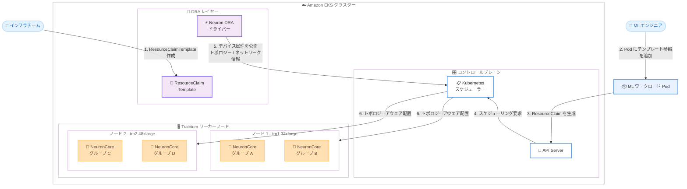

# AWS Neuron - Amazon EKS 向け Dynamic Resource Allocation サポート

**リリース日**: 2026年03月20日
**サービス**: AWS Neuron / Amazon EKS
**機能**: Neuron Dynamic Resource Allocation (DRA) ドライバー

📊 [このアップデートのインフォグラフィックを見る](https://takech9203.github.io/aws-news-summary/20260320-neuron-eks-dra-support.html)

## 概要

AWS は、Amazon EKS 向けの Neuron Dynamic Resource Allocation (DRA) ドライバーを発表しました。このドライバーにより、AWS Trainium ベースのインスタンスに対して、Kubernetes ネイティブのハードウェアアウェアスケジューリングが実現されます。Neuron DRA ドライバーは、デバイスの詳細な属性情報を Kubernetes スケジューラーに直接公開し、カスタムスケジューラー拡張を必要とせずにトポロジーアウェアな配置決定を可能にします。

インフラストラクチャチームは、デバイストポロジー、割り当てポリシー、ネットワーキングポリシーを定義した再利用可能な ResourceClaimTemplate を作成できます。ML エンジニアは、これらのテンプレートを参照するだけで、最適なハードウェア配置を自動的に取得できます。これにより、インフラストラクチャの専門知識と ML ワークロードの管理が明確に分離され、チーム間の協力が効率化されます。

**アップデート前の課題**

- Trainium インスタンス上の NeuronCore の割り当てに Kubernetes デバイスプラグインを使用しており、トポロジー情報が限定的だった
- ハードウェアトポロジーを考慮したスケジューリングにはカスタムスケジューラー拡張の開発・運用が必要だった
- ML エンジニアがインフラストラクチャの詳細を理解してデバイス要求を記述する必要があった
- デバイストポロジーやネットワーキングポリシーの再利用可能な定義方法がなかった

**アップデート後の改善**

- Neuron DRA ドライバーがデバイス属性を Kubernetes スケジューラーに直接公開し、トポロジーアウェアな配置が自動化された
- カスタムスケジューラー拡張が不要となり、標準の Kubernetes スケジューラーでハードウェアアウェアスケジューリングが利用可能になった
- ResourceClaimTemplate によりインフラ設定と ML ワークロードの関心事を分離できるようになった
- すべての AWS Trainium インスタンスタイプでの利用が可能になった

## アーキテクチャ図



Neuron DRA ドライバーは、Trainium ワーカーノード上の NeuronCore のトポロジー情報やネットワーク属性を Kubernetes スケジューラーに公開します。インフラチームが作成した ResourceClaimTemplate を ML エンジニアが Pod 定義で参照することで、スケジューラーがトポロジーアウェアな最適配置を自動的に決定します。

## サービスアップデートの詳細

### 主要機能

1. **ハードウェアアウェアスケジューリング**
   - Neuron DRA ドライバーが NeuronCore のデバイス属性をスケジューラーに直接公開
   - トポロジー情報に基づいた最適な Pod 配置を自動決定
   - カスタムスケジューラー拡張が不要で、標準の Kubernetes スケジューラーをそのまま使用可能

2. **ResourceClaimTemplate による関心事の分離**
   - インフラチームがデバイストポロジー、割り当てポリシー、ネットワーキングポリシーを ResourceClaimTemplate として定義
   - ML エンジニアは Pod 仕様からテンプレートを参照するだけで最適なリソース配置を取得
   - テンプレートは再利用可能で、複数のワークロード間で共有可能

3. **トポロジーアウェア配置**
   - NeuronCore 間の接続トポロジーを考慮した配置決定
   - 同一ノード内の近接した NeuronCore グループへの集約配置
   - マルチノードトレーニングにおけるネットワーク最適化

## 技術仕様

### 対応インスタンスタイプ

| インスタンスタイプ | アクセラレータ | NeuronCore 数 | 用途 |
|------|------|------|------|
| trn1.2xlarge | Trainium | 2 | 小規模推論・トレーニング |
| trn1.32xlarge | Trainium | 32 | 大規模トレーニング |
| trn1n.32xlarge | Trainium | 32 | ネットワーク強化トレーニング |
| trn2.48xlarge | Trainium2 | 64 | 超大規模トレーニング |

### DRA の主要コンポーネント

| コンポーネント | 説明 |
|------|------|
| Neuron DRA ドライバー | デバイス属性の検出・公開を行うコントローラー |
| ResourceClaimTemplate | デバイス要求のテンプレート定義 |
| ResourceClaim | Pod ごとに生成されるデバイス要求 |
| DeviceClass | デバイスの分類とフィルタリング条件の定義 |

### API 変更履歴

このアップデートは Kubernetes DRA フレームワークの拡張であり、AWS API の変更は伴いません。EKS アドオンとして提供される Neuron DRA ドライバーのインストールで利用可能になります。

### ResourceClaimTemplate の例

```yaml
apiVersion: resource.k8s.io/v1beta1
kind: ResourceClaimTemplate
metadata:
  name: neuron-claim-template
  namespace: ml-workloads
spec:
  spec:
    devices:
      requests:
        - name: neuron-devices
          deviceClassName: neuron
          count: 8
          selectors:
            - cel:
                expression: "device.attributes['neuron'].topology == 'ring'"
      config:
        - requests: ["neuron-devices"]
          opaque:
            driver: neuron.aws.k8s.io
            parameters:
              allocationPolicy: "topology-aware"
              networkPolicy: "efa-enabled"
```

## 設定方法

### 前提条件

1. Amazon EKS クラスター (Kubernetes 1.31 以降) が稼働していること
2. AWS Trainium ベースのインスタンスがワーカーノードとして構成されていること
3. kubectl および Helm がインストールされていること
4. DRA フィーチャーゲートが有効化されていること

### 手順

#### ステップ 1: Neuron DRA ドライバーのインストール

```bash
helm repo add aws-neuron https://aws-neuron.github.io/helm-charts
helm repo update

helm install neuron-dra-driver aws-neuron/neuron-dra-driver \
    --namespace kube-system
```

Helm チャートを使用して Neuron DRA ドライバーを EKS クラスターにインストールします。ドライバーは各 Trainium ノード上の NeuronCore を自動検出し、デバイス属性を Kubernetes API に登録します。

#### ステップ 2: ResourceClaimTemplate の作成

```bash
kubectl apply -f - <<EOF
apiVersion: resource.k8s.io/v1beta1
kind: ResourceClaimTemplate
metadata:
  name: neuron-training-template
  namespace: ml-workloads
spec:
  spec:
    devices:
      requests:
        - name: neuron-cores
          deviceClassName: neuron
          count: 16
      config:
        - requests: ["neuron-cores"]
          opaque:
            driver: neuron.aws.k8s.io
            parameters:
              allocationPolicy: "topology-aware"
EOF
```

インフラチームが ResourceClaimTemplate を作成し、トポロジーアウェアな割り当てポリシーを定義します。ML エンジニアはこのテンプレート名を参照するだけで済みます。

#### ステップ 3: Pod からテンプレートを参照

```bash
kubectl apply -f - <<EOF
apiVersion: v1
kind: Pod
metadata:
  name: neuron-training-job
  namespace: ml-workloads
spec:
  containers:
    - name: training
      image: my-training-image:latest
      resources: {}
  resourceClaims:
    - name: neuron-claim
      resourceClaimTemplateName: neuron-training-template
EOF
```

ML エンジニアが Pod 定義で ResourceClaimTemplate を参照します。Kubernetes スケジューラーが DRA ドライバーから取得したトポロジー情報に基づいて、最適なノードと NeuronCore を自動的に選択します。

## メリット

### ビジネス面

- **チーム効率の向上**: インフラチームと ML チームの関心事が分離され、それぞれの専門領域に集中できる
- **運用コストの削減**: カスタムスケジューラーの開発・運用が不要となり、標準の Kubernetes エコシステムを活用可能
- **リソース利用率の最適化**: トポロジーアウェアな配置により、ハードウェアリソースの利用効率が向上

### 技術面

- **Kubernetes ネイティブ統合**: DRA は Kubernetes の標準 API であり、既存のツールやワークフローとの互換性が高い
- **トポロジー最適化**: NeuronCore 間の接続トポロジーを考慮した配置により、トレーニング性能が向上
- **宣言的リソース管理**: ResourceClaimTemplate による宣言的なリソース定義で、Infrastructure as Code の実践を促進

## デメリット・制約事項

### 制限事項

- Kubernetes 1.31 以降が必要であり、DRA フィーチャーゲートの有効化が前提
- AWS Trainium ベースのインスタンスのみが対象で、GPU インスタンスには適用されない
- DRA は Kubernetes の比較的新しい機能であり、エコシステムのツールサポートが限定的な場合がある

### 考慮すべき点

- 既存のデバイスプラグインベースのワークロードから DRA への移行計画が必要
- ResourceClaimTemplate の設計にはデバイストポロジーの知識が求められるため、インフラチームの学習コストが発生する
- DRA ドライバーのバージョン管理と EKS クラスターのアップグレードの整合性を維持する必要がある

## ユースケース

### ユースケース 1: 大規模分散トレーニング

**シナリオ**: 数十億パラメータの基盤モデルを複数の Trainium インスタンスにまたがって分散トレーニングする。NeuronCore 間の通信効率を最大化するために、トポロジーアウェアな配置が不可欠。

**実装例**:
```yaml
apiVersion: resource.k8s.io/v1beta1
kind: ResourceClaimTemplate
metadata:
  name: distributed-training-template
spec:
  spec:
    devices:
      requests:
        - name: neuron-cores
          deviceClassName: neuron
          count: 32
      config:
        - requests: ["neuron-cores"]
          opaque:
            driver: neuron.aws.k8s.io
            parameters:
              allocationPolicy: "topology-aware"
              networkPolicy: "efa-enabled"
```

**効果**: スケジューラーが自動的にトポロジー最適な NeuronCore 配置を選択し、分散トレーニングのデータ通信オーバーヘッドを最小化できる。

### ユースケース 2: マルチテナント ML プラットフォーム

**シナリオ**: 複数の ML チームが共有する EKS クラスター上で、チームごとに異なるリソース要件とトポロジーポリシーを適用したい。

**実装例**:
```yaml
# チーム A 用テンプレート - 小規模推論
apiVersion: resource.k8s.io/v1beta1
kind: ResourceClaimTemplate
metadata:
  name: team-a-inference-template
  namespace: team-a
spec:
  spec:
    devices:
      requests:
        - name: neuron-cores
          deviceClassName: neuron
          count: 2
---
# チーム B 用テンプレート - 大規模トレーニング
apiVersion: resource.k8s.io/v1beta1
kind: ResourceClaimTemplate
metadata:
  name: team-b-training-template
  namespace: team-b
spec:
  spec:
    devices:
      requests:
        - name: neuron-cores
          deviceClassName: neuron
          count: 16
      config:
        - requests: ["neuron-cores"]
          opaque:
            driver: neuron.aws.k8s.io
            parameters:
              allocationPolicy: "topology-aware"
```

**効果**: インフラチームがチームごとのテンプレートを一元管理し、各 ML チームはテンプレートを参照するだけで適切なリソース配置を取得できる。

### ユースケース 3: CI/CD パイプラインでのモデル検証

**シナリオ**: CI/CD パイプラインの一部としてモデルの推論性能を Trainium 上で自動検証したい。パイプラインのジョブごとに適切な NeuronCore を動的に割り当てる必要がある。

**実装例**:
```yaml
apiVersion: batch/v1
kind: Job
metadata:
  name: model-validation
spec:
  template:
    spec:
      containers:
        - name: validator
          image: model-validator:latest
      resourceClaims:
        - name: neuron-claim
          resourceClaimTemplateName: neuron-validation-template
      restartPolicy: Never
```

**効果**: Kubernetes Job が完了後に NeuronCore を自動的に解放し、他のワークロードが利用可能になる。DRA によるリソースのライフサイクル管理が自動化される。

## 料金

Neuron DRA ドライバー自体に追加料金は発生しません。料金は、使用する Amazon EKS クラスターと AWS Trainium インスタンスの標準料金に基づきます。

### 料金例

| リソース | 料金 |
|--------|------|
| Amazon EKS クラスター | $0.10/時間 |
| trn1.32xlarge インスタンス | オンデマンド料金に準拠 |
| trn2.48xlarge インスタンス | オンデマンド料金に準拠 |
| Neuron DRA ドライバー | 追加料金なし |

詳細は [Amazon EKS 料金ページ](https://aws.amazon.com/eks/pricing/) および [Amazon EC2 Trn インスタンス料金ページ](https://aws.amazon.com/ec2/pricing/) を参照してください。

## 利用可能リージョン

AWS Trainium インスタンスが利用可能なすべての AWS リージョンで Neuron DRA ドライバーを使用できます。Trainium の利用可能リージョンの詳細は [AWS リージョン別サービス一覧](https://aws.amazon.com/about-aws/global-infrastructure/regional-product-services/) で確認できます。

## 関連サービス・機能

- **Amazon EKS**: Kubernetes マネージドサービスで、Neuron DRA ドライバーの実行基盤
- **AWS Neuron SDK**: Trainium および Inferentia 向けの機械学習コンパイラ、ランタイム、ツール群
- **AWS Trainium**: 機械学習トレーニング向けに設計された AWS カスタムチップ
- **Kubernetes DRA**: Kubernetes 1.26 で導入されたリソース割り当ての標準フレームワーク
- **Amazon SageMaker HyperPod**: 大規模 ML ワークロード向けの耐障害性クラスター管理サービス

## 参考リンク

- 📊 [インフォグラフィック](https://takech9203.github.io/aws-news-summary/20260320-neuron-eks-dra-support.html)
- [公式発表 (What's New)](https://aws.amazon.com/about-aws/whats-new/2026/03/neuron-eks-dra-support/)
- [AWS Neuron ドキュメント](https://awsdocs-neuron.readthedocs-hosted.com/en/latest/)
- [Amazon EKS ドキュメント](https://docs.aws.amazon.com/eks/latest/userguide/)
- [Kubernetes DRA ドキュメント](https://kubernetes.io/docs/concepts/scheduling-eviction/dynamic-resource-allocation/)
- [Amazon EKS 料金ページ](https://aws.amazon.com/eks/pricing/)

## まとめ

Neuron DRA ドライバーは、Amazon EKS 上の Trainium ワークロードに対して Kubernetes ネイティブのトポロジーアウェアスケジューリングを実現する重要なアップデートです。カスタムスケジューラー拡張が不要となり、ResourceClaimTemplate によるインフラと ML ワークロードの関心事の分離が可能になることで、大規模な ML プラットフォーム運用の効率が大幅に向上します。Trainium を使用して EKS 上で ML ワークロードを実行している組織は、Neuron DRA ドライバーの導入を検討し、トポロジーアウェアな配置によるトレーニング性能の最適化を推奨します。
