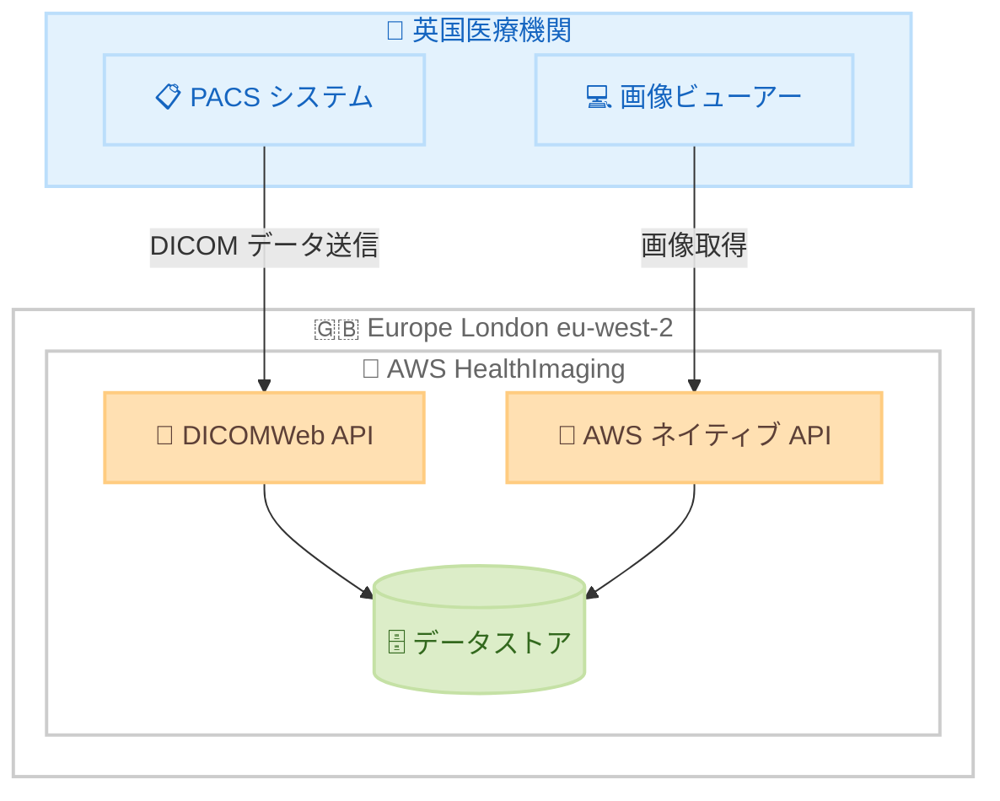

# AWS HealthImaging - Europe (London) リージョンでの提供開始

**リリース日**: 2026 年 03 月 23 日
**サービス**: AWS HealthImaging
**機能**: Europe (London) リージョンでの一般提供

📊 [このアップデートのインフォグラフィックを見る](https://takech9203.github.io/aws-news-summary/20260323-aws-healthimaging-europe-london.html)

## 概要

AWS HealthImaging が Europe (London) リージョン (eu-west-2) で一般提供を開始した。AWS HealthImaging は HIPAA 対象サービスであり、医療機関、ライフサイエンス組織、およびそのソフトウェアパートナーがペタバイトスケールで医用画像を保存、分析、共有できるフルマネージドサービスである。

今回のリージョン拡張により、英国を拠点とする医療機関やライフサイエンス企業は、データレジデンシー要件を満たしながら HealthImaging を活用できるようになった。DICOMWeb API による既存アプリケーションとの統合、および AWS ネイティブ API によるクラウドファーストな実装の両方が可能であり、自前のソリューションと比較して最大 40% のストレージコスト削減が期待できる。

**アップデート前の課題**

- 英国の医療機関が HealthImaging を利用するには、他のリージョン (米国やアイルランドなど) にデータを保存する必要があった
- 英国のデータレジデンシー要件やデータ主権規制を満たすことが困難だった
- 英国からの物理的な距離によるレイテンシーが、リアルタイムの医用画像閲覧に影響する可能性があった
- NHS や英国の医療規制への準拠において、データの所在地が課題となっていた

**アップデート後の改善**

- 英国内にデータを保存でき、データレジデンシー要件を満たすことが可能になった
- London リージョンからの低レイテンシーアクセスにより、英国の医療機関のユーザーエクスペリエンスが向上
- 英国の規制要件に準拠した医用画像管理が実現可能になった
- HealthImaging の全機能を London リージョンで利用可能

## アーキテクチャ図



英国の医療機関から London リージョンの HealthImaging に DICOMWeb API または AWS ネイティブ API 経由でアクセスする構成を示す。

## サービスアップデートの詳細

### 主要機能

1. **フルマネージド医用画像ストレージ**
   - ペタバイトスケールでの医用画像の保存と管理
   - インフラストラクチャの管理が不要
   - 自前のソリューションと比較して最大 40% のストレージコスト削減

2. **DICOMWeb API サポート**
   - 業界標準の DICOMWeb API を提供
   - 既存の PACS システムや医用画像ビューアーとの容易な統合
   - DICOM データのインポートおよびエクスポート

3. **AWS ネイティブ API**
   - クラウドファーストな実装向けの AWS ネイティブ API を提供
   - AWS SDK を使用した柔軟な統合
   - 高速な画像フレーム取得

4. **HIPAA 対象サービス**
   - 医療情報のプライバシーとセキュリティに関する規制に準拠
   - 暗号化とアクセス制御による保護
   - 監査ログの取得

## 技術仕様

### リージョン情報

| 項目 | 詳細 |
|------|------|
| リージョン名 | Europe (London) |
| リージョンコード | eu-west-2 |
| サービスエンドポイント | medical-imaging.eu-west-2.amazonaws.com |
| HIPAA 対応 | あり |

### サポートされる API

| API タイプ | 説明 |
|-----------|------|
| DICOMWeb API | STOW-RS、WADO-RS、QIDO-RS などの標準 DICOM Web サービス |
| AWS ネイティブ API | データストア管理、イメージセット操作、画像フレーム取得 |
| Import/Export | S3 経由での DICOM データのバッチインポート・エクスポート |

### API 変更履歴

直近 7 日間で HealthImaging に関連する API 変更は確認されなかった。

## 設定方法

### 前提条件

1. AWS アカウントを持っていること
2. London リージョン (eu-west-2) へのアクセス権限があること
3. AWS CLI v2 がインストール済みであること

### 手順

#### ステップ 1: データストアの作成

```bash
aws medical-imaging create-datastore \
    --datastore-name "uk-medical-images" \
    --region eu-west-2
```

London リージョンに新しいデータストアを作成する。データストアは医用画像を格納するコンテナとして機能する。

#### ステップ 2: DICOM データのインポート

```bash
aws medical-imaging start-dicom-import-job \
    --datastore-id "<datastore-id>" \
    --input-s3-uri "s3://my-dicom-bucket/images/" \
    --output-s3-uri "s3://my-output-bucket/import-results/" \
    --data-access-role-arn "arn:aws:iam::123456789012:role/HealthImagingImportRole" \
    --region eu-west-2
```

S3 バケットに保存された DICOM データをデータストアにインポートする。インポートジョブの結果は output-s3-uri で指定した S3 バケットに出力される。

#### ステップ 3: 画像フレームの取得

```bash
aws medical-imaging get-image-frame \
    --datastore-id "<datastore-id>" \
    --image-set-id "<image-set-id>" \
    --image-frame-information imageFrameId="<frame-id>" \
    --region eu-west-2 \
    outfile.jph
```

データストアから画像フレームを取得する。HTJ2K 形式で出力される。

## メリット

### ビジネス面

- **データレジデンシー対応**: 英国内にデータを保存でき、英国および EU のデータ保護規制に準拠可能
- **コスト削減**: 自前のストレージソリューションと比較して最大 40% のコスト削減
- **市場拡大**: 英国の医療機関やライフサイエンス企業にサービスを提供する ISV が、London リージョンを活用して顧客基盤を拡大可能

### 技術面

- **低レイテンシー**: 英国からの物理的距離が短縮され、画像閲覧時のレスポンスが向上
- **フルマネージド**: インフラストラクチャの管理が不要で、開発者はアプリケーションロジックに集中可能
- **既存機能の完全サポート**: DICOMWeb API、AWS ネイティブ API、JPEG XL サポートなど全ての機能が利用可能

## デメリット・制約事項

### 制限事項

- HealthImaging は現在 5 リージョンでのみ利用可能であり、全てのリージョンで提供されているわけではない
- クロスリージョンレプリケーションは HealthImaging のネイティブ機能としては提供されていない
- 大規模な DICOM データの初期移行にはネットワーク帯域幅の確保が必要

### 考慮すべき点

- 既存のアイルランドリージョンから London リージョンへの移行を検討する場合、データの再インポートが必要
- London リージョンの料金は他のリージョンと異なる可能性があるため、事前に確認が推奨される

## ユースケース

### ユースケース 1: NHS トラストの医用画像管理

**シナリオ**: 英国の NHS トラストが複数の病院にまたがる医用画像を一元管理し、放射線科医がリモートから画像にアクセスしたい。データは英国内に保存する必要がある。

**効果**: London リージョンの HealthImaging を使用することで、データレジデンシー要件を満たしながら、ペタバイトスケールの医用画像をフルマネージドで管理でき、インフラストラクチャの運用負荷を大幅に軽減できる。

### ユースケース 2: 英国ライフサイエンス企業の研究データ管理

**シナリオ**: 英国のライフサイエンス企業が臨床試験で生成される大量の医用画像を分析のために保存・共有したい。

**効果**: DICOMWeb API を通じて既存のシステムと統合し、AWS ネイティブ API を使用して分析パイプラインを構築することで、研究データの管理と分析を効率化できる。

### ユースケース 3: 医用画像 SaaS プロバイダーの英国市場展開

**シナリオ**: 医用画像 SaaS プロバイダーが英国市場に参入するにあたり、顧客の医用画像データを英国内に保存するサービスを提供したい。

**効果**: London リージョンを活用することで、英国の医療機関に対してデータレジデンシー準拠のサービスを提供でき、最大 40% のストレージコスト削減メリットを顧客に還元できる。

## 料金

AWS HealthImaging の標準料金が適用される。London リージョンでの具体的な料金については、[AWS HealthImaging 料金ページ](https://aws.amazon.com/healthimaging/pricing/)を参照。

### 料金構成要素

| 料金項目 | 説明 |
|----------|------|
| ストレージ | 格納された医用画像データの容量に基づく課金 |
| DICOM インポート | DICOM データのインポート処理に対する課金 |
| API リクエスト | DICOMWeb API および AWS ネイティブ API の呼び出しに対する課金 |
| データ転送 | リージョン外へのデータ転送に対する課金 |

## 利用可能リージョン

AWS HealthImaging が一般提供されているリージョンは以下の通り。

- 米国東部 (バージニア北部) - us-east-1
- 米国西部 (オレゴン) - us-west-2
- アジアパシフィック (シドニー) - ap-southeast-2
- ヨーロッパ (アイルランド) - eu-west-1
- ヨーロッパ (ロンドン) - eu-west-2 **← 新規追加**

## 関連サービス・機能

- **Amazon S3**: DICOM データのインポート元およびエクスポート先として使用
- **Amazon CloudWatch**: HealthImaging データストアの監視メトリクスを提供
- **AWS IAM**: データストアおよび医用画像へのアクセス制御
- **AWS HealthLake**: 医療データの統合管理プラットフォーム

## 参考リンク

- 📊 [インフォグラフィック](https://takech9203.github.io/aws-news-summary/20260323-aws-healthimaging-europe-london.html)
- [公式発表 (What's New)](https://aws.amazon.com/about-aws/whats-new/2026/03/aws-healthimaging-europe-london/)
- [AWS HealthImaging 開発者ガイド](https://docs.aws.amazon.com/healthimaging/latest/devguide/what-is.html)
- [AWS HealthImaging 料金ページ](https://aws.amazon.com/healthimaging/pricing/)

## まとめ

AWS HealthImaging の Europe (London) リージョンでの提供開始により、英国の医療機関やライフサイエンス企業がデータレジデンシー要件を満たしながら、ペタバイトスケールの医用画像管理をフルマネージドで利用できるようになった。英国市場でのデータ主権要件を持つ組織や、低レイテンシーでの画像アクセスが求められるユースケースにおいて、London リージョンの活用を検討されたい。
