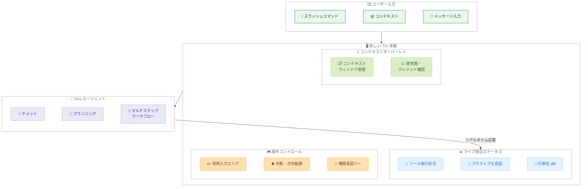

# Kiro CLI - 新しい UX デザインの導入

**リリース日**: 2026年3月23日
**サービス**: Kiro
**機能**: A new look for the Kiro CLI

[このアップデートのインフォグラフィックを見る](https://takech9203.github.io/aws-news-summary/20260323-kiro-new-look-for-cli.html)

## 概要

Kiro CLI (AWS が提供する AI 搭載 IDE のコマンドラインインターフェース) において、新しい UX デザインが実験的モードとして公開されました。`kiro-cli --tui` コマンドで起動でき、ライブ統合ステータス表示、常時利用可能な入力エリア、スラッシュコマンドと `@` コンテキスト、コンテキストオーバーレイなど、ターミナルでのエージェント操作体験を大幅に刷新する機能群を備えています。

この UX リフレッシュは、Kiro CLI がターミナルに AI エージェントを導入した初期の行単位出力方式から、フル TUI (Terminal User Interface) へと再構築されたものです。バイブコーディング、プランニング、サブエージェントなど多様なユースケースの拡大に伴い、より洗練されたインタラクション基盤が必要となったことが背景にあります。

現在は実験的モードとして提供されており、従来の体験と並行して利用できます。コミュニティからのフィードバックを基に、将来的にデフォルト体験として統合される予定です。

**アップデート前の課題**

- 従来の CLI は行単位の出力方式で、エージェントの動作状況やツール実行状態の把握が断片的だった
- エージェント動作中に次のメッセージを入力したり、処理を中断・方向転換する操作がスムーズに行えなかった
- GUI で一般的な `/` コマンドや `@` コンテキストなどのモダンな入力補助機能がターミナル上で利用できなかった

**アップデート後の改善**

- ライブ統合ステータスにより、ツール実行状況、アクティブな会話、行単位の diff がリアルタイムで一元的に表示されるようになった
- 常時表示の入力エリアにより、エージェント動作中でもメッセージの入力、Escape キーによる中断、方向転換が即座に可能になった
- スラッシュコマンド、`@` コンテキスト、コンテキストオーバーレイにより、GUI 相当の操作性がターミナル上で実現された

## アーキテクチャ図



この図は、新しい TUI 体験におけるユーザー入力からエージェントへの操作フロー、およびリアルタイムステータス表示の構成を示しています。

## サービスアップデートの詳細

### 主要機能

1. **Live Unified Status (ライブ統合ステータス)**
   - エージェントの応答に合わせてリアルタイムに更新されるステータスバーを表示
   - ツール実行状況、アクティブな会話、行単位の diff を統合した一貫性のある UX を提供
   - ファイルの読み取り、コードの書き込み、bash コマンドの実行など、現在アクティブな処理とセッション内の過去の処理を明確に区別して表示

2. **Omnipresent Input (常時入力エリア)**
   - 入力エリアが常に利用可能な状態で表示され、エージェント動作中でも次のメッセージをキュー可能
   - Escape キーで即座にエージェントを中断し、新しい方向に誘導可能
   - ツール実行の権限が必要な場合、入力エリアの直上にスナックバーが表示され、許可・拒否・永続信頼の選択が可能

3. **Slash Commands and @ Context (スラッシュコマンドと @ コンテキスト)**
   - `/` を入力するとドロップダウンで利用可能なコマンド一覧を表示
   - `@` を入力して会話にコンテキストを追加可能
   - 従来 GUI でのみ利用可能だった操作性をターミナル環境で実現

4. **Contextual Overlays (コンテキストオーバーレイ)**
   - コンテキストウィンドウの管理や使用量・クレジットの確認をプロンプト領域内のパネルとして表示
   - GUI のサイドパネルに相当する機能をターミナルネイティブで実現
   - 作業フローを中断せずに必要な情報にアクセス可能

## 技術仕様

### 新 UX 機能一覧

| 機能 | 説明 |
|------|------|
| ライブ統合ステータス | ツール実行、会話、diff をリアルタイムで一元表示 |
| 常時入力エリア | エージェント動作中も入力・中断・方向転換が可能 |
| 権限承認スナックバー | ツール実行権限の許可・拒否・永続信頼を入力エリア付近で操作 |
| スラッシュコマンド | `/` でコマンド一覧をドロップダウン表示 |
| @ コンテキスト | `@` で会話にコンテキストを追加 |
| コンテキストオーバーレイ | コンテキストウィンドウ管理をパネル表示 |
| 使用量パネル | クレジットと使用量をオーバーレイで確認 |

### 起動方法

| 項目 | 詳細 |
|------|------|
| ステータス | 実験的機能 (experimental) |
| 起動コマンド | `kiro-cli --tui` |
| 従来モードとの関係 | 並行して利用可能。いつでも従来体験に戻せる |
| フィードバック方法 | Discord の #kiro-cli-v2-ux-feedback または CLI 内の `/feedback` コマンド |

## 設定方法

### 前提条件

1. Kiro CLI がインストールされていること
2. モダンなターミナルエミュレータを使用していること

### 手順

#### ステップ 1: Kiro CLI のインストール

```bash
# Kiro CLI をインストール (未インストールの場合)
# https://kiro.dev/downloads/ からダウンロード
```

Kiro CLI がまだインストールされていない場合は、公式サイトからダウンロードしてインストールします。

#### ステップ 2: 新しい TUI モードで起動

```bash
kiro-cli --tui
```

`--tui` フラグを指定して Kiro CLI を起動すると、新しいターミナル UI が有効になります。ライブ統合ステータス、常時入力エリア、スラッシュコマンド、コンテキストオーバーレイなどの機能が利用可能になります。

#### ステップ 3: フィードバックの提供

```bash
# CLI 内で /feedback コマンドを使用
/feedback
```

新しい UX に関するフィードバックを `/feedback` コマンドまたは Discord の #kiro-cli-v2-ux-feedback チャンネルで共有できます。

## メリット

### ビジネス面

- **開発者体験の大幅な向上**: GUI に匹敵するモダンな操作性をターミナル上で実現し、CLI を好む開発者の生産性と満足度を向上
- **エージェント操作の即応性**: 常時入力エリアと中断機能により、エージェントとのインタラクションの待ち時間を排除し、開発スピードを加速
- **スムーズな移行**: 従来モードと並行して利用できるため、チーム内での段階的な導入が可能

### 技術面

- **統合ステータス表示**: ツール実行、会話、diff の一元表示により、エージェントの動作状態の可視性が飛躍的に向上
- **フル TUI アーキテクチャ**: 表示レイヤーだけでなく、ターミナルでのエージェントインタラクションのための新しいデザイン言語として再構築されており、サブエージェントやマルチエージェントチームなどの将来の拡張にも対応可能な基盤を提供
- **画面領域の最適化**: 統合ターミナルなど制約のある環境にも適応するよう設計されており、限られた画面スペースを効率的に活用

## デメリット・制約事項

### 制限事項

- 実験的機能 (experimental) の位置づけであり、将来のバージョンで仕様が変更される可能性がある
- `--tui` フラグを明示的に指定する必要があり、現時点ではデフォルトでは有効化されない
- ターミナルエミュレータによっては、一部の表示機能が正しく動作しない場合がある

### 考慮すべき点

- 新しい TUI が安定版になるタイミングはコミュニティのフィードバックに依存するため、移行時期は未定
- 本番環境のスクリプトやオートメーションへの組み込みは、実験的機能であることを考慮し慎重に判断する必要がある

## ユースケース

### ユースケース 1: ターミナル中心の開発ワークフロー

**シナリオ**: ターミナルを主要な開発環境として使用する開発者が、AI エージェントとの対話をより効率的に行いたい。

**実装例**:
```bash
kiro-cli --tui
```

**効果**: ライブ統合ステータスにより、エージェントがファイルを読み取っているのか、コードを書いているのか、bash コマンドを実行しているのかが即座に把握でき、フラグメント化された従来の表示に比べて大幅に操作効率が向上する。

### ユースケース 2: エージェントのリアルタイム制御

**シナリオ**: AI エージェントにタスクを依頼したが、途中で方向を変えたい場合に、処理の完了を待たずに即座に介入したい。

**実装例**:
```bash
kiro-cli --tui
# エージェントが動作中に Escape キーで中断
# 新しい指示を入力して方向を転換
```

**効果**: 常時入力エリアと中断機能により、エージェントの動作中でも即座に介入でき、不要な処理の実行を防ぎながら開発の方向性を素早く調整できる。

### ユースケース 3: コンテキストを活用した効率的なコーディング

**シナリオ**: 複数のファイルやコンテキストを参照しながら、エージェントに的確な指示を出したい。

**実装例**:
```bash
kiro-cli --tui
# @ を入力してコンテキストを追加
# / を入力してコマンド一覧を確認
```

**効果**: `@` コンテキストとスラッシュコマンドにより、必要な情報を素早くエージェントに伝達でき、GUI 環境に匹敵する効率的なコーディング体験がターミナル上で実現される。

## 料金

Kiro CLI の新しい TUI 機能は Kiro の各プランに含まれる機能であり、追加料金は発生しません。

## 利用可能リージョン

グローバル (Kiro はグローバルサービスとして提供)

## 関連サービス・機能

- **Kiro IDE**: デスクトップアプリケーション版の AI 搭載 IDE。新しい TUI は CLI でのターミナル体験を IDE に近づける機能
- **Kiro CLI**: Kiro のコマンドラインインターフェース。今回のアップデートはこの CLI の UX を刷新するもの
- **Kiro Powers**: Kiro のエージェント機能。TUI のライブ統合ステータスでエージェントの動作状況をリアルタイムに確認可能

## 参考リンク

- [このアップデートのインフォグラフィック](https://takech9203.github.io/aws-news-summary/20260323-kiro-new-look-for-cli.html)
- [公式ブログ記事](https://kiro.dev/blog/new-look-for-cli/)
- [Kiro Changelog](https://kiro.dev/changelog/)
- [Kiro CLI TUI ドキュメント](https://kiro.dev/docs/cli/experimental/tui/)
- [Kiro CLI ダウンロード](https://kiro.dev/downloads/)

## まとめ

Kiro CLI の新しい UX デザインは、ターミナルでのエージェントインタラクションを根本から再設計したフル TUI として提供されます。ライブ統合ステータス、常時入力エリア、スラッシュコマンド、@ コンテキスト、コンテキストオーバーレイなどの機能により、GUI に匹敵するモダンな操作性がターミナル環境で実現されます。実験的モードとして提供されているため、`kiro-cli --tui` で試用し、Discord の #kiro-cli-v2-ux-feedback チャンネルや `/feedback` コマンドを通じてフィードバックを提供することを推奨します。
