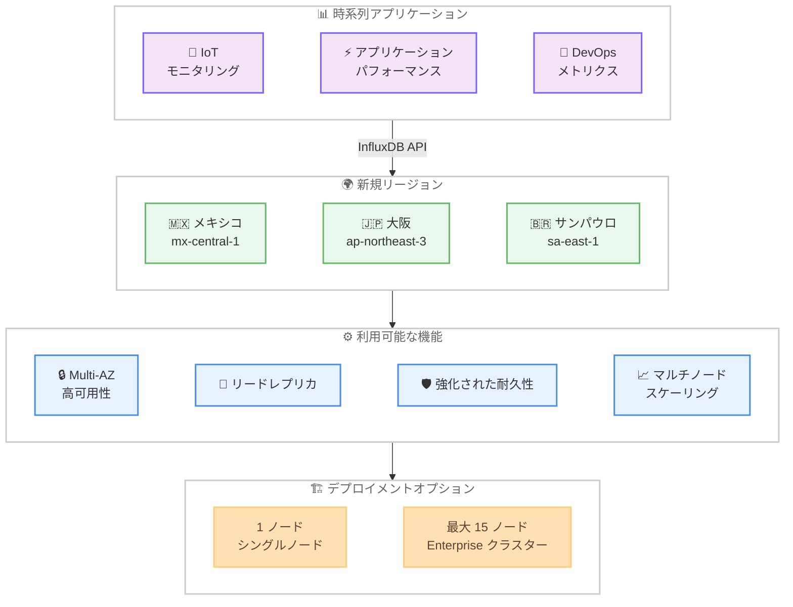

# Amazon Timestream for InfluxDB - メキシコ、大阪、サンパウロリージョンでの提供開始

**リリース日**: 2026 年 3 月 24 日
**サービス**: Amazon Timestream for InfluxDB
**機能**: メキシコ (中部)、日本 (大阪)、ブラジル (サンパウロ) リージョンでの提供開始

📊 [このアップデートのインフォグラフィックを見る](https://takech9203.github.io/aws-news-summary/20260324-amazon-timestream-influxdb-mexico-osaka-sao-paulo.html)

## 概要

Amazon Timestream for InfluxDB が、メキシコ (中部)、日本 (大阪)、ブラジル (サンパウロ) の 3 つの AWS リージョンで新たに利用可能になった。このサービスは、アプリケーション開発者や DevOps チームがオープンソースの InfluxDB API を使用して、リアルタイムの時系列アプリケーション向けにフルマネージドの InfluxDB データベースを AWS 上で実行できるようにするものである。

今回のリージョン拡張により、中南米および日本 (大阪) のお客様がデータレジデンシー要件を満たしながら、低レイテンシで時系列データベースを利用できるようになった。サービスは Multi-AZ 高可用性、リードレプリカ、強化された耐久性、マルチノードスケーリングを提供し、シングルノード構成から最大 15 ノードの Enterprise クラスターまで対応する。

**アップデート前の課題**

- メキシコ、大阪、サンパウロリージョンでは Timestream for InfluxDB が利用できず、これらの地域のお客様は他のリージョンを使用する必要があった
- 中南米および日本 (大阪) のお客様がデータレジデンシー要件を満たしながら InfluxDB のフルマネージドサービスを利用することが困難だった
- 地理的に離れたリージョンへの接続によりレイテンシが増加し、リアルタイム時系列アプリケーションのパフォーマンスに影響していた

**アップデート後の改善**

- メキシコ (中部)、日本 (大阪)、ブラジル (サンパウロ) でフルマネージドの InfluxDB を直接利用できるようになった
- これらのリージョンのお客様がデータレジデンシー要件を満たしつつ、低レイテンシで時系列データを処理できるようになった
- Multi-AZ 高可用性やマルチノードスケーリングを含む全機能がこれらのリージョンで利用可能になった

## アーキテクチャ図



この図は、新たに追加された 3 リージョンで利用可能な Timestream for InfluxDB の機能とデプロイメントオプション、および主要なユースケースの関係を示している。

## サービスアップデートの詳細

### 主要機能

1. **3 リージョンでの新規提供**
   - メキシコ (中部) / mx-central-1: 中米地域のお客様向け
   - 日本 (大阪) / ap-northeast-3: 日本国内の冗長構成や DR 要件向け
   - ブラジル (サンパウロ) / sa-east-1: 南米地域のお客様向け

2. **フルマネージド InfluxDB**
   - オープンソースの InfluxDB API との互換性を維持
   - データベースのプロビジョニング、パッチ適用、バックアップ、リカバリを AWS が管理
   - 既存の InfluxDB クライアントやツールをそのまま利用可能

3. **エンタープライズグレードの機能**
   - Multi-AZ 高可用性によるフェイルオーバー対応
   - リードレプリカによる読み取りスループットの向上
   - 強化された耐久性でデータ保護を実現
   - シングルノードから最大 15 ノードの Enterprise クラスターまでスケーリング可能

## 技術仕様

### リージョン情報

| リージョン名 | リージョンコード | 提供状況 |
|-------------|-----------------|---------|
| メキシコ (中部) | mx-central-1 | 新規追加 |
| 日本 (大阪) | ap-northeast-3 | 新規追加 |
| ブラジル (サンパウロ) | sa-east-1 | 新規追加 |

### デプロイメントオプション

| エディション | ノード構成 | 用途 |
|-------------|-----------|------|
| Core | シングルノード | 開発・テスト、小規模ワークロード |
| Enterprise | 最大 15 ノード | 本番環境、高可用性が必要なワークロード |

### サポートされる機能

| 機能 | 説明 |
|------|------|
| Multi-AZ 高可用性 | 複数のアベイラビリティゾーンにまたがるデプロイメント |
| リードレプリカ | 読み取りクエリの水平スケーリング |
| 強化された耐久性 | データの冗長保存による保護 |
| マルチノードスケーリング | 最大 15 ノードへのクラスター拡張 |
| InfluxDB API 互換 | オープンソース InfluxDB API を使用したデータ操作 |

## 設定方法

### 前提条件

1. AWS アカウントを持ち、対象リージョンでのサービス利用が有効であること
2. IAM ポリシーで Timestream for InfluxDB へのアクセス権限が設定されていること
3. VPC とサブネットが対象リージョンに作成済みであること

### 手順

#### ステップ 1: リージョンの選択と DB インスタンスの作成

```bash
aws timestream-influxdb create-db-instance \
  --region sa-east-1 \
  --name my-influxdb-instance \
  --db-instance-type db.influx.medium \
  --allocated-storage 20 \
  --vpc-subnet-ids subnet-xxxxxxxx subnet-yyyyyyyy \
  --vpc-security-group-ids sg-xxxxxxxx \
  --username admin \
  --password MySecurePassword123! \
  --organization my-org \
  --bucket my-bucket
```

サンパウロリージョンに InfluxDB インスタンスを作成するコマンド。リージョンコードを `mx-central-1` や `ap-northeast-3` に変更することで、メキシコや大阪リージョンでも作成可能である。

#### ステップ 2: Multi-AZ 高可用性の有効化

```bash
aws timestream-influxdb create-db-instance \
  --region ap-northeast-3 \
  --name my-influxdb-ha \
  --db-instance-type db.influx.xlarge \
  --allocated-storage 100 \
  --vpc-subnet-ids subnet-xxxxxxxx subnet-yyyyyyyy \
  --vpc-security-group-ids sg-xxxxxxxx \
  --deployment-type WITH_MULTI_AZ_STANDBY \
  --username admin \
  --password MySecurePassword123! \
  --organization my-org \
  --bucket my-bucket
```

大阪リージョンに Multi-AZ スタンバイを有効化した InfluxDB インスタンスを作成するコマンド。複数のアベイラビリティゾーンにまたがるデプロイメントにより高可用性を実現する。

#### ステップ 3: インスタンスの状態確認

```bash
aws timestream-influxdb get-db-instance \
  --region ap-northeast-3 \
  --identifier <db-instance-id>
```

作成した DB インスタンスの状態を確認するコマンド。ステータスが `AVAILABLE` になれば、InfluxDB API を使用してデータの書き込みとクエリが可能になる。

## メリット

### ビジネス面

- **データレジデンシー要件への対応**: メキシコ、日本 (大阪)、ブラジルの規制要件に準拠したデータ保存が可能になった
- **低レイテンシアクセス**: これらの地域のエンドユーザーに近い場所でデータベースを運用することで、リアルタイム性が向上する
- **災害復旧戦略の強化**: 日本のお客様は東京リージョンと大阪リージョンを組み合わせた DR 構成が可能になった

### 技術面

- **フルマネージド運用**: データベースの運用管理を AWS に委任し、アプリケーション開発に集中できる
- **既存ツールとの互換性**: オープンソース InfluxDB API との互換性により、既存のクライアント、Grafana ダッシュボード、Telegraf エージェントをそのまま利用可能
- **柔軟なスケーリング**: シングルノードから Enterprise クラスターまで、ワークロードの成長に応じて段階的にスケールアップ可能

## デメリット・制約事項

### 制限事項

- 新規リージョンでの提供開始直後は、インスタンスタイプの選択肢が他のリージョンと異なる場合がある
- リージョン間のデータレプリケーションは Timestream for InfluxDB のネイティブ機能としては提供されていない
- Enterprise クラスターの最大ノード数は 15 ノードに制限される

### 考慮すべき点

- 新規リージョンでの料金は他のリージョンと異なる場合があるため、事前に料金ページを確認すること
- 既存のリージョンから新規リージョンへの移行にはデータのエクスポートとインポートが必要となる
- 大阪リージョンは他の日本リージョン (東京) と比較して、利用可能なインスタンスタイプが限定される場合がある

## ユースケース

### ユースケース 1: 日本国内の災害復旧構成

**シナリオ**: 東京リージョンで Timestream for InfluxDB を運用しているが、自然災害に備えて日本国内での DR 構成が必要な場合。

**実装例**:
```
構成:
- プライマリ: ap-northeast-1 (東京) - Enterprise クラスター
- DR: ap-northeast-3 (大阪) - Enterprise クラスター
- アプリケーション側で書き込みの二重化、または定期的なデータ同期を実装
```

**効果**: 日本国内の 2 リージョンを活用した DR 構成により、リージョン障害時にも時系列データベースの可用性を維持できる。

### ユースケース 2: ブラジルの IoT モニタリング基盤

**シナリオ**: ブラジル国内に展開された IoT デバイスからの時系列データを、データレジデンシー要件を満たしながらリアルタイムで収集・分析する必要がある場合。

**実装例**:
```bash
# サンパウロリージョンに Enterprise クラスターを作成
aws timestream-influxdb create-db-instance \
  --region sa-east-1 \
  --name iot-monitoring-cluster \
  --db-instance-type db.influx.xlarge \
  --allocated-storage 500 \
  --deployment-type MULTI_NODE_READ_REPLICAS \
  --vpc-subnet-ids subnet-xxxxxxxx subnet-yyyyyyyy \
  --vpc-security-group-ids sg-xxxxxxxx \
  --username admin \
  --password MySecurePassword123! \
  --organization iot-org \
  --bucket device-metrics
```

**効果**: ブラジル国内でデータを保持しながら、Multi-AZ 高可用性とマルチノードスケーリングにより、大量の IoT デバイスデータをリアルタイムで処理できる。

### ユースケース 3: メキシコの DevOps メトリクス基盤

**シナリオ**: メキシコに拠点を持つ開発チームが、アプリケーションのパフォーマンスメトリクスをローカルリージョンで収集・監視したい場合。

**実装例**:
```
構成:
- リージョン: mx-central-1 (メキシコ中部)
- Telegraf エージェント -> Timestream for InfluxDB -> Grafana ダッシュボード
- InfluxDB API を使用してメトリクスを書き込み、Grafana で可視化
```

**効果**: メキシコリージョンでのローカル運用により、低レイテンシでメトリクスを収集・参照でき、DevOps チームの生産性が向上する。

## 料金

Amazon Timestream for InfluxDB の料金は、DB インスタンスタイプ、ストレージ容量、およびデプロイメント構成に基づいて課金される。料金はリージョンによって異なるため、新規リージョンでの利用を検討する場合は、各リージョンの料金を事前に確認することを推奨する。

### 料金要素

| 項目 | 説明 |
|------|------|
| DB インスタンス料金 | 選択したインスタンスタイプに基づく時間単位の課金 |
| ストレージ料金 | 割り当てたストレージ容量に基づく月額課金 |
| Multi-AZ スタンバイ | スタンバイインスタンスに対する追加課金 |
| データ転送 | リージョン外へのデータ転送に対する課金 |

詳細な料金については [AWS Timestream 料金ページ](https://aws.amazon.com/timestream/pricing/) を参照すること。

## 利用可能リージョン

今回のアップデートにより、以下の 3 リージョンで新たに利用可能になった。

- メキシコ (中部) / mx-central-1
- 日本 (大阪) / ap-northeast-3
- ブラジル (サンパウロ) / sa-east-1

既存の提供リージョンと合わせて、グローバルでの利用範囲が拡大された。

## 関連サービス・機能

- **Amazon Timestream for LiveAnalytics**: AWS のサーバーレス時系列データベースサービス。InfluxDB 互換ではなく独自のクエリインターフェースを提供するが、時系列データの分析で補完的に利用可能
- **Amazon Managed Service for Grafana**: Grafana のフルマネージドサービス。Timestream for InfluxDB をデータソースとして接続し、時系列データの可視化に利用可能
- **Amazon Managed Service for Prometheus**: メトリクス収集と監視に特化したマネージドサービス。Timestream for InfluxDB と組み合わせて、包括的な可観測性基盤を構築可能

## 参考リンク

- 📊 [インフォグラフィック](https://takech9203.github.io/aws-news-summary/20260324-amazon-timestream-influxdb-mexico-osaka-sao-paulo.html)
- [公式発表 (What's New)](https://aws.amazon.com/about-aws/whats-new/2026/03/amazon-timestream-influxdb-mexico-osaka-sao-paulo/)
- [ドキュメント](https://docs.aws.amazon.com/timestream/latest/developerguide/timestream-influxdb.html)
- [料金ページ](https://aws.amazon.com/timestream/pricing/)

## まとめ

Amazon Timestream for InfluxDB がメキシコ (中部)、日本 (大阪)、ブラジル (サンパウロ) の 3 リージョンで新たに利用可能になった。これにより、中南米および日本のお客様がデータレジデンシー要件を満たしながら、フルマネージドの InfluxDB データベースを低レイテンシで利用できるようになった。特に日本のお客様は、東京リージョンと大阪リージョンを組み合わせた DR 構成が可能になるため、時系列データベースの災害復旧戦略を見直すことを推奨する。
