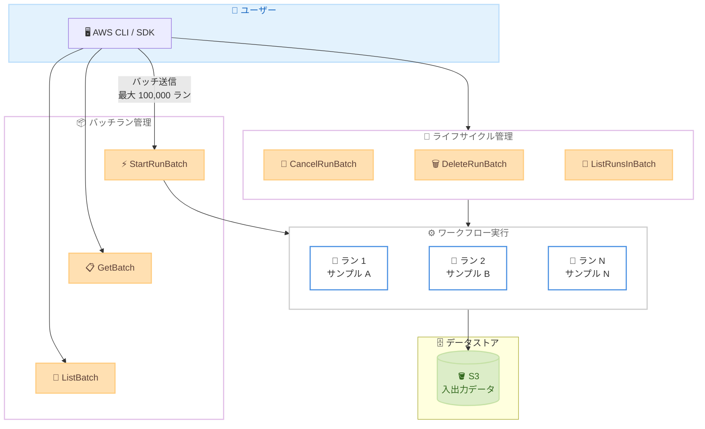

# AWS HealthOmics - バッチラン操作

**リリース日**: 2026年3月24日
**サービス**: AWS HealthOmics
**機能**: バッチラン操作 (Batch Run Operations)

📊 [このアップデートのインフォグラフィックを見る](https://takech9203.github.io/aws-news-summary/20260324-aws-healthomics-introduces-batch-run.html)

## 概要

AWS HealthOmics は、バッチランサブミッション機能を発表しました。この機能により、1 回のリクエストで最大 100,000 件のワークフローランを一括送信できるようになります。AWS HealthOmics は HIPAA 対応のフルマネージドバイオインフォマティクスワークフローサービスであり、ヘルスケアおよびライフサイエンス分野の科学的発見を加速するために設計されています。

バッチランサブミッションにより、数千のサンプルを含む大規模なゲノミクス実験を、個別のランを 1 つずつ送信・追跡するオーバーヘッドなしに実行できます。バッチ内のすべてのランは共通の設定を共有し、個別のランごとに異なるサンプル入力やパラメータ値に基づいて特定のパラメータをオーバーライドするオプションも提供されます。バッチラン API はバッチ処理ワークフローの完全なライフサイクル管理を提供し、バッチ ID リソースを使用した追跡、一括キャンセル・削除、バッチ進捗のモニタリングが可能です。

**アップデート前の課題**

- 大規模なゲノミクス実験で数千のサンプルを処理する場合、個別のランを 1 つずつ送信する必要があった
- 各ランの送信と追跡にかかるオーバーヘッドが大きく、オーケストレーションが複雑だった
- 大量のランを一括でキャンセルや削除する手段がなく、個別に操作する必要があった
- ランのステータスをバッチ単位で監視する仕組みがなく、大規模パイプラインの管理が困難だった

**アップデート後の改善**

- 1 回のリクエストで最大 100,000 件のワークフローランを一括送信できるようになった
- バッチ ID を使用してランの追跡、一括キャンセル、一括削除が可能になった
- 共通設定を共有しつつ個別パラメータのオーバーライドが可能になり、設定の重複が排除された
- バッチ進捗のモニタリングとサブミッションサマリーにより、大規模パイプラインの管理が簡素化された

## アーキテクチャ図



この図は、ユーザーが AWS CLI または SDK を使用してバッチランを送信し、バッチラン管理 API でライフサイクルを管理しながら、複数のワークフローランが並列実行される流れを示しています。

## サービスアップデートの詳細

### 主要機能

1. **バッチランサブミッション**
   - 1 回の `StartRunBatch` API 呼び出しで最大 100,000 件のワークフローランを送信
   - `defaultRunSetting` でバッチ全体の共通設定を定義し、個別ランごとにパラメータをオーバーライド可能
   - インライン設定または S3 URI 経由での設定ファイル指定に対応

2. **バッチライフサイクル管理**
   - `GetBatch` でバッチのステータス、サブミッションサマリー、ランサマリーを取得
   - `CancelRunBatch` でバッチ内の全ランを一括キャンセル
   - `DeleteRunBatch` および `DeleteBatch` でバッチとランを一括削除

3. **バッチモニタリング**
   - バッチステータス: PENDING、SUBMITTING、INPROGRESS、STOPPING、CANCELLED、FAILED、PROCESSED、RUNS_DELETING、RUNS_DELETED
   - サブミッションサマリーで成功・失敗・保留中の送信数を追跡
   - ランサマリーで各ステータスのラン数をリアルタイムで把握

4. **バッチ内ラン管理**
   - `ListRunsInBatch` でバッチ内の個別ランを一覧表示
   - サブミッションステータスによるフィルタリング: SUCCESS、FAILED、CANCEL_SUCCESS、CANCEL_FAILED、DELETE_SUCCESS、DELETE_FAILED
   - 既存の `GetRun` および `ListRuns` API にも `batchId` フィールドが追加

## 技術仕様

### バッチ設定パラメータ

| パラメータ | 説明 | 備考 |
|-----------|------|------|
| `batchName` | バッチの名前 | 識別用 |
| `defaultRunSetting` | バッチ全体の共通設定 | ワークフロー ID、ロール ARN、パラメータなど |
| `batchRunSettings` | 個別ランの設定 | インライン設定または S3 URI |
| `workflowType` | ワークフロータイプ | PRIVATE または READY2RUN |
| `cacheBehavior` | キャッシュ動作 | CACHE_ON_FAILURE または CACHE_ALWAYS |
| `storageType` | ストレージタイプ | STATIC または DYNAMIC |
| `retentionMode` | 保持モード | RETAIN または REMOVE |
| `logLevel` | ログレベル | OFF、FATAL、ERROR、ALL |

### API 変更履歴

| 日付 | サービス | 変更内容 |
|------|----------|----------|
| 2026/03/23 | [Amazon Omics](https://awsapichanges.com/archive/changes/b18efc-omics.html) | 7 new 2 updated api methods - バッチワークフローランのサポートを追加。StartRunBatch、GetBatch、ListBatch、CancelRunBatch、DeleteRunBatch、DeleteBatch、ListRunsInBatch の 7 つの新規 API と、GetRun、ListRuns の 2 つの更新 API |

### 新規 API 一覧

| API | 説明 |
|-----|------|
| `StartRunBatch` | バッチランを開始し、複数のワークフローランを一括送信 |
| `GetBatch` | バッチの詳細情報、ステータス、サマリーを取得 |
| `ListBatch` | バッチの一覧を取得。ステータスや名前でフィルタリング可能 |
| `CancelRunBatch` | バッチ内の全ランを一括キャンセル |
| `DeleteRunBatch` | バッチ内の全ランを一括削除 |
| `DeleteBatch` | バッチリソースを削除 |
| `ListRunsInBatch` | バッチ内の個別ランを一覧表示 |

### 更新 API 一覧

| API | 変更内容 |
|-----|----------|
| `GetRun` | レスポンスに `batchId` フィールドが追加 |
| `ListRuns` | リクエストに `batchId` フィルター、レスポンスに `batchId` フィールドが追加 |

## 設定方法

### 前提条件

1. AWS HealthOmics が利用可能なリージョンで AWS アカウントを所有していること
2. ワークフローが既に登録されていること (PRIVATE または READY2RUN)
3. ワークフロー実行用の IAM ロールが設定されていること
4. 入出力データ用の S3 バケットが準備されていること

### 手順

#### ステップ1: バッチランの送信

```bash
aws omics start-run-batch \
  --batch-name "genomics-experiment-2026-03" \
  --default-run-setting '{
    "workflowId": "1234567",
    "workflowType": "PRIVATE",
    "roleArn": "arn:aws:iam::123456789012:role/OmicsWorkflowRole",
    "outputUri": "s3://my-output-bucket/results/",
    "logLevel": "ALL",
    "storageType": "DYNAMIC"
  }' \
  --batch-run-settings '{
    "inlineSettings": [
      {
        "runSettingId": "sample-001",
        "name": "Sample-001-run",
        "parameters": {"sample_id": "SAMPLE001", "input_fastq": "s3://my-input-bucket/sample001.fastq.gz"}
      },
      {
        "runSettingId": "sample-002",
        "name": "Sample-002-run",
        "parameters": {"sample_id": "SAMPLE002", "input_fastq": "s3://my-input-bucket/sample002.fastq.gz"}
      }
    ]
  }'
```

`StartRunBatch` API を呼び出し、共通設定とサンプルごとの個別パラメータを指定してバッチランを送信します。

#### ステップ2: バッチステータスの確認

```bash
aws omics get-batch --batch-id "1234567"
```

`GetBatch` API でバッチの現在のステータス、サブミッションサマリー、ランサマリーを確認します。レスポンスにはバッチ内のラン数やステータスごとのカウントが含まれます。

#### ステップ3: バッチ内のランを確認

```bash
aws omics list-runs-in-batch \
  --batch-id "1234567" \
  --submission-status "SUCCESS"
```

`ListRunsInBatch` API でバッチ内の個別ランを一覧表示し、サブミッションステータスでフィルタリングします。

#### ステップ4: バッチの一括キャンセル

```bash
aws omics cancel-run-batch --batch-id "1234567"
```

問題が発生した場合、`CancelRunBatch` API でバッチ内の全ランを一括でキャンセルします。

## メリット

### ビジネス面

- **大規模実験の効率化**: 数千のサンプルを含むゲノミクス実験を 1 回のリクエストで送信でき、研究のスピードが向上
- **運用コストの削減**: 個別ランの送信・追跡にかかるオーケストレーションの負担が大幅に軽減
- **研究の迅速化**: バッチ処理により大規模な実験のターンアラウンドタイムが短縮され、科学的発見が加速

### 技術面

- **オーケストレーションの簡素化**: 最大 100,000 件のランを 1 回の API 呼び出しで送信でき、複雑なループ処理が不要
- **ライフサイクル管理の一元化**: バッチ ID を使用した追跡、一括キャンセル、一括削除により管理が容易
- **柔軟なパラメータ設定**: 共通設定の共有と個別パラメータのオーバーライドにより、設定の重複を最小化

## デメリット・制約事項

### 制限事項

- 1 バッチあたりの最大ラン数は 100,000 件
- バッチ内のすべてのランは同一のワークフローを使用する必要がある
- バッチステータスが SUBMITTING の間は追加のランを送信できない

### 考慮すべき点

- 大規模なバッチ送信時はサービスクォータの確認が必要
- バッチ内の個別ランが失敗した場合のエラーハンドリング戦略を事前に設計する必要がある
- バッチサブミッション設定をインラインで指定する場合と S3 URI で指定する場合の使い分けを検討する必要がある

## ユースケース

### ユースケース1: 大規模ゲノムシーケンシングパイプライン

**シナリオ**: バイオテック企業が数万のサンプルに対してゲノムシーケンシング解析を実行する必要がある。

**実装例**:
```bash
aws omics start-run-batch \
  --batch-name "wgs-cohort-study-50000" \
  --default-run-setting '{
    "workflowId": "wgs-pipeline-v2",
    "workflowType": "PRIVATE",
    "roleArn": "arn:aws:iam::123456789012:role/OmicsRole",
    "outputUri": "s3://genomics-results/wgs-cohort/",
    "storageType": "DYNAMIC"
  }' \
  --batch-run-settings '{
    "s3UriSettings": "s3://genomics-config/batch-settings-50000-samples.json"
  }'
```

**効果**: 50,000 サンプルのシーケンシング解析を 1 回のリクエストで送信し、個別送信に比べてオーケストレーションの複雑さを大幅に削減できます。

### ユースケース2: 臨床ゲノミクスのバリアントコール

**シナリオ**: 病院のゲノミクスラボが毎日数百の患者サンプルに対してバリアントコールを実行し、結果を臨床医に提供する必要がある。

**実装例**:
```bash
aws omics start-run-batch \
  --batch-name "daily-variant-calling-$(date +%Y%m%d)" \
  --default-run-setting '{
    "workflowId": "variant-calling-pipeline",
    "workflowType": "READY2RUN",
    "roleArn": "arn:aws:iam::123456789012:role/ClinicalOmicsRole",
    "outputUri": "s3://clinical-results/variants/",
    "logLevel": "ALL",
    "retentionMode": "RETAIN"
  }' \
  --batch-run-settings '{
    "inlineSettings": [
      {"runSettingId": "patient-001", "parameters": {"sample": "s3://clinical-data/patient001.bam"}},
      {"runSettingId": "patient-002", "parameters": {"sample": "s3://clinical-data/patient002.bam"}}
    ]
  }'
```

**効果**: 日次のバリアントコール処理を自動化し、バッチ ID による進捗追跡で臨床ワークフローの効率が向上します。

### ユースケース3: 創薬研究における大規模スクリーニング

**シナリオ**: 製薬企業が数千の化合物に対するバイオインフォマティクス解析を並列実行し、有望な候補を絞り込む必要がある。

**実装例**:
```bash
aws omics start-run-batch \
  --batch-name "drug-screening-round-3" \
  --default-run-setting '{
    "workflowId": "compound-analysis-v1",
    "workflowType": "PRIVATE",
    "roleArn": "arn:aws:iam::123456789012:role/PharmaOmicsRole",
    "outputUri": "s3://pharma-results/screening/round3/",
    "cacheBehavior": "CACHE_ON_FAILURE",
    "priority": 100
  }' \
  --batch-run-settings '{
    "s3UriSettings": "s3://pharma-config/compounds-batch-settings.json"
  }'
```

**効果**: 数千の化合物解析を一括送信し、キャッシュ機能と優先度設定を活用してリソース利用を最適化できます。

## 料金

バッチラン操作自体には追加料金は発生しません。料金は各ワークフローランの実行に基づいて課金されます。

- ワークフローランの実行時間と使用したコンピュートリソースに基づく従量課金
- ストレージ (STATIC または DYNAMIC) の使用量に基づく料金
- データの入出力に使用する S3 ストレージとデータ転送の標準料金

詳細は [AWS HealthOmics 料金ページ](https://aws.amazon.com/omics/pricing/) を参照してください。

## 利用可能リージョン

バッチラン操作は、AWS HealthOmics が利用可能な以下のすべてのリージョンで提供されています。

| リージョン | リージョンコード |
|-----------|----------------|
| 米国東部 (バージニア北部) | us-east-1 |
| 米国西部 (オレゴン) | us-west-2 |
| 欧州 (フランクフルト) | eu-central-1 |
| 欧州 (アイルランド) | eu-west-1 |
| 欧州 (ロンドン) | eu-west-2 |
| イスラエル (テルアビブ) | il-central-1 |
| アジアパシフィック (シンガポール) | ap-southeast-1 |
| アジアパシフィック (ソウル) | ap-northeast-2 |

## 関連サービス・機能

- **Amazon S3**: ゲノミクスデータの入出力ストレージとして使用。バッチ設定ファイルの格納にも対応
- **AWS IAM**: ワークフロー実行用ロールの管理と、バッチラン API へのアクセス制御
- **AWS HealthOmics ワークフロー**: バッチランで実行される WDL、Nextflow、CWL ベースのバイオインフォマティクスワークフロー
- **AWS HealthOmics ラングループ**: バッチ内のランに適用されるリソース割り当てと優先度設定

## 参考リンク

- 📊 [インフォグラフィック](https://takech9203.github.io/aws-news-summary/20260324-aws-healthomics-introduces-batch-run.html)
- [公式発表 (What's New)](https://aws.amazon.com/about-aws/whats-new/2026/03/aws-healthomics-introduces-batch-run/)
- [AWS HealthOmics ドキュメント](https://docs.aws.amazon.com/omics/latest/dev/what-is-omics.html)
- [AWS HealthOmics 料金ページ](https://aws.amazon.com/omics/pricing/)
- [AWS HealthOmics API リファレンス](https://docs.aws.amazon.com/omics/latest/api/Welcome.html)
- [API 変更履歴 - Amazon Omics](https://awsapichanges.com/archive/changes/b18efc-omics.html)

## まとめ

AWS HealthOmics のバッチラン操作は、大規模なゲノミクス実験のオーケストレーションを大幅に簡素化する重要なアップデートです。1 回のリクエストで最大 100,000 件のランを送信し、バッチ ID による一元的なライフサイクル管理が可能になることで、ヘルスケアおよびライフサイエンス分野の研究者は科学的発見に集中できるようになります。大規模なゲノミクスパイプラインを運用している組織は、この機能を活用してオーケストレーションの複雑さとオーバーヘッドを削減することを推奨します。
