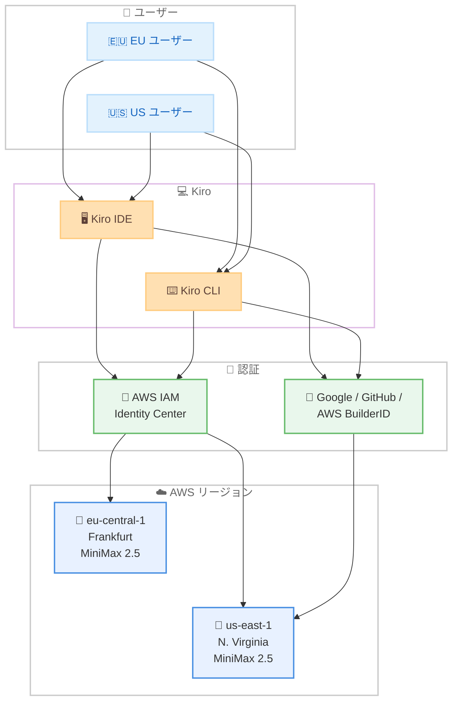

# Kiro - MiniMax 2.5 が eu-central-1 で利用可能に

**リリース日**: 2026 年 3 月 24 日
**サービス**: Kiro
**機能**: MiniMax 2.5 の eu-central-1 (Frankfurt) リージョン対応

## 概要

Kiro IDE および CLI で利用可能なオープンウェイトモデル MiniMax 2.5 が、eu-central-1 (Frankfurt) リージョンで利用可能になった。これまで us-east-1 (N. Virginia) のみで提供されていた MiniMax 2.5 の推論が、ヨーロッパリージョンにも拡張されたことで、EU 圏内のユーザーはより低レイテンシーで AI コーディング支援を受けられるようになる。

MiniMax 2.5 は 2026 年 3 月 18 日に us-east-1 で初めて提供開始されたオープンウェイトモデルで、強化学習により数十万の実環境で訓練され、フロンティアクラスのコーディング性能をコスト効率良く提供する。200K のコンテキストウィンドウと 0.25x のクレジット乗数を備え、すべてのサブスクリプションティアで利用可能である。

eu-central-1 での利用には AWS IAM Identity Center による認証が必要となる点に留意が必要である。

**アップデート前の課題**

- MiniMax 2.5 は us-east-1 (N. Virginia) でのみ利用可能であった
- ヨーロッパのユーザーは大西洋を越えた通信が必要となり、レイテンシーが大きかった
- EU のデータレジデンシー要件を持つ組織にとって、米国リージョンのみの提供は採用の障壁となっていた

**アップデート後の改善**

- eu-central-1 (Frankfurt) でも MiniMax 2.5 が利用可能になり、ヨーロッパのユーザーのレイテンシーが改善
- AWS IAM Identity Center 認証を使用するエンタープライズユーザーがヨーロッパリージョンで推論を実行可能に
- IDE または CLI を再起動するだけでモデルセレクターから選択可能

## アーキテクチャ図



EU ユーザーが AWS IAM Identity Center で認証する場合、eu-central-1 (Frankfurt) での推論が可能になる。その他の認証方法を使用する場合は、引き続き us-east-1 (N. Virginia) で推論が実行される。

## サービスアップデートの詳細

### 主要機能

1. **eu-central-1 リージョン対応**
   - MiniMax 2.5 の推論がフランクフルトリージョンで実行可能に
   - ヨーロッパのユーザーに対するレスポンスタイムの改善が期待される
   - us-east-1 と同一のモデル性能、コンテキストウィンドウ、クレジット乗数を提供

2. **AWS IAM Identity Center 認証の要件**
   - eu-central-1 での利用には AWS IAM Identity Center による認証が必要
   - Google、GitHub、AWS BuilderID による認証では引き続き us-east-1 を使用
   - エンタープライズ環境での利用を想定した設計

3. **既存環境からのシームレスな移行**
   - IDE または CLI を再起動するだけで新リージョンが利用可能に
   - モデルセレクターから MiniMax 2.5 を選択するだけで、適切なリージョンに自動ルーティング
   - 既存のワークフローや設定の変更は不要

## 技術仕様

### MiniMax 2.5 モデル仕様

| 項目 | 詳細 |
|------|------|
| モデル名 | MiniMax 2.5 |
| クレジット乗数 | 0.25x |
| コンテキストウィンドウ | 200K トークン |
| 訓練手法 | 強化学習 (数十万の実環境) |
| 対応ティア | Free, Pro, Pro+, Power |
| 対応リージョン | us-east-1, eu-central-1 |
| eu-central-1 認証要件 | AWS IAM Identity Center |

### リージョン別認証方式対応

| 認証方式 | us-east-1 | eu-central-1 |
|----------|-----------|---------------|
| AWS IAM Identity Center | 対応 | 対応 |
| Google | 対応 | 非対応 |
| GitHub | 対応 | 非対応 |
| AWS BuilderID | 対応 | 非対応 |

## 設定方法

### 前提条件

1. Kiro IDE または Kiro CLI がインストールされていること
2. AWS IAM Identity Center で認証済みであること (eu-central-1 を利用する場合)
3. いずれかのサブスクリプションティア (Free, Pro, Pro+, Power) を利用中であること

### 手順

#### ステップ 1: IDE または CLI の再起動

```bash
# Kiro CLI の場合: CLI を再起動
kiro --version
```

IDE の場合はアプリケーションを再起動する。CLI の場合はセッションを終了し、再度起動する。再起動後、モデルセレクターに MiniMax 2.5 が表示される。

#### ステップ 2: モデルの選択

```
# IDE の場合: モデルセレクターから MiniMax 2.5 を選択
# CLI の場合: --model フラグで指定
kiro --model minimax-2.5
```

モデルセレクターから MiniMax 2.5 を選択する。AWS IAM Identity Center で認証している場合、自動的に最も近いリージョン (eu-central-1 または us-east-1) にルーティングされる。

## メリット

### ビジネス面

- **EU データレジデンシー対応**: ヨーロッパリージョンでの推論実行により、データがヨーロッパ内で処理される選択肢が増加
- **コスト効率**: 0.25x のクレジット乗数により、フロンティアモデル比で大幅なコスト削減を維持
- **エンタープライズ対応強化**: IAM Identity Center 認証との組み合わせにより、企業の認証・認可ポリシーとの統合が容易

### 技術面

- **レイテンシー改善**: ヨーロッパのユーザーにとって、フランクフルトリージョンでの推論により応答時間が短縮
- **200K コンテキストウィンドウ**: 大規模コードベースでの作業に十分なコンテキスト長を提供
- **シームレスな利用開始**: IDE や CLI の再起動のみで利用可能になり、追加の設定変更は不要

## デメリット・制約事項

### 制限事項

- eu-central-1 での利用は AWS IAM Identity Center 認証に限定される
- Google、GitHub、AWS BuilderID 認証では引き続き us-east-1 のみ利用可能
- 現在はオープンウェイトモデルとして experimental サポートの位置付け

### 考慮すべき点

- エンタープライズ以外のユーザー (個人開発者など) が EU リージョンを利用するには、AWS IAM Identity Center のセットアップが別途必要
- フロンティアモデルと比較すると、複雑なタスクにおける品質差が生じる場合がある
- 他のリージョンへの展開スケジュールは未発表

## ユースケース

### ユースケース 1: EU 拠点のエンタープライズチーム

**シナリオ**: ドイツに拠点を置く開発チームが、AWS IAM Identity Center で認証し、社内プロジェクトの AI コーディング支援に Kiro を活用する

**効果**: eu-central-1 での推論により、レイテンシーが改善され、開発者体験が向上する。0.25x のクレジット乗数により、チーム全体での AI 活用コストを抑制できる

### ユースケース 2: データレジデンシー要件のあるプロジェクト

**シナリオ**: EU のデータ保護規制に配慮が必要なプロジェクトで、コードの推論処理をヨーロッパ内で完結させたい

**効果**: eu-central-1 での推論実行により、データがヨーロッパリージョン内で処理される。IAM Identity Center による認証と組み合わせることで、企業のセキュリティポリシーとの整合性も確保できる

### ユースケース 3: 大規模コードベースの日常的な開発作業

**シナリオ**: 200K トークンのコンテキストウィンドウを活用し、大規模なコードベースでのコード生成、リファクタリング、レビューを行う

**効果**: フロンティアモデルの 0.25 倍のクレジット消費で日常的な開発タスクを処理でき、複雑なタスクにはフロンティアモデルを温存する運用が可能

## 料金

MiniMax 2.5 は既存の Kiro クレジットシステムで利用可能。クレジット乗数は 0.25x で、リージョンによる料金差はない。

| サブスクリプション | MiniMax 2.5 利用 | クレジット乗数 |
|-------------------|------------------|--------------|
| Free | 利用可能 | 0.25x |
| Pro | 利用可能 | 0.25x |
| Pro+ | 利用可能 | 0.25x |
| Power | 利用可能 | 0.25x |

## 利用可能リージョン

| リージョン | ロケーション | 認証要件 |
|-----------|-------------|----------|
| us-east-1 | N. Virginia | 全認証方式 |
| eu-central-1 | Frankfurt | AWS IAM Identity Center のみ |

## 関連サービス・機能

- **Kiro Auto モード**: フロンティアモデルと特化モデルを自動的にブレンドするエージェントモード。MiniMax 2.5 との併用が可能
- **AWS IAM Identity Center**: eu-central-1 での MiniMax 2.5 利用に必要な認証基盤。エンタープライズ向けの SSO とアクセス管理を提供
- **Amazon Bedrock**: Kiro のモデル推論インフラストラクチャとして AWS リージョンを活用

## 参考リンク

- [Kiro Changelog](https://kiro.dev/changelog/)
- [Kiro ダウンロード](https://kiro.dev/downloads/)
- [Kiro ドキュメント](https://kiro.dev/docs/)
- [Kiro 料金](https://kiro.dev/pricing/)

## まとめ

MiniMax 2.5 の eu-central-1 (Frankfurt) リージョン対応により、ヨーロッパのユーザーはより低レイテンシーで AI コーディング支援を受けられるようになった。AWS IAM Identity Center 認証が必要という制約はあるものの、エンタープライズユーザーにとっては EU 内でのデータ処理が可能になる重要なアップデートである。IDE または CLI を再起動するだけで利用を開始できるため、該当する認証環境を持つユーザーは早期の導入を推奨する。
