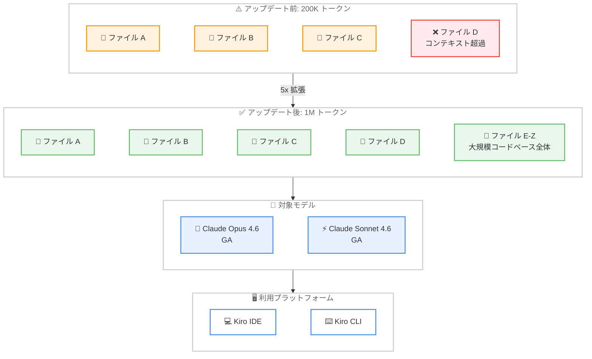

# Kiro - Claude Opus 4.6 / Sonnet 4.6 が 1M コンテキストウィンドウに拡張

**リリース日**: 2026 年 3 月 24 日
**サービス**: Kiro
**機能**: Claude Opus 4.6 および Claude Sonnet 4.6 の 1M コンテキストウィンドウ対応と GA 昇格

📊 [このアップデートのインフォグラフィックを見る](https://takech9203.github.io/aws-news-summary/20260324-kiro-changelog-2026-03-24-opus-sonnet-1m.html)

## 概要

Kiro IDE および Kiro CLI で利用可能な Claude Opus 4.6 と Claude Sonnet 4.6 のコンテキストウィンドウが、従来の 200K トークンから 1M トークン (100 万トークン) へと 5 倍に拡張された。これにより、大規模なコードベース全体を一度にモデルへ入力し、より正確で文脈を踏まえたコード生成やレビューが可能になる。

あわせて、両モデルは experimental (実験的) のラベルが外れ、一般提供 (GA) ステータスへ昇格した。Pro、Pro+、Power の各サブスクリプションティアの契約者が利用可能であり、IDE または CLI を再起動することで更新されたモデルが反映される。

**アップデート前の課題**

- コンテキストウィンドウが 200K トークンに制限されており、大規模プロジェクトではファイルの分割入力やコンテキストの手動管理が必要だった
- Claude Opus 4.6 と Claude Sonnet 4.6 は experimental ラベルが付与されており、本番利用に対する信頼性の保証が限定的だった
- 複数ファイルにまたがるリファクタリングや横断的な影響分析で、コンテキスト不足による精度低下が発生していた

**アップデート後の改善**

- 1M トークンのコンテキストウィンドウにより、数千ファイル規模のコードベースを一度に処理可能になった
- GA 昇格により、本番ワークフローでの安定した利用が保証された
- 大規模なモノレポやマイクロサービス群の横断的な分析が、コンテキスト分割なしで実行可能になった

## アーキテクチャ図



200K トークンから 1M トークンへの 5 倍の拡張により、大規模コードベース全体を一度にコンテキストとして入力可能になったことを示している。GA 昇格した両モデルは Kiro IDE と Kiro CLI の両方で利用できる。

## サービスアップデートの詳細

### 主要機能

1. **コンテキストウィンドウの 5 倍拡張**
   - 200K トークンから 1M トークンへ拡張
   - Claude Opus 4.6 と Claude Sonnet 4.6 の両方に適用
   - 大規模なコードベース、長大なログファイル、複数のドキュメントを一度に処理可能

2. **GA ステータスへの昇格**
   - experimental ラベルが除去され、一般提供として安定性が保証された
   - 本番環境のワークフローに組み込む際の信頼性が向上
   - SLA やサポート面での安心感が得られる

3. **マルチプラットフォーム対応**
   - Kiro IDE (デスクトップアプリケーション) で利用可能
   - Kiro CLI (コマンドラインインターフェース) で利用可能
   - IDE または CLI を再起動するだけで更新が反映される

## 技術仕様

### モデル仕様の比較

| 項目 | アップデート前 | アップデート後 |
|------|----------------|----------------|
| コンテキストウィンドウ | 200K トークン | 1M トークン |
| 対象モデル | Claude Opus 4.6、Claude Sonnet 4.6 | 同左 |
| ステータス | Experimental | GA (一般提供) |
| 利用可能プラットフォーム | Kiro IDE、Kiro CLI | 同左 |
| 対象サブスクリプション | Pro、Pro+、Power | 同左 |

### コンテキストウィンドウの容量目安

| コンテンツ種別 | 200K トークンの目安 | 1M トークンの目安 |
|----------------|---------------------|-------------------|
| ソースコード行数 | 約 5,000-10,000 行 | 約 25,000-50,000 行 |
| 平均的なファイル数 | 約 50-100 ファイル | 約 250-500 ファイル |
| ドキュメントページ | 約 300-400 ページ | 約 1,500-2,000 ページ |

## 設定方法

### 前提条件

1. Kiro の Pro、Pro+、または Power ティアのサブスクリプション契約
2. Kiro IDE または Kiro CLI がインストール済みであること
3. インターネット接続が利用可能であること

### 手順

#### ステップ 1: IDE または CLI の再起動

```bash
# Kiro CLI の場合、一度終了して再起動する
kiro --version
```

Kiro CLI を再起動することで、最新のモデル一覧が取得される。Kiro IDE の場合は、アプリケーションを閉じて再度開く。

#### ステップ 2: モデルの選択

Kiro IDE のモデル選択メニュー、または Kiro CLI のモデル設定で Claude Opus 4.6 または Claude Sonnet 4.6 を選択する。experimental ラベルが外れた状態で表示されていることを確認する。

#### ステップ 3: 動作確認

大規模なファイルやプロジェクト全体をコンテキストとして入力し、1M トークンのコンテキストウィンドウが正常に機能していることを確認する。

## メリット

### ビジネス面

- **大規模プロジェクトの生産性向上**: コンテキスト分割の手間がなくなり、開発者がコードの整理作業ではなく本質的な開発に集中できる
- **コードレビューの効率化**: プロジェクト全体の文脈を把握した上でのレビューが可能になり、レビュー品質と速度が向上する
- **GA 昇格による導入障壁の低下**: experimental ラベルの除去により、企業の本番ワークフローへの採用判断がしやすくなる

### 技術面

- **横断的なリファクタリング**: 複数ファイルにまたがる変更の影響範囲を一度に分析し、一貫性のあるリファクタリングが実行できる
- **モノレポ対応の強化**: 数百ファイルを含むモノレポ構成でも、コンテキスト不足による精度低下を回避できる
- **デバッグ精度の向上**: スタックトレース、関連ソースコード、設定ファイルをすべてコンテキストに含めた包括的なデバッグが可能になる

## デメリット・制約事項

### 制限事項

- 1M トークンのフル活用時にはレスポンス時間が増加する可能性がある
- 対象は Pro、Pro+、Power ティアのみであり、無料プランでは利用できない
- コンテキストウィンドウの拡張はトークン消費量の増加につながるため、利用量の上限に達しやすくなる可能性がある

### 考慮すべき点

- コンテキストウィンドウが大きいほど効果的とは限らず、関連性の高い情報を適切に選択することが引き続き重要
- 大量のコンテキストを入力した場合のモデルの注意力 (attention) の分散による精度への影響を検証する必要がある

## ユースケース

### ユースケース 1: 大規模モノレポの横断的リファクタリング

**シナリオ**: 数百のマイクロサービスを含むモノレポで、共通ライブラリの API 変更に伴う影響範囲の分析とリファクタリングを実施する

**アプローチ**:
- 共通ライブラリのソースコードと、依存する全サービスのコードを 1M トークンのコンテキストに一括入力
- Kiro に影響範囲の分析と修正コードの生成を依頼

**効果**: 従来はファイルごとに分割して確認していた作業が一度に完了し、修正の一貫性も向上する

### ユースケース 2: レガシーコードベースの包括的な理解

**シナリオ**: 新しくプロジェクトに参加した開発者が、数万行規模のレガシーコードベースの全体像を短時間で把握したい

**アプローチ**:
- プロジェクト全体のソースコード、設定ファイル、ドキュメントを Kiro のコンテキストに入力
- アーキテクチャの概要、データフロー、主要コンポーネント間の関係性について質問

**効果**: コードベース全体を踏まえた正確な回答が得られ、オンボーディング期間を大幅に短縮できる

### ユースケース 3: 複雑なバグの根本原因分析

**シナリオ**: 本番環境で発生した複雑なバグの原因が複数のサービスやレイヤーにまたがっている可能性がある

**アプローチ**:
- スタックトレース、関連するソースコード (複数サービス)、設定ファイル、インフラ定義を一括でコンテキストに入力
- Kiro に根本原因の分析と修正案の提示を依頼

**効果**: 断片的な情報ではなく、システム全体の文脈を踏まえた正確な原因特定が可能になる

## 料金

Kiro のサブスクリプションティアに基づいて利用可能。1M コンテキストウィンドウの利用にあたり追加料金は発生しない。

| ティア | 利用可否 |
|--------|----------|
| Free | 利用不可 |
| Pro | 利用可能 |
| Pro+ | 利用可能 |
| Power | 利用可能 |

各ティアの料金詳細は [Kiro Pricing](https://kiro.dev/pricing/) を参照。

## 利用可能リージョン

グローバル (Kiro はグローバルサービスとして提供)

## 関連サービス・機能

- **Kiro IDE**: AWS が提供する AI 搭載統合開発環境。今回のモデル更新が直接適用されるプラットフォーム
- **Kiro CLI**: コマンドラインから Kiro の AI 機能を利用するためのインターフェース。IDE と同様に 1M コンテキストの恩恵を受ける
- **Amazon Bedrock**: AWS のフルマネージド AI サービス。Claude Opus 4.6 および Claude Sonnet 4.6 のホスティング基盤として関連する
- **Anthropic Claude**: Kiro で利用される基盤モデルファミリー。Opus 4.6 は最高性能、Sonnet 4.6 は速度と性能のバランスに優れる

## 参考リンク

- 📊 [インフォグラフィック](https://takech9203.github.io/aws-news-summary/20260324-kiro-changelog-2026-03-24-opus-sonnet-1m.html)
- [Kiro Changelog](https://kiro.dev/changelog/)
- [Kiro](https://kiro.dev/)
- [Kiro ドキュメント](https://kiro.dev/docs/)
- [Kiro 料金ページ](https://kiro.dev/pricing/)

## まとめ

Claude Opus 4.6 と Claude Sonnet 4.6 のコンテキストウィンドウが 200K から 1M トークンへ 5 倍に拡張され、GA ステータスへ昇格したことは、Kiro ユーザーにとって大きな進歩である。大規模コードベースの横断的な分析やリファクタリングがコンテキスト分割なしで実行可能になり、開発ワークフローの効率が大幅に向上する。Pro、Pro+、Power ティアの契約者は、IDE または CLI を再起動するだけでこの機能を利用開始できるため、早期の活用を推奨する。
