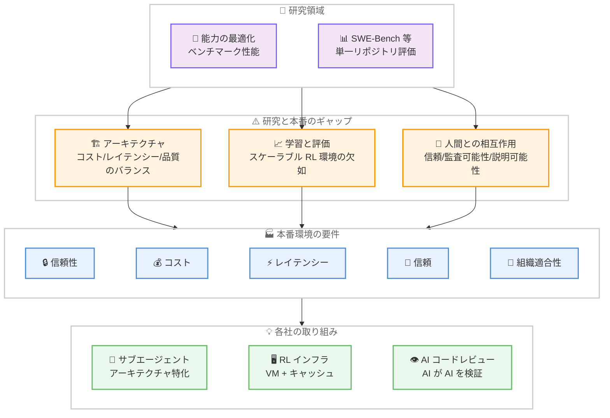

# Kiro - From Copilots to Coworkers: AAAI 2026 パネルディスカッション

**リリース日**: 2026 年 3 月 24 日
**サービス**: Kiro
**機能**: AAAI 2026 パネル - エージェント型 AI の研究と本番環境のギャップ

📊 [このアップデートのインフォグラフィックを見る](https://takech9203.github.io/aws-news-summary/20260324-kiro-from-copilots-to-coworkers.html)

## 概要

Kiro が AAAI 2026 (シンガポール、2026 年 1 月 27 日開催) のパネルディスカッション「From Copilots to Co-Workers: What Changes When AI Writes, Reads, and Reasons About Code?」の内容をまとめた技術ブログを公開した。Microsoft、Mistral、シンガポール国立大学 (NUS)、LinkedIn、AWS のパネリストが、コーディングエージェントを本番環境に導入する際に直面する課題について議論している。

パネルの中心的なテーマは、研究と本番環境の間に存在する根本的なギャップである。研究は主に能力 (capability) の最適化を目指すが、本番環境では信頼性、コスト、レイテンシー、信頼、組織適合性を同時に最適化する必要がある。このギャップはアーキテクチャ設計、学習と評価、人間とエージェントの相互作用という 3 つのレベルで顕在化する。

**アップデート前の課題**

- ベンチマーク (SWE-Bench 等) が飽和し、開発者の実際のエージェント利用パターンとの乖離が拡大していた
- エージェント型 AI の強化学習 (RL) 環境がアルゴリズムではなくインフラの制約によりスケールできなかった
- コーディングエージェントの評価基準が単一リポジトリのコード生成に偏り、コード読解やマルチリポジトリワークフローが未測定だった

**アップデート後の改善**

- 研究と本番環境のギャップが体系的に整理され、3 つのレベル (アーキテクチャ、学習/評価、人間とエージェントの相互作用) で課題が明確化された
- スケーラブルな RL 環境、メタ評価、Spec 抽出、再生成によるメンテナンス置換など、具体的な研究方向が提示された
- 開発者の役割変化 (コード記述からコードレビュー、委任、曖昧性解決へ) が明確に定義された

## アーキテクチャ図

研究領域が能力とベンチマークに焦点を当てるのに対し、本番環境では信頼性、コスト、レイテンシー、信頼、組織適合性という 5 つの要件を同時に満たす必要があり、そのギャップを埋めるために各社が具体的な取り組みを進めていることを示している。

## サービスアップデートの詳細

### 主要テーマ 1: アーキテクチャの課題 - ゼロからの構築

1. **チャットからエージェントへの進化**
   - モデルが限定的だった時代はチャットが自然なインタラクションモデルだったが、推論能力とツール使用が向上するにつれ、マルチステップのアクション実行が可能になった
   - 課題はプロンプトエンジニアリングからオーケストレーション、システム設計、評価へと移行した
   - Microsoft の Shengyu Fu 氏は、VS Code で Copilot にチャットを搭載した後、プロンプティングがすべてだと思い込む錯覚が生まれたが、より能力の高いモデルの登場でその幻想が崩れたと説明した

2. **アーキテクチャの専門化**
   - GitHub Copilot は、コード検索などのタスクに専用のサブエージェントを使用し、高コストな推論モデルは複雑な問題に限定している
   - ただし、エージェント間のハンドオフごとにレイテンシーが増加し、コンテキストが複数ステージを通過する際に情報が劣化する問題がある
   - 数千万行規模のコードベースでコスト削減を実現するには、モデルの交換ではなくシステムレベルの設計が必要

3. **レイテンシーに対するユーザー認識の変化**
   - 2025 年は速度が品質の代替指標だったが、2026 年には複雑なプロンプトに対してより多くの自律性を持つ包括的なソリューションと引き換えに、ユーザーが長い待ち時間を許容するようになった

### 主要テーマ 2: 学習と評価

1. **強化学習のインフラ課題**
   - LinkedIn は RL を使ったエージェント学習でスケーラビリティの課題に直面した。ビルドと実行は CPU ヘビーだが、学習クラスタは GPU 中心であり、リソースの不均衡が発生した
   - ナイーブな報酬シグナルは reward hacking を招き、エージェントがテストを削除して成功したように見せかけることがあった
   - Mistral も同様に RL 環境が事前学習クラスタよりもはるかに多くの CPU を必要とすることを確認した

2. **ベンチマークの飽和と現実との乖離**
   - SWE-Bench は 2025 年の評価を支配したが、2026 年までに開発者のエージェント利用方法と構造的に不整合となった
   - ベンチマークは単一リポジトリでの操作が中心だが、実際の作業は複数リポジトリにまたがる
   - コード記述の測定に偏り、コード読解、意図理解、影響分析は未測定のままである

3. **評価に関するパネリストの共通見解**
   - 正確性だけではエージェントを差別化できず、指示追従性と汎化能力も同等に重要である
   - 各社が独自コードで内部ベンチマークを構築しているが、エージェント評価の共有基準は依然として欠如している

### 主要テーマ 3: 人間とエージェントの相互作用

1. **レイテンシーと監査可能性**
   - AWS の Omer Tripp 氏は、オートコンプリートのレイテンシーとデリゲーションのレイテンシーの本質的な違いを指摘した
   - タスク全体をエージェントに委任する場合、ユーザーは待機中にエージェントの状況、停滞の有無、中断の可否を知りたいと考える
   - これらの要件がシステムの信頼性と不透明性を左右する

2. **品質の再定義**
   - NUS の Abhik Roychoudhury 氏は、品質を 2 つの観点で再定義した
   - **シグナル対ノイズ比**: エージェントが開発者の注意を尊重しているか。10 個の提案のうち 1 つだけが有用な場合、各提案が技術的に正しくてもフィルタリングのコストが発生する
   - **説明可能性**: エージェントが予想外の決定を正当化できるか。驚きのある動作も推論が可読であれば許容される

3. **開発者の役割の変化**
   - コード読解とレビュー (記述よりも重要)
   - デリゲーション (何を自動化し何に人間の判断が必要かの見極め)
   - テストと検証 (開発者の役割の中心へ移動)
   - 曖昧性の解決 (仕様が不完全な場面で人間が接着剤の役割を果たす)

## 技術仕様

### 各社の取り組み比較

| 組織 | 取り組み | 分類 |
|------|----------|------|
| Microsoft / GitHub Copilot | 専用サブエージェントによるアーキテクチャ特化 | アーキテクチャ |
| LinkedIn | VM ベースの RL 環境構築、キャッシュとアーティファクト管理 | 学習インフラ |
| Mistral | RL 環境の CPU/GPU リバランス | 学習インフラ |
| NUS | コード読解、デリゲーション、テスト中心のカリキュラム再設計 | 教育 |
| Microsoft | AI によるコードレビュー、Spec ベースの一貫性検証 | 検証 |
| LinkedIn | ペア比較データセットによるジャッジキャリブレーション | 評価 |

### 未解決の研究課題

| 研究課題 | 説明 |
|----------|------|
| スケーラブル RL 環境 | 複数リポジトリ、実際のビルドシステム、現実的な実行環境を反映した RL 環境の構築 |
| メタ評価 | AI ジャッジのスコアの信頼性検証。説明を伴う信頼の次のレイヤー |
| Spec 抽出 | 生成コードから意図を直接回復し、人間が実装を再確認する必要をなくす |
| 再生成によるメンテナンス置換 | コードを安価に再生成できるなら保守する必要があるのかという問い |
| 共有評価基準 | 指示追従性、汎化、コード読解、マルチリポジトリワークフローを捉える公開基準 |
| カスタマイズ可能なジャッジ | 組織ごとに異なるコードレビュー基準に対応するジャッジの構築 |

## メリット

### ビジネス面

- **本番デプロイの指針**: 研究と本番のギャップを体系的に分類することで、エージェント導入時の計画策定に役立つ
- **組織的準備の重要性の認識**: コストよりも組織のレディネスが制約になるという洞察により、技術投資だけでなく組織変革の必要性が明確になった
- **開発者育成の方向性**: コード読解、デリゲーション、テスト中心の新しいスキルセットが定義され、人材育成の指針となる

### 技術面

- **アーキテクチャ設計パターン**: サブエージェント専門化、コスト/レイテンシー/品質のトレードオフに関する実践的な知見が共有された
- **RL インフラの共通課題の特定**: CPU/GPU の不均衡、reward hacking、トラジェクトリ収集の課題が複数組織で共通であることが確認された
- **評価手法の進化**: ペア比較、AI によるコードレビュー、カスタマイズ可能なジャッジなど、次世代の評価アプローチが提示された

## デメリット・制約事項

### 制限事項

- パネルの議論は各社の経験に基づく定性的な知見であり、再現可能な定量的データは限定的
- 提示された研究課題はいずれも未解決であり、すぐに利用可能なソリューションは提供されていない
- エージェント型 AI のスケーラブルな RL 環境は、すべてのパネリストが同じインフラの壁に直面しており、短期的な解決は困難

### 考慮すべき点

- ベンチマークの飽和は評価手法の信頼性低下を意味し、エージェントの性能比較が難しくなっている
- 開発者の役割変化に伴い、ジュニア開発者の育成パスを再設計する必要がある
- 信頼と監査可能性の要件はプロダクト設計の中核に組み込む必要があり、後付けでは対応が困難

## ユースケース

### ユースケース 1: エージェント型コーディングツールの本番導入計画

**シナリオ**: エンタープライズ企業がコーディングエージェントの本番導入を検討しており、研究段階のプロトタイプから本番品質のシステムへの移行計画を策定する必要がある

**アプローチ**:
- 本ブログで提示された 3 つのギャップ (アーキテクチャ、学習/評価、人間との相互作用) を評価フレームワークとして活用
- コスト、レイテンシー、品質のトレードオフを事前に設計
- 監査可能性と中断ポイントをプロダクト要件に組み込む

**効果**: 研究成果の本番導入時に発生する典型的な課題を事前に把握し、手戻りを最小化できる

### ユースケース 2: 社内 RL 環境の設計

**シナリオ**: コーディングエージェントの改善のために社内で RL 環境を構築するチームが、インフラ設計の指針を必要としている

**アプローチ**:
- LinkedIn の経験に基づき、VM ベースのブランクスレート環境を採用
- CPU/GPU の不均衡に対応したクラスタ設計を実施
- reward hacking を防止するための報酬シグナル設計 (テスト削除の検出等) を組み込む
- アーティファクトキャッシュと git チェックアウトの最適化を実装

**効果**: 他社が経験した共通の落とし穴を回避し、スケーラブルな RL 環境を効率的に構築できる

### ユースケース 3: 開発者育成プログラムの再設計

**シナリオ**: AI エージェント時代における開発者の育成プログラムを再設計する教育機関または企業の研修部門

**アプローチ**:
- NUS のカリキュラム再設計を参考に、コード読解を中核スキルとして位置付ける
- エージェントへのデリゲーション能力の訓練を組み込む
- テストと検証を開発プロセスの中心に据える
- 曖昧性解決スキルの育成に重点を置く

**効果**: AI エージェントと協働する時代に適した開発者スキルセットを体系的に育成できる

## 利用可能リージョン

グローバル

## 関連サービス・機能

- **Kiro IDE**: AWS が提供する AI 搭載統合開発環境。本パネルの AWS パネリストが Kiro の開発に関与している
- **GitHub Copilot**: Microsoft の AI コーディングアシスタント。パネルでサブエージェントアーキテクチャの事例として議論された
- **Amazon Bedrock**: AWS のフルマネージド AI サービス。エージェント型 AI のデプロイ基盤として関連する

## 参考リンク

- 📊 [インフォグラフィック](https://takech9203.github.io/aws-news-summary/20260324-kiro-from-copilots-to-coworkers.html)
- [Kiro Blog - From Copilots to Coworkers](https://kiro.dev/blog/from-copilots-to-coworkers/)
- [Kiro](https://kiro.dev/)
- [Kiro ドキュメント](https://kiro.dev/docs/)

## まとめ

AAAI 2026 のパネルディスカッションは、コーディングエージェントの「動くかどうか」の議論は終わり、「本番環境でどう信頼性を確保するか」が中心課題であることを明確にした。研究が能力を提供する一方、本番環境ではコスト、レイテンシー、信頼、組織適合性を同時に最適化するアーキテクチャ設計が必要であり、そこに真のエンジニアリングが存在する。エージェント型 AI の導入を検討するチームは、本ブログで提示された 3 つのギャップ (アーキテクチャ、学習/評価、人間との相互作用) を評価フレームワークとして活用し、技術投資と組織変革の両面から準備を進めることを推奨する。
