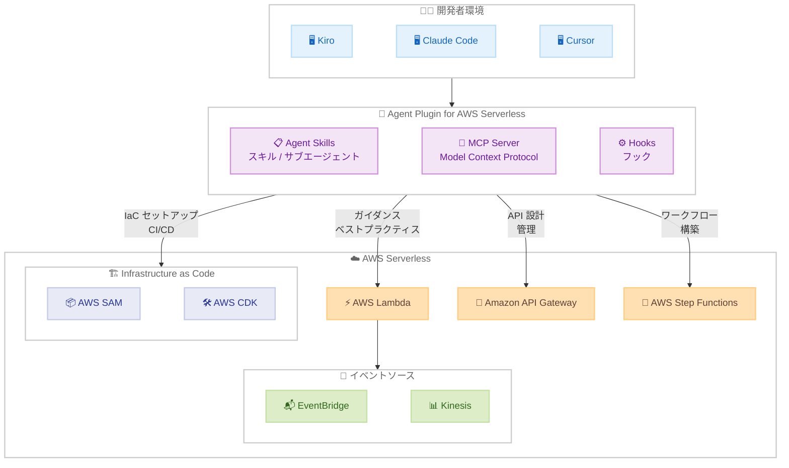

# Agent Plugin for AWS Serverless - AI アシスタントによるサーバーレス開発の加速

**リリース日**: 2026 年 3 月 25 日
**サービス**: AWS Lambda, Amazon API Gateway, AWS Step Functions, AWS SAM, AWS CDK
**機能**: Agent Plugin for AWS Serverless

## 概要

AWS は、AI コーディングアシスタントを活用してサーバーレスアプリケーションの構築、デプロイ、トラブルシューティング、管理を容易にする Agent Plugin for AWS Serverless を発表しました。Kiro、Claude Code、Cursor などの AI コーディングアシスタントと統合し、開発ライフサイクル全体を通じてサーバーレス開発に必要なガイダンスと専門知識を動的に提供します。

このプラグインは、スキル、サブエージェント、フック、Model Context Protocol (MCP) サーバーを単一のモジュラーユニットにパッケージ化するエージェントプラグインの仕組みを活用しています。開発者は AWS Lambda 関数の作成、Infrastructure as Code (IaC) によるプロジェクトセットアップ、API 設計、ステートフルワークフローの構築など、本番対応のサーバーレスアプリケーション開発をベストプラクティスに沿って効率的に進めることができます。

**アップデート前の課題**

- サーバーレスアプリケーション開発では、各サービスの設定やベストプラクティスを個別に調べる必要があった
- IaC (SAM/CDK) のセットアップ、CI/CD パイプライン構築、ローカルテスト環境の構成に専門知識が求められていた
- オブザーバビリティ、パフォーマンス最適化、トラブルシューティングのベストプラクティスを手動で適用する必要があった

**アップデート後の改善**

- AI コーディングアシスタントがサーバーレス開発のガイダンスと専門知識を動的に提供
- SAM や CDK による IaC セットアップ、CI/CD パイプライン、ローカルテストワークフローを自動化
- オブザーバビリティ、パフォーマンス最適化、トラブルシューティングのベストプラクティスが組み込みで提供される

## アーキテクチャ図



Agent Plugin for AWS Serverless は、AI コーディングアシスタントとサーバーレスサービス間のブリッジとして機能し、開発者にガイダンスとベストプラクティスを提供します。

## サービスアップデートの詳細

### 主要機能

1. **Lambda 関数の構築とイベントソース統合**
   - Amazon EventBridge、Amazon Kinesis、AWS Step Functions などの主要なイベントソースと統合する Lambda 関数を作成
   - オブザーバビリティ、パフォーマンス最適化のベストプラクティスが組み込み
   - トラブルシューティングのガイダンスを動的に提供

2. **Infrastructure as Code によるプロジェクトセットアップ**
   - AWS SAM と AWS CDK を使用した IaC の効率的なセットアップ
   - 再利用可能なコンストラクトと実績のあるアーキテクチャパターンを提供
   - 自動化された CI/CD パイプラインとローカルテストワークフローの構成

3. **Lambda Durable Functions によるステートフルワークフロー**
   - 長時間実行されるステートフルワークフローの構築を支援
   - Lambda Durable Functions を活用した信頼性の高いワークフロー設計

4. **Amazon API Gateway による API 設計と管理**
   - API の設計、構築、管理を AI アシスタントがガイド
   - ベストプラクティスに基づいた API 設計パターンの推奨

5. **オープン Agent Skills フォーマット**
   - オープンな Agent Skills フォーマットでパッケージ化
   - 互換性のある AI ツール間で再利用可能
   - Claude Code では公式 Claude Marketplace からインストール可能

## 技術仕様

### 対応 AI コーディングアシスタント

| ツール | インストール方法 |
|--------|-----------------|
| Claude Code | `/plugin install aws-serverless@claude-plugins-official` |
| Kiro | エージェントプラグインとして設定 |
| Cursor | エージェントプラグインとして設定 |

### プラグインの構成要素

| コンポーネント | 説明 |
|---------------|------|
| Skills | サーバーレス開発の専門知識をパッケージ化したスキル |
| Sub-agents | 特定タスクを処理するサブエージェント |
| Hooks | 開発ワークフローへのフック |
| MCP Servers | Model Context Protocol サーバー |

### 対応イベントソース

| イベントソース | 用途 |
|---------------|------|
| Amazon EventBridge | イベント駆動アーキテクチャ |
| Amazon Kinesis | リアルタイムデータストリーミング |
| AWS Step Functions | ワークフローオーケストレーション |

## 設定方法

### 前提条件

1. 対応する AI コーディングアシスタント (Kiro、Claude Code、Cursor) がインストール済みであること
2. AWS アカウントと適切な IAM 権限
3. Node.js および npm (SAM/CDK 使用時)

### 手順

#### ステップ 1: プラグインのインストール (Claude Code の場合)

```bash
/plugin install aws-serverless@claude-plugins-official
```

Claude Code の公式 Claude Marketplace から Agent Plugin for AWS Serverless をインストールします。

#### ステップ 2: サーバーレスアプリケーションの構築

プラグインをインストール後、AI コーディングアシスタントに自然言語でリクエストします。

```
「EventBridge からのイベントを処理する Lambda 関数を作成して、SAM でデプロイできるようにしてください」
```

プラグインが動的にガイダンスを提供し、ベストプラクティスに沿ったコードとインフラストラクチャ定義を生成します。

#### ステップ 3: IaC とローカルテストの設定

```
「このプロジェクトに CI/CD パイプラインとローカルテストワークフローを追加してください」
```

SAM または CDK を使用したプロジェクト構成、CI/CD パイプライン、ローカルテスト環境が自動的に設定されます。

## メリット

### ビジネス面

- **開発速度の大幅な向上**: AI アシスタントがベストプラクティスを動的に提供し、開発ライフサイクル全体を加速
- **学習コストの削減**: サーバーレスの専門知識がなくても本番対応のアプリケーションを構築可能
- **品質の均一化**: 組み込みのベストプラクティスにより、チーム全体で一貫した品質を維持

### 技術面

- **ベストプラクティスの自動適用**: オブザーバビリティ、パフォーマンス最適化、セキュリティのベストプラクティスが組み込み
- **IaC の効率化**: SAM と CDK の再利用可能なコンストラクトと実績のあるアーキテクチャパターンを提供
- **マルチツール対応**: オープンな Agent Skills フォーマットにより、複数の AI ツールで利用可能

## デメリット・制約事項

### 制限事項

- 対応する AI コーディングアシスタントが必要 (Kiro、Claude Code、Cursor)
- プラグインが生成するコードやインフラ定義は確認と検証が必要
- Agent Skills フォーマットに対応した AI ツールのみで利用可能

### 考慮すべき点

- 生成されたベストプラクティスが組織のポリシーやセキュリティ要件に合致するか確認が必要
- AI アシスタントの提案をそのまま本番環境に適用する前にレビューを実施すること
- プラグインのバージョンアップに伴い、推奨パターンが変更される可能性がある

## ユースケース

### ユースケース 1: イベント駆動マイクロサービスの構築

**シナリオ**: EventBridge と Lambda を使用したイベント駆動マイクロサービスを、オブザーバビリティのベストプラクティスを適用して構築する。

**実装例**:
```
「EventBridge からの注文イベントを処理する Lambda 関数を作成してください。
X-Ray トレーシングと構造化ログを含めてください」
```

**効果**: オブザーバビリティが組み込まれたイベント駆動アーキテクチャを迅速に構築でき、本番運用に必要な可視性を最初から確保できます。

### ユースケース 2: SAM を使用したサーバーレスプロジェクトの初期セットアップ

**シナリオ**: 新しいサーバーレスプロジェクトを SAM でセットアップし、CI/CD パイプラインとローカルテスト環境を構成する。

**実装例**:
```
「SAM を使用して新しいサーバーレスプロジェクトをセットアップしてください。
API Gateway + Lambda のパターンで、CI/CD パイプラインとローカルテスト環境も含めてください」
```

**効果**: プロジェクトの初期セットアップ時間を大幅に短縮し、再利用可能なコンストラクトとテストワークフローが最初から組み込まれます。

### ユースケース 3: Step Functions を活用した長時間実行ワークフロー

**シナリオ**: 注文処理や承認フローなど、長時間実行されるステートフルワークフローを Step Functions と Lambda Durable Functions で構築する。

**実装例**:
```
「注文処理ワークフローを Step Functions で構築してください。
Lambda Durable Functions を使用して、各ステップの状態管理を行ってください」
```

**効果**: 複雑なステートフルワークフローをベストプラクティスに沿って設計でき、エラーハンドリングやリトライロジックも適切に構成されます。

## 料金

Agent Plugin for AWS Serverless 自体に追加料金はかかりません。プラグインを通じて作成、利用する AWS サービスの料金が適用されます。

### 料金例

| シナリオ | 月額料金 (概算) |
|---------|----------------|
| 小規模 API (Lambda + API Gateway、100 万リクエスト / 月) | $5-15 |
| 中規模イベント駆動アプリ (Lambda + EventBridge + DynamoDB) | $20-50 |
| 大規模ワークフロー (Step Functions + Lambda + 複数イベントソース) | $50-200 |

## 利用可能リージョン

Agent Plugin for AWS Serverless はクライアントサイドのプラグインであり、AWS サーバーレスサービスが利用可能な全リージョンで使用できます。デプロイ先のリージョンは、利用する AWS サービスの対応状況に依存します。

## 関連サービス・機能

- **AWS Lambda**: サーバーレスコンピューティングの中核サービス。プラグインが関数の作成とベストプラクティスをガイド
- **Amazon API Gateway**: REST/HTTP API の構築と管理。プラグインが API 設計をサポート
- **AWS Step Functions**: ワークフローオーケストレーション。Lambda Durable Functions と連携
- **Amazon EventBridge**: イベント駆動アーキテクチャのイベントバス
- **Amazon Kinesis**: リアルタイムデータストリーミング
- **AWS SAM**: サーバーレスアプリケーションの IaC フレームワーク
- **AWS CDK**: 汎用的な IaC フレームワーク。再利用可能なコンストラクトを提供

## 参考リンク

- [公式発表 (What's New)](https://aws.amazon.com/about-aws/whats-new/2026/03/agent-plugin-aws-serverless/)
- [AWS Lambda ドキュメント](https://docs.aws.amazon.com/lambda/)
- [AWS SAM ドキュメント](https://docs.aws.amazon.com/serverless-application-model/)
- [AWS CDK ドキュメント](https://docs.aws.amazon.com/cdk/)

## まとめ

Agent Plugin for AWS Serverless は、AI コーディングアシスタントにサーバーレス開発の専門知識を統合し、開発ライフサイクル全体を通じてベストプラクティスを動的に提供する画期的なツールです。Lambda 関数の作成からイベントソース統合、IaC セットアップ、API 設計、ステートフルワークフロー構築まで幅広くサポートします。Kiro、Claude Code、Cursor を使用しているサーバーレス開発者は、このプラグインを導入することで開発効率を大幅に向上させることができます。
