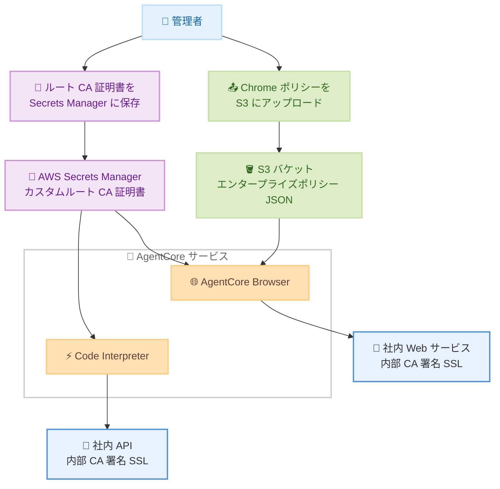

# Amazon Bedrock AgentCore - Chrome ポリシーおよびカスタムルート CA サポート

**リリース日**: 2026年3月25日
**サービス**: Amazon Bedrock AgentCore
**機能**: Chrome エンタープライズポリシーおよびカスタムルート CA 証明書サポート

📊 [このアップデートのインフォグラフィックを見る](https://takech9203.github.io/aws-news-summary/20260325-agentcore-browser-policies-root-ca.html)

## 概要

Amazon Bedrock AgentCore が、AgentCore Browser 向けの Chrome エンタープライズポリシー設定と、AgentCore Browser および Code Interpreter 向けのカスタムルート認証局 (CA) 証明書の指定をサポートしました。エンタープライズ環境でブラウザの動作を細かく制御し、組織内部の SSL 証明書を使用した安全な接続を実現する機能です。

Chrome エンタープライズポリシーにより、セキュリティ、URL フィルタリング、コンテンツ設定など 100 以上の設定項目を通じてブラウザの動作を管理できます。カスタムルート CA サポートにより、組織の内部 CA が署名した SSL 証明書を使用する社内サービスへの接続が可能になりました。東京リージョンを含む 14 の AWS リージョンで利用可能です。

**アップデート前の課題**

- AgentCore Browser のブラウザ動作をエンタープライズポリシーで一元管理する手段がなかった
- 組織の内部 CA が署名した SSL 証明書を使用する社内サービスに、AgentCore Browser や Code Interpreter から接続できなかった
- セキュリティ要件に応じた URL フィルタリングやコンテンツ制御をブラウザレベルで適用できなかった

**アップデート後の改善**

- Chrome エンタープライズポリシーを S3 経由で設定し、100 以上のポリシー項目でブラウザ動作を制御できるようになった
- AWS Secrets Manager に保存したカスタムルート CA 証明書を使用して、社内サービスへの SSL 接続が可能になった
- MANAGED と RECOMMENDED の 2 種類のポリシータイプにより、柔軟なポリシー適用が可能になった

## アーキテクチャ図



Chrome エンタープライズポリシーは S3 から、カスタムルート CA 証明書は Secrets Manager から AgentCore Browser および Code Interpreter に適用される構成を示しています。

## サービスアップデートの詳細

### 主要機能

1. **Chrome エンタープライズポリシー**
   - 100 以上の Chrome ポリシー項目を JSON 形式で設定可能
   - S3 バケットにポリシーファイルをアップロードし、ブラウザ作成時またはセッション開始時に適用
   - MANAGED タイプ: 強制適用されるポリシー (ユーザーによる変更不可)
   - RECOMMENDED タイプ: 推奨設定として適用されるポリシー
   - セキュリティ、URL フィルタリング、コンテンツ設定、ダウンロード制御など幅広い項目をカバー

2. **カスタムルート CA 証明書サポート**
   - 組織の内部 CA が署名した SSL 証明書を信頼ルートとして追加
   - AWS Secrets Manager に CA 証明書を安全に保存
   - AgentCore Browser と Code Interpreter の両方で利用可能
   - VPC 内の社内サービスへの SSL/TLS 接続を実現

3. **Browser Profile API の改善**
   - ListBrowserProfiles API に名前ベースのフィルタリングオプションを追加
   - ブラウザプロファイルの管理効率が向上

## 技術仕様

### エンタープライズポリシー設定

| 項目 | 詳細 |
|------|------|
| ポリシー形式 | Chrome Enterprise Policy JSON |
| 保存先 | Amazon S3 バケット |
| ポリシータイプ | MANAGED (強制) / RECOMMENDED (推奨) |
| 設定可能項目数 | 100 以上 |
| 適用タイミング | ブラウザ作成時またはセッション開始時 |

### カスタムルート CA 証明書

| 項目 | 詳細 |
|------|------|
| 証明書保存先 | AWS Secrets Manager |
| 対応ツール | AgentCore Browser、Code Interpreter |
| 証明書形式 | PEM 形式のルート CA 証明書 |
| 指定方法 | Secrets Manager の ARN を指定 |

### API 変更履歴

| 日付 | サービス | 変更内容 |
|------|----------|----------|
| 2026/03/19 | [Amazon Bedrock AgentCore Control](https://awsapichanges.com/archive/changes/9a8fcc-bedrock-agentcore-control.html) | 4 updated methods - CreateBrowser、GetBrowser に enterprisePolicies と certificates パラメータを追加 |
| 2026/03/19 | [Amazon Bedrock AgentCore](https://awsapichanges.com/archive/changes/9a8fcc-bedrock-agentcore.html) | 4 updated methods - StartBrowserSession、GetBrowserSession に enterprisePolicies と certificates を追加。StartCodeInterpreterSession、GetCodeInterpreterSession に certificates を追加 |

### エンタープライズポリシーの設定例

```json
{
  "URLBlocklist": ["*://blocked-site.example.com/*"],
  "URLAllowlist": ["*://approved-site.example.com/*"],
  "DownloadRestrictions": 1,
  "DefaultCookiesSetting": 1,
  "SafeBrowsingProtectionLevel": 2,
  "PasswordManagerEnabled": false,
  "AutofillAddressEnabled": false,
  "TranslateEnabled": true
}
```

## 設定方法

### 前提条件

1. Amazon Bedrock AgentCore Browser または Code Interpreter が利用可能であること
2. Chrome エンタープライズポリシー用の S3 バケットが用意されていること
3. カスタムルート CA 証明書が AWS Secrets Manager に保存されていること
4. 必要な IAM 権限が設定されていること

### 手順

#### ステップ1: Chrome エンタープライズポリシーの準備と S3 へのアップロード

```bash
# ポリシー JSON ファイルを作成
cat > enterprise-policy.json << 'EOF'
{
  "URLBlocklist": ["*://malicious-site.example.com/*"],
  "SafeBrowsingProtectionLevel": 2,
  "DownloadRestrictions": 1
}
EOF

# S3 バケットにアップロード
aws s3 cp enterprise-policy.json s3://my-agentcore-policies/browser/enterprise-policy.json
```

Chrome エンタープライズポリシーを JSON 形式で定義し、S3 バケットにアップロードします。ポリシーの詳細は Chrome Enterprise のドキュメントを参照してください。

#### ステップ2: カスタムルート CA 証明書を Secrets Manager に保存

```bash
# ルート CA 証明書を Secrets Manager に保存
aws secretsmanager create-secret \
  --name "/agentcore/certificates/internal-root-ca" \
  --description "Internal Root CA certificate for AgentCore" \
  --secret-string file://internal-root-ca.pem
```

組織の内部 CA のルート証明書を PEM 形式で Secrets Manager に保存します。この証明書は AgentCore Browser と Code Interpreter の両方から参照可能です。

#### ステップ3: エンタープライズポリシーとカスタム CA 付きブラウザの作成

```python
import boto3

client = boto3.client('bedrock-agentcore-control', region_name='ap-northeast-1')

response = client.create_browser(
    name='enterprise-browser',
    description='Chrome policies and custom CA enabled browser',
    executionRoleArn='arn:aws:iam::123456789012:role/AgentCoreBrowserRole',
    networkConfiguration={
        'networkMode': 'VPC',
        'vpcConfig': {
            'securityGroups': ['sg-0123456789abcdef0'],
            'subnets': ['subnet-0123456789abcdef0']
        }
    },
    enterprisePolicies=[
        {
            'location': {
                's3': {
                    'bucket': 'my-agentcore-policies',
                    'prefix': 'browser/enterprise-policy.json'
                }
            },
            'type': 'MANAGED'
        }
    ],
    certificates=[
        {
            'location': {
                'secretsManager': {
                    'secretArn': 'arn:aws:secretsmanager:ap-northeast-1:123456789012:secret:/agentcore/certificates/internal-root-ca'
                }
            }
        }
    ]
)

print(f"Browser ID: {response['browserId']}")
```

エンタープライズポリシーを MANAGED タイプで適用し、カスタムルート CA 証明書を指定してブラウザを作成します。

#### ステップ4: Code Interpreter にカスタム CA 証明書を設定

```python
response = client.create_code_interpreter(
    name='enterprise-code-interpreter',
    description='Custom CA enabled Code Interpreter',
    executionRoleArn='arn:aws:iam::123456789012:role/AgentCoreCodeIntRole',
    networkConfiguration={
        'networkMode': 'VPC',
        'vpcConfig': {
            'securityGroups': ['sg-0123456789abcdef0'],
            'subnets': ['subnet-0123456789abcdef0']
        }
    },
    certificates=[
        {
            'location': {
                'secretsManager': {
                    'secretArn': 'arn:aws:secretsmanager:ap-northeast-1:123456789012:secret:/agentcore/certificates/internal-root-ca'
                }
            }
        }
    ]
)

print(f"Code Interpreter ID: {response['codeInterpreterId']}")
```

Code Interpreter にもカスタムルート CA 証明書を設定し、社内 API への SSL 接続を有効にします。

## メリット

### ビジネス面

- **エンタープライズセキュリティ基準への準拠**: Chrome エンタープライズポリシーにより、組織のセキュリティポリシーを AI エージェントのブラウザ操作にも適用可能
- **社内システムとの統合拡大**: カスタムルート CA により、内部 CA を使用する社内システムへの接続が可能になり、AI エージェントの活用範囲が拡大
- **ガバナンスの強化**: URL フィルタリングやダウンロード制御を通じて、AI エージェントのブラウザ操作を組織のコンプライアンス要件に合致させることが可能

### 技術面

- **柔軟なポリシー管理**: MANAGED と RECOMMENDED の 2 種類のポリシータイプにより、必須設定と推奨設定を使い分け可能
- **統一的な証明書管理**: Secrets Manager を利用した安全な証明書の保存と、Browser/Code Interpreter 両方での共有利用
- **VPC 内のプライベートサービスアクセス**: カスタム CA と VPC 設定を組み合わせ、完全にプライベートなネットワーク内でのエージェント実行を実現

## デメリット・制約事項

### 制限事項

- Chrome エンタープライズポリシーは AgentCore Browser のみに適用可能 (Code Interpreter には非対応)
- ポリシーファイルは S3 バケットに保存する必要があり、直接的な API パラメータとしての指定は不可
- カスタムルート CA 証明書は Secrets Manager 経由でのみ指定可能

### 考慮すべき点

- 不適切なポリシー設定により、AI エージェントの Web 操作が意図せずブロックされる可能性がある
- ルート CA 証明書の有効期限管理は利用者の責任で行う必要がある
- VPC モードでの利用時は、適切なセキュリティグループとサブネット設定が必要

## ユースケース

### ユースケース1: 金融機関のセキュアなブラウザ自動化

**シナリオ**: 金融機関が AI エージェントに社内の金融データポータルを操作させたいが、外部サイトへのアクセスを厳密に制限し、社内 CA 署名のサイトにのみ接続させたい。

**実装例**:
```json
{
  "URLAllowlist": [
    "*://internal-portal.bank.example.com/*",
    "*://data-api.bank.example.com/*"
  ],
  "URLBlocklist": ["*"],
  "DownloadRestrictions": 3,
  "SafeBrowsingProtectionLevel": 2
}
```

**効果**: AI エージェントのアクセス先を社内システムに限定し、機密データの漏洩リスクを最小化しながら業務自動化を実現。

### ユースケース2: 社内マイクロサービスとの連携

**シナリオ**: 複数のマイクロサービスが社内 CA 署名の SSL 証明書で保護された VPC 内で動作しており、Code Interpreter からこれらの API を呼び出してデータ分析を行いたい。

**実装例**:
```python
# Code Interpreter セッションでカスタム CA を使用
runtime_client = boto3.client('bedrock-agentcore', region_name='ap-northeast-1')

response = runtime_client.start_code_interpreter_session(
    codeInterpreterIdentifier='ci-abc123',
    name='data-analysis-session',
    sessionTimeoutSeconds=3600,
    certificates=[
        {
            'location': {
                'secretsManager': {
                    'secretArn': 'arn:aws:secretsmanager:ap-northeast-1:123456789012:secret:/agentcore/certificates/internal-root-ca'
                }
            }
        }
    ]
)
```

**効果**: Code Interpreter が社内の API サーバーに安全に接続し、データの取得・分析を自動化。手動でのデータエクスポート作業を排除。

### ユースケース3: 複数部門で異なるブラウザポリシーの適用

**シナリオ**: 営業部門と開発部門で異なるブラウザポリシーを適用し、各部門の業務要件に応じた Web アクセス制御を行いたい。

**実装例**:
```python
# 営業部門用ブラウザ - CRM サイトへのアクセスを許可
sales_browser = client.create_browser(
    name='sales-browser',
    enterprisePolicies=[
        {
            'location': {
                's3': {
                    'bucket': 'my-agentcore-policies',
                    'prefix': 'policies/sales-policy.json'
                }
            },
            'type': 'MANAGED'
        }
    ],
    certificates=[{
        'location': {
            'secretsManager': {
                'secretArn': 'arn:aws:secretsmanager:ap-northeast-1:123456789012:secret:internal-ca'
            }
        }
    }],
    executionRoleArn='arn:aws:iam::123456789012:role/SalesBrowserRole',
    networkConfiguration={'networkMode': 'PUBLIC'}
)
```

**効果**: 部門ごとに最適化されたブラウザポリシーにより、セキュリティを維持しつつ業務効率を最大化。

## 料金

Chrome エンタープライズポリシーおよびカスタムルート CA 証明書の使用に対する追加料金はかかりません。AgentCore Browser および Code Interpreter の通常の使用料金に加え、関連する AWS サービスの料金が発生します。

### 料金例

| 使用量 | 月額料金 (概算) |
|--------|------------------|
| S3 ストレージ (ポリシーファイル) | 約 $0.01 未満 |
| Secrets Manager (CA 証明書 1 シークレット) | 約 $0.40 |
| Secrets Manager API コール (10,000 回) | 約 $0.05 |

※料金は概算であり、実際の料金は使用状況やリージョンによって異なります。

## 利用可能リージョン

この機能は、以下の 14 の AWS リージョンで利用可能です。

- US East (N. Virginia)
- US East (Ohio)
- US West (Oregon)
- Asia Pacific (Mumbai)
- Asia Pacific (Seoul)
- Asia Pacific (Singapore)
- Asia Pacific (Sydney)
- Asia Pacific (Tokyo)
- Canada (Central)
- Europe (Frankfurt)
- Europe (Ireland)
- Europe (London)
- Europe (Paris)
- South America (Sao Paulo)

## 関連サービス・機能

- **Amazon S3**: Chrome エンタープライズポリシーファイルの保存
- **AWS Secrets Manager**: カスタムルート CA 証明書の安全な保存と管理
- **Amazon Bedrock AgentCore Browser**: ポリシーと CA 証明書が適用されるブラウザ自動化ツール
- **Amazon Bedrock AgentCore Code Interpreter**: カスタム CA 証明書により社内 API への接続が可能なコード実行環境

## 参考リンク

- 📊 [インフォグラフィック](https://takech9203.github.io/aws-news-summary/20260325-agentcore-browser-policies-root-ca.html)
- [公式発表 (What's New)](https://aws.amazon.com/about-aws/whats-new/2026/03/agentcore-browser-policies-root-ca/)
- [ドキュメント - AgentCore Browser](https://docs.aws.amazon.com/bedrock-agentcore/latest/devguide/browser-tool.html)
- [ドキュメント - Code Interpreter](https://docs.aws.amazon.com/bedrock-agentcore/latest/devguide/code-interpreter-tool.html)

## まとめ

Amazon Bedrock AgentCore の Chrome エンタープライズポリシーとカスタムルート CA 証明書サポートにより、エンタープライズ環境における AI エージェントのブラウザ操作とコード実行のセキュリティ管理が大幅に強化されました。組織のセキュリティポリシーに準拠した URL フィルタリングやコンテンツ制御を適用しつつ、社内 CA 署名のサービスへの安全な接続を実現できます。社内システムとの統合を進めている組織は、この機能を活用してエージェントの利用範囲を安全に拡大することを検討してください。
