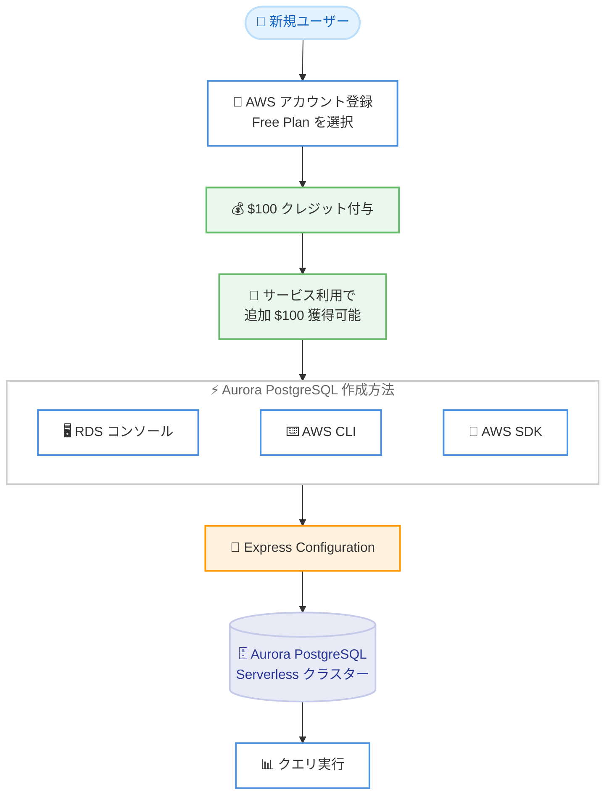

# Amazon Aurora PostgreSQL - AWS Free Tier で利用可能に

**リリース日**: 2026年3月25日
**サービス**: Amazon Aurora PostgreSQL
**機能**: AWS Free Tier での Aurora PostgreSQL Serverless の提供開始

📊 [このアップデートのインフォグラフィックを見る](https://takech9203.github.io/aws-news-summary/20260325-amazon-aurora-postgresql-aws-free-tier.html)

## 概要

Amazon Aurora PostgreSQL が AWS Free Tier で利用可能になりました。新規の AWS アカウント登録時に $100 の AWS クレジットが付与され、さらに Amazon RDS を含むサービスの利用によって追加で $100 のクレジットを獲得できます。

Free Plan アカウントを使用することで、Amazon RDS コンソール、AWS CLI、または AWS SDK から Express Configuration を使用して Aurora PostgreSQL Serverless クラスターを作成できます。Express Configuration により、Aurora PostgreSQL データベースの作成とクエリ実行が数秒で完了します。利用を開始するには、新規 AWS アカウント登録時に Free Plan を選択します。

このアップデートにより、AWS を初めて利用するユーザーが、商用グレードのリレーショナルデータベースである Aurora PostgreSQL を無料で試すことができるようになりました。学習目的やプロトタイプ開発において、コスト負担なく Aurora の高性能なデータベース機能を体験できます。

**アップデート前の課題**

- Aurora PostgreSQL を試用するには、有料のリソースを起動する必要があり、学習やプロトタイプ開発に対するコスト面での障壁があった
- AWS Free Tier で利用できるリレーショナルデータベースは Amazon RDS の単一インスタンス構成に限られていた
- Aurora の高性能な Serverless 構成を無料で体験する手段がなかった

**アップデート後の改善**

- 新規 AWS アカウントで最大 $200 分のクレジットを使用して Aurora PostgreSQL を無料で試せるようになった
- Express Configuration により、Aurora PostgreSQL Serverless クラスターを数秒で作成・クエリ実行が可能になった
- 商用グレードのサーバーレスデータベースをコスト負担なく評価・学習できるようになった

## アーキテクチャ図



この図は、新規ユーザーが AWS Free Tier を通じて Aurora PostgreSQL Serverless クラスターを作成するまでの流れを示しています。アカウント登録時にクレジットが付与され、3 つの方法から Express Configuration を使用して数秒でデータベースを起動できます。

## サービスアップデートの詳細

### 主要機能

1. **AWS Free Tier クレジット**
   - 新規アカウント登録時に $100 の AWS クレジットを自動付与
   - Amazon RDS を含むサービスの利用で追加 $100 のクレジットを獲得可能
   - 合計最大 $200 のクレジットで Aurora PostgreSQL を試用可能

2. **Express Configuration**
   - Aurora PostgreSQL Serverless クラスターを数秒で作成
   - 複雑な設定なしにデータベースの作成からクエリ実行まで即座に開始可能
   - Amazon RDS コンソール、AWS CLI、AWS SDK の 3 つの方法で利用可能

3. **Aurora PostgreSQL Serverless**
   - サーバーレスアーキテクチャによる自動スケーリング
   - PostgreSQL 互換の高性能リレーショナルデータベース
   - 商用データベースと同等の可用性と耐久性

## 技術仕様

### Free Tier の概要

| 項目 | 詳細 |
|------|------|
| 初回クレジット | 新規アカウント登録時に $100 |
| 追加クレジット | サービス利用で最大 $100 |
| 対象 | 新規 AWS アカウント |
| データベースエンジン | Aurora PostgreSQL Serverless |
| 作成方法 | RDS コンソール / AWS CLI / AWS SDK |
| 構成方法 | Express Configuration |

### 利用開始方法

```bash
# AWS CLI を使用した Aurora PostgreSQL Serverless クラスターの作成例
aws rds create-db-cluster \
  --db-cluster-identifier my-free-tier-cluster \
  --engine aurora-postgresql \
  --engine-mode provisioned \
  --serverless-v2-scaling-configuration MinCapacity=0,MaxCapacity=2 \
  --master-username admin \
  --manage-master-user-password
```

上記のコマンドは、Aurora PostgreSQL Serverless クラスターを作成します。`--manage-master-user-password` オプションにより、マスターユーザーのパスワードが AWS Secrets Manager で自動管理されます。

## 設定方法

### 前提条件

1. 新規 AWS アカウントであること
2. アカウント登録時に Free Plan を選択していること
3. Aurora PostgreSQL Serverless がサポートされているリージョンを使用すること

### 手順

#### ステップ 1: AWS アカウントの登録

新規 AWS アカウントのサインアップページにアクセスし、Free Plan を選択してアカウントを作成します。登録完了後、$100 の AWS クレジットが自動的に付与されます。

#### ステップ 2: Aurora PostgreSQL クラスターの作成

Amazon RDS コンソールにアクセスし、Express Configuration を使用して Aurora PostgreSQL Serverless クラスターを作成します。

```bash
# Express Configuration を使用してクラスターを作成
aws rds create-db-cluster \
  --db-cluster-identifier my-aurora-cluster \
  --engine aurora-postgresql \
  --engine-mode provisioned \
  --serverless-v2-scaling-configuration MinCapacity=0,MaxCapacity=2 \
  --master-username admin \
  --manage-master-user-password
```

このコマンドは、Aurora PostgreSQL Serverless v2 クラスターを最小構成で作成します。MinCapacity を 0 に設定することで、アイドル時のコストを最小化できます。

#### ステップ 3: データベースへの接続とクエリ実行

```bash
# クラスターのエンドポイントを取得
aws rds describe-db-clusters \
  --db-cluster-identifier my-aurora-cluster \
  --query 'DBClusters[0].Endpoint' \
  --output text

# psql で接続
psql -h <cluster-endpoint> -U admin -d postgres
```

取得したエンドポイントを使用して PostgreSQL クライアントから接続し、クエリを実行できます。

## メリット

### ビジネス面

- **コスト障壁の排除**: 新規ユーザーがコスト負担なく Aurora PostgreSQL を評価でき、採用判断を容易にする
- **学習機会の拡大**: AWS の学習者やスタートアップが商用グレードのデータベースを無料で体験でき、スキル習得を加速する
- **迅速なプロトタイプ開発**: 予算承認を待たずに Aurora PostgreSQL でプロトタイプを構築でき、開発サイクルを短縮する

### 技術面

- **即座のセットアップ**: Express Configuration により、数秒で Aurora PostgreSQL Serverless クラスターの作成からクエリ実行まで完了する
- **サーバーレスの柔軟性**: Aurora Serverless v2 の自動スケーリング機能を無料で体験でき、運用負荷を低減する設計を学べる
- **PostgreSQL 互換**: 既存の PostgreSQL アプリケーションやツールをそのまま使用でき、移行の検証も可能

## デメリット・制約事項

### 制限事項

- 新規 AWS アカウントのみが対象であり、既存アカウントでは利用できない
- クレジットには有効期限が設定されている可能性がある
- Aurora PostgreSQL Serverless がサポートされているリージョンでのみ利用可能

### 考慮すべき点

- Free Tier のクレジットを超過した場合、通常の料金が請求されるため、利用状況のモニタリングが重要
- 本番ワークロードへの適用には、Free Tier の範囲を超えた容量設計とコスト計画が必要

## ユースケース

### ユースケース 1: AWS 学習者のデータベーストレーニング

**シナリオ**: クラウドデータベースを学習中のエンジニアが、Aurora PostgreSQL の機能を実際に操作して理解したい。

**実装例**:
```sql
-- Aurora PostgreSQL でサンプルデータベースを作成
CREATE TABLE employees (
    id SERIAL PRIMARY KEY,
    name VARCHAR(100),
    department VARCHAR(50),
    created_at TIMESTAMP DEFAULT CURRENT_TIMESTAMP
);

INSERT INTO employees (name, department) VALUES
    ('Tanaka', 'Engineering'),
    ('Suzuki', 'Marketing');

-- Aurora の PostgreSQL 拡張機能を試す
CREATE EXTENSION IF NOT EXISTS pg_stat_statements;
SELECT * FROM pg_stat_statements LIMIT 5;
```

**効果**: コスト負担なく Aurora PostgreSQL の機能を実際に操作でき、座学だけでは得られない実践的な知識を習得できる。

### ユースケース 2: スタートアップのプロトタイプ開発

**シナリオ**: スタートアップ企業が新しい Web アプリケーションのバックエンドデータベースとして Aurora PostgreSQL の適合性を評価したい。

**実装例**:
```bash
# Serverless v2 クラスターの作成
aws rds create-db-cluster \
  --db-cluster-identifier prototype-db \
  --engine aurora-postgresql \
  --engine-mode provisioned \
  --serverless-v2-scaling-configuration MinCapacity=0,MaxCapacity=4 \
  --master-username appuser \
  --manage-master-user-password

# DB インスタンスの追加
aws rds create-db-instance \
  --db-instance-identifier prototype-db-instance \
  --db-cluster-identifier prototype-db \
  --engine aurora-postgresql \
  --db-instance-class db.serverless
```

**効果**: 予算制約のあるスタートアップが、Aurora PostgreSQL のパフォーマンスとスケーラビリティを無料で検証でき、本番環境への採用判断を迅速に行える。

### ユースケース 3: 既存 PostgreSQL からの移行検証

**シナリオ**: オンプレミスの PostgreSQL データベースを Aurora PostgreSQL に移行する前に、互換性とパフォーマンスの差異を検証したい。

**実装例**:
```bash
# pg_dump でエクスポートしたデータを Aurora PostgreSQL にインポート
pg_dump -h on-premises-host -U dbuser mydb > mydb_dump.sql

# Aurora PostgreSQL クラスターにインポート
psql -h <aurora-endpoint> -U admin -d mydb -f mydb_dump.sql

# クエリパフォーマンスの比較
EXPLAIN ANALYZE SELECT * FROM orders
    JOIN customers ON orders.customer_id = customers.id
    WHERE orders.created_at > '2026-01-01';
```

**効果**: 無料でデータ移行のリハーサルを実施でき、本番移行前にリスクを特定・軽減できる。

## 料金

AWS Free Tier の Free Plan では、新規アカウント登録時に以下のクレジットが提供されます。

| 項目 | クレジット額 |
|------|-------------|
| 初回登録クレジット | $100 |
| サービス利用追加クレジット | 最大 $100 |
| 合計 | 最大 $200 |

Free Tier クレジットの範囲内であれば、Aurora PostgreSQL Serverless の利用料金は発生しません。クレジットを超過した場合は、通常の Aurora PostgreSQL の料金体系が適用されます。

Aurora PostgreSQL Serverless v2 の通常料金は、ACU (Aurora Capacity Unit) の使用量に基づく従量課金制です。

## 利用可能リージョン

AWS Free Tier は、Aurora PostgreSQL Serverless がサポートされているすべての AWS リージョンで利用可能です。

## 関連サービス・機能

- **Amazon RDS**: Aurora PostgreSQL の基盤となるマネージドデータベースサービス。RDS コンソールから Aurora クラスターを作成・管理する
- **Aurora Serverless v2**: 自動スケーリング機能を備えた Aurora のサーバーレスデプロイメントオプション。ワークロードに応じて容量を自動調整する
- **AWS Secrets Manager**: `--manage-master-user-password` オプションにより、データベースの認証情報を安全に管理する

## 参考リンク

- 📊 [インフォグラフィック](https://takech9203.github.io/aws-news-summary/20260325-amazon-aurora-postgresql-aws-free-tier.html)
- [公式発表 (What's New)](https://aws.amazon.com/about-aws/whats-new/2026/03/amazon-aurora-postgresql-aws-free-tier/)
- [Aurora & RDS Free Tier](https://aws.amazon.com/rds/free/)
- [AWS Free Tier](https://aws.amazon.com/free/)
- [Aurora PostgreSQL ドキュメント](https://docs.aws.amazon.com/AmazonRDS/latest/AuroraUserGuide/Aurora.AuroraPostgreSQL.html)
- [Aurora 料金ページ](https://aws.amazon.com/rds/aurora/pricing/)

## まとめ

Amazon Aurora PostgreSQL が AWS Free Tier で利用可能になったことで、新規 AWS ユーザーがコスト負担なく商用グレードのサーバーレスリレーショナルデータベースを体験できるようになりました。最大 $200 のクレジットと Express Configuration による即座のセットアップにより、学習・評価・プロトタイプ開発を迅速に開始できます。AWS を検討中のユーザーや、PostgreSQL から Aurora への移行を計画している組織にとって、まず Free Plan でアカウントを作成して Aurora PostgreSQL の機能を実際に試すことを推奨します。
