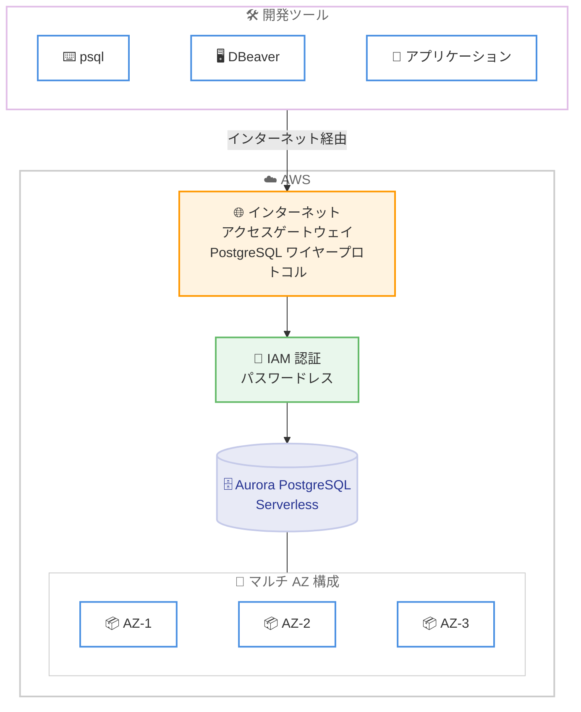

# Amazon Aurora PostgreSQL - Express Configuration によるデータベースの即時作成と接続

**リリース日**: 2026年3月25日
**サービス**: Amazon Aurora PostgreSQL
**機能**: Express Configuration による VPC 外クラスター作成とインターネットアクセスゲートウェイ

📊 [このアップデートのインフォグラフィックを見る](https://takech9203.github.io/aws-news-summary/20260325-amazon-aurora-postgresql-database.html)

## 概要

Amazon Aurora PostgreSQL に、Express Configuration を使用してクラスターを数秒で作成しクエリを実行できる新しいエクスペリエンスが追加されました。事前設定済みの構成により、初期セットアップが大幅に簡素化され、最初のクエリ実行までの時間が短縮されます。

Express Configuration で作成された Aurora クラスターは、VPC の外部に配置されます。インターネットアクセスゲートウェイを介したセキュアな接続が提供されるため、VPN や AWS Direct Connect を必要とせず、開発者が使い慣れたツールから直接データベースに接続できます。このインターネットアクセスゲートウェイは PostgreSQL ワイヤープロトコルを完全にサポートしており、幅広い開発ツールやクライアントからの接続が可能です。また、複数のアベイラビリティゾーンに分散配置されています。

さらに、管理者ユーザーに対してデフォルトで AWS Identity and Access Management (IAM) 認証が設定され、パスワードレスのデータベース認証が有効になります。Aurora PostgreSQL Serverless は、AWS Free Tier の Free Plan および Paid Plan の両方で利用可能になりました。

**アップデート前の課題**

- Aurora PostgreSQL クラスターの作成には VPC の設定やサブネットグループの構成が必要で、初期セットアップに時間がかかっていた
- データベースに接続するには VPC 内からのアクセスが前提であり、VPN や Direct Connect、踏み台サーバーの構築が必要だった
- データベース認証にはパスワードベースの認証が一般的で、認証情報の管理が煩雑だった

**アップデート後の改善**

- Express Configuration により、事前設定済みの構成で Aurora PostgreSQL Serverless クラスターを数秒で作成できるようになった
- VPC 外に配置されたクラスターにインターネットアクセスゲートウェイ経由で直接接続でき、VPN や Direct Connect が不要になった
- IAM 認証がデフォルトで有効化され、パスワードレスでセキュアなデータベース認証が標準になった

## アーキテクチャ図



開発者のツールからインターネットアクセスゲートウェイを経由して、VPC 外に配置された Aurora PostgreSQL Serverless クラスターにセキュアに接続する構成を示しています。IAM 認証によるパスワードレス認証と、マルチ AZ 構成による高可用性が標準で提供されます。

## サービスアップデートの詳細

### 主要機能

1. **Express Configuration**
   - 事前設定済みの構成により Aurora PostgreSQL Serverless クラスターを数秒で作成
   - 複雑な VPC 設定やサブネットグループの構成が不要
   - 作成からクエリ実行までの時間を大幅に短縮

2. **インターネットアクセスゲートウェイ**
   - VPC 外に配置されたクラスターへのセキュアなインターネット接続を提供
   - PostgreSQL ワイヤープロトコルを完全サポートし、幅広い開発ツールやクライアントから接続可能
   - 複数のアベイラビリティゾーンに分散配置され、高可用性を確保
   - VPN や AWS Direct Connect の構築が不要

3. **IAM 認証のデフォルト有効化**
   - 管理者ユーザーに対してデフォルトで IAM 認証を設定
   - パスワードレスのデータベース認証により、認証情報の管理を簡素化
   - AWS のセキュリティベストプラクティスに準拠した認証方式

## 技術仕様

### Express Configuration の構成

| 項目 | 詳細 |
|------|------|
| データベースエンジン | Aurora PostgreSQL Serverless |
| ネットワーク配置 | VPC 外 |
| 接続方式 | インターネットアクセスゲートウェイ |
| プロトコル | PostgreSQL ワイヤープロトコル |
| 可用性 | マルチ AZ 分散 |
| 認証方式 | IAM 認証 (デフォルト) |
| 対象プラン | AWS Free Tier Free Plan / Paid Plan |

### IAM 認証の仕組み

```bash
# IAM 認証トークンの生成
aws rds generate-db-auth-token \
  --hostname <cluster-endpoint> \
  --port 5432 \
  --region <region> \
  --username <admin-user>

# 生成されたトークンを使用して psql で接続
PGPASSWORD=$(aws rds generate-db-auth-token \
  --hostname <cluster-endpoint> \
  --port 5432 \
  --region <region> \
  --username <admin-user>) \
psql "host=<cluster-endpoint> port=5432 dbname=postgres user=<admin-user> sslmode=require"
```

IAM 認証トークンは一時的な認証情報として機能し、パスワードの管理や定期的なローテーションが不要になります。

## 設定方法

### 前提条件

1. AWS アカウントを所有していること (Free Plan または Paid Plan)
2. IAM ユーザーまたはロールに適切な RDS 権限が付与されていること
3. PostgreSQL クライアントツールがインストールされていること

### 手順

#### ステップ 1: Express Configuration でクラスターを作成

Amazon RDS コンソールにアクセスし、「データベースの作成」から Express Configuration を選択します。Aurora PostgreSQL Serverless が事前設定済みの構成で数秒以内に作成されます。

```bash
# AWS CLI を使用する場合の例
aws rds create-db-cluster \
  --db-cluster-identifier my-express-cluster \
  --engine aurora-postgresql \
  --engine-mode provisioned \
  --serverless-v2-scaling-configuration MinCapacity=0,MaxCapacity=2 \
  --enable-iam-database-authentication \
  --publicly-accessible
```

Express Configuration では、VPC やサブネットグループの設定を省略し、インターネットアクセスゲートウェイが自動的に構成されます。

#### ステップ 2: IAM ポリシーの確認

```json
{
  "Version": "2012-10-17",
  "Statement": [
    {
      "Effect": "Allow",
      "Action": [
        "rds-db:connect"
      ],
      "Resource": [
        "arn:aws:rds-db:<region>:<account-id>:dbuser:<resource-id>/<admin-user>"
      ]
    }
  ]
}
```

IAM 認証でデータベースに接続するために、`rds-db:connect` アクションを許可する IAM ポリシーが必要です。

#### ステップ 3: データベースへの接続

```bash
# クラスターのエンドポイントを取得
ENDPOINT=$(aws rds describe-db-clusters \
  --db-cluster-identifier my-express-cluster \
  --query 'DBClusters[0].Endpoint' \
  --output text)

# IAM 認証トークンを生成して接続
PGPASSWORD=$(aws rds generate-db-auth-token \
  --hostname $ENDPOINT \
  --port 5432 \
  --region <region> \
  --username <admin-user>) \
psql "host=$ENDPOINT port=5432 dbname=postgres user=<admin-user> sslmode=require"
```

インターネットアクセスゲートウェイ経由で、ローカル環境から直接クラスターに接続します。VPN や踏み台サーバーは不要です。

## メリット

### ビジネス面

- **開発開始までの時間短縮**: Express Configuration により、数秒でデータベースを作成しクエリを実行でき、開発の初動を大幅に加速する
- **インフラ構築コストの削減**: VPN や Direct Connect、踏み台サーバーの構築が不要になり、インフラストラクチャの管理コストを削減する
- **Free Tier での利用**: Free Plan と Paid Plan の両方で利用可能になり、コスト負担なく Aurora PostgreSQL を評価できる

### 技術面

- **ネットワーク設定の簡素化**: VPC 外配置とインターネットアクセスゲートウェイにより、複雑なネットワーク設定が不要になる
- **セキュリティの向上**: IAM 認証のデフォルト有効化により、パスワード管理の負荷を排除しつつセキュリティレベルを向上させる
- **幅広いツール互換性**: PostgreSQL ワイヤープロトコルの完全サポートにより、psql、DBeaver、pgAdmin など任意のクライアントから接続可能

## デメリット・制約事項

### 制限事項

- Express Configuration で作成されたクラスターは VPC 外に配置されるため、VPC 内のリソースとのプライベート通信には追加の構成が必要になる可能性がある
- インターネットアクセスゲートウェイはインターネット経由の接続を前提としているため、ネットワークポリシーで外部接続が制限されている環境では利用が難しい場合がある
- IAM 認証がデフォルトのため、従来のパスワードベース認証に依存するレガシーアプリケーションの接続には追加設定が必要になる場合がある

### 考慮すべき点

- 本番ワークロードにおいては、VPC 内配置によるネットワーク分離やセキュリティグループによるアクセス制御が推奨される場合がある
- Express Configuration は迅速な開発開始を目的としているため、本番環境では要件に応じたカスタム構成を検討する必要がある

## ユースケース

### ユースケース 1: 迅速なプロトタイプ開発

**シナリオ**: Web アプリケーションのプロトタイプを開発中のチームが、数分以内にデータベースを準備してバックエンドの検証を開始したい。

**実装例**:
```bash
# Express Configuration でクラスターを作成
aws rds create-db-cluster \
  --db-cluster-identifier prototype-db \
  --engine aurora-postgresql \
  --engine-mode provisioned \
  --serverless-v2-scaling-configuration MinCapacity=0,MaxCapacity=2 \
  --enable-iam-database-authentication \
  --publicly-accessible

# ローカル環境から直接接続してスキーマを作成
psql "host=<endpoint> dbname=postgres user=admin sslmode=require" \
  -c "CREATE TABLE users (id SERIAL PRIMARY KEY, email TEXT UNIQUE, created_at TIMESTAMPTZ DEFAULT NOW());"
```

**効果**: VPC やネットワークの設定を省略し、数秒でデータベースを作成してアプリケーション開発に集中できる。

### ユースケース 2: リモート開発環境からの接続

**シナリオ**: リモートワーク中の開発者が、自宅のネットワーク環境から VPN を構築せずに共有データベースにアクセスしたい。

**実装例**:
```bash
# 開発者のローカルマシンから IAM 認証で接続
export PGPASSWORD=$(aws rds generate-db-auth-token \
  --hostname dev-cluster.cluster-xxxx.us-east-1.rds.amazonaws.com \
  --port 5432 \
  --region us-east-1 \
  --username dev-user)

psql "host=dev-cluster.cluster-xxxx.us-east-1.rds.amazonaws.com \
  port=5432 dbname=devdb user=dev-user sslmode=require"
```

**効果**: VPN や Direct Connect なしで、インターネット経由でセキュアにデータベースに接続でき、リモート開発の生産性が向上する。

### ユースケース 3: 教育・ハンズオン環境の構築

**シナリオ**: 企業内の技術トレーニングで、参加者ごとに独立した Aurora PostgreSQL データベースを短時間で準備したい。

**実装例**:
```bash
# 参加者ごとにクラスターを一括作成
for i in $(seq 1 20); do
  aws rds create-db-cluster \
    --db-cluster-identifier "training-db-${i}" \
    --engine aurora-postgresql \
    --engine-mode provisioned \
    --serverless-v2-scaling-configuration MinCapacity=0,MaxCapacity=1 \
    --enable-iam-database-authentication \
    --publicly-accessible &
done
wait
echo "All training databases created"
```

**効果**: 参加者がネットワーク設定を意識することなく、各自の PC から直接データベースに接続してハンズオン演習を開始できる。

## 料金

Express Configuration で作成される Aurora PostgreSQL Serverless クラスターは、Aurora Serverless v2 の通常の料金体系が適用されます。AWS Free Tier の Free Plan および Paid Plan で利用可能です。

### 料金例

| 項目 | 料金 (米国東部リージョン、概算) |
|------|-------------------------------|
| Aurora Serverless v2 ACU 時間 | $0.12/ACU 時間 |
| ストレージ | $0.10/GB/月 |
| I/O | $0.20/100 万リクエスト |
| Free Tier 初回クレジット | $100 |
| Free Tier 追加クレジット | 最大 $100 |

インターネットアクセスゲートウェイの利用に追加料金は発生しません (Aurora の通常料金に含まれます)。

## 利用可能リージョン

Express Configuration による Aurora PostgreSQL の作成は、Aurora PostgreSQL Serverless v2 がサポートされているリージョンで利用可能です。詳細は公式ドキュメントを参照してください。

## 関連サービス・機能

- **Amazon Aurora Serverless v2**: ワークロードに応じて自動スケーリングする Aurora のサーバーレスデプロイメントオプション。Express Configuration のバックエンドとして使用される
- **AWS Identity and Access Management (IAM)**: Express Configuration でデフォルトで有効化される認証方式。パスワードレスのデータベース認証を提供する
- **AWS Free Tier**: Free Plan と Paid Plan の両方で Aurora PostgreSQL Serverless が利用可能。新規ユーザーの学習や評価に最適

## 参考リンク

- 📊 [インフォグラフィック](https://takech9203.github.io/aws-news-summary/20260325-amazon-aurora-postgresql-database.html)
- [公式発表 (What's New)](https://aws.amazon.com/about-aws/whats-new/2026/03/amazon-aurora-postgresql-database/)
- [Aurora PostgreSQL ドキュメント](https://docs.aws.amazon.com/AmazonRDS/latest/AuroraUserGuide/Aurora.AuroraPostgreSQL.html)
- [Aurora 料金ページ](https://aws.amazon.com/rds/aurora/pricing/)

## まとめ

Amazon Aurora PostgreSQL の Express Configuration により、VPC の設定や VPN の構築を必要とせず、数秒でデータベースを作成しインターネット経由で直接接続できるようになりました。IAM 認証のデフォルト有効化とインターネットアクセスゲートウェイの提供により、セキュリティを維持しながら開発者の利便性が大幅に向上しています。開発環境の迅速な立ち上げやプロトタイプ開発、教育用途において、まず Express Configuration でクラスターを作成して Aurora PostgreSQL の機能を体験することを推奨します。
