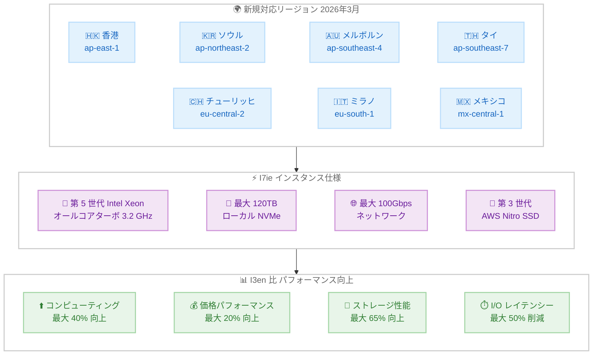

# Amazon EC2 - I7ie インスタンスが追加の AWS リージョンで利用可能に

**リリース日**: 2026年03月25日
**サービス**: Amazon EC2
**機能**: I7ie ストレージ最適化インスタンスのリージョン拡大

## 概要

AWS は 2026 年 3 月 25 日、Amazon EC2 I7ie インスタンスが、アジアパシフィック (香港)、アジアパシフィック (ソウル)、アジアパシフィック (メルボルン)、アジアパシフィック (タイ)、欧州 (チューリッヒ)、欧州 (ミラノ)、メキシコ (中部) の 7 つの追加リージョンで利用可能になったことを発表しました。I7ie インスタンスは、第 5 世代 Intel Xeon プロセッサー (オールコアターボ 3.2 GHz) を搭載した、ストレージ集約的ワークロード向けの高性能インスタンスです。

I7ie インスタンスは、前世代の I3en インスタンスと比較して最大 40% 優れたコンピューティング性能と 20% 優れた価格パフォーマンスを実現します。最大 120TB のローカル NVMe ストレージ密度を提供し、前世代と比較して最大 2 倍の vCPU とメモリを搭載しています。第 3 世代 AWS Nitro SSD により、リアルタイムストレージ性能が最大 65% 向上し、ストレージ I/O レイテンシーが最大 50% 削減されています。

**アップデート前の課題**

- 香港、ソウル、メルボルン、タイ、チューリッヒ、ミラノ、メキシコの各リージョンでは I7ie インスタンスが利用できず、最新のストレージ最適化インスタンスの性能を活用できなかった
- これらのリージョンでは前世代の I3en インスタンスに依存する必要があり、コンピューティング性能とストレージ I/O 性能に制限があった
- 地理的に近いリージョンでストレージ集約的ワークロードを実行できないため、レイテンシーやデータ主権の要件に対応が困難だった

**アップデート後の改善**

- 7 つの追加リージョンで I7ie インスタンスが利用可能になり、グローバルなストレージ集約的ワークロードの展開が容易になった
- 前世代 I3en と比較して最大 40% のコンピューティング性能向上と 20% の価格パフォーマンス向上を新しいリージョンで活用可能
- 第 3 世代 AWS Nitro SSD による最大 65% のリアルタイムストレージ性能向上と最大 50% の I/O レイテンシー削減が利用可能になった

## アーキテクチャ図



この図は、I7ie インスタンスが新たに利用可能になった 7 リージョンと、第 5 世代 Intel Xeon プロセッサーおよび第 3 世代 AWS Nitro SSD による主要スペック、前世代 I3en インスタンスとのパフォーマンス比較を示しています。

## サービスアップデートの詳細

### 主要機能

1. **第 5 世代 Intel Xeon プロセッサー搭載**
   - オールコアターボクロック 3.2 GHz による高いコンピューティング性能
   - 前世代 I3en と比較して最大 40% 優れたコンピューティング性能
   - 前世代と比較して最大 2 倍の vCPU とメモリを提供

2. **第 3 世代 AWS Nitro SSD によるストレージ性能**
   - リアルタイムストレージ性能が最大 65% 向上
   - ストレージ I/O レイテンシーが最大 50% 削減
   - 最大 120TB のローカル NVMe ストレージ密度

3. **高いネットワークおよび EBS 帯域幅**
   - 最大 100Gbps のネットワーク帯域幅
   - 最大 60Gbps の EBS 帯域幅
   - 9 つの仮想サイズで柔軟なサイジングが可能

## 技術仕様

### I7ie インスタンスと I3en インスタンスの比較

| 項目 | I7ie | I3en |
|------|------|------|
| プロセッサー | 第 5 世代 Intel Xeon (3.2 GHz) | 第 2 世代 Intel Xeon Scalable |
| コンピューティング性能 | 最大 40% 向上 (I3en 比) | ベースライン |
| 価格パフォーマンス | 最大 20% 向上 (I3en 比) | ベースライン |
| ローカル NVMe ストレージ | 最大 120TB | 最大 60TB |
| vCPU とメモリ | 最大 2 倍 (前世代比) | ベースライン |
| ストレージ性能 | 最大 65% 向上 (Nitro SSD 第 3 世代) | Nitro SSD 第 1/2 世代 |
| I/O レイテンシー | 最大 50% 削減 | ベースライン |
| ネットワーク帯域幅 | 最大 100Gbps | 最大 100Gbps |
| EBS 帯域幅 | 最大 60Gbps | 最大 20Gbps |
| 仮想サイズ数 | 9 | 6 |

### I7ie インスタンスサイズ一覧

| 項目 | 詳細 |
|------|------|
| インスタンスファミリー | ストレージ最適化 (I) |
| 利用可能サイズ | 9 つの仮想サイズ |
| 最大ネットワーク帯域幅 | 100Gbps |
| 最大 EBS 帯域幅 | 60Gbps |
| 最大ローカルストレージ | 120TB NVMe |

## 設定方法

### 前提条件

1. AWS アカウントと適切な IAM 権限
2. 対象リージョンへのアクセスが有効であること
3. 必要な VPC およびサブネット設定
4. 十分なサービスクォータ (vCPU 制限の確認)

### 手順

#### ステップ1: 利用可能なインスタンスタイプの確認

```bash
# 香港リージョンで利用可能な I7ie インスタンスタイプを確認
aws ec2 describe-instance-types \
  --filters "Name=instance-type,Values=i7ie*" \
  --region ap-east-1 \
  --query "InstanceTypes[].{Type:InstanceType,vCPU:VCpuInfo.DefaultVCpus,Memory:MemoryInfo.SizeInMiB,Storage:InstanceStorageInfo.TotalSizeInGB}" \
  --output table
```

このコマンドは、香港リージョン (ap-east-1) で利用可能な I7ie インスタンスタイプとそのスペック (vCPU、メモリ、ストレージ) を一覧表示します。

#### ステップ2: I7ie インスタンスの起動

```bash
# I7ie インスタンスを起動
aws ec2 run-instances \
  --image-id ami-xxxxxxxxxxxxxxxxx \
  --instance-type i7ie.xlarge \
  --region ap-east-1 \
  --subnet-id subnet-xxxxxxxxxxxxxxxxx \
  --security-group-ids sg-xxxxxxxxxxxxxxxxx \
  --key-name my-key-pair
```

このコマンドは、香港リージョンで I7ie.xlarge インスタンスを起動します。AMI ID、サブネット ID、セキュリティグループ ID、キーペア名は環境に合わせて変更してください。

#### ステップ3: ローカル NVMe ストレージのセットアップ

```bash
# インスタンスに SSH 接続後、NVMe デバイスを確認
lsblk

# NVMe ストレージをフォーマットしてマウント
sudo mkfs.xfs /dev/nvme1n1
sudo mkdir -p /data
sudo mount /dev/nvme1n1 /data
```

I7ie インスタンスのローカル NVMe ストレージはエフェメラルストレージです。インスタンスの停止や終了時にデータが失われるため、永続化が必要なデータは別途 EBS ボリュームや S3 に保存してください。

## メリット

### ビジネス面

- **コスト効率の向上**: I3en と比較して最大 20% 優れた価格パフォーマンスにより、ストレージ集約的ワークロードの運用コストを削減
- **グローバル展開の拡大**: 7 つの追加リージョンにより、データ主権やコンプライアンス要件への対応が容易になり、エンドユーザーへのレイテンシーを最小化
- **柔軟なサイジング**: 9 つの仮想サイズにより、ワークロードに最適なインスタンスサイズを選択でき、リソースの無駄を削減

### 技術面

- **高ストレージ性能**: 第 3 世代 AWS Nitro SSD による最大 65% のリアルタイムストレージ性能向上と最大 50% の I/O レイテンシー削減
- **大容量ローカルストレージ**: 最大 120TB のローカル NVMe ストレージにより、大規模データセットをローカルで高速処理
- **高コンピューティング性能**: 第 5 世代 Intel Xeon プロセッサー (3.2 GHz) により、前世代比最大 40% のコンピューティング性能向上
- **高帯域幅ネットワーク**: 最大 100Gbps のネットワーク帯域幅と 60Gbps の EBS 帯域幅により、大量データ転送に対応

## デメリット・制約事項

### 制限事項

- ローカル NVMe ストレージはエフェメラル (一時的) であり、インスタンスの停止・終了時にデータが失われる
- すべての AWS リージョンで利用可能ではなく、特定のリージョンに限定される
- インスタンスサイズが大きい場合、サービスクォータの引き上げが必要になる場合がある

### 考慮すべき点

- I3en からの移行時には、アプリケーションの互換性テストとパフォーマンステストを実施することを推奨
- ローカル NVMe ストレージに保存するデータのバックアップ戦略を事前に策定する必要がある
- 価格パフォーマンスを最大化するには、Reserved Instances や Savings Plans の利用を検討

## ユースケース

### ユースケース1: 高スループットデータベース

**シナリオ**: NoSQL データベース (Apache Cassandra、MongoDB など) を実行し、大量の読み書きオペレーションを低レイテンシーで処理したい

**実装例**:
```bash
# I7ie インスタンスで Cassandra ノードを起動
aws ec2 run-instances \
  --image-id ami-xxxxxxxxxxxxxxxxx \
  --instance-type i7ie.6xlarge \
  --region ap-east-1 \
  --block-device-mappings file://storage-config.json \
  --user-data file://cassandra-setup.sh
```

**効果**: 第 3 世代 AWS Nitro SSD による最大 65% のストレージ性能向上と最大 50% の I/O レイテンシー削減により、データベースのクエリ応答時間が大幅に改善

### ユースケース2: リアルタイムデータ分析

**シナリオ**: 大量のログデータやイベントデータをリアルタイムで収集・分析し、Elasticsearch や OpenSearch で検索・可視化したい

**実装例**:
```bash
# I7ie インスタンスで Elasticsearch クラスターノードを起動
aws ec2 run-instances \
  --image-id ami-xxxxxxxxxxxxxxxxx \
  --instance-type i7ie.4xlarge \
  --region ap-northeast-2 \
  --user-data file://elasticsearch-setup.sh
```

**効果**: 最大 120TB のローカル NVMe ストレージにより大量のインデックスデータをローカルに保持でき、高速なクエリ処理を実現

### ユースケース3: データレイクおよび分散ファイルシステム

**シナリオ**: Hadoop HDFS や Apache Spark を使用して、ペタバイト規模のデータを処理するデータレイク基盤を構築したい

**実装例**:
```bash
# I7ie インスタンスで HDFS DataNode を起動
aws ec2 run-instances \
  --image-id ami-xxxxxxxxxxxxxxxxx \
  --instance-type i7ie.12xlarge \
  --region eu-central-2 \
  --count 3 \
  --user-data file://hdfs-datanode-setup.sh
```

**効果**: 前世代比最大 2 倍の vCPU とメモリ、120TB のローカルストレージにより、データ処理スループットが大幅に向上し、ジョブ完了時間を短縮

## 料金

I7ie インスタンスの料金は、選択したインスタンスサイズ、リージョン、購入オプションによって異なります。I3en と比較して最大 20% 優れた価格パフォーマンスが期待できます。詳細な料金については、[Amazon EC2 料金ページ](https://aws.amazon.com/ec2/pricing/) をご確認ください。

購入オプションとして以下が利用可能です。

- **オンデマンドインスタンス**: 使用した分だけ支払い、長期コミットメント不要
- **Reserved Instances**: 1 年または 3 年のコミットメントで大幅な割引
- **Savings Plans**: 柔軟なコミットメントベースの割引
- **スポットインスタンス**: 未使用の EC2 容量を大幅な割引で利用 (中断の可能性あり)

## 利用可能リージョン

今回のアップデートにより、I7ie インスタンスは以下の 7 リージョンが追加されました。

**新規対応リージョン (2026年3月25日)**:
- アジアパシフィック (香港) - ap-east-1
- アジアパシフィック (ソウル) - ap-northeast-2
- アジアパシフィック (メルボルン) - ap-southeast-4
- アジアパシフィック (タイ) - ap-southeast-7
- 欧州 (チューリッヒ) - eu-central-2
- 欧州 (ミラノ) - eu-south-1
- メキシコ (中部) - mx-central-1

## 関連サービス・機能

- **Amazon EBS**: I7ie インスタンスは最大 60Gbps の EBS 帯域幅を提供し、永続ブロックストレージとローカル NVMe ストレージを組み合わせた柔軟なストレージアーキテクチャを構築可能
- **Amazon S3**: ローカル NVMe ストレージのバックアップ先として S3 を活用し、データの耐久性を確保
- **AWS Nitro System**: I7ie インスタンスの基盤技術であり、第 3 世代 Nitro SSD によるストレージ性能の大幅な向上を実現
- **Amazon CloudWatch**: I7ie インスタンスのパフォーマンスメトリクス (CPU、ディスク I/O、ネットワーク) を監視

## 参考リンク

- [公式発表 (What's New)](https://aws.amazon.com/about-aws/whats-new/2026/03/amazon-ec2-i7ie-instances-additional-aws-regions/)
- [I7ie インスタンス製品ページ](https://aws.amazon.com/ec2/instance-types/i7ie/)
- [Amazon EC2 料金ページ](https://aws.amazon.com/ec2/pricing/)
- [Amazon EC2 ドキュメント](https://docs.aws.amazon.com/ec2/)

## まとめ

Amazon EC2 I7ie インスタンスが 7 つの追加リージョンで利用可能になったことにより、ストレージ集約的ワークロードをグローバルに展開する選択肢が大幅に広がりました。第 5 世代 Intel Xeon プロセッサーと第 3 世代 AWS Nitro SSD により、前世代 I3en と比較して最大 40% のコンピューティング性能向上、最大 65% のストレージ性能向上、最大 50% の I/O レイテンシー削減を実現します。NoSQL データベース、リアルタイム分析、データレイクなどのストレージ集約的ワークロードを新しいリージョンで実行するお客様は、I7ie インスタンスへの移行を検討してください。
