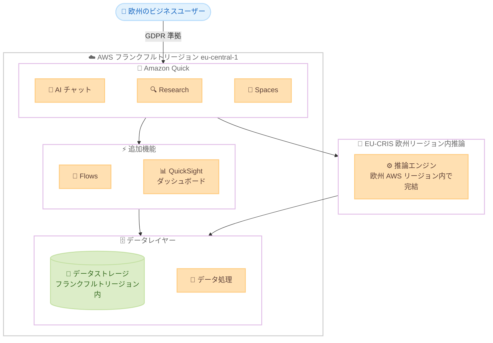

# Amazon Quick - AWS フランクフルトリージョンでの提供開始

**リリース日**: 2026 年 3 月 25 日
**サービス**: Amazon Quick
**機能**: AWS ヨーロッパ (フランクフルト) リージョン (eu-central-1) での提供開始

[このアップデートのインフォグラフィックを見る](https://takech9203.github.io/aws-news-summary/20260325-amazon-quick-now-available-in-the-aws-frankfurt-region.html)

## 概要

Amazon Quick が AWS ヨーロッパ (フランクフルト) リージョン (eu-central-1) で利用可能になりました。Amazon Quick は、ビジネスユーザーに AI を活用したエージェントチームメイトを提供し、業務上の質問に迅速に回答し、その回答をアクションに変換するサービスです。今回のフランクフルトリージョン対応により、ドイツをはじめとする欧州のお客様はデータ主権要件を満たしながら Amazon Quick の全機能を利用できるようになりました。

フランクフルトリージョンでの提供開始に伴い、AI チャット、Research、Spaces、Flows、QuickSight ダッシュボードなどの主要機能がすべて利用可能です。データはフランクフルトリージョン内でローカルに保存・処理されるため、GDPR をはじめとする EU のデータ保護フレームワークへの準拠が容易になります。

さらに、EU-CRIS (Europe Cross-Region Inference) によるリージョン内推論をサポートしており、フランクフルトインスタンスからの推論リクエストは欧州の AWS リージョン内で排他的にルーティングされます。これにより、金融サービス、ヘルスケア、公共セクターなどの規制産業のお客様も、厳格なデータ主権要件を満たしつつ Amazon Quick を活用できます。

**アップデート前の課題**

- ドイツおよび EU のお客様が Amazon Quick を利用する際、EU 域外のリージョンにデータを送信する必要があり、GDPR を含むデータ主権要件への対応が困難だった
- 推論リクエストが EU 域外のリージョンにルーティングされる可能性があり、規制産業のお客様は利用が制限されていた
- EU 域内でデータを保存・処理する必要がある組織は Amazon Quick の導入を見送らざるを得なかった

**アップデート後の改善**

- フランクフルトリージョンでデータのローカル保存・処理が可能になり、GDPR 準拠のデータ主権要件を満たせるようになった
- EU-CRIS により推論リクエストが欧州 AWS リージョン内に閉じた処理が保証されるようになった
- 金融、ヘルスケア、公共セクターなどの規制産業でも Amazon Quick の導入が可能になった

## アーキテクチャ図



この図は、AWS フランクフルトリージョン内で Amazon Quick の全機能がデータ主権を保ちながら動作する構成を示しています。EU-CRIS による欧州リージョン内推論とデータのローカル保存により、GDPR をはじめとする EU の規制要件に準拠した利用が可能です。

## サービスアップデートの詳細

### 主要機能

1. **フランクフルトリージョンでの全機能提供**
   - AI チャット: 自然言語で業務上の質問に回答し、アクションを実行
   - Research: データに基づく調査・分析機能
   - Spaces: チームでの情報共有とコラボレーション
   - Flows: ワークフローの自動化
   - QuickSight ダッシュボード: データの可視化と分析

2. **EU-CRIS による欧州リージョン内推論**
   - Europe Cross-Region Inference の略称で、欧州リージョン専用の推論ルーティング機能
   - フランクフルトインスタンスからの推論リクエストは欧州 AWS リージョン内で排他的にルーティング
   - 推論データが EU 域外に送信されないことを保証
   - 規制産業向けのコンプライアンス要件に対応

3. **データ主権とコンプライアンス対応**
   - データはフランクフルトリージョン内でローカルに保存・処理
   - EU 一般データ保護規則 (GDPR) への準拠を支援
   - 金融サービス、ヘルスケア、公共セクターの規制要件に対応
   - EU のデータ保護フレームワークに準拠した運用が可能

## 技術仕様

### フランクフルトリージョン対応の詳細

| 項目 | 詳細 |
|------|------|
| リージョン | ヨーロッパ (フランクフルト) / eu-central-1 |
| 推論ルーティング | EU-CRIS (Europe Cross-Region Inference) |
| 推論ルーティング範囲 | 欧州 AWS リージョン内 |
| データ保存場所 | AWS フランクフルトリージョン内 |
| 対応コンプライアンス | GDPR (EU 一般データ保護規則) |

### 利用可能な機能

| 機能 | 説明 |
|------|------|
| AI チャット | 自然言語による質問応答とアクション実行 |
| Research | データに基づく調査・分析 |
| Spaces | チームコラボレーションと情報共有 |
| Flows | ワークフローの自動化 |
| QuickSight ダッシュボード | データの可視化と BI 分析 |

### API 変更履歴

| 日付 | サービス | 変更内容 |
|------|----------|----------|
| 2026/03/13 | [Amazon QuickSight](https://awsapichanges.com/archive/changes/7a0027-quicksight.html) | 4 updated api methods - ManageSharedFolders capability の追加 |

## 設定方法

### 前提条件

1. AWS アカウントとフランクフルトリージョンへのアクセス権限
2. Amazon Quick のサブスクリプション
3. 適切な IAM ポリシーの設定

### 手順

#### ステップ 1: フランクフルトリージョンの選択

AWS Management Console にログインし、リージョンとして「ヨーロッパ (フランクフルト) eu-central-1」を選択します。

#### ステップ 2: Amazon Quick へのアクセス

AWS Management Console から Amazon Quick のサービスページにアクセスし、セットアップを開始します。フランクフルトリージョンが選択されていることを確認してください。

#### ステップ 3: ワークスペースの作成

```bash
# AWS CLI を使用してワークスペースを作成
aws quick create-workspace \
  --region eu-central-1 \
  --workspace-name "my-frankfurt-workspace" \
  --workspace-description "Frankfurt region workspace"
```

このコマンドはフランクフルトリージョンに新しい Amazon Quick ワークスペースを作成します。データは自動的にフランクフルトリージョン内に保存されます。

#### ステップ 4: EU-CRIS の確認

フランクフルトリージョンで作成されたワークスペースでは、EU-CRIS による欧州リージョン内推論が自動的に有効になります。追加の設定は不要です。推論リクエストが欧州 AWS リージョン内で処理されることを確認するには、CloudTrail ログを確認してください。

## メリット

### ビジネス面

- **GDPR 準拠の確保**: EU 域内にデータを保持できるため、GDPR 要件を満たしながら AI 活用が可能
- **規制産業での導入促進**: 金融、ヘルスケア、公共セクターなど、これまでデータ主権の懸念から導入を見送っていた組織が利用可能に
- **レイテンシの低減**: 欧州のユーザーがフランクフルトリージョンに直接アクセスすることで、応答速度が向上

### 技術面

- **欧州リージョン内推論の保証**: EU-CRIS により推論データが EU 域外に送信されないことが保証される
- **ローカルデータ処理**: データの保存・処理がフランクフルトリージョン内で完結
- **既存 AWS 環境との統合**: フランクフルトリージョンで運用中の他の AWS サービスとシームレスに連携可能

## デメリット・制約事項

### 制限事項

- EU-CRIS は欧州リージョン内推論のみをサポートしており、欧州外の推論リソースは利用できない
- フランクフルトリージョン固有の SPICE キャパシティやサービスクォータの制限が適用される
- 一部のサードパーティ統合は、フランクフルトリージョンでの対応状況を個別に確認する必要がある

### 考慮すべき点

- フランクフルトリージョンの料金体系が他リージョンと異なる場合がある
- 既存の他リージョンで運用中のワークスペースからの移行には、データの再配置が必要となる場合がある
- EU-CRIS は欧州 AWS リージョン内でのルーティングを保証するが、特定の単一リージョンに限定するものではない点に留意が必要

## ユースケース

### ユースケース 1: ドイツの金融機関でのデータ分析

**シナリオ**: ドイツの銀行が顧客データを分析し、AI を活用した意思決定を行う

**実装例**:
```
Amazon Quick チャット:
「過去 3 か月の融資審査データを分析して、
承認率のトレンドと主要な却下理由をまとめて」
```

**効果**: GDPR に準拠しながら、顧客データを EU 域内で安全に分析し、業務効率を向上

### ユースケース 2: ヘルスケア分野でのレポート作成

**シナリオ**: 欧州の医療機関が患者データに基づく運営レポートを作成する

**実装例**:
```
Amazon Quick チャット:
「今月の外来患者数と診療科別の待ち時間データを
QuickSight ダッシュボードで可視化して」
```

**効果**: 医療データを EU 域内で保持しつつ、AI による分析でレポート作成時間を大幅に短縮

### ユースケース 3: 公共セクターでの業務効率化

**シナリオ**: EU 加盟国の政府機関が内部業務データの分析と自動化を実施する

**実装例**:
```
Amazon Quick Flows:
1. 週次データを自動収集
2. AI で異常値を検出
3. Spaces で関係者に共有
4. 報告書を自動生成
```

**効果**: GDPR に準拠したデータ主権を確保しながら、業務プロセスの自動化と効率化を実現

## 料金

Amazon Quick の料金は、ユーザー数とワークスペースの使用量に基づきます。フランクフルトリージョンでの料金は、他のリージョンと同等の料金体系が適用されます。詳細な料金情報は [Amazon Quick の料金ページ](https://aws.amazon.com/quicksight/pricing/) を参照してください。

### 料金例

| 使用量 | 月額料金 (概算) |
|--------|------------------|
| Quick ユーザー 10 名 | $200 |
| Quick ユーザー 50 名 | $800 |
| Quick ユーザー 100 名 | $1,500 |

## 利用可能リージョン

Amazon Quick は以下のリージョンで利用可能です。今回のアップデートにより、フランクフルトリージョンが追加されました。

- **新規追加**: ヨーロッパ (フランクフルト) - eu-central-1
- アジアパシフィック (東京) - ap-northeast-1 (2026 年 3 月 25 日追加)
- その他の既存リージョンでも引き続き利用可能

## 関連サービス・機能

- **Amazon QuickSight**: Quick と統合されたダッシュボード機能を提供し、フランクフルトリージョンでのデータ可視化を実現
- **Amazon Bedrock**: Quick の AI 機能の基盤となる大規模言語モデルを提供
- **AWS IAM**: ワークスペースとユーザーのアクセス制御を管理
- **AWS CloudTrail**: EU-CRIS による推論リクエストのルーティングを監査・追跡

## 参考リンク

- [インフォグラフィック](https://takech9203.github.io/aws-news-summary/20260325-amazon-quick-now-available-in-the-aws-frankfurt-region.html)
- [公式発表 (What's New)](https://aws.amazon.com/about-aws/whats-new/2026/03/amazon-quick-now-available-in-the-aws-frankfurt-region/)
- [ドキュメント](https://docs.aws.amazon.com/quicksuite/latest/userguide/)
- [料金ページ](https://aws.amazon.com/quicksight/pricing/)

## まとめ

Amazon Quick の AWS フランクフルトリージョン対応は、ドイツおよび欧州のお客様にとって大きな前進です。EU-CRIS による欧州リージョン内推論の保証と、データのローカル保存・処理により、GDPR をはじめとする EU のデータ保護フレームワークへの準拠が容易になります。金融、ヘルスケア、公共セクターなどの規制産業のお客様は、データ主権要件を満たしながら Amazon Quick の AI 機能を活用できるようになりましたので、導入を検討されることを推奨します。
