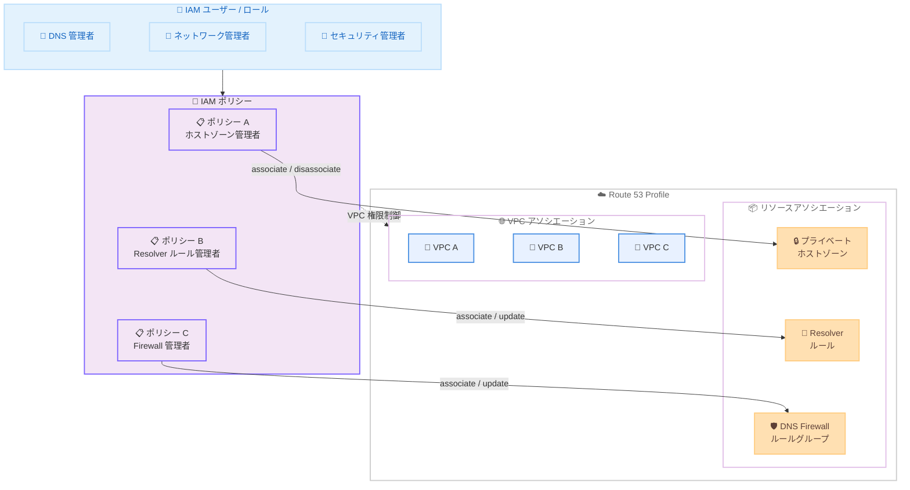

# Amazon Route 53 Profiles - きめ細かな IAM 権限のサポート

**リリース日**: 2026 年 3 月 25 日
**サービス**: Amazon Route 53
**機能**: Route 53 Profiles のきめ細かな IAM 権限 (リソースおよび VPC アソシエーション)

[このアップデートのインフォグラフィックを見る](https://takech9203.github.io/aws-news-summary/20260325-amazon-route-53-profiles-granular-iam.html)

## 概要

Amazon Route 53 Profiles がきめ細かな AWS Identity and Access Management (IAM) 権限をサポートしました。これにより、Profile 内の特定のリソースタイプや VPC アソシエーションに対して、どのユーザーがどの操作を実行できるかを詳細に制御できるようになります。

Route 53 Profiles は、プライベートホストゾーンの関連付け、Resolver ルール、DNS Firewall ルールグループを含む標準的な DNS 構成を定義し、自アカウント内の複数の VPC に適用したり、AWS Resource Access Manager (RAM) を使用して他の AWS アカウントと共有できるサービスです。今回のアップデートにより、管理者は特定の責任を委任しながら、組織全体のセキュリティとガバナンス基準を維持できるようになります。

**アップデート前の課題**

- Route 53 Profiles に対する IAM 権限は粗い粒度でしか設定できず、リソースタイプ別の操作制御が困難だった
- プライベートホストゾーン、Resolver ルール、DNS Firewall ルールグループの管理権限を個別に分離できなかった
- VPC アソシエーションの操作権限を特定のリソースや条件に基づいて制限する手段がなかった

**アップデート後の改善**

- リソースタイプごと (プライベートホストゾーン、Resolver ルール、DNS Firewall ルールグループ) に個別の IAM ポリシーを作成可能になった
- リソース ARN、ホストゾーン名、Resolver ルールドメイン名、DNS Firewall ルールグループの優先度範囲、特定の VPC アソシエーションに基づいて権限を定義可能になった
- 操作レベル (associate、disassociate、update) での権限制御が可能になった

## アーキテクチャ図



IAM ポリシーを使用して、各管理者が Route 53 Profile 内の特定のリソースタイプに対してのみ操作を実行できるよう制御する構成を示しています。

## サービスアップデートの詳細

### 主要機能

1. **リソースタイプ別の操作制御**
   - プライベートホストゾーン、Resolver ルール、DNS Firewall ルールグループごとに個別の IAM ポリシーを作成可能
   - 操作レベル (associate、disassociate、update) で権限を細分化
   - 不要な権限を付与せずに、最小権限の原則に基づいたアクセス制御を実現

2. **条件ベースのアクセス制御**
   - リソース ARN に基づく権限の限定
   - ホストゾーン名や Resolver ルールのドメイン名による条件指定
   - DNS Firewall ルールグループの優先度範囲による制御
   - 特定の VPC アソシエーションに対する権限の制限

3. **VPC アソシエーションの権限管理**
   - 特定の VPC に対するアソシエーション操作を個別に制御
   - Profile と VPC の関連付け・解除を細かく管理
   - マルチアカウント環境でのガバナンスを強化

## 技術仕様

### IAM 条件キーとアクション

| 項目 | 詳細 |
|------|------|
| サポートされるアクション | associate、disassociate、update |
| 対象リソースタイプ | プライベートホストゾーン、Resolver ルール、DNS Firewall ルールグループ、VPC アソシエーション |
| 条件キーの種類 | リソース ARN、ホストゾーン名、ドメイン名、優先度範囲、VPC ID |
| 追加料金 | なし |
| 共有機能 | AWS Resource Access Manager (RAM) によるクロスアカウント共有に対応 |

### IAM ポリシー条件の詳細

| 条件の種類 | 説明 | 使用例 |
|-----------|------|--------|
| リソース ARN | 特定のリソースに対する操作を制限 | 特定のホストゾーンのみ associate を許可 |
| ホストゾーン名 | ホストゾーン名に基づくフィルタリング | `*.example.com` に関連するゾーンのみ操作可能 |
| ドメイン名 | Resolver ルールのドメイン名による制御 | 特定ドメインの Resolver ルールのみ管理可能 |
| 優先度範囲 | DNS Firewall ルールグループの優先度で制限 | 優先度 100-200 の範囲のみ変更可能 |
| VPC アソシエーション | 特定の VPC への操作を制限 | 開発用 VPC のみアソシエーション可能 |

### IAM ポリシー例

```json
{
  "Version": "2012-10-17",
  "Statement": [
    {
      "Effect": "Allow",
      "Action": [
        "route53profiles:AssociateResourceToProfile",
        "route53profiles:DisassociateResourceFromProfile"
      ],
      "Resource": "arn:aws:route53profiles:*:123456789012:profile/*",
      "Condition": {
        "StringEquals": {
          "route53profiles:ResourceType": "AWS::Route53::HostedZone"
        }
      }
    }
  ]
}
```

上記は、プライベートホストゾーンのアソシエーションおよびディスアソシエーション操作のみを許可する IAM ポリシーの例です。

```json
{
  "Version": "2012-10-17",
  "Statement": [
    {
      "Effect": "Allow",
      "Action": [
        "route53profiles:AssociateProfileToVpc",
        "route53profiles:DisassociateProfileFromVpc"
      ],
      "Resource": "arn:aws:route53profiles:*:123456789012:profile/*",
      "Condition": {
        "StringEquals": {
          "ec2:Vpc": "arn:aws:ec2:us-east-1:123456789012:vpc/vpc-0abc1234def56789"
        }
      }
    }
  ]
}
```

上記は、特定の VPC に対するアソシエーション操作のみを許可する IAM ポリシーの例です。

## 設定方法

### 前提条件

1. AWS アカウントを持っていること
2. Route 53 Profiles が利用可能なリージョンを使用していること
3. IAM ポリシーを作成・管理する権限があること
4. Route 53 Profile が作成済みであること

### 手順

#### ステップ 1: 既存の IAM 権限を確認

```bash
aws iam list-attached-user-policies --user-name dns-admin
```

現在のユーザーに付与されている Route 53 Profiles 関連のポリシーを確認します。

#### ステップ 2: きめ細かな IAM ポリシーを作成

```bash
aws iam create-policy \
  --policy-name Route53ProfilesHostedZoneAdmin \
  --policy-document file://hosted-zone-policy.json
```

リソースタイプ別の IAM ポリシーを作成します。上記の例では、プライベートホストゾーンの管理に限定したポリシーを作成しています。

#### ステップ 3: ポリシーを IAM ユーザーまたはロールにアタッチ

```bash
aws iam attach-user-policy \
  --user-name dns-admin \
  --policy-arn arn:aws:iam::123456789012:policy/Route53ProfilesHostedZoneAdmin
```

作成したポリシーを対象の IAM ユーザーまたはロールにアタッチし、権限を適用します。

#### ステップ 4: 権限の動作を検証

```bash
aws route53profiles list-profile-resource-associations \
  --profile-id profile-1234567890
```

設定したポリシーが意図した通りに動作しているか、対象ユーザーで操作を試行して確認します。

## メリット

### ビジネス面

- **ガバナンスの強化**: 組織全体で一貫した DNS 管理権限のガバナンスを確立し、コンプライアンス要件に対応
- **責任の明確な委任**: DNS 管理者、ネットワーク管理者、セキュリティ管理者にそれぞれ適切な権限を付与し、業務効率を向上
- **追加コストなし**: 既存の Route 53 Profiles 利用料金内で利用可能であり、追加の費用が発生しない

### 技術面

- **最小権限の原則**: リソースタイプ、操作レベル、条件に基づいた最小権限の IAM ポリシーを実現
- **マルチアカウント対応**: AWS RAM との組み合わせにより、クロスアカウント環境でもきめ細かなアクセス制御が可能
- **柔軟な条件指定**: ARN、名前、ドメイン、優先度範囲など多様な条件キーによる制御が可能

## デメリット・制約事項

### 制限事項

- Middle East (Bahrain) および Middle East (UAE) リージョンでは利用不可
- IAM ポリシーの条件キーの詳細な仕様は公式ドキュメントで確認が必要
- 既存の IAM ポリシーを使用している場合、新しいきめ細かな権限への移行計画が必要

### 考慮すべき点

- IAM ポリシーの複雑性が増す可能性があるため、ポリシー管理の戦略を事前に検討すること
- 既存のユーザーやロールに付与されている広範な権限を見直し、段階的に細粒度のポリシーに移行することを推奨
- ポリシーの条件が厳しすぎる場合、正当な操作がブロックされる可能性があるため、十分なテストを実施すること

## ユースケース

### ユースケース 1: チーム別の DNS リソース管理権限の分離

**シナリオ**: 大規模な組織で、DNS 管理チームがプライベートホストゾーンを管理し、ネットワークチームが Resolver ルールを管理し、セキュリティチームが DNS Firewall ルールグループを管理する。

**実装例**:
```json
{
  "Version": "2012-10-17",
  "Statement": [
    {
      "Effect": "Allow",
      "Action": [
        "route53profiles:AssociateResourceToProfile",
        "route53profiles:DisassociateResourceFromProfile",
        "route53profiles:UpdateResourceAssociation"
      ],
      "Resource": "*",
      "Condition": {
        "StringEquals": {
          "route53profiles:ResourceType": "AWS::Route53Resolver::ResolverRule"
        }
      }
    }
  ]
}
```

**効果**: 各チームが自身の担当領域のみを操作でき、他チームのリソースへの意図しない変更を防止。

### ユースケース 2: 開発環境と本番環境の VPC アソシエーション分離

**シナリオ**: 開発チームが開発用 VPC への Profile アソシエーションを自由に管理できるが、本番用 VPC への操作は制限する必要がある。

**実装例**:
```json
{
  "Version": "2012-10-17",
  "Statement": [
    {
      "Effect": "Allow",
      "Action": [
        "route53profiles:AssociateProfileToVpc",
        "route53profiles:DisassociateProfileFromVpc"
      ],
      "Resource": "*",
      "Condition": {
        "StringEquals": {
          "ec2:Vpc": "arn:aws:ec2:us-east-1:123456789012:vpc/vpc-dev-1234"
        }
      }
    }
  ]
}
```

**効果**: 開発チームは開発環境で迅速に作業でき、本番環境の DNS 構成は保護される。

### ユースケース 3: DNS Firewall ルールグループの優先度範囲制限

**シナリオ**: セキュリティチーム内で、高優先度 (低い数値) のルールグループはシニアエンジニアのみが管理し、通常優先度のルールグループは全メンバーが管理できるようにする。

**実装例**:
```json
{
  "Version": "2012-10-17",
  "Statement": [
    {
      "Effect": "Allow",
      "Action": [
        "route53profiles:AssociateResourceToProfile"
      ],
      "Resource": "*",
      "Condition": {
        "StringEquals": {
          "route53profiles:ResourceType": "AWS::Route53Resolver::FirewallRuleGroup"
        },
        "NumericGreaterThanEquals": {
          "route53profiles:FirewallRuleGroupPriority": "100"
        }
      }
    }
  ]
}
```

**効果**: 高優先度のファイアウォールルールが不用意に変更されるリスクを低減し、セキュリティポリシーの一貫性を維持。

## 料金

この機能は追加料金なしで利用可能です。Route 53 Profiles が利用可能な全リージョン (Middle East (Bahrain) および Middle East (UAE) を除く) で追加費用なしで使用できます。

| 項目 | 料金 |
|------|------|
| きめ細かな IAM 権限機能 | 無料 (追加料金なし) |
| Route 53 Profiles | 既存の料金体系に準拠 |

## 利用可能リージョン

Route 53 Profiles が利用可能なすべての AWS リージョンで利用可能です。ただし、以下のリージョンは除外されています。

- Middle East (Bahrain) - me-south-1
- Middle East (UAE) - me-central-1

## 関連サービス・機能

- **Amazon Route 53 Profiles**: DNS 構成の標準化と複数 VPC への一括適用を実現するサービス
- **AWS Identity and Access Management (IAM)**: 今回のアップデートで条件キーが拡張され、Profiles リソースへのきめ細かなアクセス制御が可能に
- **AWS Resource Access Manager (RAM)**: Route 53 Profiles をクロスアカウントで共有する際に使用
- **Amazon Route 53 Resolver**: DNS クエリの転送ルールを管理し、Profiles と連携して利用
- **Amazon Route 53 DNS Firewall**: DNS レベルのセキュリティルールグループを管理し、Profiles 経由で VPC に適用

## 参考リンク

- [インフォグラフィック](https://takech9203.github.io/aws-news-summary/20260325-amazon-route-53-profiles-granular-iam.html)
- [公式発表 (What's New)](https://aws.amazon.com/about-aws/whats-new/2026/03/amazon-route-53-profiles-granular-iam/)
- [Amazon Route 53 Profiles ドキュメント](https://docs.aws.amazon.com/Route53/latest/DeveloperGuide/profiles.html)
- [Route 53 料金ページ](https://aws.amazon.com/route53/pricing/)
- [IAM ユーザーガイド](https://docs.aws.amazon.com/IAM/latest/UserGuide/)

## まとめ

Amazon Route 53 Profiles のきめ細かな IAM 権限サポートにより、Profile 内のリソースタイプ別および VPC アソシエーション別に詳細なアクセス制御が可能になりました。プライベートホストゾーン、Resolver ルール、DNS Firewall ルールグループの管理権限を個別に委任できるため、組織のセキュリティとガバナンス基準を維持しながら効率的な DNS 管理を実現できます。追加料金なしで利用可能であるため、既存の Route 53 Profiles ユーザーは IAM ポリシーの見直しと最小権限への移行を検討することを推奨します。
