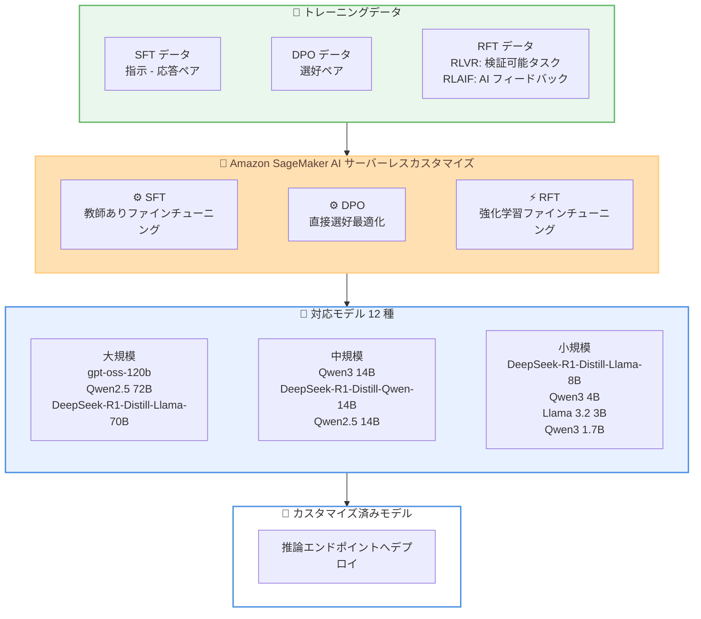

# Amazon SageMaker AI - サーバーレス強化学習ファインチューニングが 12 モデル追加対応

**リリース日**: 2026 年 3 月 25 日
**サービス**: Amazon SageMaker AI
**機能**: Serverless Reinforcement Fine-Tuning for 12 Additional Models

📊 [このアップデートのインフォグラフィックを見る](https://takech9203.github.io/aws-news-summary/20260325-amazon-sagemaker-ai-serverless-additional-models.html)

## 概要

Amazon SageMaker AI のサーバーレスモデルカスタマイズおよび強化学習ファインチューニング (Reinforcement Fine-Tuning) が、新たに 12 のオープンウェイトモデルに対応しました。インフラストラクチャのプロビジョニングや管理を行うことなく、これらのモデルのファインチューニングと評価が可能になります。

今回追加された 12 モデルは、1.5B から 120B パラメータまで幅広いサイズをカバーしており、gpt-oss-120b、Qwen2.5 72B Instruct、DeepSeek-R1-Distill-Llama-70B、Qwen3 14B、DeepSeek-R1-Distill-Qwen-14B、Qwen2.5 14B Instruct、DeepSeek-R1-Distill-Llama-8B、DeepSeek-R1-Distill-Qwen-7B、Qwen3 4B、Meta Llama 3.2 3B Instruct、Qwen3 1.7B、DeepSeek-R1-Distill-Qwen-1.5B が含まれます。SFT、DPO、RFT (RLVR および RLAIF を含む) の各ファインチューニング手法に対応しており、従量課金制で利用できます。

**アップデート前の課題**

- サーバーレスファインチューニングに対応するオープンウェイトモデルの選択肢が限定的だった
- RLVR や RLAIF といった強化学習ベースのファインチューニングを実施するには、クラスタのセットアップやキャパシティプランニング、分散トレーニングの専門知識が必要だった
- DeepSeek-R1 系や Qwen3 系の最新モデルをサーバーレス環境でカスタマイズする手段がなかった

**アップデート後の改善**

- 1.5B から 120B パラメータまでの 12 モデルがサーバーレスファインチューニングに対応し、ユースケースに応じた最適なモデルサイズを選択可能になった
- SFT、DPO に加え、RLVR および RLAIF による強化学習ファインチューニングが、インフラ管理不要で利用可能になった
- 従量課金制により、使用した分だけの支払いでモデルカスタマイズを実行できるようになった

## アーキテクチャ図



トレーニングデータから各ファインチューニング手法を通じて、12 種のオープンウェイトモデルをサーバーレス環境でカスタマイズし、推論エンドポイントにデプロイするまでの流れを示しています。

## サービスアップデートの詳細

### 主要機能

1. **12 モデルのサーバーレスファインチューニング対応**
   - gpt-oss-120b から DeepSeek-R1-Distill-Qwen-1.5B まで、幅広いパラメータサイズのモデルをサポート
   - インフラのプロビジョニングや管理が不要で、すぐにファインチューニングを開始可能
   - 従量課金制により、使用した分だけの支払いで利用可能

2. **強化学習ファインチューニング (RFT)**
   - **RLVR (Reinforcement Learning with Verifiable Rewards)**: コード生成、数学、構造化データ抽出などの検証可能なタスクでモデル精度を向上。正解に基づく報酬シグナルを使用
   - **RLAIF (Reinforcement Learning from AI Feedback)**: AI が生成したフィードバックを使用し、品質と安全性の基準に沿ったモデル動作を実現

3. **複数のファインチューニング手法のサポート**
   - **SFT (Supervised Fine-Tuning)**: 教師ありデータを使用した標準的なファインチューニング
   - **DPO (Direct Preference Optimization)**: 人間の選好データに基づくモデルの最適化
   - **RFT**: 従来の SFT では対応が難しい、複雑なドメイン固有の推論タスクへのアライメント

## 技術仕様

### 対応モデル一覧

| モデル名 | パラメータ数 | ベースモデル系列 |
|----------|-------------|-----------------|
| gpt-oss-120b | 120B | GPT 系 |
| Qwen2.5 72B Instruct | 72B | Qwen |
| DeepSeek-R1-Distill-Llama-70B | 70B | DeepSeek/Llama |
| Qwen3 14B | 14B | Qwen |
| DeepSeek-R1-Distill-Qwen-14B | 14B | DeepSeek/Qwen |
| Qwen2.5 14B Instruct | 14B | Qwen |
| DeepSeek-R1-Distill-Llama-8B | 8B | DeepSeek/Llama |
| DeepSeek-R1-Distill-Qwen-7B | 7B | DeepSeek/Qwen |
| Qwen3 4B | 4B | Qwen |
| Meta Llama 3.2 3B Instruct | 3B | Meta Llama |
| Qwen3 1.7B | 1.7B | Qwen |
| DeepSeek-R1-Distill-Qwen-1.5B | 1.5B | DeepSeek/Qwen |

### ファインチューニング手法の比較

| 手法 | 正式名称 | 主な用途 | データ要件 |
|------|---------|---------|-----------|
| SFT | Supervised Fine-Tuning | 一般的なタスク適応 | 指示 - 応答ペア |
| DPO | Direct Preference Optimization | 選好アライメント | 選好ペアデータ |
| RLVR | Reinforcement Learning with Verifiable Rewards | 検証可能なタスクの精度向上 | 検証関数と評価基準 |
| RLAIF | Reinforcement Learning from AI Feedback | 品質・安全性の制御 | AI フィードバック基準 |

### API 変更履歴

今回のアップデートに関連する API 変更は、調査時点では確認されていません。

## 設定方法

### 前提条件

1. AWS アカウントと SageMaker AI へのアクセス権限
2. 対応リージョン (US East (N. Virginia)、US West (Oregon)、Asia Pacific (Tokyo)、EU (Ireland)) での利用
3. ファインチューニング用のトレーニングデータ (手法に応じた形式)

### 手順

#### ステップ 1: SageMaker コンソールでモデルカスタマイズを開始

SageMaker AI コンソールにアクセスし、モデルカスタマイズセクションからカスタマイズするモデルを選択します。12 の新規対応モデルから、ユースケースに適したモデルを選びます。

#### ステップ 2: ファインチューニング手法の選択

目的に応じたファインチューニング手法を選択します。

- **SFT**: 一般的なタスクへのモデル適応に最適
- **DPO**: モデルの応答品質を人間の選好に合わせる場合に選択
- **RLVR**: コード生成や数学的推論など、正解が検証可能なタスクの精度向上に利用
- **RLAIF**: AI フィードバックに基づく品質・安全性の制御が必要な場合に選択

#### ステップ 3: トレーニングデータの準備とジョブの実行

選択した手法に応じたフォーマットでトレーニングデータを準備し、S3 にアップロードします。ハイパーパラメータを設定後、サーバーレス環境でファインチューニングジョブを実行します。クラスタのセットアップやキャパシティプランニングは不要です。

## メリット

### ビジネス面

- **コスト効率**: 従量課金制により、使用した分だけの支払いでファインチューニングが可能。インフラの固定費が不要
- **迅速な導入**: インフラ管理不要のサーバーレス環境により、ファインチューニングの開始までの時間を大幅に短縮
- **モデル選択の柔軟性**: 1.5B から 120B パラメータまでの幅広いモデルラインナップから、コストと性能のバランスに基づいた最適な選択が可能

### 技術面

- **高度なアライメント手法**: RLVR と RLAIF により、従来の SFT では困難だった複雑な推論タスクへの対応が可能
- **インフラ管理不要**: 分散トレーニングの専門知識やクラスタ管理が不要で、モデルカスタマイズに集中可能
- **最新モデルへのアクセス**: DeepSeek-R1 系、Qwen3 系など、最新のオープンウェイトモデルをすぐに利用可能

## デメリット・制約事項

### 制限事項

- 利用可能リージョンが 4 リージョンに限定されている (US East (N. Virginia)、US West (Oregon)、Asia Pacific (Tokyo)、EU (Ireland))
- サーバーレス環境のため、トレーニングジョブの実行環境に対するきめ細かな制御が制限される可能性がある
- 対応モデルは発表時点の 12 モデルに限定されており、すべてのオープンウェイトモデルが利用できるわけではない

### 考慮すべき点

- ファインチューニング手法の選択により、必要なデータの形式と量が異なるため、事前のデータ準備戦略が重要
- 大規模モデル (120B、72B、70B) のファインチューニングはコストが高くなる可能性があるため、まず小規模モデルで実験することを推奨

## ユースケース

### ユースケース 1: ドメイン固有のコード生成精度向上

**シナリオ**: 社内フレームワークやカスタム API を使用するコード生成タスクにおいて、汎用 LLM では十分な精度が得られない場合に、RLVR を使用してモデルをカスタマイズします。

**実装例**:
```
モデル: DeepSeek-R1-Distill-Llama-70B
手法: RLVR
報酬シグナル: コードの実行結果に基づく正解判定
データ: 社内コードベースのタスクと期待される出力のペア
```

**効果**: コード生成の正確性が向上し、開発者の手動修正コストを削減

### ユースケース 2: カスタマーサポート向け応答品質の最適化

**シナリオ**: カスタマーサポートチャットボットの応答品質と安全性を、RLAIF を使用して自社の品質基準に合わせてカスタマイズします。

**実装例**:
```
モデル: Qwen3 14B
手法: RLAIF
AI フィードバック基準: 正確性、丁寧さ、ブランドガイドライン準拠
```

**効果**: ブランドガイドラインに沿った一貫性のある応答品質を実現し、顧客満足度を向上

### ユースケース 3: コスト効率の高い軽量モデルのカスタマイズ

**シナリオ**: エッジデバイスやレイテンシ要件の厳しい環境向けに、小規模モデルを SFT でカスタマイズして特定タスクの精度を最大化します。

**実装例**:
```
モデル: Qwen3 1.7B または DeepSeek-R1-Distill-Qwen-1.5B
手法: SFT
データ: ドメイン固有の指示 - 応答ペア
```

**効果**: 低コストかつ低レイテンシで、特定タスクに最適化されたモデルを取得

## 料金

SageMaker AI モデルカスタマイズは従量課金制で、使用した分だけの支払いとなります。料金はモデルサイズ、ファインチューニング手法、トレーニング時間によって異なります。

### 料金例

詳細な料金情報は [Amazon SageMaker AI の料金ページ](https://aws.amazon.com/sagemaker/pricing/) (Model Customization タブ) で確認できます。モデルごと、手法ごとの正確な料金はこのページに記載されています。

## 利用可能リージョン

以下の 4 リージョンで利用可能です。

| リージョン名 | リージョンコード |
|-------------|----------------|
| US East (N. Virginia) | us-east-1 |
| US West (Oregon) | us-west-2 |
| Asia Pacific (Tokyo) | ap-northeast-1 |
| EU (Ireland) | eu-west-1 |

## 関連サービス・機能

- **Amazon SageMaker AI モデルカスタマイズ**: 今回のアップデートの基盤となるサーバーレスファインチューニングプラットフォーム
- **Amazon SageMaker AI 推論**: カスタマイズ済みモデルをデプロイして推論を実行するためのサービス
- **Amazon S3**: ファインチューニング用トレーニングデータの保存先

## 参考リンク

- 📊 [インフォグラフィック](https://takech9203.github.io/aws-news-summary/20260325-amazon-sagemaker-ai-serverless-additional-models.html)
- [公式発表 (What's New)](https://aws.amazon.com/about-aws/whats-new/2026/03/amazon-sagemaker-ai-serverless-additional-models/)
- [Amazon SageMaker AI モデルカスタマイズ製品ページ](https://aws.amazon.com/sagemaker/model-customization/)
- [Amazon SageMaker AI 料金ページ](https://aws.amazon.com/sagemaker/pricing/)

## まとめ

Amazon SageMaker AI のサーバーレスファインチューニングが 12 のオープンウェイトモデルに拡大し、RLVR や RLAIF を含む強化学習ファインチューニングがインフラ管理不要で利用可能になりました。特に、検証可能なタスクの精度向上や AI フィードバックによる品質制御が必要な場合に有効です。まず小規模モデルで手法を検証し、段階的に大規模モデルへスケールするアプローチが推奨されます。
