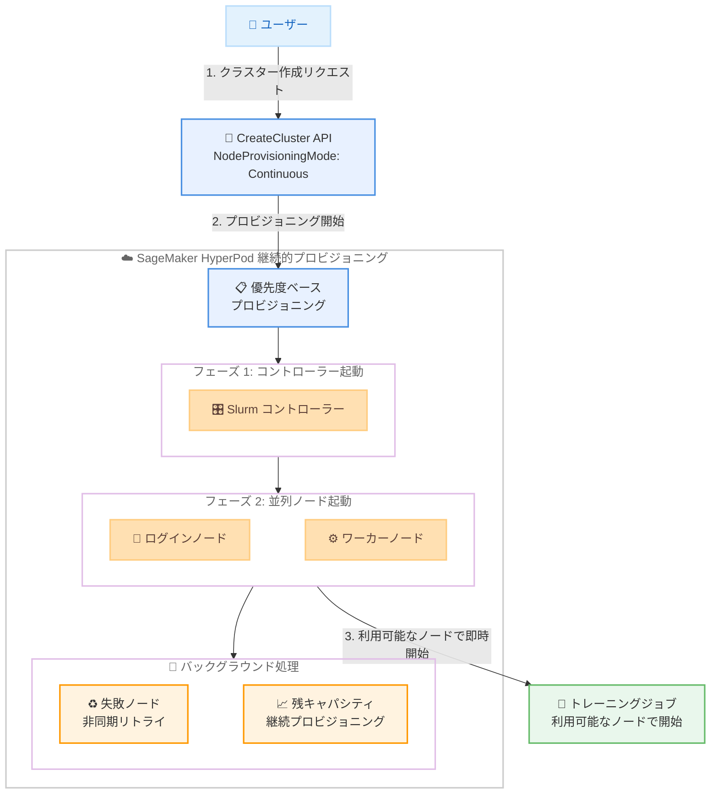

# Amazon SageMaker HyperPod - Slurm クラスター向け継続的プロビジョニング

**リリース日**: 2026 年 3 月 25 日
**サービス**: Amazon SageMaker HyperPod
**機能**: Slurm オーケストレーションクラスターの継続的プロビジョニング

📊 [このアップデートのインフォグラフィックを見る](https://takech9203.github.io/aws-news-summary/20260325-amazon-sagemaker-hyperpod-continuous-provisioning.html)

## 概要

Amazon SageMaker HyperPod が、Slurm オーケストレーションクラスターに対して継続的プロビジョニング機能を提供開始しました。これにより、一部のインスタンスグループのプロビジョニングが完了できない場合でも、クラスター全体の作成やスケーリングが失敗してロールバックされることなく、利用可能なインスタンス上でトレーニングジョブを開始できるようになります。

SageMaker HyperPod は、大規模言語モデル (LLM) や基盤モデル (FM) の開発に向けた耐障害性のある AI/ML クラスターをプロビジョニングするサービスです。今回のアップデートは、大規模クラスターの運用においてキャパシティの確保が課題となるユーザーにとって、トレーニングジョブの開始を大幅に迅速化する重要な改善です。

**アップデート前の課題**

- いずれかのインスタンスグループが完全にプロビジョニングできない場合、クラスター全体の作成またはスケーリング操作が失敗しロールバックされていた
- キャパシティ不足によりクラスター作成が完了するまで、すべてのトレーニングジョブが待機状態になっていた
- 複数のインスタンスグループのスケーリングが逐次的に処理され、時間がかかっていた

**アップデート後の改善**

- 一部のインスタンスが利用可能になった時点で、トレーニングジョブを開始できるようになった
- 残りのキャパシティはバックグラウンドで自動的にプロビジョニングが継続される
- 優先度ベースのプロビジョニングにより、Slurm コントローラーが最初に起動し、ログインノードとワーカーノードが並列で起動される
- 失敗したノードの起動は非同期でリトライされる
- 複数のインスタンスグループにわたる並行かつノンブロッキングなスケーリングが可能になった

## アーキテクチャ図



継続的プロビジョニングでは、CreateCluster API で NodeProvisioningMode を "Continuous" に設定することで、優先度ベースのプロビジョニングが有効になります。Slurm コントローラーが最初に起動され、その後ログインノードとワーカーノードが並列で起動されます。利用可能なノードでトレーニングジョブを即座に開始でき、残りのキャパシティはバックグラウンドで継続的にプロビジョニングされます。

## サービスアップデートの詳細

### 主要機能

1. **優先度ベースのプロビジョニング**
   - Slurm コントローラーノードが最優先で起動される
   - コントローラー起動後、ログインノードとワーカーノードが並列でプロビジョニングされる
   - クラスターの基盤となるコンポーネントから順に確実に起動される

2. **バックグラウンド継続プロビジョニング**
   - 利用可能なインスタンスでクラスターが部分的に稼働を開始する
   - 残りのキャパシティはバックグラウンドで自動的にプロビジョニングが継続される
   - ユーザーの介入なしに、徐々にクラスターが完全な状態に近づく

3. **非同期リトライ機構**
   - 起動に失敗したノードは非同期で自動的にリトライされる
   - 一時的なキャパシティ不足やプロビジョニングエラーに対する耐障害性が向上
   - 手動での再試行操作が不要

4. **並行ノンブロッキングスケーリング**
   - 複数のインスタンスグループにわたるスケーリング操作が並行して実行される
   - 1 つのインスタンスグループのスケーリングが他のグループをブロックしない
   - スケーリング全体の所要時間が短縮される

## 技術仕様

### プロビジョニングモード比較

| 項目 | 従来モード | 継続的プロビジョニング |
|------|-----------|---------------------|
| 部分プロビジョニング失敗時 | クラスター全体がロールバック | 利用可能なノードで稼働開始 |
| ジョブ開始タイミング | 全ノードのプロビジョニング完了後 | 利用可能なノードが揃い次第 |
| スケーリング方式 | 逐次処理 | 並行ノンブロッキング |
| 失敗ノードのリトライ | 手動 | 非同期自動リトライ |
| 設定パラメータ | デフォルト | NodeProvisioningMode: Continuous |

### API 設定

CreateCluster API の `NodeProvisioningMode` パラメータを `Continuous` に設定して有効化します。

```json
{
  "ClusterName": "my-hyperpod-cluster",
  "InstanceGroups": [
    {
      "InstanceGroupName": "controller-group",
      "InstanceType": "ml.m5.xlarge",
      "InstanceCount": 1,
      "LifeCycleConfig": {
        "SourceS3Uri": "s3://my-bucket/lifecycle-scripts/",
        "OnCreate": "on-create-controller.sh"
      },
      "ExecutionRole": "arn:aws:iam::123456789012:role/HyperPodRole"
    },
    {
      "InstanceGroupName": "worker-group",
      "InstanceType": "ml.p5.48xlarge",
      "InstanceCount": 16,
      "LifeCycleConfig": {
        "SourceS3Uri": "s3://my-bucket/lifecycle-scripts/",
        "OnCreate": "on-create-worker.sh"
      },
      "ExecutionRole": "arn:aws:iam::123456789012:role/HyperPodRole"
    }
  ],
  "NodeProvisioningMode": "Continuous"
}
```

## 設定方法

### 前提条件

1. AWS アカウントに SageMaker HyperPod へのアクセス権限がある
2. Slurm オーケストレーションを使用するクラスター構成が準備されている
3. 必要な IAM ロールとライフサイクルスクリプトが設定済みである

### 手順

#### ステップ 1: クラスター構成の準備

```bash
# クラスター構成ファイルを作成
cat > cluster-config.json << 'EOF'
{
  "ClusterName": "my-hyperpod-cluster",
  "InstanceGroups": [
    {
      "InstanceGroupName": "controller-group",
      "InstanceType": "ml.m5.xlarge",
      "InstanceCount": 1,
      "LifeCycleConfig": {
        "SourceS3Uri": "s3://my-bucket/lifecycle-scripts/",
        "OnCreate": "on-create-controller.sh"
      },
      "ExecutionRole": "arn:aws:iam::123456789012:role/HyperPodRole"
    },
    {
      "InstanceGroupName": "worker-group",
      "InstanceType": "ml.p5.48xlarge",
      "InstanceCount": 16,
      "LifeCycleConfig": {
        "SourceS3Uri": "s3://my-bucket/lifecycle-scripts/",
        "OnCreate": "on-create-worker.sh"
      },
      "ExecutionRole": "arn:aws:iam::123456789012:role/HyperPodRole"
    }
  ],
  "NodeProvisioningMode": "Continuous"
}
EOF
```

クラスター構成ファイルを作成し、`NodeProvisioningMode` を `Continuous` に設定します。インスタンスグループには Slurm コントローラーとワーカーノードを定義します。

#### ステップ 2: クラスターの作成

```bash
# 継続的プロビジョニングを有効にしてクラスターを作成
aws sagemaker create-cluster --cli-input-json file://cluster-config.json
```

CreateCluster API を使用してクラスターを作成します。継続的プロビジョニングが有効なため、一部のインスタンスが利用可能になった時点でクラスターが部分的に稼働を開始します。

#### ステップ 3: プロビジョニング状況の確認

```bash
# クラスターの状態を確認
aws sagemaker describe-cluster --cluster-name my-hyperpod-cluster

# ノードグループの詳細を確認
aws sagemaker list-cluster-nodes --cluster-name my-hyperpod-cluster
```

DescribeCluster API でクラスター全体の状態を確認し、ListClusterNodes API で各ノードのプロビジョニング状況を確認します。バックグラウンドでプロビジョニングが継続されている間も、利用可能なノードの状態を監視できます。

## メリット

### ビジネス面

- **トレーニング開始時間の短縮**: 全ノードのプロビジョニング完了を待たずに、利用可能なノードでトレーニングジョブを開始できるため、プロジェクトのタイムラインが改善される
- **キャパシティ制約への対応力向上**: キャパシティ不足が発生しても運用が継続できるため、ビジネスの中断リスクが低減される
- **運用コストの最適化**: アイドル状態のリソースを削減し、利用可能なリソースを即座にトレーニングに活用できる

### 技術面

- **耐障害性の向上**: 部分的なプロビジョニング失敗がクラスター全体に影響しなくなり、システムの可用性が向上する
- **自動リカバリ**: 失敗したノードの非同期リトライにより、手動介入なしでクラスターが完全な状態に回復する
- **スケーリングの効率化**: 複数インスタンスグループの並行スケーリングにより、クラスターの拡張時間が短縮される

## デメリット・制約事項

### 制限事項

- Slurm オーケストレーションクラスターのみが対象であり、Amazon EKS オーケストレーションには現時点で適用されない可能性がある
- 継続的プロビジョニング中は、クラスターのノード数が設定値に達するまで部分的な状態で稼働するため、ジョブのスケジューリングに注意が必要
- CreateCluster API を使用した設定が必要であり、コンソールからの設定方法については公式ドキュメントの確認が必要

### 考慮すべき点

- 部分プロビジョニング状態でトレーニングジョブを実行する場合、ジョブの並列度やデータ分散戦略の調整が必要になる場合がある
- バックグラウンドでのプロビジョニング中にノードが追加されるため、Slurm のジョブスケジューラー設定の最適化が推奨される
- 継続的プロビジョニングのリトライ動作やタイムアウトの詳細仕様については、公式ドキュメントで確認が必要

## ユースケース

### ユースケース 1: 大規模 LLM トレーニングの迅速な開始

**シナリオ**: 数百台の GPU インスタンスを必要とする大規模 LLM トレーニングで、一部のインスタンスのキャパシティが一時的に不足している状況。

**実装例**:
```json
{
  "ClusterName": "llm-training-cluster",
  "InstanceGroups": [
    {
      "InstanceGroupName": "controller",
      "InstanceType": "ml.m5.xlarge",
      "InstanceCount": 1
    },
    {
      "InstanceGroupName": "gpu-workers",
      "InstanceType": "ml.p5.48xlarge",
      "InstanceCount": 128
    }
  ],
  "NodeProvisioningMode": "Continuous"
}
```

**効果**: 128 台中 96 台が先に利用可能になった場合、96 台でトレーニングを開始し、残り 32 台はバックグラウンドでプロビジョニングされる。従来は 128 台全てが揃うまでトレーニングを開始できなかった。

### ユースケース 2: マルチインスタンスグループの効率的なスケーリング

**シナリオ**: 異なるインスタンスタイプで構成された複数のインスタンスグループを持つクラスターのスケーリング。

**実装例**:
```json
{
  "InstanceGroups": [
    {
      "InstanceGroupName": "training-workers",
      "InstanceType": "ml.p5.48xlarge",
      "InstanceCount": 64
    },
    {
      "InstanceGroupName": "data-processing",
      "InstanceType": "ml.m5.4xlarge",
      "InstanceCount": 16
    }
  ],
  "NodeProvisioningMode": "Continuous"
}
```

**効果**: トレーニングワーカーとデータ処理ノードが並行してスケーリングされ、一方のグループのプロビジョニング遅延が他方をブロックしない。

### ユースケース 3: キャパシティ変動が大きいリージョンでの運用

**シナリオ**: 人気の GPU インスタンスタイプのキャパシティが変動しやすいリージョンで、安定したクラスター運用を行いたい。

**実装例**:
1. `NodeProvisioningMode` を `Continuous` に設定してクラスターを作成
2. 利用可能なキャパシティでクラスターが部分的に稼働開始
3. バックグラウンドで非同期リトライにより残りのノードが順次追加される
4. キャパシティが解放されるたびに自動的にノードがプロビジョニングされる

**効果**: キャパシティの変動に対して自動的に適応し、手動での再試行やクラスター再作成が不要になる。

## 料金

継続的プロビジョニング機能自体に追加料金は発生しません。通常の SageMaker HyperPod の料金体系が適用され、プロビジョニングされたインスタンスの使用時間に基づいて課金されます。

詳細については [Amazon SageMaker 料金ページ](https://aws.amazon.com/sagemaker/pricing/) を参照してください。

## 利用可能リージョン

Amazon SageMaker HyperPod がサポートされているすべての AWS リージョンで利用可能です。詳細なリージョンリストは [AWS リージョンとサービス](https://aws.amazon.com/about-aws/global-infrastructure/regional-product-services/) を参照してください。

## 関連サービス・機能

- **Amazon SageMaker HyperPod タスクガバナンス**: クラスター内のリソース配分を細かく制御する機能
- **Slurm Workload Manager**: HyperPod クラスターのジョブスケジューリングとリソース管理を行うオーケストレーター
- **Amazon EC2 キャパシティリザベーション**: GPU インスタンスのキャパシティを事前に確保するための機能

## 参考リンク

- 📊 [インフォグラフィック](https://takech9203.github.io/aws-news-summary/20260325-amazon-sagemaker-hyperpod-continuous-provisioning.html)
- [公式発表 (What's New)](https://aws.amazon.com/about-aws/whats-new/2026/03/amazon-sagemaker-hyperpod-continuous-provisioning/)
- [ドキュメント - SageMaker HyperPod クラスター管理](https://docs.aws.amazon.com/sagemaker/latest/dg/sagemaker-hyperpod-operate.html)
- [Amazon SageMaker 料金ページ](https://aws.amazon.com/sagemaker/pricing/)

## まとめ

Amazon SageMaker HyperPod の継続的プロビジョニング機能は、Slurm オーケストレーションクラスターにおけるキャパシティ確保の課題を大幅に改善するアップデートです。部分的なキャパシティでもトレーニングジョブを即座に開始でき、残りのノードがバックグラウンドで自動的にプロビジョニングされるため、大規模 AI/ML トレーニングの効率が向上します。大規模な GPU クラスターを運用する組織は、CreateCluster API で `NodeProvisioningMode` を `Continuous` に設定し、この機能を活用することを推奨します。
