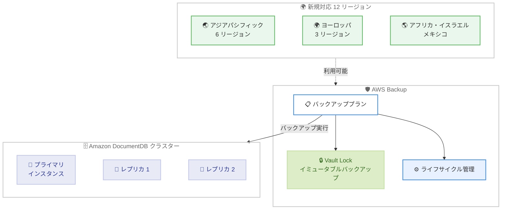

# AWS Backup - Amazon DocumentDB のサポートを 12 リージョンに拡大

**リリース日**: 2026 年 3 月 25 日
**サービス**: AWS Backup
**機能**: Amazon DocumentDB のバックアップサポートのリージョン拡大

:bar_chart: [このアップデートのインフォグラフィックを見る](https://takech9203.github.io/aws-news-summary/20260325-aws-backup-amazon-documentdb-regions.html)

## 概要

AWS Backup が Amazon DocumentDB (MongoDB 互換) のサポートを新たに 12 の AWS リージョンに拡大した。今回追加されたリージョンは、アジアパシフィック (マレーシア、タイ、大阪、香港、ジャカルタ、メルボルン)、ヨーロッパ (ストックホルム、スペイン、チューリッヒ)、アフリカ (ケープタウン)、イスラエル (テルアビブ)、メキシコ (セントラル) である。

この拡張により、これらのリージョンで Amazon DocumentDB クラスターに対するポリシーベースのデータ保護とリカバリが利用可能になった。AWS Backup は、フルマネージドかつコスト効率の高いバックアップソリューションであり、DocumentDB を含む AWS サービス全体のデータ保護を一元化・自動化する。

**アップデート前の課題**

- これら 12 のリージョンでは AWS Backup による DocumentDB クラスターの保護ができなかった
- 該当リージョンのユーザーは DocumentDB データの一元的なバックアップ管理を利用できず、ネイティブのスナップショット機能に依存する必要があった
- データレジデンシー要件がある地域では、他リージョンへのバックアップ移行に制約があった

**アップデート後の改善**

- 12 の追加リージョンで DocumentDB クラスターのポリシーベースバックアップが可能になった
- 既存のバックアッププランに DocumentDB クラスターを追加するだけで保護を開始できる
- AWS Backup Vault Lock によるイミュータブルバックアップや自動ライフサイクル管理を新しいリージョンで活用できるようになった

## アーキテクチャ図



AWS Backup のバックアッププランから DocumentDB クラスターを保護する構成を示す。新たに 12 リージョンで Vault Lock によるイミュータブルバックアップと自動ライフサイクル管理が利用可能になった。

## サービスアップデートの詳細

### 主要機能

1. **12 リージョンへの拡大**
   - アジアパシフィック: マレーシア、タイ、大阪、香港、ジャカルタ、メルボルン
   - ヨーロッパ: ストックホルム、スペイン、チューリッヒ
   - アフリカ: ケープタウン
   - 中東: イスラエル (テルアビブ)
   - アメリカ: メキシコ (セントラル)

2. **ポリシーベースのデータ保護**
   - バックアッププランを作成し、DocumentDB クラスターに適用
   - スケジュールに基づく自動バックアップの実行
   - ライフサイクルポリシーによるバックアップの保持期間管理

3. **一元的なバックアップ管理**
   - AWS Backup コンソールから DocumentDB を含む複数サービスのバックアップを統合管理
   - AWS Backup Audit Manager によるコンプライアンス管理
   - クロスリージョン・クロスアカウントバックアップのサポート

## 技術仕様

### 新規対応リージョン一覧

| リージョン | リージョンコード |
|------|------|
| アジアパシフィック (マレーシア) | ap-southeast-5 |
| アジアパシフィック (タイ) | ap-southeast-7 |
| アジアパシフィック (大阪) | ap-northeast-3 |
| アジアパシフィック (香港) | ap-east-1 |
| アジアパシフィック (ジャカルタ) | ap-southeast-3 |
| アジアパシフィック (メルボルン) | ap-southeast-4 |
| ヨーロッパ (ストックホルム) | eu-north-1 |
| ヨーロッパ (スペイン) | eu-south-2 |
| ヨーロッパ (チューリッヒ) | eu-central-2 |
| アフリカ (ケープタウン) | af-south-1 |
| イスラエル (テルアビブ) | il-central-1 |
| メキシコ (セントラル) | mx-central-1 |

## 設定方法

### 前提条件

1. 対象リージョンに Amazon DocumentDB クラスターが構築済みであること
2. AWS Backup サービスが有効化されていること
3. 適切な IAM 権限が設定されていること

### 手順

#### ステップ 1: バックアッププランの作成

```bash
aws backup create-backup-plan \
  --backup-plan '{
    "BackupPlanName": "DocumentDBBackupPlan",
    "Rules": [
      {
        "RuleName": "DailyBackup",
        "TargetBackupVaultName": "Default",
        "ScheduleExpression": "cron(0 5 ? * * *)",
        "Lifecycle": {
          "DeleteAfterDays": 35
        }
      }
    ]
  }' \
  --region ap-northeast-3
```

新規対応リージョン (この例では大阪) で DocumentDB クラスター用のバックアッププランを作成する。日次バックアップを実行し、35 日間保持する設定である。

#### ステップ 2: DocumentDB クラスターをバックアッププランに割り当て

```bash
aws backup create-backup-selection \
  --backup-plan-id <backup-plan-id> \
  --backup-selection '{
    "SelectionName": "DocumentDBSelection",
    "IamRoleArn": "arn:aws:iam::<account-id>:role/service-role/AWSBackupDefaultServiceRole",
    "Resources": [
      "arn:aws:rds:ap-northeast-3:<account-id>:cluster:<cluster-name>"
    ]
  }' \
  --region ap-northeast-3
```

DocumentDB クラスターの ARN を指定してバックアッププランに割り当てる。

#### ステップ 3: バックアップの確認

```bash
aws backup list-backup-jobs \
  --by-resource-type DocumentDB \
  --region ap-northeast-3
```

バックアップジョブのステータスを確認する。

## メリット

### ビジネス面

- **データレジデンシー対応**: アジアパシフィック、ヨーロッパ、アフリカ、中東、メキシコの新リージョンでデータ保護規制に準拠したバックアップが可能になった
- **運用効率の向上**: 既存のバックアッププランに DocumentDB クラスターを追加するだけで保護を開始できる
- **コンプライアンス強化**: AWS Backup Audit Manager と組み合わせたバックアップポリシーの一元管理が実現できる

### 技術面

- **ポリシーベースの自動化**: スケジュールに基づく自動バックアップにより手動作業を排除できる
- **一元管理**: AWS Backup コンソールから DocumentDB を含む複数サービスのバックアップを統合管理できる
- **データ保護の強化**: Vault Lock によりバックアップデータの改ざんや削除を防止できる

## デメリット・制約事項

### 制限事項

- 今回のアップデートは 12 の追加リージョンのみが対象であり、すべてのリージョンで新規に利用可能になったわけではない
- DocumentDB のバックアップはクラスター単位で取得され、個別のコレクション単位でのバックアップには対応していない
- AWS Backup によるバックアップは DocumentDB ネイティブの自動スナップショットとは別に管理される

### 考慮すべき点

- 既存の DocumentDB ネイティブバックアップと AWS Backup の両方を使用する場合、バックアップの重複によるストレージコスト増加に注意が必要
- クロスリージョンコピーを設定する場合、データ転送コストが発生する

## ユースケース

### ユースケース 1: グローバル展開企業のバックアップ一元管理

**シナリオ**: 複数のアジアパシフィックリージョンに DocumentDB クラスターを展開している企業が、統一されたバックアップポリシーを適用したい。

**実装例**:
```bash
# タグベースでの一括バックアップ割り当て
aws backup create-backup-selection \
  --backup-plan-id <plan-id> \
  --backup-selection '{
    "SelectionName": "global-docdb-selection",
    "IamRoleArn": "arn:aws:iam::<account-id>:role/service-role/AWSBackupDefaultServiceRole",
    "ListOfTags": [
      {
        "ConditionType": "STRINGEQUALS",
        "ConditionKey": "backup-policy",
        "ConditionValue": "standard"
      }
    ]
  }'
```

**効果**: タグベースの選択により、新しいリージョンに DocumentDB クラスターを追加しても自動的にバックアップポリシーが適用される。

### ユースケース 2: データレジデンシー要件への対応

**シナリオ**: ヨーロッパでサービスを提供する企業が、ストックホルムリージョンで運用する DocumentDB クラスターのデータを EU 内に保持する必要がある。

**実装例**:
```bash
# Vault Lock の設定
aws backup put-backup-vault-lock-configuration \
  --backup-vault-name compliance-vault \
  --min-retention-days 365 \
  --max-retention-days 2555 \
  --changeable-for-days 3 \
  --region eu-north-1
```

**効果**: Vault Lock により最低 365 日間のバックアップ保持が強制され、データレジデンシー要件に準拠しつつイミュータブルなバックアップを確保できる。

### ユースケース 3: 日本国内での災害復旧戦略

**シナリオ**: 東京リージョンで本番環境の DocumentDB を運用し、大阪リージョンを DR サイトとして活用している組織が、両リージョンで一貫したバックアップ管理を行いたい。

**実装例**:
```bash
# クロスリージョンコピーを含むバックアッププラン
aws backup create-backup-plan \
  --backup-plan '{
    "BackupPlanName": "docdb-dr-plan",
    "Rules": [
      {
        "RuleName": "daily-with-copy",
        "TargetBackupVaultName": "Default",
        "ScheduleExpression": "cron(0 5 ? * * *)",
        "Lifecycle": {
          "DeleteAfterDays": 35
        },
        "CopyActions": [
          {
            "DestinationBackupVaultArn": "arn:aws:backup:ap-northeast-3:<account-id>:backup-vault:dr-vault",
            "Lifecycle": {
              "DeleteAfterDays": 35
            }
          }
        ]
      }
    ]
  }' \
  --region ap-northeast-1
```

**効果**: 東京リージョンのバックアップが自動的に大阪リージョンにコピーされ、リージョン障害時の復旧に備えることができる。

## 料金

AWS Backup の料金は、バックアップストレージ、リストア、クロスリージョンデータ転送に基づいて発生する。DocumentDB クラスターのバックアップについても、標準の AWS Backup 料金体系が適用される。

### 料金例

| 項目 | 料金 (東京リージョン参考) |
|--------|------------------|
| ウォームバックアップストレージ | $0.05/GB-月 |
| コールドバックアップストレージ | $0.01/GB-月 |
| リストア | $0.02/GB |

※ 料金はリージョンにより異なる。最新の料金は [AWS Backup 料金ページ](https://aws.amazon.com/backup/pricing/) を参照。

## 利用可能リージョン

今回新たに追加された 12 リージョンに加え、既存の対応リージョンで利用可能。完全なリージョンリストは [AWS Backup 機能の利用可能状況ページ](https://docs.aws.amazon.com/aws-backup/latest/devguide/backup-feature-availability.html) を参照。

## 関連サービス・機能

- **Amazon DocumentDB**: MongoDB 互換のフルマネージドドキュメントデータベースサービス
- **AWS Backup Vault Lock**: バックアップデータのイミュータブル保護機能
- **AWS Backup Audit Manager**: バックアップのコンプライアンス監視とレポート
- **AWS Organizations**: 組織全体でのバックアップポリシーの一元管理

## 参考リンク

- :bar_chart: [インフォグラフィック](https://takech9203.github.io/aws-news-summary/20260325-aws-backup-amazon-documentdb-regions.html)
- [公式発表 (What's New)](https://aws.amazon.com/about-aws/whats-new/2026/03/aws-backup-amazon-documentdb-regions/)
- [AWS Backup ドキュメント](https://docs.aws.amazon.com/aws-backup/latest/devguide/whatisbackup.html)
- [AWS Backup 料金ページ](https://aws.amazon.com/backup/pricing/)
- [Amazon DocumentDB ドキュメント](https://docs.aws.amazon.com/documentdb/latest/developerguide/what-is.html)
- [AWS Backup 機能の利用可能状況](https://docs.aws.amazon.com/aws-backup/latest/devguide/backup-feature-availability.html)

## まとめ

AWS Backup の Amazon DocumentDB サポートが 12 リージョン (アジアパシフィック 6 リージョン、ヨーロッパ 3 リージョン、アフリカ、イスラエル、メキシコ) に拡大されたことで、グローバルに展開する組織がより多くのリージョンで一貫したバックアップポリシーを適用できるようになった。特に大阪リージョンが対象に含まれている点は、日本国内での DR 構成を検討する組織にとって重要である。該当リージョンで DocumentDB を運用しているユーザーは、既存のバックアッププランに DocumentDB クラスターを追加するか、新しいバックアッププランを作成して保護を開始することを推奨する。
