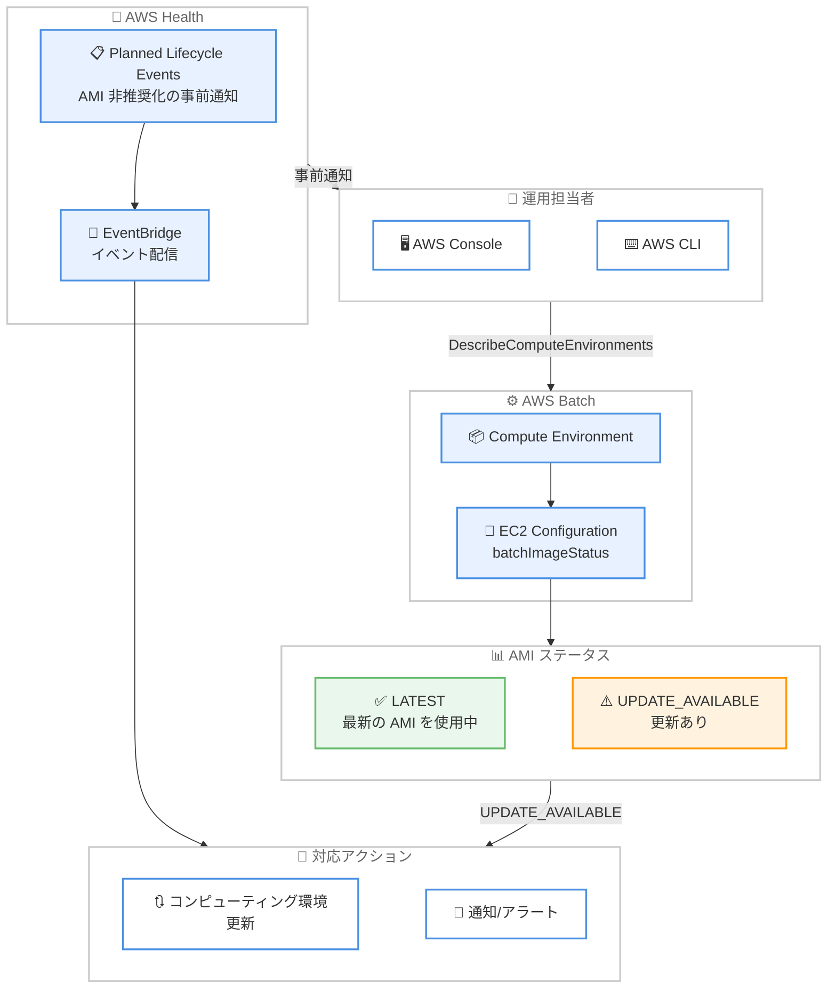

# AWS Batch - AMI ステータス表示と AWS Health 計画済みライフサイクルイベント対応

**リリース日**: 2026 年 3 月 25 日
**サービス**: AWS Batch
**機能**: AMI ステータスインジケーターおよび AWS Health Planned Lifecycle Events

📊 [このアップデートのインフォグラフィックを見る](https://takech9203.github.io/aws-news-summary/20260325-aws-batch-ami-status-aws-health.html)

## 概要

AWS Batch がコンピューティング環境の運用可視性を向上させる 2 つの新機能を提供開始した。1 つ目は、コンピューティング環境の AMI ステータスインジケーターで、Batch が提供するデフォルト Amazon Machine Image (AMI) が最新かどうかを確認できるようになった。2 つ目は、AWS Health Planned Lifecycle Events との統合で、AMI の非推奨化などの予定された変更について事前通知を受け取れるようになった。

これらの機能により、AWS Batch ユーザーはコンピューティング環境のセキュリティとコンプライアンスの状態をプロアクティブに管理できるようになる。AMI のステータスが `LATEST` か `UPDATE_AVAILABLE` かを API レスポンスで直接確認でき、手動での AMI バージョン追跡が不要になる。

**アップデート前の課題**

- コンピューティング環境で使用している AMI が最新かどうかを確認する標準的な方法がなく、手動でバージョンを比較する必要があった
- AMI の非推奨化や変更に関する事前通知がなく、予期しないタイミングで影響を受ける可能性があった
- セキュリティパッチやバグ修正を含む新しい AMI のリリースを見逃すリスクがあった

**アップデート後の改善**

- `DescribeComputeEnvironments` API で `batchImageStatus` フィールドを確認するだけで、AMI が最新かどうかを即座に判断できるようになった
- AWS Health Planned Lifecycle Events により、AMI の非推奨化などの変更スケジュールを事前に把握できるようになった
- 運用のベストプラクティスに基づいたプロアクティブな AMI 管理ワークフローを構築できるようになった

## アーキテクチャ図



AWS Batch の AMI ステータス確認と AWS Health イベント通知の全体的なフローを示す。運用担当者は API 経由で AMI ステータスを直接確認でき、AWS Health からの計画済みイベント通知を EventBridge 経由で受け取ることができる。

## サービスアップデートの詳細

### 主要機能

1. **AMI ステータスインジケーター**
   - `Ec2Configuration` に読み取り専用の `batchImageStatus` フィールドが追加された
   - ステータス値は `LATEST` (最新の AMI を使用中) または `UPDATE_AVAILABLE` (更新が利用可能) の 2 種類
   - `DescribeComputeEnvironments` API のレスポンスで確認可能
   - `CreateComputeEnvironment` および `UpdateComputeEnvironment` のレスポンスにも含まれる

2. **AWS Health Planned Lifecycle Events**
   - AWS Batch のリソースに影響する予定された変更の事前通知を提供
   - AMI の非推奨化スケジュールなどのライフサイクルイベントを追跡可能
   - AWS Health Dashboard および EventBridge 経由でイベントを受信可能
   - 計画的なメンテナンスウィンドウの設定に活用できる

3. **運用ベストプラクティスの支援**
   - AMI の更新状況を継続的にモニタリングする自動化ワークフローの構築が可能
   - セキュリティパッチ適用の SLA 管理に活用できる
   - コンプライアンス監査のエビデンスとして AMI ステータスを記録できる

## 技術仕様

### batchImageStatus フィールド

| 項目 | 詳細 |
|------|------|
| フィールド名 | `batchImageStatus` |
| データ型 | String |
| 値 | `LATEST`, `UPDATE_AVAILABLE` |
| 格納場所 | `computeResources.ec2Configuration[].batchImageStatus` |
| アクセス権限 | 読み取り専用 |

### API 変更履歴

| 日付 | サービス | 変更内容 |
|------|----------|----------|
| 2026/03/23 | [AWS Batch](https://awsapichanges.com/archive/changes/b18efc-batch.html) | 3 updated methods - `Ec2Configuration` に `batchImageStatus` フィールドを追加。対象 API: `CreateComputeEnvironment`, `DescribeComputeEnvironments`, `UpdateComputeEnvironment` |

### IAM 権限

```json
{
    "Version": "2012-10-17",
    "Statement": [
        {
            "Effect": "Allow",
            "Action": [
                "batch:DescribeComputeEnvironments"
            ],
            "Resource": "*"
        },
        {
            "Effect": "Allow",
            "Action": [
                "health:DescribeEvents",
                "health:DescribeEventDetails"
            ],
            "Resource": "*"
        }
    ]
}
```

## 設定方法

### 前提条件

1. AWS Batch のマネージド型コンピューティング環境が作成済みであること
2. AWS CLI v2 が最新バージョンに更新されていること
3. 必要な IAM 権限が付与されていること

### 手順

#### ステップ 1: AMI ステータスの確認

```bash
aws batch describe-compute-environments \
    --compute-environments my-compute-env \
    --query 'computeEnvironments[].computeResources.ec2Configuration[].{imageType:imageType,status:batchImageStatus}' \
    --output table
```

コンピューティング環境の EC2 設定から AMI のイメージタイプとステータスを取得する。`batchImageStatus` が `UPDATE_AVAILABLE` の場合、新しい AMI が利用可能であることを示す。

#### ステップ 2: コンピューティング環境の AMI 更新

```bash
aws batch update-compute-environment \
    --compute-environment my-compute-env \
    --compute-resources '{"updateToLatestImageVersion": true}'
```

`updateToLatestImageVersion` を `true` に設定して、コンピューティング環境を最新の AMI に更新する。この操作により、次回のインスタンス起動時から新しい AMI が使用される。

#### ステップ 3: AWS Health イベントの EventBridge ルール設定

```bash
aws events put-rule \
    --name "batch-health-lifecycle-events" \
    --event-pattern '{
        "source": ["aws.health"],
        "detail-type": ["AWS Health Event"],
        "detail": {
            "service": ["BATCH"],
            "eventTypeCategory": ["plannedChange"]
        }
    }'
```

AWS Health の計画済みライフサイクルイベントを検知する EventBridge ルールを作成する。これにより、AMI の非推奨化などの計画的な変更について事前通知を受け取れるようになる。

## メリット

### ビジネス面

- **セキュリティコンプライアンスの向上**: AMI のステータスを常に把握することで、セキュリティパッチ適用の SLA を遵守しやすくなる
- **ダウンタイムの削減**: 計画済みイベントの事前通知により、メンテナンスウィンドウを適切に計画し、予期しない中断を回避できる
- **運用コストの削減**: 手動での AMI バージョン追跡作業が不要になり、運用チームのリソースを他の業務に充当できる

### 技術面

- **自動化の容易さ**: API レスポンスにステータスが含まれるため、CI/CD パイプラインやモニタリングスクリプトへの組み込みが簡単
- **EventBridge 統合**: 既存の EventBridge ルールやターゲットと組み合わせて、柔軟な通知・自動修復ワークフローを構築可能
- **追加設定不要**: 既存の API に新しいフィールドが追加される形のため、別途の有効化手順は不要

## デメリット・制約事項

### 制限事項

- `batchImageStatus` は読み取り専用フィールドであり、ユーザーが直接値を設定することはできない
- AMI ステータスは Batch が提供するデフォルト AMI にのみ適用され、カスタム AMI (`imageIdOverride` 使用時) のステータスは対象外の可能性がある
- AWS Health イベントの通知タイミングは AWS 側のスケジュールに依存する

### 考慮すべき点

- `UPDATE_AVAILABLE` が表示された場合でも、実行中のジョブに即座に影響はないが、セキュリティの観点から計画的な更新が推奨される
- コンピューティング環境の更新時にはインスタンスの入れ替えが発生するため、実行中のジョブへの影響を `updatePolicy` で制御する必要がある

## ユースケース

### ユースケース 1: セキュリティパッチの自動検知と通知

**シナリオ**: セキュリティチームが全コンピューティング環境の AMI ステータスを定期的に監視し、更新が必要な環境を検知したい。

**実装例**:
```bash
#!/bin/bash
# 全コンピューティング環境の AMI ステータスを確認
ENVS=$(aws batch describe-compute-environments \
    --query 'computeEnvironments[?computeResources.ec2Configuration[?batchImageStatus==`UPDATE_AVAILABLE`]].computeEnvironmentName' \
    --output text)

if [ -n "$ENVS" ]; then
    echo "AMI update available for: $ENVS"
    # SNS 通知などの処理を追加
fi
```

**効果**: セキュリティパッチ適用の遅延を最小限に抑え、コンプライアンス要件を満たすことができる。

### ユースケース 2: 計画的な AMI ローテーション

**シナリオ**: 大規模なバッチ処理環境で、ジョブの実行スケジュールに合わせて AMI の更新を計画的に行いたい。

**実装例**:
```python
import boto3

batch = boto3.client('batch')
health = boto3.client('health')

# AMI ステータスの確認
response = batch.describe_compute_environments(
    computeEnvironments=['production-ce']
)

for ce in response['computeEnvironments']:
    for ec2_config in ce['computeResources']['ec2Configuration']:
        if ec2_config.get('batchImageStatus') == 'UPDATE_AVAILABLE':
            # メンテナンスウィンドウ中に更新を実行
            batch.update_compute_environment(
                computeEnvironment=ce['computeEnvironmentName'],
                computeResources={
                    'updateToLatestImageVersion': True
                }
            )
```

**効果**: ジョブの実行に影響を与えることなく、計画的に AMI を最新バージョンに維持できる。

### ユースケース 3: AWS Health イベントによる自動対応ワークフロー

**シナリオ**: AMI の非推奨化通知を受けた際に、自動的に対応チケットを作成し、関係者に通知したい。

**実装例**:
```json
{
    "source": ["aws.health"],
    "detail-type": ["AWS Health Event"],
    "detail": {
        "service": ["BATCH"],
        "eventTypeCategory": ["plannedChange"]
    }
}
```

**効果**: AWS Health からの通知を EventBridge 経由で Lambda に連携し、Jira チケットの自動作成や Slack 通知を実行することで、対応漏れを防止できる。

## 料金

AMI ステータスインジケーターおよび AWS Health Planned Lifecycle Events の利用に追加料金は発生しない。これらの機能は AWS Batch の標準機能として提供される。

### 関連する料金

| 項目 | 料金 |
|------|------|
| AWS Batch | 追加料金なし (コンピューティングリソースの料金のみ) |
| AWS Health | 追加料金なし |
| EventBridge | カスタムイベントバスを使用する場合、イベント配信料金が発生 |

## 利用可能リージョン

AWS Batch が利用可能なすべての AWS リージョンで提供される。

## 関連サービス・機能

- **AWS Health**: コンピューティング環境に影響する計画済み変更の通知元サービス
- **Amazon EventBridge**: Health イベントの配信とルーティングに使用し、自動化ワークフローを構築
- **AWS Systems Manager**: AMI の管理やパッチ適用の自動化に活用可能
- **Amazon EC2 Image Builder**: カスタム AMI のビルドパイプラインとの連携に活用可能

## 参考リンク

- 📊 [インフォグラフィック](https://takech9203.github.io/aws-news-summary/20260325-aws-batch-ami-status-aws-health.html)
- [公式発表 (What's New)](https://aws.amazon.com/about-aws/whats-new/2026/03/aws-batch-ami-status-aws-health/)
- [AWS Batch ドキュメント - Compute environment parameters](https://docs.aws.amazon.com/batch/latest/userguide/compute_environment_parameters.html)
- [AWS Health ドキュメント](https://docs.aws.amazon.com/health/latest/ug/what-is-aws-health.html)
- [AWS Batch 料金ページ](https://aws.amazon.com/batch/pricing/)
- [API 変更履歴 - AWS Batch AMI Visibility](https://awsapichanges.com/archive/changes/b18efc-batch.html)

## まとめ

AWS Batch に AMI ステータスインジケーターと AWS Health Planned Lifecycle Events が追加されたことで、コンピューティング環境の AMI 管理がより透明かつプロアクティブに行えるようになった。特にセキュリティパッチの適用状況を API で直接確認できる点は、コンプライアンス要件の厳しい環境で大きな価値がある。既存のコンピューティング環境で即座に利用可能なため、`DescribeComputeEnvironments` API を使って現在の AMI ステータスを確認し、EventBridge ルールを設定して計画済みイベントの通知を受け取ることを推奨する。
