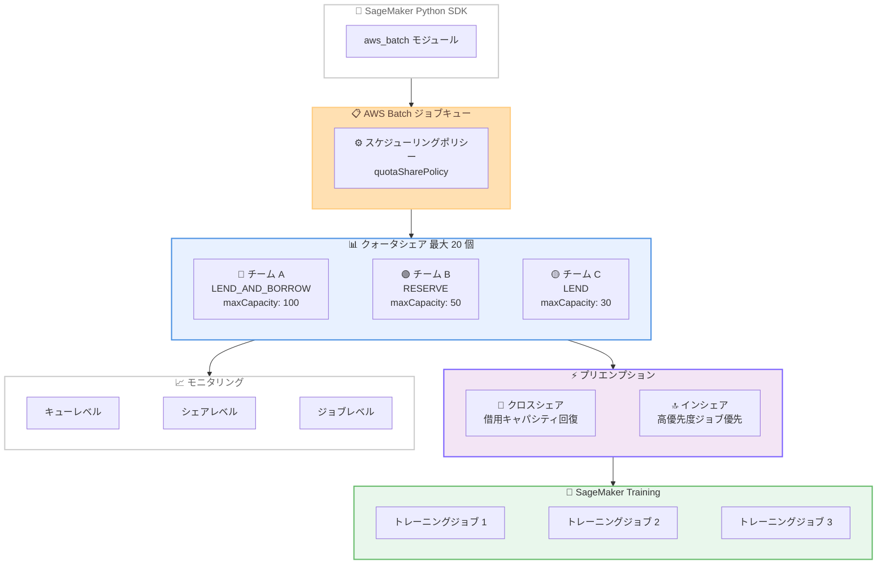

# AWS Batch - SageMaker Training ジョブ向けクォータ管理とプリエンプション

**リリース日**: 2026 年 3 月 25 日
**サービス**: AWS Batch
**機能**: Quota Management and Preemption for SageMaker Training Jobs

📊 [このアップデートのインフォグラフィックを見る](https://takech9203.github.io/aws-news-summary/20260325-aws-batch-quota-management-preemption-sagemaker.html)

## 概要

AWS Batch が SageMaker Training ジョブ向けにクォータ管理とジョブプリエンプション機能をサポートしました。ジョブキューごとに最大 20 個のクォータシェアを作成し、仮想キューとして専用のキャパシティ制限と設定可能なリソース共有戦略を持たせることができます。

この機能により、管理者はチームやプロジェクト間で共有コンピュートリソースを効率的に配分し、優先度に基づくプリエンプションを通じてリソースの最適利用を実現できます。クォータシェアレベルでの自動クロスシェアプリエンプション (借用キャパシティの回復) とインシェアプリエンプション (高優先度ジョブの即時実行) の両方に対応しています。SageMaker Python SDK の aws_batch モジュールとも統合されています。

**アップデート前の課題**

- SageMaker Training ジョブのリソース配分をチームやプロジェクト単位で細かく制御する手段が限られていた
- 高優先度のトレーニングジョブを即座に実行するために、低優先度ジョブを自動的にプリエンプトする仕組みがなかった
- 借用されたキャパシティを自動的に回復するメカニズムが存在しなかった

**アップデート後の改善**

- ジョブキューごとに最大 20 個のクォータシェアを作成し、仮想キューとしてキャパシティ制限を設定可能になった
- RESERVE、LEND、LEND_AND_BORROW の 3 つのリソース共有戦略を選択可能になった
- クロスシェアプリエンプションとインシェアプリエンプションにより、リソースの効率的な再配分が自動化された
- キュー、クォータシェア、ジョブレベルの粒度でキャパシティを監視可能になった

## アーキテクチャ図



SageMaker Python SDK からジョブを投入し、AWS Batch のクォータシェアを通じてリソース配分とプリエンプションが管理され、SageMaker Training ジョブとして実行される全体の流れを示しています。

## サービスアップデートの詳細

### 主要機能

1. **クォータシェアによるリソース配分**
   - ジョブキューごとに最大 20 個のクォータシェアを作成可能
   - 各クォータシェアに専用のキャパシティ制限 (maxCapacity) を設定
   - 仮想キューとして機能し、チームやプロジェクトごとの独立したリソース管理を実現

2. **リソース共有戦略**
   - **RESERVE**: キャパシティを予約し、他のシェアへの貸出を行わない
   - **LEND**: 未使用キャパシティを他のシェアに貸出可能
   - **LEND_AND_BORROW**: 未使用キャパシティの貸出と、他シェアからの借用の両方が可能。borrowLimit でバースト上限を制御

3. **プリエンプション機能**
   - **クロスシェアプリエンプション**: 他のシェアに貸し出されたキャパシティを自動回復。借用者のジョブを停止して元のシェアにキャパシティを返還
   - **インシェアプリエンプション**: 同一シェア内で高優先度ジョブが低優先度ジョブをプリエンプト。preemptionConfiguration で有効化/無効化を切り替え
   - **プリエンプションリトライ**: preemptionRetriesBeforeTermination でプリエンプトされたジョブの再試行回数を設定可能

4. **スケジューリングポリシーの拡張**
   - quotaSharePolicy の追加。idleResourceAssignmentStrategy (FIFO) によるアイドルリソースの割当戦略を設定可能

## 技術仕様

### 新規 API

| API | 説明 |
|-----|------|
| CreateQuotaShare | クォータシェアを作成。キャパシティ制限、共有戦略、プリエンプション設定を指定 |
| DescribeQuotaShare | クォータシェアの詳細情報を取得 |
| UpdateQuotaShare | クォータシェアのキャパシティ制限や共有戦略を更新 |
| DeleteQuotaShare | クォータシェアを削除 |
| ListQuotaShares | ジョブキューに関連するクォータシェアの一覧を取得 |
| UpdateServiceJob | サービスジョブのスケジューリング優先度を更新 |

### 更新された API

| API | 変更内容 |
|-----|----------|
| CreateSchedulingPolicy | quotaSharePolicy パラメータの追加 |
| UpdateSchedulingPolicy | quotaSharePolicy パラメータの追加 |
| DescribeSchedulingPolicies | quotaSharePolicy レスポンスフィールドの追加 |
| SubmitServiceJob | quotaShareName、preemptionConfiguration パラメータの追加 |
| DescribeServiceJob | quotaShareName、preemptionConfiguration、preemptionSummary の追加 |
| ListServiceJobs | quotaShareName フィルタの追加 |
| GetJobQueueSnapshot | frontOfQuotaShares、quotaShareUtilization の追加 |

### リソース共有戦略

| 戦略 | 動作 | ユースケース |
|------|------|-------------|
| RESERVE | キャパシティを専有。貸出・借用なし | ミッションクリティカルなワークロード |
| LEND | 未使用分を他シェアに貸出。借用は不可 | 柔軟なリソース活用を許容するチーム |
| LEND_AND_BORROW | 貸出と借用の両方が可能。borrowLimit で上限設定 | バーストキャパシティが必要なチーム |

### API 変更履歴

| 日付 | サービス | 変更内容 |
|------|----------|----------|
| 2026/03/19 | [AWS Batch](https://awsapichanges.com/archive/changes/9a8fcc-batch.html) | 6 new 7 updated methods - クォータ管理、リソース共有戦略、優先度ベースのプリエンプションをサポート |

### クォータシェア作成例

```json
{
  "quotaShareName": "team-ml-training",
  "jobQueue": "sagemaker-training-queue",
  "capacityLimits": [
    {
      "maxCapacity": 100,
      "capacityUnit": "VCPU"
    }
  ],
  "resourceSharingConfiguration": {
    "strategy": "LEND_AND_BORROW",
    "borrowLimit": 150
  },
  "preemptionConfiguration": {
    "inSharePreemption": "ENABLED"
  },
  "state": "ENABLED"
}
```

## 設定方法

### 前提条件

1. AWS アカウントと AWS Batch への適切な IAM アクセス権限
2. SageMaker Training ジョブを実行可能な環境
3. AWS CLI v2 または AWS SDK の最新バージョン、または SageMaker Python SDK

### 手順

#### ステップ 1: スケジューリングポリシーの作成

```bash
# クォータシェアポリシーを含むスケジューリングポリシーを作成
aws batch create-scheduling-policy \
  --name quota-share-scheduling-policy \
  --quota-share-policy '{
    "idleResourceAssignmentStrategy": "FIFO"
  }'
```

クォータシェアのアイドルリソース割当戦略を FIFO に設定したスケジューリングポリシーを作成します。

#### ステップ 2: クォータシェアの作成

```bash
# チーム A 用のクォータシェアを作成
aws batch create-quota-share \
  --quota-share-name team-a-share \
  --job-queue sagemaker-training-queue \
  --capacity-limits '[{"maxCapacity": 100, "capacityUnit": "VCPU"}]' \
  --resource-sharing-configuration '{
    "strategy": "LEND_AND_BORROW",
    "borrowLimit": 150
  }' \
  --preemption-configuration '{"inSharePreemption": "ENABLED"}' \
  --state ENABLED
```

チーム A 向けに最大 100 vCPU のキャパシティを持つクォータシェアを作成します。LEND_AND_BORROW 戦略により、未使用キャパシティの貸出と最大 150 vCPU までの借用が可能です。

#### ステップ 3: SageMaker Training ジョブの投入

```bash
# クォータシェアを指定してサービスジョブを投入
aws batch submit-service-job \
  --job-name my-training-job \
  --job-queue sagemaker-training-queue \
  --service-job-type SAGEMAKER_TRAINING \
  --quota-share-name team-a-share \
  --scheduling-priority 100 \
  --preemption-configuration '{"preemptionRetriesBeforeTermination": 3}' \
  --service-request-payload file://training-job-config.json
```

クォータシェア team-a-share にジョブを投入します。スケジューリング優先度を 100 に設定し、プリエンプト時の再試行回数を 3 回に設定しています。

#### ステップ 4: キャパシティ使用率の確認

```bash
# クォータシェアごとのキャパシティ使用率を確認
aws batch get-job-queue-snapshot \
  --job-queue sagemaker-training-queue \
  --query 'queueUtilization.quotaShareUtilization'
```

ジョブキューのスナップショットからクォータシェアごとのキャパシティ使用率を確認します。

## メリット

### ビジネス面

- **コスト最適化**: リソース共有戦略により未使用キャパシティを他チームに貸出可能で、リソースの無駄を削減
- **公平なリソース配分**: チームやプロジェクトごとにキャパシティ上限を設定し、特定チームによるリソース占有を防止
- **SLA の確保**: RESERVE 戦略とプリエンプション機能により、重要なトレーニングジョブの実行を保証

### 技術面

- **柔軟なリソース管理**: 3 種類の共有戦略と borrowLimit によるきめ細かなリソース制御
- **自動リカバリ**: クロスシェアプリエンプションによる借用キャパシティの自動回復
- **多段階モニタリング**: キュー、クォータシェア、ジョブの 3 レベルでのキャパシティ可視化

## デメリット・制約事項

### 制限事項

- クォータシェアは現時点で SageMaker Training ジョブキューでのみ利用可能
- ジョブキューあたり最大 20 個のクォータシェアに制限
- プリエンプトされたジョブは最初からやり直しとなるため、長時間実行ジョブではチェックポイント設計が重要

### 考慮すべき点

- プリエンプション設計には、ジョブの優先度設計とチーム間のリソース配分ポリシーの事前合意が必要
- LEND_AND_BORROW 戦略の borrowLimit 値の設定には、実際のワークロードパターンの分析が前提

## ユースケース

### ユースケース 1: マルチチーム ML トレーニング環境

**シナリオ**: 複数の ML チームが共有の SageMaker Training インフラを利用しており、チームごとにリソース上限を設定しつつ、未使用リソースの有効活用を行いたい。

**実装例**:
```bash
# チーム A: 大規模モデルトレーニング - 借用可能
aws batch create-quota-share \
  --quota-share-name ml-team-a \
  --job-queue shared-training-queue \
  --capacity-limits '[{"maxCapacity": 200, "capacityUnit": "VCPU"}]' \
  --resource-sharing-configuration '{"strategy": "LEND_AND_BORROW", "borrowLimit": 300}'

# チーム B: 推論モデル評価 - 貸出のみ
aws batch create-quota-share \
  --quota-share-name ml-team-b \
  --job-queue shared-training-queue \
  --capacity-limits '[{"maxCapacity": 100, "capacityUnit": "VCPU"}]' \
  --resource-sharing-configuration '{"strategy": "LEND"}'
```

**効果**: チーム A はバースト時に最大 300 vCPU まで利用でき、チーム B の未使用リソースを自動的に活用できます。チーム B がリソースを必要とした場合、クロスシェアプリエンプションにより自動的にキャパシティが回復されます。

### ユースケース 2: 本番/実験ワークロードの優先度管理

**シナリオ**: 本番モデルの再トレーニングジョブと実験的なトレーニングジョブが混在する環境で、本番ジョブを常に優先実行したい。

**実装例**:
```bash
# 本番用クォータシェア - リソースを予約
aws batch create-quota-share \
  --quota-share-name production \
  --job-queue training-queue \
  --capacity-limits '[{"maxCapacity": 150, "capacityUnit": "VCPU"}]' \
  --resource-sharing-configuration '{"strategy": "RESERVE"}' \
  --preemption-configuration '{"inSharePreemption": "ENABLED"}'

# 実験用クォータシェア - 余剰リソースを活用
aws batch create-quota-share \
  --quota-share-name experiment \
  --job-queue training-queue \
  --capacity-limits '[{"maxCapacity": 50, "capacityUnit": "VCPU"}]' \
  --resource-sharing-configuration '{"strategy": "LEND_AND_BORROW", "borrowLimit": 200}'
```

**効果**: 本番ジョブは 150 vCPU が常に確保され、実験ジョブはアイドル時に最大 200 vCPU まで利用可能です。本番側の需要が増加した際は、実験ジョブが自動的にプリエンプトされます。

### ユースケース 3: コスト配分とチャージバック

**シナリオ**: 組織内の部門ごとに ML トレーニングコストを正確に配分し、使用量ベースのチャージバックを実施したい。

**実装例**:
```bash
# 各部門のクォータシェア使用量を取得
aws batch get-job-queue-snapshot \
  --job-queue org-training-queue \
  --query 'queueUtilization.quotaShareUtilization.topCapacityUtilization[*].{share:quotaShareName,usage:capacityUsage}'

# 特定のクォータシェアのジョブ一覧を取得
aws batch list-service-jobs \
  --job-queue org-training-queue \
  --filters name=QUOTA_SHARE_NAME,values=dept-research
```

**効果**: クォータシェア単位でキャパシティ使用量を定量的に把握し、部門ごとの正確なコスト配分とチャージバックを実現できます。

## 料金

クォータ管理機能は AWS Batch の標準料金に含まれており、追加料金は発生しません。AWS Batch 自体には追加料金はなく、ジョブの実行に使用する AWS リソース (SageMaker Training インスタンスなど) に対してのみ課金されます。

## 利用可能リージョン

AWS Batch が利用可能なすべての AWS リージョンで提供されています。

## 関連サービス・機能

- **Amazon SageMaker Training**: クォータ管理の対象となる ML トレーニングサービス
- **AWS Batch フェアシェアスケジューリング**: 既存のリソース配分機能。クォータシェアはより細かな制御を提供
- **SageMaker Python SDK**: aws_batch モジュールを通じたプログラマティックなジョブ投入とクォータ管理

## 参考リンク

- 📊 [インフォグラフィック](https://takech9203.github.io/aws-news-summary/20260325-aws-batch-quota-management-preemption-sagemaker.html)
- [公式発表 (What's New)](https://aws.amazon.com/about-aws/whats-new/2026/03/aws-batch-quota-management-preemption-sagemaker/)
- [API 変更履歴](https://awsapichanges.com/archive/changes/9a8fcc-batch.html)
- [ドキュメント: AWS Batch Quota Shares](https://docs.aws.amazon.com/batch/latest/userguide/quota-shares.html)
- [料金ページ](https://aws.amazon.com/batch/pricing/)

## まとめ

AWS Batch の SageMaker Training ジョブ向けクォータ管理とプリエンプション機能により、マルチチーム環境での ML トレーニングリソースの配分と優先度管理が大幅に改善されます。RESERVE、LEND、LEND_AND_BORROW の 3 つの共有戦略とクロスシェア/インシェアプリエンプションを組み合わせることで、リソースの効率的な利用と重要ジョブの実行保証を両立できます。ML トレーニングワークロードを運用しているチームは、クォータシェアの設計とプリエンプションポリシーの策定から着手することを推奨します。
