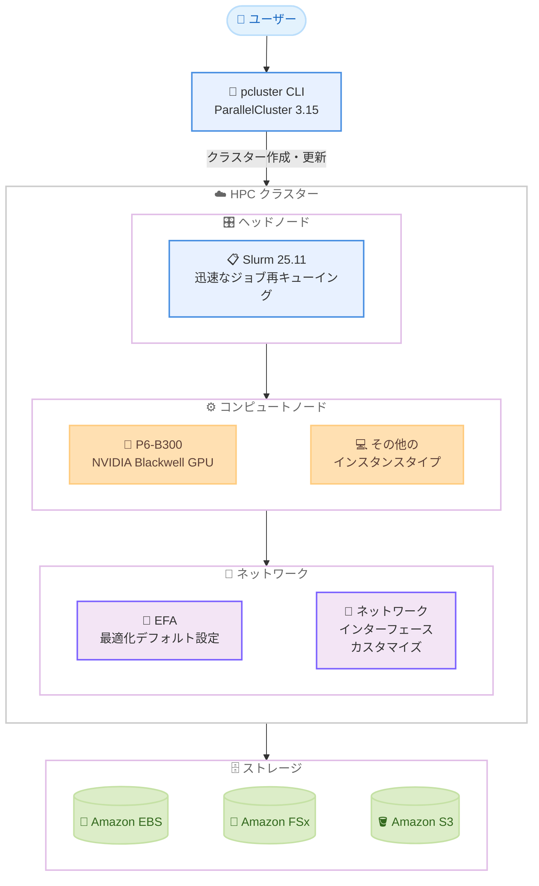

# AWS ParallelCluster 3.15 - P6-B300 サポートと Slurm 25.11 アップグレード

**リリース日**: 2026 年 3 月 25 日
**サービス**: AWS ParallelCluster
**機能**: P6-B300 インスタンスタイプサポート、Slurm 25.11 アップグレード

📊 [このアップデートのインフォグラフィックを見る](https://takech9203.github.io/aws-news-summary/20260325-aws-parallelcluster-p6-b300-slurm.html)

## 概要

AWS ParallelCluster 3.15 が一般提供開始されました。今回のリリースでは、NVIDIA Blackwell GPU アーキテクチャを搭載した P6-B300 インスタンスタイプのサポートが追加され、Slurm ワークロードマネージャーがバージョン 25.11 にアップグレードされています。これにより、最新の GPU インフラストラクチャ上で AI/ML および HPC ワークロードを実行できるようになります。

AWS ParallelCluster は、AWS 上で HPC クラスターを運用するためのオープンソースのクラスター管理ツールです。研究開発部門や IT 管理者が、科学技術計算やエンジニアリングワークロードを大規模に実行するための弾力的にスケーリングする HPC クラスターを自動的かつ安全にプロビジョニングできます。今回のアップデートは、最先端の GPU コンピューティング性能を必要とするユーザーにとって重要な改善です。

**アップデート前の課題**

- P6-B300 インスタンスタイプが ParallelCluster でサポートされておらず、最新の NVIDIA Blackwell GPU を HPC クラスターで利用できなかった
- Slurm の旧バージョンでは、ジョブの迅速な再キューイング機能が利用できなかった
- EFA ネットワーク設定のデフォルト値が最適化されておらず、手動での調整が必要だった
- 大規模クラスターでの密結合ワークロードのパフォーマンスに改善の余地があった

**アップデート後の改善**

- P6-B300 インスタンスタイプが ParallelCluster で利用可能になり、NVIDIA Blackwell GPU 上で AI/ML および HPC ワークロードを実行できるようになった
- Slurm 25.11 の迅速なジョブ再キューイング機能により、障害発生時のジョブ復旧が高速化された
- EFA ネットワーク設定のデフォルト値が改善され、ネットワークインターフェースのカスタマイズもサポートされた
- クラスター更新の信頼性が向上し、タグの更新も中断なしで実行可能になった
- 大規模クラスターでの密結合ワークロードのパフォーマンスが向上した

## アーキテクチャ図



AWS ParallelCluster 3.15 のアーキテクチャを示しています。ユーザーは pcluster CLI を通じてクラスターを作成・管理し、ヘッドノード上の Slurm 25.11 が P6-B300 を含むコンピュートノードのジョブスケジューリングを行います。EFA による最適化されたネットワーク設定がノード間通信を高速化します。

## サービスアップデートの詳細

### 主要機能

1. **P6-B300 インスタンスタイプサポート**
   - NVIDIA Blackwell GPU アーキテクチャを搭載した最新のインスタンスタイプを HPC クラスターで利用可能
   - 高度な AI/ML トレーニングおよび推論ワークロードに対応
   - 大規模な科学技術シミュレーションやエンジニアリング計算にも活用可能

2. **Slurm 25.11 へのアップグレード**
   - 迅速なジョブ再キューイング機能の追加により、ノード障害時のジョブ復旧が高速化
   - ジョブスケジューリングの効率が向上
   - 最新の Slurm エコシステムとの互換性を確保

3. **EFA ネットワーク設定の改善**
   - ネットワーク設定のデフォルト値が最適化され、初期設定での性能が向上
   - ネットワークインターフェースのカスタマイズがサポートされ、ワークロードに応じた柔軟な設定が可能
   - 密結合ワークロードのノード間通信性能が改善

4. **クラスター管理の改善**
   - クラスター更新の信頼性が向上し、更新時のエラーリスクが低減
   - クラスタータグの更新が中断なしで実行可能になり、運用中のタグ管理が容易に
   - 大規模クラスターでの密結合ワークロードのパフォーマンスが全体的に向上

## 技術仕様

### P6-B300 インスタンスタイプ

| 項目 | 詳細 |
|------|------|
| GPU アーキテクチャ | NVIDIA Blackwell |
| 主な用途 | AI/ML トレーニング・推論、HPC |
| ネットワーク | EFA 対応 |
| ParallelCluster バージョン | 3.15 以降 |

### Slurm バージョン比較

| 項目 | 旧バージョン | Slurm 25.11 |
|------|-------------|-------------|
| ジョブ再キューイング | 標準速度 | 迅速な再キューイング対応 |
| ParallelCluster 対応 | 3.14 以前 | 3.15 以降 |

### クラスター設定例

```yaml
Region: us-east-1
Image:
  Os: alinux2023
HeadNode:
  InstanceType: m6i.xlarge
  Networking:
    SubnetId: subnet-xxxxxxxx
  Ssh:
    KeyName: my-key-pair
Scheduling:
  Scheduler: slurm
  SlurmQueues:
    - Name: gpu-queue
      ComputeResources:
        - Name: p6-b300
          InstanceType: p6-b300.48xlarge
          MinCount: 0
          MaxCount: 16
          Efa:
            Enabled: true
      Networking:
        SubnetIds:
          - subnet-xxxxxxxx
        PlacementGroup:
          Enabled: true
```

## 設定方法

### 前提条件

1. AWS ParallelCluster CLI 3.15 以降がインストールされていること
2. 適切な IAM 権限を持つ AWS アカウントがあること
3. P6-B300 インスタンスが利用可能なリージョンであること
4. VPC、サブネット、キーペアが事前に設定されていること

### 手順

#### ステップ 1: ParallelCluster CLI のアップグレード

```bash
# ParallelCluster CLI を最新バージョンにアップグレード
pip install aws-parallelcluster --upgrade

# バージョンを確認
pcluster version
```

ParallelCluster CLI をバージョン 3.15 以降にアップグレードします。`pcluster version` コマンドでインストールされたバージョンを確認できます。

#### ステップ 2: クラスター設定ファイルの作成

```bash
# クラスター設定ファイルを作成
cat > cluster-config.yaml << 'EOF'
Region: us-east-1
Image:
  Os: alinux2023
HeadNode:
  InstanceType: m6i.xlarge
  Networking:
    SubnetId: subnet-xxxxxxxx
  Ssh:
    KeyName: my-key-pair
Scheduling:
  Scheduler: slurm
  SlurmQueues:
    - Name: gpu-queue
      ComputeResources:
        - Name: p6-b300
          InstanceType: p6-b300.48xlarge
          MinCount: 0
          MaxCount: 16
          Efa:
            Enabled: true
      Networking:
        SubnetIds:
          - subnet-xxxxxxxx
        PlacementGroup:
          Enabled: true
EOF
```

P6-B300 インスタンスタイプを使用するコンピュートキューを定義した設定ファイルを作成します。EFA を有効化し、プレイスメントグループを設定することで、密結合ワークロードのパフォーマンスを最適化します。

#### ステップ 3: クラスターの作成と確認

```bash
# クラスターを作成
pcluster create-cluster --cluster-name my-hpc-cluster \
  --cluster-configuration cluster-config.yaml

# クラスターの状態を確認
pcluster describe-cluster --cluster-name my-hpc-cluster

# クラスターのインスタンス一覧を確認
pcluster describe-compute-fleet --cluster-name my-hpc-cluster
```

`pcluster create-cluster` コマンドでクラスターを作成します。作成が完了すると、Slurm 25.11 が自動的にセットアップされ、P6-B300 インスタンスが利用可能になります。

## メリット

### ビジネス面

- **最新 GPU による競争力向上**: NVIDIA Blackwell GPU を活用することで、AI/ML モデルのトレーニング時間を短縮し、研究開発サイクルを加速できる
- **運用の簡素化**: EFA ネットワーク設定のデフォルト最適化やタグの中断なし更新により、クラスター管理の運用負荷が軽減される
- **障害復旧の迅速化**: Slurm 25.11 の迅速なジョブ再キューイングにより、ノード障害時のダウンタイムが短縮され、計算リソースの有効活用率が向上する

### 技術面

- **高性能コンピューティングの強化**: P6-B300 の NVIDIA Blackwell GPU により、大規模な分散トレーニングやシミュレーションのスループットが向上する
- **ネットワーク性能の最適化**: EFA 設定のデフォルト改善とカスタマイズサポートにより、ノード間通信のレイテンシが低減される
- **クラスター更新の信頼性向上**: 更新プロセスの信頼性改善により、本番環境のクラスター更新がより安全に実行できる

## デメリット・制約事項

### 制限事項

- P6-B300 インスタンスは利用可能なリージョンが限定されている可能性がある
- P6-B300 インスタンスのキャパシティは需要が高く、確保が困難な場合がある
- Slurm 25.11 へのアップグレードに伴い、既存のカスタム Slurm 設定の互換性確認が必要

### 考慮すべき点

- 既存のクラスターを 3.15 にアップグレードする場合、Slurm バージョンの変更による影響を事前にテスト環境で確認することが推奨される
- P6-B300 インスタンスの料金は高額であるため、ワークロードの要件に応じたインスタンスタイプの選択が重要
- ネットワークインターフェースのカスタマイズは、EFA の動作に影響する可能性があるため、変更前にドキュメントの確認が必要

## ユースケース

### ユースケース 1: 大規模言語モデルの分散トレーニング

**シナリオ**: 数十億パラメータの大規模言語モデルを、最新の GPU インフラストラクチャ上で効率的にトレーニングしたい。

**実装例**:
```yaml
Scheduling:
  Scheduler: slurm
  SlurmQueues:
    - Name: llm-training
      ComputeResources:
        - Name: p6-b300-nodes
          InstanceType: p6-b300.48xlarge
          MinCount: 0
          MaxCount: 64
          Efa:
            Enabled: true
      Networking:
        SubnetIds:
          - subnet-xxxxxxxx
        PlacementGroup:
          Enabled: true
```

**効果**: NVIDIA Blackwell GPU の高い演算性能と EFA による低レイテンシ通信により、分散トレーニングのスループットが大幅に向上する。Slurm 25.11 の迅速な再キューイングにより、ノード障害時のトレーニング再開も高速化される。

### ユースケース 2: 計算流体力学シミュレーション

**シナリオ**: 大規模な CFD シミュレーションを密結合ワークロードとして実行し、高いノード間通信性能が必要。

**実装例**:
```yaml
Scheduling:
  Scheduler: slurm
  SlurmQueues:
    - Name: cfd-simulation
      ComputeResources:
        - Name: gpu-compute
          InstanceType: p6-b300.48xlarge
          MinCount: 8
          MaxCount: 32
          Efa:
            Enabled: true
      Networking:
        SubnetIds:
          - subnet-xxxxxxxx
        PlacementGroup:
          Enabled: true
```

**効果**: 改善された EFA ネットワークデフォルト設定と大規模クラスターでの密結合ワークロード性能向上により、シミュレーション実行時間が短縮される。

### ユースケース 3: AI 推論パイプラインの構築

**シナリオ**: 複数の AI モデルを使用した推論パイプラインを HPC クラスター上で運用し、必要に応じてスケールしたい。

**実装例**:
```yaml
Scheduling:
  Scheduler: slurm
  SlurmQueues:
    - Name: inference-queue
      ComputeResources:
        - Name: p6-b300-inference
          InstanceType: p6-b300.48xlarge
          MinCount: 0
          MaxCount: 8
          Efa:
            Enabled: true
      Networking:
        SubnetIds:
          - subnet-xxxxxxxx
Tags:
  - Key: Environment
    Value: production
  - Key: Team
    Value: ml-inference
```

**効果**: P6-B300 の高い推論性能により、複雑な AI モデルの推論レイテンシが低減される。クラスタータグの中断なし更新により、運用中のリソース管理やコスト配分の変更も容易に実行できる。

## 料金

AWS ParallelCluster 自体は無料のオープンソースツールであり、追加料金は発生しません。料金は、クラスターで使用する AWS リソース (EC2 インスタンス、EBS ボリューム、S3 ストレージなど) に対して発生します。

P6-B300 インスタンスの料金は、リージョンと使用形態 (オンデマンド、リザーブド、スポット) によって異なります。

詳細については [Amazon EC2 料金ページ](https://aws.amazon.com/ec2/pricing/) および [AWS ParallelCluster ドキュメント](https://docs.aws.amazon.com/parallelcluster/latest/ug/what-is-aws-parallelcluster.html) を参照してください。

## 利用可能リージョン

AWS ParallelCluster 3.15 は、ParallelCluster がサポートされているすべてのリージョンで利用可能です。ただし、P6-B300 インスタンスタイプの利用可能性はリージョンによって異なります。最新のリージョン情報については [AWS リージョンとサービス](https://aws.amazon.com/about-aws/global-infrastructure/regional-product-services/) を参照してください。

## 関連サービス・機能

- **Amazon EC2 P6-B300 インスタンス**: NVIDIA Blackwell GPU を搭載した最新の GPU インスタンスタイプ
- **Elastic Fabric Adapter**: HPC および ML ワークロード向けの高性能ネットワークインターフェース
- **Amazon FSx for Lustre**: HPC ワークロード向けの高性能ファイルシステム
- **AWS Batch**: バッチコンピューティングジョブの実行と管理を行うフルマネージドサービス

## 参考リンク

- 📊 [インフォグラフィック](https://takech9203.github.io/aws-news-summary/20260325-aws-parallelcluster-p6-b300-slurm.html)
- [公式発表 (What's New)](https://aws.amazon.com/about-aws/whats-new/2026/03/aws-parallelcluster-p6-b300-slurm/)
- [ドキュメント - AWS ParallelCluster](https://docs.aws.amazon.com/parallelcluster/latest/ug/what-is-aws-parallelcluster.html)
- [Amazon EC2 料金ページ](https://aws.amazon.com/ec2/pricing/)

## まとめ

AWS ParallelCluster 3.15 は、P6-B300 インスタンスタイプのサポートと Slurm 25.11 へのアップグレードにより、AI/ML および HPC ワークロードの実行基盤を大幅に強化するアップデートです。NVIDIA Blackwell GPU の最新性能を HPC クラスターで活用したい組織や、密結合ワークロードのパフォーマンス向上を求めるユーザーにとって、ParallelCluster CLI を 3.15 にアップグレードし、新機能を検証することを推奨します。
