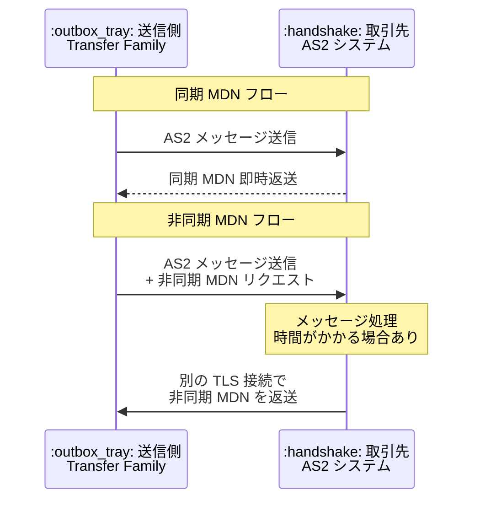

# AWS Transfer Family - AS2 非同期 MDN サポート

**リリース日**: 2026 年 3 月 25 日
**サービス**: AWS Transfer Family
**機能**: AS2 メッセージにおける非同期 MDN の受信サポート

:bar_chart: [このアップデートのインフォグラフィックを見る](https://takech9203.github.io/aws-news-summary/20260325-aws-transfer-family-as2-mdns.html)

## 概要

AWS Transfer Family は、Applicability Statement 2 (AS2) プロトコルで送信されたメッセージに対する Message Disposition Notification (MDN) の非同期受信をサポートしました。これにより、取引先のメッセージ処理時間やネットワーク要件に関係なく、AS2 ワークフローを Transfer Family に移行しながら取引先との相互運用性を維持できます。

ヘルスケア、ライフサイエンス、小売、製造、サプライチェーンなどの業界では、取引先や規制機関との安全な AS2 ベースのデータ交換に Transfer Family を活用しています。今回のアップデートにより、別の TLS 接続を介して非同期 MDN をリクエストしながら AS2 メッセージを送信できるようになり、処理時間が長い、またはレイテンシーが高いパートナー AS2 システムとの互換性が確保されます。

Transfer Family は同期 MDN と非同期 MDN の両方のリクエストをサポートするようになり、パートナー統合に影響を与えることなく AS2 ワークフローを AWS に移行できます。

**アップデート前の課題**

- Transfer Family の AS2 コネクタは同期 MDN のみをサポートしており、MDN を即時返送できない取引先との通信に制約があった
- 処理時間が長い取引先システムでは、同期 MDN のタイムアウトが発生する可能性があった
- レイテンシーの高いネットワーク環境にある取引先との AS2 通信が困難だった
- 非同期 MDN を必要とする既存の AS2 ワークフローを Transfer Family に移行できなかった

**アップデート後の改善**

- 非同期 MDN を別の TLS 接続で受信できるようになり、処理時間の長い取引先との通信が可能に
- 同期 MDN と非同期 MDN の両方をサポートし、取引先の要件に応じて柔軟に選択可能に
- 既存の AS2 ワークフローをパートナー統合に影響を与えずに AWS へ移行可能に
- ヘルスケア、小売、製造など幅広い業界の AS2 通信ニーズに対応

## アーキテクチャ図



同期 MDN では即時に確認応答が返されますが、非同期 MDN では取引先が処理完了後に別の TLS 接続を介して MDN を返送します。これにより、処理時間の長いシステムとの相互運用性が向上します。

## サービスアップデートの詳細

### 主要機能

1. **非同期 MDN の受信サポート**
   - AS2 メッセージ送信時に非同期 MDN をリクエスト可能
   - 取引先は別の TLS 接続を使用して MDN を返送
   - 処理時間の長い取引先システムとの互換性を確保

2. **同期・非同期 MDN の両方をサポート**
   - 取引先の要件に応じて MDN タイプを選択可能
   - 同期 MDN: 即時応答が必要な場合に使用
   - 非同期 MDN: 処理時間が長い、またはレイテンシーが高い場合に使用

3. **既存ワークフローの移行互換性**
   - オンプレミスの AS2 システムからの移行が容易に
   - パートナー側の変更なしで移行可能
   - 業界標準の AS2 プロトコルに準拠

## 技術仕様

### MDN タイプの比較

| 項目 | 同期 MDN | 非同期 MDN |
|------|----------|------------|
| レスポンス方式 | 同一 HTTP セッションで即時返送 | 別の TLS 接続で後から返送 |
| 適用シナリオ | 低レイテンシー環境 | 高レイテンシー、長時間処理 |
| 接続方式 | 元の HTTP 接続を使用 | 新しい TLS 接続を確立 |
| タイムアウトリスク | 処理時間が長い場合にリスクあり | タイムアウトリスクが低い |

### AS2 コネクタ設定パラメータ

| パラメータ | 説明 |
|------------|------|
| `MdnResponse` | MDN のレスポンスタイプ (SYNC または NONE、今回 ASYNC が追加) |
| `MdnSigningAlgorithm` | MDN 署名アルゴリズム (SHA256、SHA384、SHA512 など) |
| `MessageSubject` | AS2 メッセージの件名 |
| `Compression` | メッセージ圧縮 (ZLIB または DISABLED) |
| `EncryptionAlgorithm` | 暗号化アルゴリズム |
| `SigningAlgorithm` | 署名アルゴリズム |

### API 変更履歴

直近 7 日間に Transfer サービスに関連する API 変更は検出されませんでした。

## 設定方法

### 前提条件

1. AWS Transfer Family サーバー (AS2 プロトコルが有効)
2. AS2 コネクタの設定
3. 取引先の AS2 プロファイル情報
4. 非同期 MDN を受信するための TLS 証明書

### 手順

#### ステップ 1: AS2 コネクタを作成 (非同期 MDN 有効)

```bash
aws transfer create-connector \
  --url "https://partner-as2-endpoint.example.com" \
  --as2-config '{
    "LocalProfileId": "p-1234567890abcdef0",
    "PartnerProfileId": "p-0987654321fedcba0",
    "MessageSubject": "AS2 Message from Transfer Family",
    "Compression": "ZLIB",
    "EncryptionAlgorithm": "AES256_CBC",
    "SigningAlgorithm": "SHA256",
    "MdnSigningAlgorithm": "SHA256",
    "MdnResponse": "ASYNC"
  }' \
  --access-role "arn:aws:iam::123456789012:role/TransferAS2Role"
```

このコマンドは、非同期 MDN をリクエストする AS2 コネクタを作成します。`MdnResponse` を `ASYNC` に設定することで、取引先に非同期 MDN を要求します。

#### ステップ 2: AS2 メッセージを送信

```bash
aws transfer start-file-transfer \
  --connector-id "c-1234567890abcdef0" \
  --send-file-paths "/mybucket/outbound/invoice.edi"
```

このコマンドは、AS2 コネクタを使用してファイルを取引先に送信します。コネクタの設定に基づき、非同期 MDN が自動的にリクエストされます。

#### ステップ 3: MDN の受信状況を確認

```bash
aws transfer list-executions \
  --connector-id "c-1234567890abcdef0" \
  --max-results 10
```

このコマンドは、AS2 メッセージの送信履歴と MDN の受信状況を確認します。非同期 MDN の場合、MDN の受信には時間がかかる場合があります。

## メリット

### ビジネス面

- **AS2 ワークフローの完全な AWS 移行**: 非同期 MDN をサポートする取引先との統合も含め、すべての AS2 ワークフローを Transfer Family に移行可能
- **パートナー統合への影響なし**: 取引先側の変更なしで AWS への移行が可能
- **幅広い業界への対応**: ヘルスケア、小売、製造、サプライチェーンなど EDI を活用する業界のニーズに対応

### 技術面

- **タイムアウトの回避**: 処理時間の長い取引先システムとの通信でタイムアウトが発生しない
- **ネットワーク互換性の向上**: 高レイテンシー環境にある取引先との AS2 通信が可能に
- **柔軟な MDN 設定**: 取引先の要件に応じて同期・非同期を切り替え可能
- **セキュアな通信**: 非同期 MDN も TLS 接続で暗号化

## デメリット・制約事項

### 制限事項

- 非同期 MDN の受信には追加の TLS 接続が必要であり、ネットワーク設定の確認が必要
- 非同期 MDN の受信タイミングは取引先の処理速度に依存
- AS2 プロトコル固有の制約 (メッセージサイズ制限など) は引き続き適用

### 考慮すべき点

- 非同期 MDN 受信用のエンドポイントが適切に設定されていることを確認する必要がある
- ファイアウォールやセキュリティグループで非同期 MDN の受信接続を許可する設定が必要
- 非同期 MDN の場合、メッセージ送信と MDN 受信のタイミングにずれが生じるため、ワークフローの設計を考慮する必要がある

## ユースケース

### ユースケース 1: ヘルスケア業界の EDI データ交換

**シナリオ**: 医療機関が保険請求データを保険会社に AS2 で送信しています。保険会社のシステムは請求データの検証に時間がかかるため、非同期 MDN が必要です。

**実装例**:
1. Transfer Family で AS2 コネクタを作成し、`MdnResponse` を `ASYNC` に設定
2. 請求データファイルを S3 バケットに配置
3. `start-file-transfer` API でファイルを送信
4. 保険会社が処理完了後、非同期 MDN を返送

**効果**: 保険会社の処理時間に関係なく、AS2 メッセージを確実に送信でき、MDN による配信確認も受信できます。

### ユースケース 2: 小売業のサプライチェーン統合

**シナリオ**: 大手小売業者が複数のサプライヤーと注文書や請求書を AS2 で交換しています。一部のサプライヤーは処理能力が限られており、同期 MDN を返送できません。

**実装例**:
1. サプライヤーごとに AS2 コネクタを作成
2. 同期 MDN 対応のサプライヤーには `MdnResponse: SYNC` を設定
3. 非同期 MDN が必要なサプライヤーには `MdnResponse: ASYNC` を設定
4. EventBridge で MDN 受信イベントを監視し、後続処理を自動化

**効果**: すべてのサプライヤーとの AS2 通信を 1 つのプラットフォームで管理でき、サプライヤーの処理能力に応じた柔軟な MDN 設定が可能になります。

### ユースケース 3: 製造業のオンプレミス AS2 システムからの移行

**シナリオ**: 製造企業がオンプレミスの AS2 システムを運用しており、クラウドに移行したい場合です。既存の取引先の一部は非同期 MDN を要求しています。

**実装例**:
1. 既存の AS2 コネクタ設定を Transfer Family に移行
2. 取引先ごとの MDN タイプ (同期/非同期) を維持
3. S3 バケットをストレージとして設定
4. 段階的にオンプレミスシステムから Transfer Family に切り替え

**効果**: 取引先に影響を与えることなく、AS2 システムを AWS に移行でき、インフラの運用負荷を大幅に削減できます。

## 料金

AWS Transfer Family の AS2 コネクタの料金は以下の要素で構成されます。

- **AS2 コネクタ料金**: コネクタが有効化されている時間に対する時間単位の料金
- **メッセージ料金**: 送受信されるメッセージ数に対する料金
- **データ転送料金**: 転送されるデータ量に対する料金

非同期 MDN のサポートに追加料金は発生しません。詳細な料金については [AWS Transfer Family Pricing](https://aws.amazon.com/aws-transfer-family/pricing/) をご確認ください。

## 利用可能リージョン

AWS Transfer Family AS2 が利用可能なすべてのリージョンでこの機能を使用できます。利用可能なリージョンの最新情報については、[AWS Transfer Family エンドポイントとクォータ](https://docs.aws.amazon.com/general/latest/gr/transfer-service.html)をご確認ください。

## 関連サービス・機能

- **AWS Transfer Family AS2**: AS2 プロトコルによるセキュアな B2B データ交換
- **Amazon S3**: AS2 で送受信されるファイルのストレージ
- **Amazon EventBridge**: MDN 受信イベントの監視と後続ワークフローの自動化
- **AWS CloudTrail**: AS2 メッセージ送受信のセキュリティ監査

## 参考リンク

- :bar_chart: [インフォグラフィック](https://takech9203.github.io/aws-news-summary/20260325-aws-transfer-family-as2-mdns.html)
- [公式発表 (What's New)](https://aws.amazon.com/about-aws/whats-new/2026/03/aws-transfer-family-as2-mdns/)
- [AWS Transfer Family AS2 ドキュメント](https://docs.aws.amazon.com/transfer/latest/userguide/as2-config-workflow.html)
- [AWS Transfer Family 料金ページ](https://aws.amazon.com/aws-transfer-family/pricing/)

## まとめ

AWS Transfer Family の AS2 非同期 MDN サポートにより、処理時間が長い取引先や高レイテンシー環境にある取引先との AS2 通信が可能になりました。同期 MDN と非同期 MDN の両方をサポートすることで、既存の AS2 ワークフローをパートナー統合に影響を与えることなく AWS に移行できます。AS2 ベースの B2B データ交換を行っている組織は、コネクタの `MdnResponse` 設定を確認し、取引先の要件に応じて非同期 MDN の活用を検討してください。
