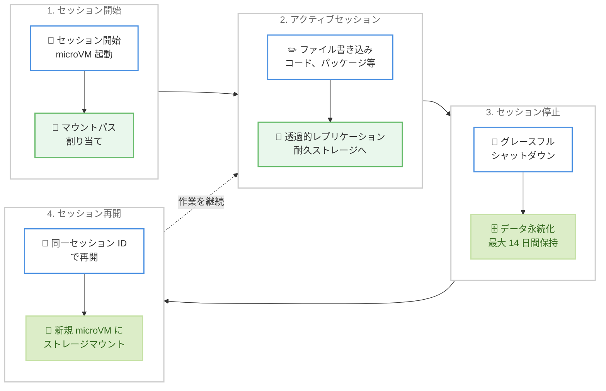

# Amazon Bedrock AgentCore Runtime - マネージドセッションストレージ

**リリース日**: 2026年3月25日
**サービス**: Amazon Bedrock AgentCore Runtime
**機能**: マネージドセッションストレージ (パブリックプレビュー)

[このアップデートのインフォグラフィックを見る](https://takech9203.github.io/aws-news-summary/20260325-bedrock-agentcore-runtime-session-storage.html)

## 概要

Amazon Bedrock AgentCore Runtime がマネージドセッションストレージのパブリックプレビューを開始しました。この機能により、エージェントがセッションの停止と再開を跨いでファイルシステムの状態を永続化できるようになります。コードの作成、パッケージのインストール、アーティファクトの生成など、ファイルシステムを通じた作業結果を自動的に保持できます。

セッションストレージを設定すると、指定したマウントパスに永続ディレクトリが割り当てられます。エージェントは通常通りファイルの読み書きを行い、AgentCore Runtime がバックグラウンドで耐久性のあるストレージにデータを透過的にレプリケーションします。セッション停止時にはグレースフルシャットダウン中にデータがフラッシュされ、同じセッション ID で再開すると新しい microVM が同じストレージをマウントしてエージェントが中断した時点から作業を継続できます。

**アップデート前の課題**

- エージェントがセッション停止時にファイルシステム上の作業結果 (ソースコード、インストール済みパッケージ、ビルドアーティファクトなど) をすべて失っていた
- 状態を永続化するために、チェックポイントロジックや保存・復元コードをアプリケーション側で独自に実装する必要があった
- コンピューティング環境の終了後にエージェントの作業コンテキストを復元する標準的な仕組みが存在しなかった

**アップデート後の改善**

- 設定したマウントパスに書き込まれたデータが自動的に永続化され、セッションの停止・再開を跨いで保持されるようになった
- チェックポイントロジックや保存・復元コードの実装が不要になり、エージェントアプリケーションの変更なしで利用可能になった
- 同じセッション ID で再開するだけで、ソースファイル、パッケージ、ビルドアーティファクト、Git 履歴がすべて復元されるようになった

## アーキテクチャ図



セッションストレージのライフサイクル: セッション開始からファイル書き込み、停止時のデータ永続化、再開時のストレージ復元までの流れを示しています。

## サービスアップデートの詳細

### 主要機能

1. **透過的なファイルシステム永続化**
   - 設定したマウントパスへの書き込みが自動的に耐久ストレージにレプリケーションされる
   - エージェントアプリケーション側の変更は不要
   - 標準的な Linux ファイルシステム操作 (通常ファイル、ディレクトリ、シンボリックリンク) をサポート

2. **セッション停止・再開のサポート**
   - セッション停止時にグレースフルシャットダウンでデータをフラッシュ
   - 同じセッション ID で再開すると、新しい microVM が同じストレージをマウント
   - ソースファイル、インストール済みパッケージ、ビルドアーティファクト、Git 履歴がすべて復元される

3. **セッション分離とセキュリティ**
   - ストレージ通信は単一セッションのデータに限定される
   - 他のセッションや AgentCore Runtime 環境のデータにはアクセスできない
   - セッションごとに独立したストレージ領域を確保

## 技術仕様

### ストレージ仕様

| 項目 | 詳細 |
|------|------|
| 最大容量 | セッションあたり 1 GB |
| データ保持期間 | アイドル状態で最大 14 日間 |
| サポートするファイル操作 | 通常ファイル、ディレクトリ、シンボリックリンク |
| レプリケーション方式 | 耐久ストレージへの透過的レプリケーション |
| シャットダウン方式 | グレースフルシャットダウン時にデータフラッシュ |
| セッション分離 | セッション間のデータアクセス不可 |

### API 変更履歴

| 日付 | サービス | 変更内容 |
|------|----------|----------|
| 2026/03/24 | [Amazon Bedrock AgentCore Control](https://awsapichanges.com/archive/changes/cfa448-bedrock-agentcore-control.html) | 4 updated methods - CreateAgentRuntime、UpdateAgentRuntime、GetAgentRuntime に `filesystemConfigurations` パラメータを追加 |

### API 設定例

`filesystemConfigurations` パラメータを使用してセッションストレージを設定します。

```json
{
    "filesystemConfigurations": [
        {
            "sessionStorage": {
                "mountPath": "/mnt/session-data"
            }
        }
    ]
}
```

## 設定方法

### 前提条件

1. Amazon Bedrock AgentCore Runtime の Agent Runtime が作成済みであること
2. AgentCore Runtime を操作するための適切な IAM 権限が設定されていること
3. エージェントアプリケーションが指定するマウントパスにファイルを読み書きするように構成されていること

### 手順

#### ステップ1: セッションストレージ付き Agent Runtime の作成

```bash
aws bedrock-agentcore create-agent-runtime \
  --agent-runtime-name "my-persistent-agent" \
  --agent-runtime-artifact '{
    "containerConfiguration": {
      "containerUri": "123456789012.dkr.ecr.us-east-1.amazonaws.com/my-agent:latest"
    }
  }' \
  --role-arn "arn:aws:iam::123456789012:role/AgentCoreRole" \
  --filesystem-configurations '[
    {
      "sessionStorage": {
        "mountPath": "/mnt/session-data"
      }
    }
  ]'
```

`filesystemConfigurations` に `sessionStorage` の `mountPath` を指定して、エージェントがデータを永続化するディレクトリパスを設定します。

#### ステップ2: Python SDK での設定

```python
import boto3

client = boto3.client('bedrock-agentcore', region_name='us-east-1')

response = client.create_agent_runtime(
    agentRuntimeName='my-persistent-agent',
    agentRuntimeArtifact={
        'containerConfiguration': {
            'containerUri': '123456789012.dkr.ecr.us-east-1.amazonaws.com/my-agent:latest'
        }
    },
    roleArn='arn:aws:iam::123456789012:role/AgentCoreRole',
    filesystemConfigurations=[
        {
            'sessionStorage': {
                'mountPath': '/mnt/session-data'
            }
        }
    ]
)

print(f"Agent Runtime ID: {response['agentRuntimeId']}")
print(f"Status: {response['status']}")
```

Agent Runtime 作成時に `filesystemConfigurations` を指定することで、セッションストレージが有効化されます。

#### ステップ3: 既存 Agent Runtime へのセッションストレージ追加

```python
response = client.update_agent_runtime(
    agentRuntimeId='existing-runtime-id',
    agentRuntimeArtifact={
        'containerConfiguration': {
            'containerUri': '123456789012.dkr.ecr.us-east-1.amazonaws.com/my-agent:latest'
        }
    },
    roleArn='arn:aws:iam::123456789012:role/AgentCoreRole',
    filesystemConfigurations=[
        {
            'sessionStorage': {
                'mountPath': '/mnt/session-data'
            }
        }
    ]
)
```

既存の Agent Runtime に対して `UpdateAgentRuntime` API を使用してセッションストレージを後から追加できます。

## メリット

### ビジネス面

- **開発効率の向上**: チェックポイントロジックや状態管理コードの実装が不要になり、エージェント開発に集中できる
- **コスト最適化**: セッション停止中はコンピューティングリソースを解放しながらも、作業状態を維持できるため、アイドル時間のコストを削減
- **ユーザー体験の改善**: エージェントが中断した時点から即座に作業を再開でき、エンドユーザーの待機時間を短縮

### 技術面

- **透過的な統合**: エージェントアプリケーションのコード変更なしで永続化機能を利用可能
- **データ整合性の保証**: グレースフルシャットダウンによるデータフラッシュで、書き込み中のデータ損失を防止
- **セッション分離**: セッション間のデータアクセスが制限されており、セキュリティとデータプライバシーを確保

## デメリット・制約事項

### 制限事項

- セッションあたりの最大ストレージ容量は 1 GB に制限される
- アイドル状態のデータ保持期間は最大 14 日間であり、それを超えるとデータが削除される
- 現時点ではパブリックプレビューであり、本番ワークロードでの使用には注意が必要

### 考慮すべき点

- 1 GB の制限があるため、大容量のデータセットやモデルファイルの永続化には適さない場合がある
- セッション再開時に新しい microVM が起動するため、ストレージのマウントに若干の時間がかかる可能性がある
- プレビュー期間中は機能仕様が変更される可能性がある

## ユースケース

### ユースケース1: ソフトウェア開発エージェント

**シナリオ**: AI エージェントがコードリポジトリをクローンし、パッケージをインストールして開発作業を行う。作業の途中でセッションを停止し、後日再開して作業を継続したい。

**実装例**:
```python
# エージェント側のコード (変更不要)
# /mnt/session-data 配下でファイル操作を行うだけ
import subprocess

# リポジトリのクローンとパッケージインストール
subprocess.run(["git", "clone", "https://github.com/example/repo.git",
                "/mnt/session-data/repo"])
subprocess.run(["pip", "install", "-r",
                "/mnt/session-data/repo/requirements.txt",
                "--target", "/mnt/session-data/packages"])
```

**効果**: セッション再開時にリポジトリのクローンやパッケージの再インストールが不要になり、開発作業の再開時間を大幅に短縮。

### ユースケース2: データ分析エージェント

**シナリオ**: AI エージェントが大規模データの分析を段階的に実行し、中間結果をファイルに保存しながら作業を進める。長時間の分析を複数のセッションに分割して実行したい。

**実装例**:
```python
import pandas as pd

# 中間結果の保存と読み込み
checkpoint_path = "/mnt/session-data/analysis_checkpoint.parquet"

# 前回のチェックポイントが存在する場合は読み込み
try:
    df = pd.read_parquet(checkpoint_path)
    print("前回の分析結果を復元しました")
except FileNotFoundError:
    df = pd.read_csv("/mnt/session-data/raw_data.csv")
    print("新規分析を開始します")

# 分析処理の実行と中間結果の保存
df_processed = perform_analysis(df)
df_processed.to_parquet(checkpoint_path)
```

**効果**: 長時間の分析作業を複数のセッションに分割でき、コスト効率を改善しながらも分析の継続性を維持。

### ユースケース3: ドキュメント生成エージェント

**シナリオ**: AI エージェントが複数のステップでドキュメントを生成し、生成済みのファイルやテンプレートをセッション間で再利用したい。

**実装例**:
```python
import os

output_dir = "/mnt/session-data/documents"
os.makedirs(output_dir, exist_ok=True)

# 生成済みドキュメントの確認
existing_docs = os.listdir(output_dir)
print(f"生成済みドキュメント: {len(existing_docs)} 件")

# 未生成のドキュメントのみ作成
for doc_name in required_documents:
    if doc_name not in existing_docs:
        generate_document(doc_name, output_dir)
```

**効果**: セッション再開時に既に生成済みのドキュメントを再利用でき、重複作業を排除して効率的にドキュメント生成を完了。

## 料金

マネージドセッションストレージの料金はパブリックプレビュー時点では明示されていません。一般提供 (GA) 開始時に料金体系が公開される見込みです。AgentCore Runtime の基本的なコンピューティング料金は別途発生します。

## 利用可能リージョン

パブリックプレビューとして、以下の 14 リージョンで利用可能です。

- US East (N. Virginia)
- US East (Ohio)
- US West (Oregon)
- Canada (Central)
- Asia Pacific (Mumbai)
- Asia Pacific (Seoul)
- Asia Pacific (Singapore)
- Asia Pacific (Sydney)
- Asia Pacific (Tokyo)
- Europe (Frankfurt)
- Europe (Ireland)
- Europe (London)
- Europe (Paris)
- Europe (Stockholm)

## 関連サービス・機能

- **Amazon Bedrock AgentCore Runtime**: エージェントの実行環境を提供する基盤サービス。セッションストレージはこの Runtime の機能拡張
- **Amazon Bedrock Agents**: AI エージェントの構築・デプロイフレームワーク。AgentCore Runtime と連携してエージェントを実行
- **Amazon EBS**: EC2 向けの永続ブロックストレージ。セッションストレージは AgentCore Runtime 専用のマネージドストレージとして類似の永続化機能を提供

## 参考リンク

- [インフォグラフィック](https://takech9203.github.io/aws-news-summary/20260325-bedrock-agentcore-runtime-session-storage.html)
- [公式発表 (What's New)](https://aws.amazon.com/about-aws/whats-new/2026/03/bedrock-agentcore-runtime-session-storage/)
- [ドキュメント - セッション間のファイル永続化](https://docs.aws.amazon.com/bedrock-agentcore/latest/devguide/persist-files-across-stop-resume.html)
- [Amazon Bedrock AgentCore 料金ページ](https://aws.amazon.com/bedrock/agentcore/pricing/)

## まとめ

Amazon Bedrock AgentCore Runtime のマネージドセッションストレージにより、エージェントのファイルシステム状態をセッション間で自動的に永続化できるようになりました。チェックポイントロジックの実装が不要で、エージェントアプリケーションの変更なしに利用できる点が大きな利点です。ソフトウェア開発、データ分析、ドキュメント生成など、長時間の作業を複数セッションに分割する必要があるユースケースに特に有効であり、14 リージョンでのパブリックプレビュー提供により、幅広い地域で早期検証が可能です。
