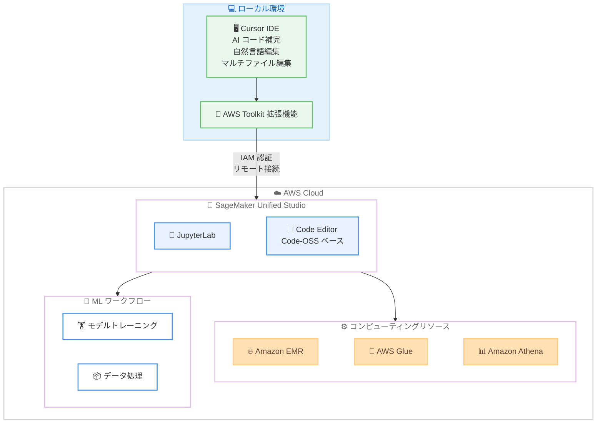

# Amazon SageMaker Unified Studio - Cursor IDE からのリモート接続サポート

**リリース日**: 2026 年 3 月 25 日
**サービス**: Amazon SageMaker Unified Studio
**機能**: Remote Connection from Cursor IDE

📊 [このアップデートのインフォグラフィックを見る](https://takech9203.github.io/aws-news-summary/20260325-sagemaker-unified-studio-cursor-ide.html)

## 概要

Amazon SageMaker Unified Studio が、AWS Toolkit 拡張機能を介した Cursor IDE からのリモート接続をサポートしました。データサイエンティスト、ML エンジニア、開発者は、Cursor の AI パワードコード補完、自然言語編集、マルチファイル編集機能をそのまま活用しながら、Amazon SageMaker のスケーラブルなコンピューティングリソースにアクセスできるようになります。

Cursor は Code-OSS をベースに構築されているため、SageMaker Unified Studio が提供するクラウド IDE との親和性が高く、AWS Toolkit 拡張機能を通じた IAM ベースの認証によりセキュアな接続が実現されます。これにより、ローカルの AI 開発環境からクラウド上のスケーラブルなインフラストラクチャへシームレスに作業を移行でき、データ処理、SQL 分析、ML ワークフローを効率的に実行できます。

**アップデート前の課題**

- Cursor IDE の AI 支援機能を活用しつつ SageMaker のクラウドリソースを利用するには、ローカル IDE とクラウドインフラ間でコンテキストスイッチが必要だった
- SageMaker Unified Studio のクラウド IDE は JupyterLab と Code Editor に限定されており、Cursor ユーザーは慣れた開発環境を使用できなかった
- ローカル環境でのプロトタイピングからクラウド上の大規模処理への移行に手動でのセットアップが必要だった

**アップデート後の改善**

- Cursor IDE から AWS Toolkit 拡張機能を使用して SageMaker Unified Studio に直接リモート接続が可能になった
- Cursor の AI パワード機能 (コード補完、自然言語編集、マルチファイル編集) をクラウドリソース上で利用可能になった
- ローカル IDE とクラウドインフラ間のコンテキストスイッチが不要になり、開発効率が向上した

## アーキテクチャ図



Cursor IDE からAWS Toolkit 拡張機能を介して SageMaker Unified Studio にリモート接続し、クラウド上のコンピューティングリソースや ML ワークフローにアクセスする全体的なアーキテクチャを示しています。

## サービスアップデートの詳細

### 主要機能

1. **Cursor IDE からのリモート接続**
   - AWS Toolkit 拡張機能を使用して Cursor IDE から SageMaker Unified Studio にリモート接続
   - Cursor は Code-OSS ベースのため、SageMaker Unified Studio の Code Editor との互換性が高い
   - ローカル IDE の設定やカスタマイズをそのまま利用可能

2. **AI パワード開発機能のクラウド活用**
   - Cursor の AI コード補完機能をクラウドリソース上で利用可能
   - 自然言語による編集機能でクラウド上のコードを直感的に操作
   - マルチファイル編集機能による効率的な大規模プロジェクト管理

3. **IAM ベースのセキュア認証**
   - AWS Toolkit 拡張機能を通じた IAM 認証による安全な接続
   - 既存の AWS 認証情報と権限管理をそのまま利用可能
   - エンタープライズのセキュリティ要件に準拠

## 技術仕様

### 対応環境

| 項目 | 詳細 |
|------|------|
| IDE | Cursor IDE (Code-OSS ベース) |
| 拡張機能 | AWS Toolkit |
| 認証方式 | IAM (AWS Toolkit 経由) |
| 接続方式 | リモート接続 |

### SageMaker Unified Studio クラウド IDE

| IDE | ベース | 主な用途 |
|-----|--------|---------|
| JupyterLab | Jupyter | インタラクティブなデータ分析、ノートブック |
| Code Editor | Code-OSS | 汎用コード開発、プロジェクト管理 |
| Cursor (リモート) | Code-OSS | AI 支援開発、自然言語編集 |

### 連携可能な分析・ML サービス

| サービス | 用途 |
|----------|------|
| Amazon EMR | 大規模データ処理 |
| AWS Glue | ETL ジョブ、データカタログ |
| Amazon Athena | SQL アナリティクス |
| SageMaker ML ワークフロー | モデルトレーニング、推論 |

### API 変更履歴

今回のアップデートに関連する API 変更は、調査時点では確認されていません。AWS Toolkit 拡張機能のアップデートとして提供されています。

## 設定方法

### 前提条件

1. Cursor IDE がローカル環境にインストールされていること
2. AWS アカウントと SageMaker Unified Studio へのアクセス権限
3. AWS Toolkit 拡張機能がインストールされていること

### 手順

#### ステップ 1: AWS Toolkit 拡張機能のインストール

Cursor IDE の拡張機能マーケットプレイスから AWS Toolkit をインストールします。Cursor は Code-OSS ベースのため、VS Code 互換の拡張機能が利用可能です。

#### ステップ 2: AWS 認証情報の設定

AWS Toolkit 拡張機能を使用して IAM 認証情報を設定します。IAM ユーザーまたは IAM Identity Center の認証情報を使用してサインインします。

#### ステップ 3: SageMaker Unified Studio へのリモート接続

AWS Toolkit から SageMaker Unified Studio のリモート接続機能を使用して、クラウド上の開発環境に接続します。接続後は、Cursor の AI 支援機能を活用しながらクラウドリソースにアクセスできます。

## メリット

### ビジネス面

- **開発生産性の向上**: ローカル IDE とクラウド環境間のコンテキストスイッチが不要になり、開発者の集中力と生産性が向上
- **導入コストの低減**: 既存の Cursor ライセンスと AWS 環境をそのまま活用でき、新たなツールの学習コストが不要
- **人材活用の最適化**: Cursor に習熟した開発者が、追加のトレーニングなしでクラウド ML 環境を活用可能

### 技術面

- **AI 支援開発のスケール**: Cursor の高度な AI 機能をクラウドのスケーラブルなリソースと組み合わせて活用可能
- **シームレスなワークフロー**: ローカルプロトタイピングからクラウドスケールの処理まで、同一 IDE 内で完結
- **セキュアな接続**: IAM ベースの認証により、エンタープライズレベルのセキュリティを確保

## デメリット・制約事項

### 制限事項

- Cursor IDE に限定されたサポートであり、他のサードパーティ IDE からのリモート接続は別途対応が必要
- Cursor は有償ソフトウェアのため、ライセンスコストが追加で発生する
- リモート接続の安定性はネットワーク環境に依存する

### 考慮すべき点

- Cursor のバージョンアップに伴い、AWS Toolkit 拡張機能との互換性を定期的に確認する必要がある
- リモート接続環境では、一部のローカル拡張機能が正常に動作しない場合がある

## ユースケース

### ユースケース 1: データサイエンティストの大規模データ分析

**シナリオ**: データサイエンティストがローカルの Cursor IDE で AI コード補完を活用しながら、SageMaker のスケーラブルなコンピューティングリソース上で大規模データセットの分析を実行します。

**実装例**:
```
1. Cursor IDE で AWS Toolkit 拡張機能を使用して SageMaker Unified Studio に接続
2. Cursor の AI 補完を活用しながら PySpark コードを記述
3. Amazon EMR クラスタ上でジョブを実行
```

**効果**: AI 支援によるコーディング速度の向上と、クラウドリソースによる大規模処理の実行を両立

### ユースケース 2: ML エンジニアのモデル開発ワークフロー

**シナリオ**: ML エンジニアが Cursor のマルチファイル編集機能を使用して ML パイプラインのコードを効率的に開発し、SageMaker 上でトレーニングジョブを実行します。

**実装例**:
```
1. Cursor のマルチファイル編集で複数のパイプラインスクリプトを同時に編集
2. 自然言語指示でデータ前処理コードを自動生成
3. SageMaker トレーニングジョブをリモート環境から直接実行
```

**効果**: パイプライン開発の効率化と、ローカル/クラウド間の切り替え不要による開発サイクルの短縮

### ユースケース 3: SQL アナリストのクラウドデータ分析

**シナリオ**: アナリストが Cursor の AI 支援で SQL クエリを効率的に作成し、Amazon Athena や Amazon EMR で実行します。

**実装例**:
```
1. Cursor IDE から SageMaker Unified Studio にリモート接続
2. AI コード補完を活用して複雑な SQL クエリを作成
3. Amazon Athena で S3 上のデータに対してクエリを実行
```

**効果**: AI 支援による SQL 作成の効率化と、クラウド上の大規模データへのシームレスなアクセス

## 料金

Cursor IDE からの SageMaker Unified Studio へのリモート接続機能自体に追加料金はありません。以下の既存料金が適用されます。

### 料金例

| 項目 | 料金体系 |
|------|---------|
| SageMaker Unified Studio | コンピューティングインスタンスの使用量に基づく |
| Amazon EMR | クラスタの使用量に基づく |
| AWS Glue | ジョブの実行時間に基づく |
| Amazon Athena | スキャンしたデータ量に基づく |
| Cursor IDE | 別途 Cursor のライセンス料金 |

## 利用可能リージョン

Amazon SageMaker Unified Studio が利用可能なすべてのリージョンでサポートされます。

## 関連サービス・機能

- **Amazon SageMaker Unified Studio**: データサイエンスと ML 開発のための統合開発環境プラットフォーム
- **AWS Toolkit**: IDE と AWS サービスを接続するための拡張機能
- **Amazon EMR**: 大規模データ処理のためのマネージドクラスタプラットフォーム
- **AWS Glue**: サーバーレス ETL サービス
- **Amazon Athena**: S3 データに対するサーバーレス SQL クエリサービス

## 参考リンク

- 📊 [インフォグラフィック](https://takech9203.github.io/aws-news-summary/20260325-sagemaker-unified-studio-cursor-ide.html)
- [公式発表 (What's New)](https://aws.amazon.com/about-aws/whats-new/2026/03/sagemaker-unified-studio-cursor-ide/)
- [Amazon SageMaker Unified Studio](https://aws.amazon.com/sagemaker/unified-studio/)
- [AWS Toolkit for Visual Studio Code](https://aws.amazon.com/visualstudiocode/)

## まとめ

Amazon SageMaker Unified Studio が Cursor IDE からのリモート接続をサポートしたことにより、開発者は Cursor の AI パワード機能を活用しながらクラウド上のスケーラブルなリソースにシームレスにアクセスできるようになりました。AWS Toolkit 拡張機能を通じた IAM 認証によりセキュアな接続が確保されており、ローカル IDE とクラウドインフラ間のコンテキストスイッチを排除することで開発効率の大幅な向上が期待できます。Cursor を日常的に使用しているデータサイエンティストや ML エンジニアは、AWS Toolkit 拡張機能をインストールして接続を試みることを推奨します。
