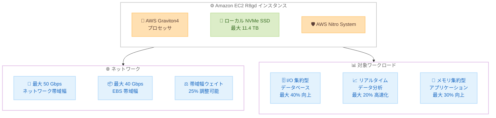

# Amazon EC2 R8gd インスタンス - 追加リージョンでの提供開始

**リリース日**: 2026 年 3 月 26 日
**サービス**: Amazon EC2
**機能**: R8gd インスタンスのリージョン拡大

📊 [このアップデートのインフォグラフィックを見る](https://takech9203.github.io/aws-news-summary/20260326-amazon-ec2-r8gd-aws-regions.html)

## 概要

Amazon EC2 R8gd インスタンスが、US West (N. California)、Asia Pacific (Seoul、Hong Kong、Jakarta)、Africa (Cape Town)、Canada West (Calgary) の各リージョンで新たに利用可能になりました。R8gd インスタンスは AWS Graviton4 プロセッサを搭載し、最大 11.4 TB のローカル NVMe ベース SSD ブロックレベルストレージを提供するメモリ最適化インスタンスです。

R8gd インスタンスは、Graviton3 ベースのインスタンスと比較して最大 30% 優れたパフォーマンスを提供します。特に I/O 集約型のデータベースワークロードでは最大 40% のパフォーマンス向上、I/O 集約型のリアルタイムデータ分析では最大 20% 高速なクエリ結果を実現します。AWS Nitro System 上に構築されており、12 種類のインスタンスサイズが利用可能です。

**アップデート前の課題**

- R8gd インスタンスは限られたリージョンでのみ利用可能であり、特にアジア太平洋やアフリカのリージョンでは利用できなかった
- ローカル NVMe ストレージを必要とするメモリ集約型ワークロードにおいて、一部のリージョンでは最新世代のインスタンスが選択できなかった
- グローバルにデータベースやリアルタイム分析を展開する際に、リージョンごとに異なるインスタンスタイプを使い分ける必要があった

**アップデート後の改善**

- 6 つの追加リージョンで R8gd インスタンスが利用可能になり、グローバルな展開の選択肢が拡大した
- アジア太平洋地域 (ソウル、香港、ジャカルタ) でローカル NVMe ストレージ付きの Graviton4 ベースメモリ最適化インスタンスが利用可能になった
- データレジデンシー要件やレイテンシー要件に応じて、より多くのリージョンで高性能な I/O 集約型ワークロードを実行できるようになった

## アーキテクチャ図



R8gd インスタンスは Graviton4 プロセッサ、ローカル NVMe SSD、Nitro System を組み合わせ、I/O 集約型のデータベースやリアルタイム分析ワークロードに最適化されたパフォーマンスを提供します。

## サービスアップデートの詳細

### 主要機能

1. **AWS Graviton4 プロセッサ**
   - 最新世代の AWS 設計 ARM ベースプロセッサを搭載
   - Graviton3 ベースのインスタンスと比較して最大 30% 優れたパフォーマンス
   - エネルギー効率の向上によるコスト最適化

2. **ローカル NVMe SSD ストレージ**
   - 最大 11.4 TB のローカル NVMe ベース SSD ブロックレベルストレージ
   - I/O 集約型データベースワークロードで最大 40% のパフォーマンス向上
   - I/O 集約型リアルタイムデータ分析で最大 20% 高速なクエリ結果

3. **ネットワークおよび EBS 帯域幅**
   - 最大 50 Gbps のネットワーク帯域幅
   - 最大 40 Gbps の Amazon EBS 帯域幅
   - EC2 インスタンス帯域幅ウェイト設定により、ネットワークと EBS の帯域幅を 25% 調整可能

4. **スケーラブルなインスタンスサイズ**
   - 12 種類の異なるインスタンスサイズが利用可能
   - ワークロードの要件に応じた柔軟なサイジングが可能

## 技術仕様

### インスタンス仕様

| 項目 | 詳細 |
|------|------|
| プロセッサ | AWS Graviton4 |
| アーキテクチャ | ARM ベース |
| インフラストラクチャ | AWS Nitro System |
| ローカルストレージ | 最大 11.4 TB NVMe SSD |
| 最大ネットワーク帯域幅 | 50 Gbps |
| 最大 EBS 帯域幅 | 40 Gbps |
| インスタンスサイズ数 | 12 種類 |
| 帯域幅ウェイト調整 | 25% |

### パフォーマンス比較 (Graviton3 ベースインスタンス比)

| ワークロードタイプ | パフォーマンス向上 |
|------|------|
| 一般的なワークロード | 最大 30% 向上 |
| I/O 集約型データベース | 最大 40% 向上 |
| I/O 集約型リアルタイムデータ分析 | 最大 20% 高速化 |

## 設定方法

### 前提条件

1. AWS アカウントを所有していること
2. 対象リージョンで EC2 インスタンスの起動権限があること
3. ARM ベース (Graviton) のインスタンスに対応した AMI を使用すること

### 手順

#### ステップ 1: R8gd インスタンスの起動

```bash
aws ec2 run-instances \
  --instance-type r8gd.xlarge \
  --image-id ami-xxxxxxxxxxxxxxxxx \
  --region us-west-1 \
  --key-name my-key-pair \
  --subnet-id subnet-xxxxxxxxxxxxxxxxx
```

対象リージョン (この例では us-west-1) で R8gd インスタンスを起動します。AMI は ARM64 (Graviton) 対応のものを指定してください。

#### ステップ 2: 帯域幅ウェイトの設定

```bash
aws ec2 modify-instance-attribute \
  --instance-id i-xxxxxxxxxxxxxxxxx \
  --instance-type r8gd.xlarge \
  --bandwidth-weighting default-ebs
```

EC2 インスタンス帯域幅ウェイト設定を使用して、ネットワーク帯域幅と EBS 帯域幅の配分を調整します。この機能により、帯域幅を 25% の範囲で調整できます。

#### ステップ 3: ローカル NVMe ストレージの確認

```bash
lsblk
```

インスタンスに接続後、ローカル NVMe SSD ストレージが正しくマウントされていることを確認します。ローカル NVMe ストレージはインスタンスストアとして表示されます。

## メリット

### ビジネス面

- **グローバル展開の拡大**: 6 つの追加リージョンにより、データレジデンシー要件やレイテンシー要件に対応しやすくなった
- **コスト最適化**: Graviton4 の優れた価格パフォーマンスにより、メモリ集約型ワークロードの運用コストを削減できる
- **パフォーマンス向上**: I/O 集約型ワークロードで最大 40% のパフォーマンス向上により、ビジネスの応答性が改善される

### 技術面

- **高速ローカルストレージ**: 最大 11.4 TB の NVMe SSD により、低レイテンシーの I/O 処理が可能
- **柔軟な帯域幅設定**: 帯域幅ウェイト設定により、ワークロードの特性に応じてネットワークと EBS の帯域幅配分を最適化できる
- **豊富なインスタンスサイズ**: 12 種類のサイズから選択でき、ワークロードに最適なリソース配分が可能

## デメリット・制約事項

### 制限事項

- ARM ベース (Graviton) アーキテクチャのため、x86 向けに最適化されたソフトウェアは再コンパイルまたは移行が必要
- ローカル NVMe ストレージはインスタンスストアであるため、インスタンス停止時にデータが消失する
- すべてのリージョンで利用可能ではなく、一部のリージョンでは引き続き利用できない

### 考慮すべき点

- Graviton4 への移行に際して、アプリケーションの互換性テストが必要
- ローカルストレージのデータ永続性が不要な場合は EBS のみのインスタンスタイプ (R8g) も選択肢となる
- 既存の Graviton3 ベースインスタンスからの移行時にはパフォーマンスベンチマークの実施を推奨

## ユースケース

### ユースケース 1: I/O 集約型データベース

**シナリオ**: 大規模な OLTP データベースをローカル NVMe ストレージ上で実行し、高い I/O スループットと低レイテンシーを必要とする。

**実装例**:
```bash
aws ec2 run-instances \
  --instance-type r8gd.16xlarge \
  --image-id ami-xxxxxxxxxxxxxxxxx \
  --region ap-northeast-2 \
  --block-device-mappings '[{"DeviceName":"/dev/sda1","Ebs":{"VolumeSize":100,"VolumeType":"gp3"}}]'
```

**効果**: Graviton3 ベースのインスタンスと比較して最大 40% のデータベース I/O パフォーマンス向上により、トランザクション処理のスループットが大幅に改善される。

### ユースケース 2: リアルタイムデータ分析

**シナリオ**: 大量のデータストリームをリアルタイムで分析し、ローカルストレージを一時的なデータバッファとして使用する。

**実装例**:
```bash
aws ec2 run-instances \
  --instance-type r8gd.8xlarge \
  --image-id ami-xxxxxxxxxxxxxxxxx \
  --region ap-southeast-3 \
  --tag-specifications 'ResourceType=instance,Tags=[{Key=Purpose,Value=RealTimeAnalytics}]'
```

**効果**: 最大 20% 高速なクエリ結果により、リアルタイム分析のレスポンスタイムが改善され、ビジネスインサイトの迅速な取得が可能になる。

### ユースケース 3: インメモリキャッシュ

**シナリオ**: 大規模なインメモリキャッシュ (Redis、Memcached など) をローカル NVMe ストレージと組み合わせて、永続化付きの高速キャッシュレイヤーを構築する。

**実装例**:
```bash
aws ec2 run-instances \
  --instance-type r8gd.4xlarge \
  --image-id ami-xxxxxxxxxxxxxxxxx \
  --region ap-east-1 \
  --tag-specifications 'ResourceType=instance,Tags=[{Key=Purpose,Value=InMemoryCache}]'
```

**効果**: Graviton4 の高いメモリパフォーマンスとローカル NVMe SSD の組み合わせにより、高速なキャッシュ読み書きと永続化を両立できる。

## 料金

R8gd インスタンスは、オンデマンドインスタンス、Savings Plans、スポットインスタンス、Reserved Instances、または専用インスタンスおよび専用ホストとして購入できます。料金はリージョンとインスタンスサイズによって異なります。

詳細な料金については、[Amazon EC2 料金ページ](https://aws.amazon.com/ec2/pricing/) を参照してください。

## 利用可能リージョン

R8gd インスタンスは、今回の追加リージョンを含む以下のリージョンで利用可能です。

**今回追加されたリージョン:**

- US West (N. California)
- Asia Pacific (Seoul)
- Asia Pacific (Hong Kong)
- Asia Pacific (Jakarta)
- Africa (Cape Town)
- Canada West (Calgary)

## 関連サービス・機能

- **AWS Graviton4**: 最新世代の AWS 設計 ARM ベースプロセッサ。前世代比で大幅なパフォーマンス向上を実現
- **AWS Nitro System**: EC2 インスタンスに高パフォーマンス、高セキュリティを提供する基盤インフラストラクチャ
- **Amazon EBS**: EC2 インスタンス向けの高性能ブロックストレージサービス
- **EC2 インスタンス帯域幅ウェイト**: ネットワークと EBS 帯域幅の配分を調整する機能

## 参考リンク

- 📊 [インフォグラフィック](https://takech9203.github.io/aws-news-summary/20260326-amazon-ec2-r8gd-aws-regions.html)
- [公式発表 (What's New)](https://aws.amazon.com/about-aws/whats-new/2026/03/amazon-ec2-r8gd-aws-regions/)
- [Amazon EC2 R8g インスタンスファミリー](https://aws.amazon.com/ec2/instance-types/r8g/)
- [料金ページ](https://aws.amazon.com/ec2/pricing/)

## まとめ

Amazon EC2 R8gd インスタンスが 6 つの追加リージョンで利用可能になり、Graviton4 プロセッサと最大 11.4 TB のローカル NVMe SSD を活用した高性能なメモリ最適化ワークロードをより多くの地域で実行できるようになりました。I/O 集約型のデータベースやリアルタイムデータ分析を実行している場合は、R8gd インスタンスへの移行を検討し、最大 40% のパフォーマンス向上を活用してください。
