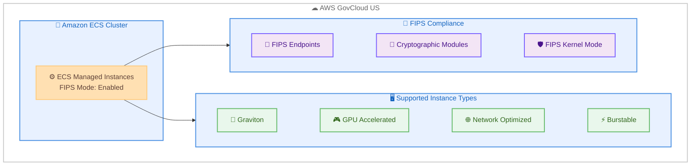

# Amazon ECS Managed Instances - GovCloud での FIPS 準拠ワークロードが Graviton および GPU インスタンスに対応

**リリース日**: 2026 年 3 月 26 日
**サービス**: Amazon Elastic Container Service (Amazon ECS)
**機能**: ECS Managed Instances における FIPS 準拠ワークロードの Graviton/GPU インスタンスサポート

[このアップデートのインフォグラフィックを見る](https://takech9203.github.io/aws-news-summary/20260326-amazon-ecs-mi-supports-fips-graviron-gpu.html)

## 概要

Amazon ECS Managed Instances が、AWS GovCloud (US) リージョンにおいて Graviton ベースおよび GPU アクセラレーテッドインスタンスでの FIPS (Federal Information Processing Standard) 準拠モードでのワークロードデプロイをサポートしました。FIPS は、機密情報を保護する暗号モジュールのセキュリティ要件を規定する米国およびカナダの政府標準規格です。

AWS GovCloud (US) リージョンでは、ECS Managed Instances はデフォルトで FIPS 準拠を自動的に有効化します。ECS Managed Instances は FIPS 準拠のエンドポイントを通じて通信し、適切に構成された暗号モジュールを使用し、基盤となるカーネルを FIPS モードで起動します。連邦政府のコンプライアンス要件を持つユーザーは、Graviton ベース、GPU アクセラレーテッド、ネットワーク最適化、バースト可能パフォーマンスインスタンスを含む幅広いインスタンスタイプで、FIPS 検証済みの暗号モジュールを使用したワークロードを実行できます。

**アップデート前の課題**

- GovCloud で ECS Managed Instances を使用する際、Graviton ベースのインスタンスでの FIPS 準拠ワークロードの実行が制限されていた
- GPU アクセラレーテッドインスタンスで FIPS 準拠モードを有効化した状態でのコンテナワークロード実行が困難だった
- 政府系ワークロードでコスト効率の高い Graviton プロセッサを FIPS 準拠で活用することが難しかった

**アップデート後の改善**

- Graviton ベースのインスタンスで FIPS 準拠のコンテナワークロードを GovCloud で実行可能になった
- GPU アクセラレーテッドインスタンスを含む幅広いインスタンスタイプで FIPS 準拠モードが利用可能になった
- GovCloud では FIPS 準拠がデフォルトで自動的に有効化されるため、追加設定が不要になった

## アーキテクチャ図



ECS Managed Instances が GovCloud でデフォルトで FIPS 準拠を有効化し、FIPS エンドポイント、暗号モジュール、FIPS カーネルモードを通じてセキュアな通信を実現する構成を示しています。

## サービスアップデートの詳細

### 主要機能

1. **FIPS 準拠の自動有効化**
   - AWS GovCloud (US) リージョンでは、ECS Managed Instances がデフォルトで FIPS 準拠を自動的に有効化
   - 追加の設定や手動構成が不要
   - FIPS 準拠のエンドポイントを通じたサービス間通信

2. **幅広いインスタンスタイプのサポート**
   - Graviton ベースインスタンス: コスト効率の高い Arm ベースプロセッサ
   - GPU アクセラレーテッドインスタンス: ML/AI ワークロード向け
   - ネットワーク最適化インスタンス: 高帯域幅が必要なワークロード向け
   - バースト可能パフォーマンスインスタンス: 変動するワークロード向け

3. **暗号モジュールとカーネルレベルの FIPS 対応**
   - 適切に構成された FIPS 検証済み暗号モジュールの使用
   - 基盤となるカーネルが FIPS モードで起動
   - エンドツーエンドの暗号化コンプライアンスを確保

## 技術仕様

### サポートされるインスタンスタイプ

| カテゴリ | 説明 | 主なユースケース |
|---------|------|----------------|
| Graviton ベース | AWS 独自設計の Arm ベースプロセッサ | コスト効率重視の汎用ワークロード |
| GPU アクセラレーテッド | GPU 搭載インスタンス | ML 推論、HPC、グラフィックス処理 |
| ネットワーク最適化 | 高帯域幅ネットワーク | データ転送集約型ワークロード |
| バースト可能パフォーマンス | 可変 CPU パフォーマンス | 負荷が変動するワークロード |

### FIPS 準拠の構成要素

| 要素 | 詳細 |
|------|------|
| FIPS エンドポイント | FIPS 準拠のサービスエンドポイントを通じた通信 |
| 暗号モジュール | FIPS 140 検証済みの暗号モジュール |
| カーネルモード | FIPS モードで起動されるカーネル |
| デフォルト有効化 | GovCloud では自動的に有効化 |

## 設定方法

### 前提条件

1. AWS GovCloud (US) リージョンの AWS アカウント
2. Amazon ECS クラスターの作成権限
3. 適切な IAM ロールとポリシーの設定

### 手順

#### ステップ 1: ECS クラスターの作成または更新

```bash
aws ecs create-cluster \
  --cluster-name my-fips-cluster \
  --region us-gov-west-1
```

GovCloud リージョンで ECS クラスターを作成します。FIPS 準拠はデフォルトで自動的に有効化されます。

#### ステップ 2: ECS Managed Instances の有効化

AWS コンソール、Amazon ECS MCP Server、ECS Express Mode、または Infrastructure as Code ツールを使用して、新規または既存の Amazon ECS クラスターで ECS Managed Instances を有効化します。

```bash
aws ecs put-cluster-capacity-providers \
  --cluster my-fips-cluster \
  --capacity-providers FARGATE FARGATE_SPOT \
  --default-capacity-provider-strategy \
    capacityProvider=FARGATE,weight=1 \
  --region us-gov-west-1
```

クラスターにキャパシティプロバイダーを設定します。GovCloud リージョンでは FIPS 準拠が自動的に適用されます。

#### ステップ 3: タスクのデプロイ

```bash
aws ecs run-task \
  --cluster my-fips-cluster \
  --task-definition my-task-definition \
  --region us-gov-west-1
```

タスクをデプロイします。FIPS 準拠は透過的に適用されるため、タスク定義の変更は不要です。

## メリット

### ビジネス面

- **政府コンプライアンスの達成**: FIPS 140 準拠が求められる連邦政府および州政府のワークロードに対応可能
- **コスト最適化**: Graviton インスタンスの活用により、FIPS 準拠を維持しながら最大 40% のコスト削減を実現
- **運用の簡素化**: GovCloud でのデフォルト自動有効化により、FIPS 準拠の設定管理負荷を軽減

### 技術面

- **幅広いインスタンス選択肢**: Graviton、GPU、ネットワーク最適化、バースト可能と、ワークロードに最適なインスタンスを FIPS 準拠で選択可能
- **エンドツーエンドの暗号化**: FIPS エンドポイント、暗号モジュール、カーネルモードの 3 層で包括的なセキュリティを確保
- **透過的な統合**: 既存のタスク定義やアプリケーションコードの変更なしに FIPS 準拠を適用可能

## デメリット・制約事項

### 制限事項

- AWS GovCloud (US) リージョンのみで利用可能
- ECS Managed Instances のコンピュート管理に対する追加料金が発生 (通常の Amazon EC2 コストに加算)
- FIPS モードでの暗号処理により、一部のワークロードでわずかなパフォーマンスオーバーヘッドが発生する可能性がある

### 考慮すべき点

- GovCloud アカウントの取得には特定の要件を満たす必要がある
- FIPS 準拠のアプリケーションが FIPS 検証済みの暗号ライブラリを使用していることを確認する必要がある

## ユースケース

### ユースケース 1: 連邦政府機関の ML/AI ワークロード

**シナリオ**: 連邦政府機関が機密データを使用した機械学習モデルの推論を FIPS 準拠環境で実行する必要がある。

**実装例**:
```json
{
  "family": "ml-inference-fips",
  "containerDefinitions": [
    {
      "name": "ml-inference",
      "image": "my-govcloud-account.dkr.ecr.us-gov-west-1.amazonaws.com/ml-model:latest",
      "cpu": 4096,
      "memory": 8192,
      "essential": true,
      "resourceRequirements": [
        {
          "type": "GPU",
          "value": "1"
        }
      ]
    }
  ]
}
```

**効果**: GPU アクセラレーテッドインスタンス上で FIPS 準拠の ML 推論パイプラインを運用し、連邦政府のセキュリティ要件を満たしながら高パフォーマンスな推論処理を実現。

### ユースケース 2: コスト最適化された政府系 Web アプリケーション

**シナリオ**: 政府系 Web アプリケーションを FIPS 準拠環境で運用しつつ、Graviton インスタンスでコストを最適化したい。

**実装例**:
```json
{
  "family": "gov-web-app",
  "runtimePlatform": {
    "cpuArchitecture": "ARM64",
    "operatingSystemFamily": "LINUX"
  },
  "containerDefinitions": [
    {
      "name": "web-app",
      "image": "my-govcloud-account.dkr.ecr.us-gov-west-1.amazonaws.com/web-app:latest",
      "cpu": 1024,
      "memory": 2048,
      "essential": true,
      "portMappings": [
        {
          "containerPort": 8080,
          "protocol": "tcp"
        }
      ]
    }
  ]
}
```

**効果**: Graviton ベースのインスタンスで FIPS 準拠を維持しながら、x86 ベースのインスタンスと比較してコンピュートコストを削減。

### ユースケース 3: バースト可能パフォーマンスでの開発・テスト環境

**シナリオ**: FIPS 準拠が求められるプロジェクトの開発・テスト環境をバースト可能パフォーマンスインスタンスで低コストに運用する。

**実装例**:
```bash
aws ecs create-service \
  --cluster my-fips-cluster \
  --service-name dev-test-service \
  --task-definition dev-test-task \
  --desired-count 2 \
  --region us-gov-west-1
```

**効果**: バースト可能パフォーマンスインスタンスにより開発・テスト環境のコストを抑えながら、本番環境と同じ FIPS 準拠レベルで動作検証が可能。

## 料金

ECS Managed Instances を使用する場合、プロビジョニングされたコンピュートの管理に対する料金が、通常の Amazon EC2 コストに加えて発生します。FIPS 準拠の有効化自体に追加料金はありません。

### 料金例

| 構成要素 | 料金体系 |
|---------|---------|
| Amazon EC2 インスタンス | 使用するインスタンスタイプに応じた通常料金 |
| ECS Managed Instances 管理料金 | プロビジョニングされたコンピュートに対する追加料金 |
| FIPS 準拠 | 追加料金なし |

## 利用可能リージョン

- AWS GovCloud (US-West): us-gov-west-1
- AWS GovCloud (US-East): us-gov-east-1

## 関連サービス・機能

- **Amazon ECS**: フルマネージドのコンテナオーケストレーションサービス。ECS Managed Instances はその上で動作するコンピュートレイヤー
- **AWS GovCloud**: 米国政府のコンプライアンス要件を満たすために設計された分離された AWS リージョン
- **AWS Graviton**: AWS が設計したカスタム Arm プロセッサ。コスト効率の高いコンピュートを提供
- **FIPS 140**: 暗号モジュールのセキュリティ要件を定義する米国およびカナダの政府標準規格

## 参考リンク

- [このアップデートのインフォグラフィック](https://takech9203.github.io/aws-news-summary/20260326-amazon-ecs-mi-supports-fips-graviron-gpu.html)
- [公式発表 (What's New)](https://aws.amazon.com/about-aws/whats-new/2026/03/amazon-ecs-mi-supports-fips-graviron-gpu/)
- [FIPS on AWS](https://aws.amazon.com/compliance/fips/)
- [AWS Fargate Federal Information Processing Standard (FIPS-140) ドキュメント](https://docs.aws.amazon.com/AmazonECS/latest/developerguide/ecs-fips-compliance.html)
- [Amazon ECS Managed Instances 機能ページ](https://aws.amazon.com/ecs/managed-instances/)
- [Amazon ECS ドキュメント](https://docs.aws.amazon.com/AmazonECS/latest/developerguide/)

## まとめ

今回のアップデートにより、AWS GovCloud (US) リージョンにおいて ECS Managed Instances が Graviton ベースおよび GPU アクセラレーテッドインスタンスでの FIPS 準拠ワークロードをサポートしました。連邦政府のセキュリティ要件を満たしながら、Graviton の価格性能比の高さや GPU アクセラレーションを活用できるため、政府系ワークロードのコスト最適化とパフォーマンス向上の両立が期待できます。GovCloud で FIPS 準拠のコンテナワークロードを運用しているユーザーは、ECS Managed Instances への移行を検討することを推奨します。
