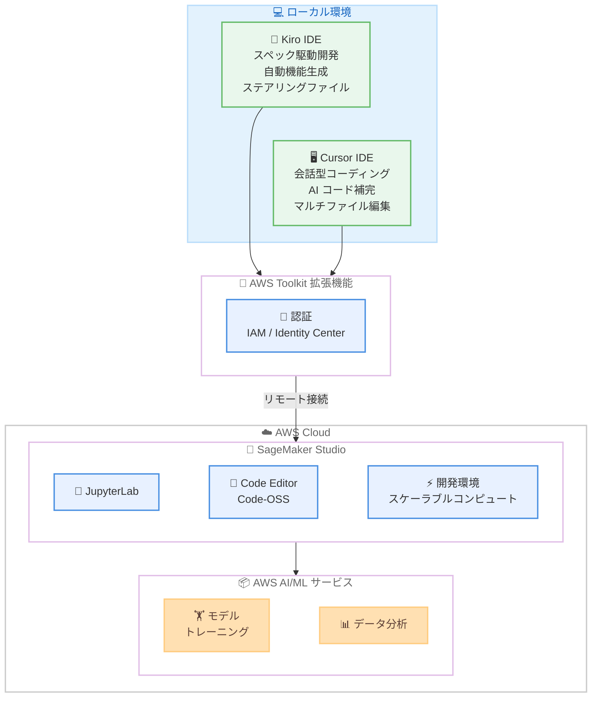

# Amazon SageMaker Studio - Kiro および Cursor IDE のリモート IDE サポート

**リリース日**: 2026 年 3 月 26 日
**サービス**: Amazon SageMaker Studio
**機能**: Kiro and Cursor IDEs as Remote IDEs

📊 [このアップデートのインフォグラフィックを見る](https://takech9203.github.io/aws-news-summary/20260326-amazon-sagemaker-studio-kiro-cursor.html)

## 概要

Amazon SageMaker Studio が、Kiro および Cursor IDE からのリモート接続をサポートしました。データサイエンティスト、ML エンジニア、開発者は、Kiro のスペック駆動開発や自動機能生成、Cursor の会話型コーディングや AI コード補完といった各 IDE 固有の機能をそのまま活用しながら、Amazon SageMaker Studio のスケーラブルなコンピューティングリソースにアクセスできるようになります。

SageMaker Studio は、JupyterLab、Code-OSS ベースの Code Editor、VS Code IDE のリモート接続など、フルマネージドのクラウド対話型開発環境を幅広く提供しています。今回のアップデートにより、Kiro と Cursor が新たにリモート IDE として追加され、AWS Toolkit 拡張機能を介した認証または SageMaker Studio の Web インターフェースからの認証により、数クリックで SageMaker Studio の開発環境に接続できます。Web ベースの環境と同じセキュリティ境界が維持されるため、セキュアな環境で AI モデル開発やデータ分析を行うことが可能です。

**アップデート前の課題**

- Kiro や Cursor の AI 支援機能を活用しつつ SageMaker Studio のクラウドリソースを利用するには、ローカル IDE とクラウドインフラ間でコンテキストスイッチが必要だった
- SageMaker Studio のリモート IDE サポートは VS Code に限定されており、Kiro や Cursor ユーザーは慣れた開発環境をクラウドリソースと組み合わせて使用できなかった
- Kiro のスペック駆動開発ワークフローやステアリングファイル、フックといったカスタマイズをクラウド環境で活用する手段がなかった

**アップデート後の改善**

- Kiro および Cursor IDE から AWS Toolkit 拡張機能を使用して SageMaker Studio に直接リモート接続が可能になった
- Kiro のスペック駆動開発、Cursor の AI コード補完など、各 IDE 固有のエージェンティック開発ワークフローをクラウドリソース上でそのまま活用可能になった
- ローカル IDE とクラウドインフラ間のコンテキストスイッチが不要になり、単一環境で AWS の分析サービスや AI/ML サービスを利用可能になった

## アーキテクチャ図



ローカルの Kiro および Cursor IDE から AWS Toolkit 拡張機能を介して SageMaker Studio にリモート接続し、クラウド上の開発環境や AI/ML サービスにアクセスする全体的なアーキテクチャを示しています。

## サービスアップデートの詳細

### 主要機能

1. **Kiro IDE からのリモート接続**
   - スペック駆動開発ワークフローをクラウド環境で活用可能
   - ステアリングファイルやフックなどの Kiro 固有のカスタマイズをそのまま利用
   - 自動機能生成機能によるクラウド上での効率的な開発

2. **Cursor IDE からのリモート接続**
   - AI パワードのコード補完機能をクラウドリソース上で利用可能
   - 会話型コーディングによる直感的な開発体験
   - マルチファイル編集機能による大規模プロジェクトの効率的な管理

3. **AWS Toolkit 拡張機能による統合認証**
   - Kiro または Cursor 内の AWS Toolkit 拡張機能を通じた IAM ベースの認証
   - SageMaker Studio の Web インターフェースからの認証にも対応
   - Web ベースの環境と同じセキュリティ境界を維持

## 技術仕様

### 対応 IDE

| IDE | 主な特徴 | 接続方式 |
|-----|---------|---------|
| Kiro | スペック駆動開発、自動機能生成、ステアリングファイル | AWS Toolkit 拡張機能 / Web UI |
| Cursor | AI コード補完、会話型コーディング、マルチファイル編集 | AWS Toolkit 拡張機能 / Web UI |
| VS Code | 汎用コード開発、豊富な拡張機能 | AWS Toolkit 拡張機能 / Web UI |

### SageMaker Studio クラウド IDE

| IDE | ベース | 接続タイプ |
|-----|--------|-----------|
| JupyterLab | Jupyter | Web ブラウザ |
| Code Editor | Code-OSS | Web ブラウザ |
| Kiro | Kiro IDE | リモート IDE |
| Cursor | Cursor IDE | リモート IDE |
| VS Code | VS Code | リモート IDE |

### API 変更履歴

| 日付 | サービス | 変更内容 |
|------|----------|----------|
| 2026/03/26 | [Amazon SageMaker Service](https://awsapichanges.com/archive/changes/a42e6c-api.sagemaker.html) | 9 updated api methods - ml.r5d.16xlarge インスタンスタイプのサポート追加 |

今回の Kiro/Cursor リモート IDE サポート自体は AWS Toolkit 拡張機能のアップデートとして提供されており、SageMaker API の直接的な変更は確認されていません。上記は同日に公開された SageMaker 関連の API 変更です。

## 設定方法

### 前提条件

1. Kiro IDE または Cursor IDE がローカル環境にインストールされていること
2. AWS アカウントと SageMaker Studio へのアクセス権限
3. AWS Toolkit 拡張機能がインストールされていること

### 手順

#### ステップ 1: AWS Toolkit 拡張機能のインストール

Kiro または Cursor IDE の拡張機能マーケットプレイスから AWS Toolkit をインストールします。両 IDE とも Code-OSS との互換性があるため、VS Code 互換の拡張機能が利用可能です。

#### ステップ 2: AWS 認証情報の設定

AWS Toolkit 拡張機能を使用して認証情報を設定します。IAM ユーザーまたは IAM Identity Center の認証情報を使用してサインインします。代替として、SageMaker Studio の Web インターフェースからも認証を行うことが可能です。

#### ステップ 3: SageMaker Studio 開発環境への接続

認証完了後、AWS Toolkit から SageMaker Studio の開発環境一覧を確認し、接続先の環境を選択します。数クリックで接続が完了し、ローカル IDE のすべての機能をクラウドリソース上で利用開始できます。

## メリット

### ビジネス面

- **開発生産性の向上**: ローカル IDE とクラウド環境間のコンテキストスイッチが不要になり、開発者の集中力と生産性が向上
- **ツール選択の柔軟性**: Kiro、Cursor、VS Code など、チームメンバーが最も生産性の高い IDE を自由に選択可能
- **導入コストの低減**: 既存の IDE ライセンスと AWS 環境をそのまま活用でき、新たなツールの学習コストが不要

### 技術面

- **エージェンティック開発のスケール**: Kiro のスペック駆動開発や Cursor の AI コード補完をクラウドのスケーラブルなリソースと組み合わせて活用可能
- **シームレスなワークフロー**: ローカルでのプロトタイピングからクラウドスケールの処理まで、同一 IDE 内で完結
- **セキュアな接続**: Web ベースの環境と同じセキュリティ境界が維持され、IAM ベースの認証によりエンタープライズレベルのセキュリティを確保

## デメリット・制約事項

### 制限事項

- Kiro および Cursor は有償ソフトウェアのため、ライセンスコストが追加で発生する
- リモート接続の安定性はネットワーク環境に依存する
- 一部のローカル拡張機能がリモート接続環境では正常に動作しない場合がある

### 考慮すべき点

- IDE のバージョンアップに伴い、AWS Toolkit 拡張機能との互換性を定期的に確認する必要がある
- チーム内で複数の IDE を使用する場合、開発環境の標準化と IDE 固有の設定管理のバランスを検討する必要がある

## ユースケース

### ユースケース 1: Kiro を活用したスペック駆動 ML 開発

**シナリオ**: ML エンジニアが Kiro のスペック駆動開発機能を活用して、ML パイプラインの仕様を定義し、自動機能生成により実装を効率化しながら、SageMaker Studio のスケーラブルなコンピューティングリソース上でトレーニングジョブを実行します。

**実装例**:
```
1. Kiro IDE で AWS Toolkit 拡張機能を使用して SageMaker Studio に接続
2. Kiro のスペックファイルで ML パイプラインの仕様を定義
3. 自動機能生成によりトレーニングスクリプトを作成
4. SageMaker Studio のコンピューティングリソース上でトレーニングジョブを実行
```

**効果**: スペック駆動開発による設計から実装までの一貫したワークフローと、クラウドリソースによる大規模トレーニングの実行を両立

### ユースケース 2: Cursor を活用した AI 支援データ分析

**シナリオ**: データサイエンティストが Cursor の会話型コーディング機能を使用して、自然言語でデータ分析コードを記述し、SageMaker Studio 上のリソースで大規模データセットの処理を実行します。

**実装例**:
```
1. Cursor IDE から SageMaker Studio にリモート接続
2. 会話型コーディングで「このデータセットの異常値を検出するコードを書いて」と指示
3. AI が生成したコードをクラウド上のコンピューティングリソースで実行
4. 結果を確認しながら反復的にコードを改善
```

**効果**: AI 支援によるコーディング速度の向上と、クラウドリソースによる大規模データ処理の効率化

### ユースケース 3: マルチ IDE チームでの共同開発

**シナリオ**: チーム内で Kiro、Cursor、VS Code を使用する開発者が混在する環境で、全員が同じ SageMaker Studio の開発環境にアクセスし、統一されたインフラストラクチャ上で共同開発を行います。

**実装例**:
```
1. 各開発者が自分の好みの IDE に AWS Toolkit 拡張機能をインストール
2. 全員が同じ SageMaker Studio の開発環境にリモート接続
3. Kiro ユーザーはスペック駆動開発、Cursor ユーザーは会話型コーディングを活用
4. 共通のコンピューティングリソースとデータソースを利用して共同作業
```

**効果**: IDE の選択自由度を維持しながら、統一されたクラウドインフラストラクチャによるチーム開発の効率化

## 料金

Kiro および Cursor IDE からの SageMaker Studio へのリモート接続機能自体に追加料金はありません。以下の既存料金が適用されます。

### 料金例

| 項目 | 料金体系 |
|------|---------|
| SageMaker Studio | コンピューティングインスタンスの使用量に基づく |
| Kiro IDE | 別途 Kiro のライセンス料金 |
| Cursor IDE | 別途 Cursor のライセンス料金 |

## 利用可能リージョン

Amazon SageMaker Studio が利用可能なすべてのリージョンでサポートされます。

## 関連サービス・機能

- **Amazon SageMaker Studio**: データサイエンスと ML 開発のためのフルマネージドクラウド IDE プラットフォーム
- **AWS Toolkit**: IDE と AWS サービスを接続するための拡張機能
- **Kiro**: AWS が提供するスペック駆動開発に対応した AI 搭載 IDE
- **Cursor**: AI パワードのコード補完と会話型コーディングを提供する IDE

## 参考リンク

- 📊 [インフォグラフィック](https://takech9203.github.io/aws-news-summary/20260326-amazon-sagemaker-studio-kiro-cursor.html)
- [公式発表 (What's New)](https://aws.amazon.com/about-aws/whats-new/2026/03/amazon-sagemaker-studio-kiro-cursor/)
- [ドキュメント - SageMaker Studio Remote Access](https://docs.aws.amazon.com/sagemaker/latest/dg/remote-access.html)

## まとめ

Amazon SageMaker Studio が Kiro および Cursor IDE からのリモート接続をサポートしたことにより、開発者は各 IDE 固有のエージェンティック開発機能を活用しながらクラウド上のスケーラブルなリソースにシームレスにアクセスできるようになりました。VS Code に加えて Kiro と Cursor が選択肢に追加されたことで、チーム内の IDE 選択の柔軟性が大幅に向上しています。Kiro のスペック駆動開発や Cursor の AI コード補完を日常的に活用しているデータサイエンティストや ML エンジニアは、AWS Toolkit 拡張機能をインストールして SageMaker Studio への接続を試みることを推奨します。
