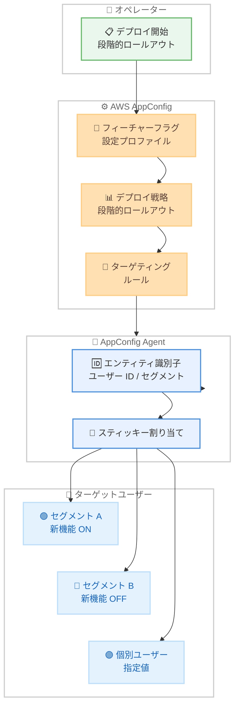

# AWS AppConfig - 段階的ロールアウト中の拡張ターゲティング機能

**リリース日**: 2026 年 3 月 26 日
**サービス**: AWS AppConfig
**機能**: Enhanced targeting during feature flag rollout

📊 [このアップデートのインフォグラフィックを見る](https://takech9203.github.io/aws-news-summary/20260326-appconfig-enhanced-targeting-feature-flag-rollout.html)

## 概要

AWS AppConfig が段階的ロールアウトのライフサイクル中に、フィーチャーフラグおよび設定データの値を特定のセグメントや個々のユーザーにターゲティングできる新しいコントロールを追加しました。この機能により、プログレッシブデリバリーの安全性を維持しながら、きめ細かなターゲット制御が可能になります。

AWS AppConfig の主要な安全ガードレールの 1 つである段階的ロールアウトでは、フィーチャーフラグや設定データの変更を数分から数時間かけてゆっくりと展開できます。今回の拡張ターゲティング機能では、AppConfig Agent を使用してエンティティ識別子に基づき、特定のフィーチャーフラグや動的設定データを個々のターゲットセグメントに「スティッキー」に割り当てることで、デプロイ中の一貫性のある体験を保証します。

**アップデート前の課題**

- 段階的ロールアウト中に特定のユーザーやセグメントに対してフィーチャーフラグの値をターゲティングする標準的な手段がなかった
- ロールアウトの進行に伴い、同一ユーザーが異なるフラグ値を受け取る可能性があり、一貫性のないユーザー体験が発生していた
- 個々のユーザー ID を指定してデプロイ中のフィーチャーフラグ制御を行うためのネイティブ機能が不足していた

**アップデート後の改善**

- 段階的ロールアウト中に特定のセグメントや個々のユーザーにフィーチャーフラグ値をターゲティング可能に
- エンティティ識別子を使用したスティッキーな割り当てにより、ロールアウト期間中のユーザー体験の一貫性を確保
- AppConfig Agent を活用したきめ細かな制御で、個々のユーザー ID レベルでのターゲティングが可能に

## アーキテクチャ図



AWS AppConfig の段階的ロールアウトにおける拡張ターゲティングの全体フローを示しています。オペレーターがデプロイを開始すると、AppConfig Agent がエンティティ識別子に基づいてスティッキーな割り当てを行い、各セグメントや個別ユーザーに一貫したフィーチャーフラグ値を配信します。

## サービスアップデートの詳細

### 主要機能

1. **エンティティ識別子ベースのターゲティング**
   - ユーザーが提供するエンティティ識別子を使用して、フィーチャーフラグや動的設定データを特定のターゲットに割り当て
   - 個々のユーザー ID、ユーザーグループ、セグメントなど、柔軟な識別子を使用可能
   - 段階的ロールアウトのライフサイクル全体を通じて、ターゲティングの一貫性を維持

2. **スティッキーな設定割り当て**
   - 特定のフィーチャーフラグや動的設定データが個々のターゲットセグメントに「スティッキー」に固定
   - ロールアウトの進行状況に関わらず、同一ユーザーは常に同じフラグ値を受け取る
   - プログレッシブデリバリー中のユーザー体験の一貫性を保証

3. **AppConfig Agent を活用したきめ細かな制御**
   - AppConfig Agent がエンティティ識別子の解決とターゲティングロジックを実行
   - 個々のユーザー ID レベルでのターゲティングが可能
   - デプロイ中のリアルタイムなターゲット制御を実現

4. **段階的ロールアウトとの統合**
   - 既存の段階的デプロイ戦略との完全な互換性
   - 数分から数時間かけたプログレッシブデリバリーにターゲティング機能を追加
   - 安全ガードレールとターゲティングの組み合わせにより、リスクを最小化

## 技術仕様

### ターゲティング機能の概要

| 項目 | 詳細 |
|------|------|
| ターゲティング単位 | セグメント、個々のユーザー ID |
| 識別子タイプ | エンティティ識別子 |
| 割り当て方式 | スティッキー |
| 実行基盤 | AppConfig Agent |
| 対象設定タイプ | フィーチャーフラグ、動的設定データ |
| デプロイ方式 | 段階的ロールアウト |

### API 変更履歴

直近 7 日間で AppConfig に関連する API 変更は検出されませんでした。

### AppConfig Agent でのターゲティング設定例

```json
{
    "flags": {
        "new_checkout_flow": {
            "enabled": true,
            "targeting": {
                "segments": [
                    {
                        "name": "beta_users",
                        "value": {
                            "enabled": true,
                            "variant": "new_flow"
                        }
                    },
                    {
                        "name": "internal_testers",
                        "value": {
                            "enabled": true,
                            "variant": "new_flow"
                        }
                    }
                ],
                "individual_targets": [
                    {
                        "entity_id": "user-12345",
                        "value": {
                            "enabled": true,
                            "variant": "new_flow"
                        }
                    }
                ],
                "default_value": {
                    "enabled": false,
                    "variant": "legacy_flow"
                }
            }
        }
    }
}
```

## 設定方法

### 前提条件

1. AWS アカウントと AWS AppConfig の設定
2. AppConfig Agent のインストールおよび設定
3. フィーチャーフラグまたは動的設定プロファイルの作成
4. 段階的デプロイ戦略の定義

### 手順

#### ステップ 1: フィーチャーフラグの設定プロファイルを作成

ターゲティングルールを含むフィーチャーフラグの設定プロファイルを作成します。

```bash
aws appconfig create-configuration-profile \
    --application-id MyApp \
    --name "FeatureFlagsWithTargeting" \
    --location-uri "hosted" \
    --type "AWS.AppConfig.FeatureFlags"
```

AWS AppConfig にフィーチャーフラグ型の設定プロファイルを作成するコマンドです。`--type` パラメータでフィーチャーフラグ型を指定しています。

#### ステップ 2: 段階的デプロイ戦略を作成

ターゲティングと組み合わせて使用する段階的デプロイ戦略を定義します。

```bash
aws appconfig create-deployment-strategy \
    --name "GradualRolloutWithTargeting" \
    --deployment-duration-in-minutes 60 \
    --growth-factor 10 \
    --growth-type LINEAR \
    --replicate-to NONE
```

60 分間で 10% ずつリニアに展開する段階的デプロイ戦略を作成するコマンドです。この戦略により、ターゲティングされたユーザーへのフラグ配信が段階的に行われます。

#### ステップ 3: AppConfig Agent でエンティティ識別子を指定して設定を取得

AppConfig Agent を使用してエンティティ識別子を指定し、ターゲティングされたフィーチャーフラグの値を取得します。

```bash
# AppConfig Agent エンドポイントからターゲティングされた設定を取得
curl "http://localhost:2772/applications/MyApp/environments/Production/configurations/FeatureFlagsWithTargeting?entity_id=user-12345"
```

AppConfig Agent のローカルエンドポイントに対して、`entity_id` パラメータでユーザー ID を指定してフィーチャーフラグ値を取得するコマンドです。指定されたエンティティ ID に基づいてスティッキーなターゲティングが適用されます。

#### ステップ 4: デプロイを開始

段階的デプロイ戦略を使用してターゲティング付きフィーチャーフラグをデプロイします。

```bash
aws appconfig start-deployment \
    --application-id MyApp \
    --environment-id Production \
    --deployment-strategy-id GradualRolloutWithTargeting \
    --configuration-profile-id FeatureFlagsWithTargeting \
    --configuration-version 1
```

段階的デプロイ戦略を使用してフィーチャーフラグのデプロイを開始するコマンドです。ロールアウト中、ターゲティングされたセグメントや個別ユーザーにはスティッキーな値が配信されます。

## メリット

### ビジネス面

- **ユーザー体験の一貫性**: スティッキーな割り当てにより、ロールアウト中でも同一ユーザーが一貫した体験を得られる
- **段階的リリースの安全性向上**: 特定のセグメントに限定したリリースにより、問題発生時の影響範囲を限定
- **ベータユーザープログラムの効率化**: 特定のユーザーグループに対する先行リリースを容易に実現

### 技術面

- **きめ細かなターゲット制御**: 個々のユーザー ID レベルでのフィーチャーフラグ制御が可能
- **AppConfig Agent のネイティブ機能**: 追加のインフラストラクチャなしでターゲティングを実現
- **既存ワークフローとの互換性**: 段階的デプロイ戦略やロールバック機能との完全な統合

## デメリット・制約事項

### 制限事項

- AppConfig Agent の使用が前提条件であり、直接 API 呼び出しではターゲティング機能を利用できない可能性がある
- エンティティ識別子の設計と管理はユーザー側の責任であり、適切な識別子スキーマの策定が必要
- 大量のターゲティングルールを設定した場合、設定サイズの制限に抵触する可能性がある

### 考慮すべき点

- ターゲティングルールの複雑化に伴い、設定の可読性と保守性が低下するリスクがある
- 段階的ロールアウトとターゲティングの組み合わせにより、デバッグやトラブルシューティングが複雑になる場合がある
- エンティティ識別子の一貫性を保つため、アプリケーション全体で統一した識別子スキーマを使用する必要がある

## ユースケース

### ユースケース 1: ベータユーザーへの新機能先行リリース

**シナリオ**: SaaS アプリケーションで新しいダッシュボード機能をリリースする際、まずベータプログラムに参加しているユーザーグループに対してのみ機能を有効化し、フィードバックを収集した上で全ユーザーに展開したい。

**実装例**:
```json
{
    "flags": {
        "new_dashboard": {
            "enabled": true,
            "targeting": {
                "segments": [
                    {
                        "name": "beta_users",
                        "value": {"enabled": true}
                    }
                ],
                "default_value": {"enabled": false}
            }
        }
    }
}
```

**効果**: ベータユーザーセグメントに対してのみ新ダッシュボードを有効化し、段階的ロールアウト中もスティッキーな割り当てにより一貫した体験を提供。問題が発生した場合はベータユーザーのみに影響が限定される

### ユースケース 2: A/B テストの安定的な実施

**シナリオ**: EC サイトで新しいチェックアウトフローの A/B テストを実施する際、段階的ロールアウト中に同一ユーザーが常に同じバリアントを体験するようにしたい。

**実装例**:
```json
{
    "flags": {
        "checkout_variant": {
            "enabled": true,
            "targeting": {
                "individual_targets": [
                    {"entity_id": "user-001", "value": {"variant": "A"}},
                    {"entity_id": "user-002", "value": {"variant": "B"}}
                ],
                "default_value": {"variant": "control"}
            }
        }
    }
}
```

**効果**: エンティティ識別子に基づくスティッキーな割り当てにより、A/B テストの統計的有意性を維持しながら段階的にテスト対象を拡大可能

### ユースケース 3: 特定テナントへのカスタム設定配信

**シナリオ**: マルチテナント SaaS プラットフォームで、特定の大口顧客テナントに対して動的設定値をカスタマイズしながら、段階的にプラットフォーム全体へ変更を展開したい。

**実装例**:
```json
{
    "flags": {
        "rate_limit_config": {
            "enabled": true,
            "targeting": {
                "segments": [
                    {
                        "name": "enterprise_tier",
                        "value": {"requests_per_second": 10000}
                    },
                    {
                        "name": "standard_tier",
                        "value": {"requests_per_second": 1000}
                    }
                ],
                "default_value": {"requests_per_second": 500}
            }
        }
    }
}
```

**効果**: テナントティアに基づくターゲティングにより、段階的ロールアウト中も各テナントに適切な設定値を安定的に配信。ロールアウト完了後も同じターゲティングルールで運用を継続可能

## 料金

AWS AppConfig のターゲティング機能自体に追加料金はありません。以下の AWS AppConfig の標準料金が適用されます。

### 料金例

| 項目 | 料金 |
|------|------|
| 設定リクエスト (API コール) | $0.0000002 / リクエスト |
| 設定受信 | $0.0008 / 受信 |

AppConfig Agent を使用した設定取得もリクエスト数に基づいて課金されます。詳細は [AWS Systems Manager 料金ページ](https://aws.amazon.com/systems-manager/pricing/) を参照してください。

## 利用可能リージョン

AWS GovCloud (US) リージョンを含む、すべての AWS リージョンで利用可能です。

## 関連サービス・機能

- **AWS AppConfig**: フィーチャーフラグと動的設定の管理・デプロイサービス
- **AppConfig Agent**: アプリケーションサイドカーとして動作し、設定の取得とキャッシュを管理するエージェント
- **AWS AppConfig Extensions**: デプロイワークフローにカスタムアクションを追加する拡張機能
- **Amazon CloudWatch**: デプロイ中のアプリケーション健全性監視とアラーム連携
- **AWS Lambda**: AppConfig Agent のサーバーレス環境での実行基盤

## 参考リンク

- 📊 [インフォグラフィック](https://takech9203.github.io/aws-news-summary/20260326-appconfig-enhanced-targeting-feature-flag-rollout.html)
- [公式発表 (What's New)](https://aws.amazon.com/about-aws/whats-new/2026/03/appconfig-enhanced-targeting-feature-flag-rollout/)
- [AWS AppConfig ユーザーガイド](https://docs.aws.amazon.com/appconfig/latest/userguide/getting-started-with-appconfig.html)
- [AWS AppConfig Agent ドキュメント](https://docs.aws.amazon.com/appconfig/latest/userguide/appconfig-integration-ec2.html)
- [AWS Systems Manager 料金](https://aws.amazon.com/systems-manager/pricing/)

## まとめ

AWS AppConfig の拡張ターゲティング機能により、段階的ロールアウト中にフィーチャーフラグや動的設定データを特定のセグメントや個々のユーザーにターゲティングできるようになりました。AppConfig Agent とエンティティ識別子を使用したスティッキーな割り当てにより、プログレッシブデリバリーの安全性を維持しながらきめ細かなターゲット制御が可能になります。ベータユーザーへの先行リリース、A/B テスト、テナント別設定配信など、多様なユースケースでデプロイの安全性とユーザー体験の一貫性を両立させる機能です。
