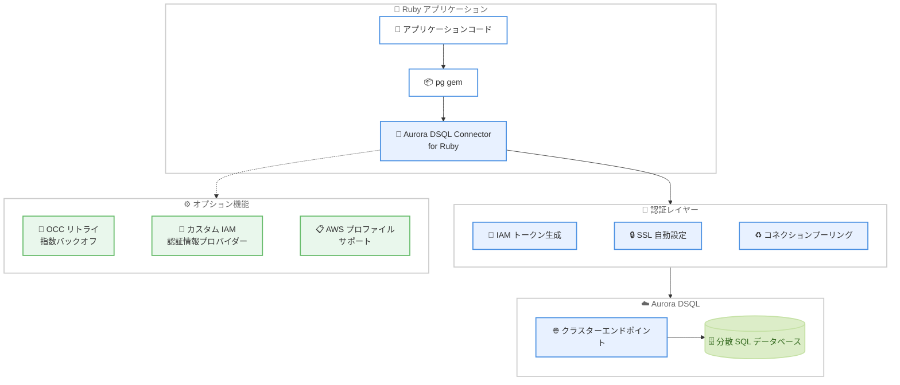

# Aurora DSQL - Ruby 向けコネクタの提供開始

**リリース日**: 2026 年 3 月 26 日
**サービス**: Amazon Aurora DSQL
**機能**: Aurora DSQL Connector for Ruby (pg gem)

📊 [このアップデートのインフォグラフィックを見る](https://takech9203.github.io/aws-news-summary/20260326-aurora-dsql-connector-for-ruby.html)

## 概要

Amazon Aurora DSQL が Ruby アプリケーション向けの公式コネクタをリリースした。このコネクタは Ruby の標準的な PostgreSQL クライアントライブラリである pg gem と完全な互換性を持ち、Aurora DSQL への接続における認証、SSL 設定、コネクションプーリングを自動的に処理する。

従来、Aurora DSQL に Ruby アプリケーションから接続する際には、IAM トークンの生成や SSL 設定を開発者が手動で実装する必要があった。今回のコネクタにより、接続ごとに自動的にトークンが生成され、有効なトークンが常に使用されるため、従来のユーザー生成パスワードに関連するセキュリティリスクが排除される。さらに、楽観的同時実行制御 (OCC) リトライやカスタム IAM 認証情報プロバイダー、AWS プロファイルサポートなどの高度な機能もオプトインで利用可能である。

**アップデート前の課題**

- Ruby アプリケーションから Aurora DSQL に接続する際、IAM トークンの生成ロジックを独自に実装する必要があった
- SSL/TLS 設定を手動で構成する必要があり、設定ミスによるセキュリティリスクが存在した
- コネクションプーリングの実装やトークンの有効期限管理を開発者が自ら行う必要があった
- OCC リトライロジックの実装が複雑で、アプリケーションごとに独自の実装が必要だった

**アップデート後の改善**

- pg gem 互換のコネクタを導入するだけで、IAM 認証が自動的に処理されるようになった
- SSL 設定が自動構成され、セキュアな接続がデフォルトで確立されるようになった
- コネクションプーリングとトークン管理がコネクタ側で一元管理されるようになった
- オプトインの OCC リトライ機能により、指数バックオフ付きの再試行が簡単に利用可能になった

## アーキテクチャ図



Ruby アプリケーションから Aurora DSQL への接続フローを示す。コネクタが pg gem と Aurora DSQL の間に位置し、IAM トークン生成、SSL 設定、コネクションプーリングを透過的に処理する。

## サービスアップデートの詳細

### 主要機能

1. **IAM トークン自動生成**
   - 接続ごとに有効な IAM 認証トークンを自動的に生成する
   - トークンの有効期限管理が不要になり、常に有効なトークンが使用される
   - 従来のユーザー生成パスワードに比べてセキュリティが大幅に向上する

2. **SSL 自動設定**
   - Aurora DSQL エンドポイントへの SSL/TLS 接続がデフォルトで有効化される
   - 証明書の設定や更新を手動で管理する必要がない
   - セキュアな通信がゼロコンフィグで実現される

3. **コネクションプーリング**
   - 接続の再利用と効率的な管理が組み込みで提供される
   - 簡単なスクリプトから本番ワークロードまで、認証方式を変更せずにスケール可能
   - 接続数の制御とリソースの効率的な利用が自動的に行われる

4. **OCC リトライ機能**
   - オプトインで楽観的同時実行制御 (OCC) のリトライ機能を有効化可能
   - 指数バックオフアルゴリズムにより、適切な間隔でリトライが実行される
   - 同時実行の競合が発生した場合にアプリケーション側での複雑なリトライロジックが不要になる

5. **カスタム IAM 認証情報プロバイダーと AWS プロファイルサポート**
   - カスタムの IAM 認証情報プロバイダーを指定して柔軟な認証設定が可能
   - AWS プロファイルを指定して複数のアカウントや環境を切り替え可能
   - 既存の AWS 認証情報管理の仕組みとシームレスに統合できる

## 技術仕様

### コネクタの仕様

| 項目 | 詳細 |
|------|------|
| コネクタ名 | Aurora DSQL Connector for Ruby |
| 互換ライブラリ | pg gem |
| 認証方式 | IAM トークンベース認証 (自動生成) |
| 暗号化 | SSL/TLS (自動設定) |
| リトライ機能 | OCC リトライ (オプトイン、指数バックオフ) |
| 認証情報 | カスタム IAM プロバイダー、AWS プロファイル対応 |

### API 変更履歴

今回のアップデートは Aurora DSQL サービス自体の API 変更ではなく、クライアント側のコネクタライブラリのリリースであるため、API レベルの変更はない。

## 設定方法

### 前提条件

1. Ruby がインストールされていること
2. Aurora DSQL クラスターが作成済みであること
3. IAM ユーザーまたはロールに Aurora DSQL への接続権限が付与されていること
4. AWS 認証情報が設定されていること (環境変数、AWS プロファイルなど)

### 手順

#### ステップ 1: コネクタのインストール

```bash
gem install aws-dsql-pg
```

Aurora DSQL Connector for Ruby をインストールする。pg gem への依存関係も自動的に解決される。

#### ステップ 2: 基本的な接続

```ruby
require 'aws-dsql-pg'

# Aurora DSQL コネクタを使用して接続
conn = Aws::Dsql::Pg.connect(
  host: 'your-cluster-endpoint.dsql.us-east-1.on.aws',
  dbname: 'postgres',
  user: 'admin'
)

# クエリの実行
result = conn.exec('SELECT * FROM users LIMIT 10')
result.each do |row|
  puts row
end

conn.close
```

コネクタが IAM トークンの生成と SSL 設定を自動的に処理するため、パスワードや SSL パラメータの指定は不要である。

#### ステップ 3: OCC リトライの有効化

```ruby
require 'aws-dsql-pg'

# OCC リトライを有効化して接続
conn = Aws::Dsql::Pg.connect(
  host: 'your-cluster-endpoint.dsql.us-east-1.on.aws',
  dbname: 'postgres',
  user: 'admin',
  occ_retry: true
)

# トランザクション内での操作
conn.transaction do |tx|
  tx.exec("UPDATE accounts SET balance = balance - 100 WHERE id = 1")
  tx.exec("UPDATE accounts SET balance = balance + 100 WHERE id = 2")
end
```

OCC リトライを有効化することで、同時実行の競合が発生した場合に自動的に指数バックオフ付きのリトライが実行される。

## メリット

### ビジネス面

- **開発速度の向上**: 認証やセキュリティ設定の実装にかかる時間を削減し、ビジネスロジックの開発に集中できる
- **セキュリティリスクの低減**: パスワードの管理が不要になり、認証情報の漏洩リスクが大幅に低減される
- **運用コストの削減**: トークン管理やコネクション管理の運用負荷が軽減される

### 技術面

- **pg gem 互換性**: 既存の pg gem を使用したコードベースへの導入が容易で、移行コストが低い
- **ゼロコンフィグセキュリティ**: SSL 設定や認証トークンの管理が自動化され、設定ミスによる脆弱性のリスクが排除される
- **スケーラビリティ**: コネクションプーリングと OCC リトライにより、小規模なスクリプトから大規模な本番ワークロードまで同一の接続方式で対応可能

## デメリット・制約事項

### 制限事項

- Aurora DSQL 専用のコネクタであり、通常の Aurora PostgreSQL や Amazon RDS for PostgreSQL には使用できない
- pg gem に依存するため、他の PostgreSQL クライアントライブラリ (例: sequel、activerecord-dsql-adapter) との互換性は別途確認が必要
- OCC リトライはオプトイン機能であり、デフォルトでは無効化されている

### 考慮すべき点

- IAM 認証情報の適切な設定が前提であるため、AWS 認証情報の管理ポリシーを事前に確立しておく必要がある
- Aurora DSQL 自体がプレビューまたは限定リージョンでの提供である場合、コネクタの利用可能範囲もそれに準ずる
- 既存の pg gem ベースのコードを移行する際、接続パラメータの変更が必要になる場合がある

## ユースケース

### ユースケース 1: Ruby on Rails アプリケーションからの接続

**シナリオ**: Ruby on Rails で構築された Web アプリケーションから Aurora DSQL に接続し、分散 SQL データベースの高可用性とスケーラビリティを活用したい。

**実装例**:
```ruby
require 'aws-dsql-pg'

# Rails の database.yml とは別に、直接接続を利用する場合
conn = Aws::Dsql::Pg.connect(
  host: ENV['DSQL_CLUSTER_ENDPOINT'],
  dbname: 'myapp_production',
  user: ENV['DSQL_USER']
)

# Active Record との統合が可能な場合の接続設定
# (adapter の対応状況に依存)
```

**効果**: パスワード管理なしでセキュアな接続を確立でき、マルチリージョン対応の Rails アプリケーションを構築できる。

### ユースケース 2: バッチ処理スクリプト

**シナリオ**: 定期的に実行されるデータ処理スクリプトから Aurora DSQL に接続し、大量のデータを処理したい。

**実装例**:
```ruby
require 'aws-dsql-pg'

conn = Aws::Dsql::Pg.connect(
  host: 'cluster.dsql.us-east-1.on.aws',
  dbname: 'analytics',
  user: 'batch_processor',
  occ_retry: true
)

# バッチデータの挿入
data.each_slice(1000) do |batch|
  conn.transaction do |tx|
    batch.each do |record|
      tx.exec_params(
        'INSERT INTO events (id, data, created_at) VALUES ($1, $2, $3)',
        [record[:id], record[:data], Time.now]
      )
    end
  end
end

conn.close
```

**効果**: OCC リトライにより同時実行の競合を自動的に処理し、大量データのバッチ処理を安定して実行できる。

### ユースケース 3: マルチアカウント環境でのデータアクセス

**シナリオ**: 複数の AWS アカウントに跨がる環境で、異なるアカウントの Aurora DSQL クラスターにアクセスしたい。

**実装例**:
```ruby
require 'aws-dsql-pg'

# AWS プロファイルを指定して接続
conn_prod = Aws::Dsql::Pg.connect(
  host: 'prod-cluster.dsql.us-east-1.on.aws',
  dbname: 'production',
  user: 'app_user',
  aws_profile: 'production'
)

conn_staging = Aws::Dsql::Pg.connect(
  host: 'staging-cluster.dsql.us-west-2.on.aws',
  dbname: 'staging',
  user: 'app_user',
  aws_profile: 'staging'
)
```

**効果**: AWS プロファイルサポートにより、複数の環境やアカウントへの接続をコード内で簡潔に切り替えることができる。

## 料金

Aurora DSQL Connector for Ruby はオープンソースのクライアントライブラリであり、コネクタ自体の利用に追加料金は発生しない。料金は Aurora DSQL の利用分に対してのみ課金される。

### 関連する料金

| 項目 | 料金 |
|------|------|
| Aurora DSQL Connector for Ruby | 無料 |
| Aurora DSQL | 読み取り/書き込みリクエスト、ストレージ、データ転送に応じた従量課金 |
| IAM 認証 | 追加料金なし |

## 利用可能リージョン

Aurora DSQL が利用可能なすべての AWS リージョンでコネクタを使用できる。Aurora DSQL の利用可能リージョンについては、公式ドキュメントを参照のこと。

## 関連サービス・機能

- **Amazon Aurora DSQL**: コネクタの接続先となる分散 SQL データベースサービス
- **AWS Identity and Access Management (IAM)**: コネクタが使用するトークンベース認証の基盤
- **pg gem**: コネクタが互換性を持つ Ruby の PostgreSQL クライアントライブラリ
- **Aurora DSQL Connector for other languages**: Python、Java、.NET など他言語向けのコネクタも提供されている

## 参考リンク

- 📊 [インフォグラフィック](https://takech9203.github.io/aws-news-summary/20260326-aurora-dsql-connector-for-ruby.html)
- [公式発表 (What's New)](https://aws.amazon.com/about-aws/whats-new/2026/03/aurora-dsql-connector-for-ruby/)
- [Aurora DSQL ドキュメント](https://docs.aws.amazon.com/aurora-dsql/latest/userguide/)
- [Aurora DSQL 料金ページ](https://aws.amazon.com/aurora/dsql/pricing/)

## まとめ

Aurora DSQL Connector for Ruby の提供開始により、Ruby 開発者は pg gem 互換のインターフェースを通じて Aurora DSQL にセキュアかつ効率的に接続できるようになった。IAM トークンの自動生成、SSL 自動設定、コネクションプーリングが組み込まれているため、セキュリティと運用の負担を大幅に軽減できる。Ruby で Aurora DSQL を利用する開発者は、コネクタを導入してパスワードレス認証への移行を検討することを推奨する。
