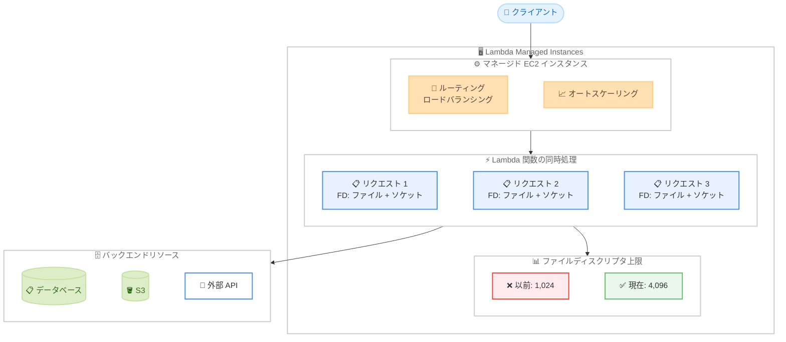

# AWS Lambda - Lambda Managed Instances のファイルディスクリプタ上限を 4,096 に引き上げ

**リリース日**: 2026 年 3 月 26 日
**サービス**: AWS Lambda
**機能**: Lambda Managed Instances のファイルディスクリプタ上限の引き上げ

[このアップデートのインフォグラフィックを見る](https://takech9203.github.io/aws-news-summary/20260326-aws-Lambda-file-descriptors-increase-4096.html)

## 概要

AWS Lambda が Lambda Managed Instances (LMI) 上で実行される関数のファイルディスクリプタ上限を 1,024 から 4,096 に引き上げました。これは 4 倍の増加であり、I/O 集約型のワークロードを Lambda で実行する際の制約を大幅に緩和するアップデートです。

Lambda Managed Instances は、マネージドな Amazon EC2 インスタンス上で Lambda 関数を実行する機能で、ルーティング、ロードバランシング、オートスケーリングが組み込まれています。LMI では複数のリクエストを同時に処理するため、各リクエストが開くファイル、ネットワークソケット、内部リソースがそれぞれファイルディスクリプタを消費します。今回の上限引き上げにより、高並行性の Web サービスやファイル集約型のデータ処理パイプラインなどのワークロードを、ファイルディスクリプタの制限に悩まされることなく実行できるようになりました。

**アップデート前の課題**

- LMI 上の Lambda 関数ではファイルディスクリプタの上限が 1,024 に制限されていた
- 高並行性の Web サービスでは同時接続数が増えるとファイルディスクリプタが不足する可能性があった
- ファイル集約型のデータ処理パイプラインで、多数のファイルを同時に扱う際にエラーが発生する場合があった

**アップデート後の改善**

- ファイルディスクリプタの上限が 4,096 に引き上げられ、4 倍のリソースが利用可能になった
- 高並行性の Web サービスをファイルディスクリプタ制限を気にすることなく実行できるようになった
- ファイル集約型のデータ処理パイプラインで、より多くのファイルやソケットを同時に扱えるようになった

## アーキテクチャ図



LMI 上で複数のリクエストが同時に処理される際、各リクエストがファイルやネットワークソケットなどのファイルディスクリプタを消費します。今回の上限引き上げにより、従来の 4 倍のリソースを利用できるようになりました。

## サービスアップデートの詳細

### 主要機能

1. **ファイルディスクリプタ上限の 4 倍引き上げ**
   - LMI 上の Lambda 関数で利用可能なファイルディスクリプタ上限が 1,024 から 4,096 に増加
   - 追加設定は不要で、自動的に新しい上限が適用される
   - 開いたファイル、ネットワークソケット、内部リソースのすべてに適用

2. **高並行性ワークロードのサポート強化**
   - LMI は複数のリクエストを 1 つのインスタンス上で同時処理するため、従来よりも多くの並行接続を維持可能
   - Web サービスでの同時接続数の実質的な上限が大幅に拡大

3. **I/O 集約型パイプラインへの対応**
   - ファイル集約型のデータ処理パイプラインで、同時に開くことができるファイル数が増加
   - データ変換やバッチ処理などの ETL ワークロードでの柔軟性が向上

## 技術仕様

### ファイルディスクリプタの仕様比較

| 項目 | 変更前 | 変更後 |
|------|--------|--------|
| ファイルディスクリプタ上限 | 1,024 | 4,096 |
| 対象環境 | Lambda Managed Instances | Lambda Managed Instances |
| 増加倍率 | - | 4 倍 |
| 設定変更の要否 | - | 不要 (自動適用) |

### ファイルディスクリプタの消費要因

| リソースタイプ | 消費するファイルディスクリプタ |
|---------------|-------------------------------|
| 開いたファイル | 1 ファイルにつき 1 FD |
| ネットワークソケット | 1 ソケットにつき 1 FD |
| 内部リソース | ランタイムやフレームワークの内部利用分 |

### Lambda Managed Instances の特徴

| 項目 | 詳細 |
|------|------|
| 実行基盤 | マネージドな Amazon EC2 インスタンス |
| ルーティング | 組み込みのリクエストルーティング |
| スケーリング | 自動スケーリング対応 |
| ロードバランシング | 組み込みのロードバランシング |
| リクエスト処理 | 複数リクエストの同時処理が可能 |

## 設定方法

### 前提条件

1. AWS アカウントを持っていること
2. Lambda Managed Instances を使用する Lambda 関数が設定されていること
3. AWS CLI v2 がインストールされていること

### 手順

#### ステップ 1: 現在のファイルディスクリプタ上限を確認

```python
import resource
import os

def lambda_handler(event, context):
    soft, hard = resource.getrlimit(resource.RLIMIT_NOFILE)
    return {
        'soft_limit': soft,
        'hard_limit': hard,
        'current_open_fds': len(os.listdir('/proc/self/fd'))
    }
```

Lambda 関数内で `resource.getrlimit` を使用して、現在のファイルディスクリプタのソフトリミットとハードリミットを確認します。LMI 上で実行されている場合、上限が 4,096 と表示されます。

#### ステップ 2: Lambda Managed Instances で関数を設定

```bash
# Lambda 関数を LMI で実行するよう設定
aws lambda update-function-configuration \
  --function-name my-function \
  --compute-platform ManagedInstances
```

Lambda 関数を Lambda Managed Instances 上で実行するよう設定します。設定後、ファイルディスクリプタの上限は自動的に 4,096 に引き上げられます。

#### ステップ 3: ファイルディスクリプタの使用状況をモニタリング

```python
import os

def lambda_handler(event, context):
    open_fds = len(os.listdir('/proc/self/fd'))
    print(f"Currently open file descriptors: {open_fds}/4096")

    # ファイルディスクリプタの使用率をチェック
    usage_percent = (open_fds / 4096) * 100
    if usage_percent > 80:
        print(f"WARNING: FD usage is at {usage_percent:.1f}%")

    return {'fd_usage': open_fds}
```

本番環境では、ファイルディスクリプタの使用状況をモニタリングすることが推奨されます。使用率が高い場合はアラートを設定し、リソースリークを早期に検出できるようにします。

## メリット

### ビジネス面

- **ワークロードの幅が拡大**: I/O 集約型のアプリケーションを Lambda で実行できるようになり、サーバーレスアーキテクチャの適用範囲が広がる
- **運用コストの削減**: EC2 インスタンスを直接管理する必要がなくなり、LMI のマネージド機能を活用しながら高い並行性を実現できる
- **追加コスト不要**: ファイルディスクリプタの上限引き上げに伴う追加料金は発生しない

### 技術面

- **高並行性の実現**: 4,096 のファイルディスクリプタにより、同時に多数のネットワーク接続やファイル操作を処理可能
- **設定不要**: 自動的に新しい上限が適用されるため、コード変更や設定変更が不要
- **安定性の向上**: ファイルディスクリプタの枯渇による "Too many open files" エラーのリスクが大幅に低減

## デメリット・制約事項

### 制限事項

- 本アップデートは Lambda Managed Instances (LMI) 上で実行される関数のみが対象であり、標準の Lambda 実行環境には適用されない
- ファイルディスクリプタの上限は 4,096 であり、これを超える要件がある場合は別のアーキテクチャを検討する必要がある
- LMI 自体の利用には、通常の Lambda とは異なる料金体系が適用される

### 考慮すべき点

- ファイルディスクリプタのリークがある場合、上限の引き上げは根本的な解決にはならないため、適切なリソース管理が必要
- 高並行性の処理では、ファイルディスクリプタ以外のリソース (メモリ、CPU) も考慮する必要がある

## ユースケース

### ユースケース 1: 高並行性 Web サービス

**シナリオ**: REST API を提供する Lambda 関数が、LMI 上で多数のクライアントからの同時リクエストを処理する場合。各リクエストがデータベース接続やキャッシュへの接続でファイルディスクリプタを消費する。

**実装例**:
```python
import urllib3

http = urllib3.PoolManager(maxsize=50)

def lambda_handler(event, context):
    # 複数のバックエンドサービスに同時接続
    responses = []
    for endpoint in event['endpoints']:
        resp = http.request('GET', endpoint)
        responses.append(resp.data)
    return {'results': len(responses)}
```

**効果**: 従来の 1,024 では同時接続数が制約されていたが、4,096 に引き上げられたことで、より多くの並行接続を安定して維持できるようになる。

### ユースケース 2: ファイル集約型データ処理パイプライン

**シナリオ**: 大量の CSV ファイルや JSON ファイルを同時に読み込み、変換して S3 にアップロードする ETL パイプライン。

**実装例**:
```python
import boto3
import concurrent.futures

s3 = boto3.client('s3')

def lambda_handler(event, context):
    files = event['files']
    results = []

    # 同時に多数のファイルを処理
    with concurrent.futures.ThreadPoolExecutor(max_workers=100) as executor:
        futures = {
            executor.submit(process_file, f): f for f in files
        }
        for future in concurrent.futures.as_completed(futures):
            results.append(future.result())

    return {'processed': len(results)}
```

**効果**: 同時に開くファイル数の上限が 4 倍に増加したことで、バッチサイズを大きくでき、処理のスループットが向上する。

### ユースケース 3: マイクロサービス間通信の集約

**シナリオ**: API Gateway の背後で動作する Lambda 関数が、複数のマイクロサービスに対して同時にリクエストを送信し、結果を集約する BFF (Backend for Frontend) パターン。

**実装例**:
```python
import asyncio
import aiohttp

async def fetch_all(endpoints):
    async with aiohttp.ClientSession() as session:
        tasks = [session.get(url) for url in endpoints]
        return await asyncio.gather(*tasks)

def lambda_handler(event, context):
    endpoints = [
        'https://service-a.internal/api/data',
        'https://service-b.internal/api/data',
        'https://service-c.internal/api/data',
        # ... 多数のサービスエンドポイント
    ]
    results = asyncio.run(fetch_all(endpoints))
    return {'aggregated': len(results)}
```

**効果**: 多数のマイクロサービスへの同時接続が可能になり、レスポンス集約のレイテンシが改善される。

## 料金

今回のファイルディスクリプタ上限の引き上げに伴う追加料金は発生しません。料金は Lambda Managed Instances の通常の利用料金に従います。

LMI の料金は、使用する EC2 インスタンスタイプと実行時間に基づいて課金されます。詳細は AWS Lambda の料金ページを参照してください。

## 利用可能リージョン

Lambda Managed Instances が利用可能なすべてのリージョンでこのアップデートが適用されます。最新のリージョン対応状況については、AWS Lambda のドキュメントを参照してください。

## 関連サービス・機能

- **AWS Lambda**: サーバーレスコンピューティングサービス。コードの実行基盤を提供
- **Lambda Managed Instances (LMI)**: マネージドな EC2 インスタンス上で Lambda 関数を実行する機能。ルーティング、ロードバランシング、オートスケーリングを内蔵
- **Amazon EC2**: LMI の基盤となるコンピューティングサービス
- **Amazon CloudWatch**: Lambda 関数のモニタリングとメトリクス収集に使用

## 参考リンク

- [インフォグラフィック](https://takech9203.github.io/aws-news-summary/20260326-aws-Lambda-file-descriptors-increase-4096.html)
- [公式発表 (What's New)](https://aws.amazon.com/about-aws/whats-new/2026/03/aws-Lambda-file-descriptors-increase-4096/)
- [AWS Lambda ドキュメント](https://docs.aws.amazon.com/lambda/)
- [AWS Lambda 料金ページ](https://aws.amazon.com/lambda/pricing/)

## まとめ

AWS Lambda が Lambda Managed Instances のファイルディスクリプタ上限を 1,024 から 4,096 に 4 倍に引き上げたことで、高並行性の Web サービスやファイル集約型のデータ処理パイプラインなど、I/O 集約型のワークロードをより柔軟に実行できるようになりました。設定変更は不要で自動的に適用されるため、LMI を利用しているユーザーは即座にこの恩恵を受けることができます。LMI で I/O 集約型のワークロードを実行している場合は、ファイルディスクリプタの使用状況を確認し、新しい上限を活用した最適化を検討することを推奨します。
