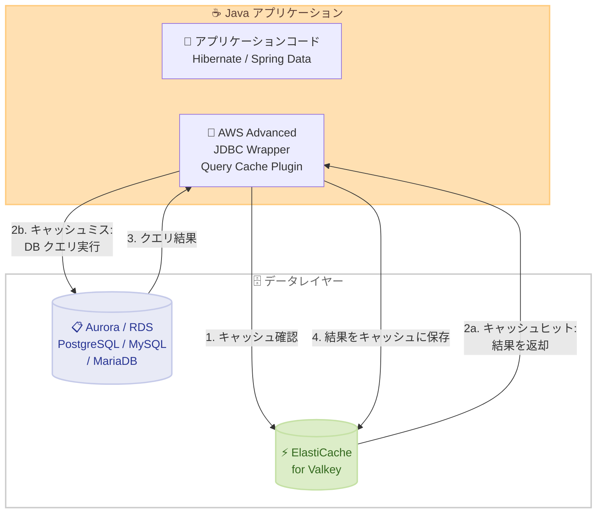

# AWS Advanced JDBC Wrapper - Valkey による自動クエリキャッシュ

**リリース日**: 2026 年 3 月 26 日
**サービス**: AWS Advanced JDBC Wrapper / Amazon ElastiCache for Valkey
**機能**: Automatic JDBC Query Caching with Valkey

📊 [このアップデートのインフォグラフィックを見る](https://takech9203.github.io/aws-news-summary/20260326-aws-jdbc-caching-with-valkey.html)

## 概要

AWS Advanced JDBC Wrapper が、Valkey (Amazon ElastiCache for Valkey を含む) を使用した JDBC クエリの自動キャッシュに対応しました。これにより、Aurora および RDS の PostgreSQL、MySQL、MariaDB データベースのクエリ結果セットを、数ステップの設定で自動的に Valkey キャッシュに保存・取得できるようになります。

このアップデートは、データベースの読み取り負荷を軽減し、頻繁にアクセスされるデータの読み取りレイテンシを低減したい開発者を対象としています。Hibernate や Spring Data などの一般的な永続化 API やフレームワークからのクエリキャッシュアノテーション、および手動のクエリヒントにも対応しています。

**アップデート前の課題**

- JDBC クエリ結果セットをキャッシュするには、各クエリに対してキャッシュへの保存・取得コードを手動で記述する必要があった
- キャッシュロジックとビジネスロジックが混在し、コードの保守性が低下していた
- キャッシュの有効期限管理やキャッシュキーの設計を個別に実装する必要があった

**アップデート後の改善**

- クエリキャッシュプラグインを有効化し、データベースとキャッシュのエンドポイントを設定するだけで、自動的にクエリ結果がキャッシュされるようになった
- Hibernate や Spring Data などのフレームワークからアノテーションベースでキャッシュ対象クエリを指定可能になった
- 手動のキャッシュコード記述が不要になり、アプリケーションコードの簡素化と保守性の向上が実現された

## アーキテクチャ図



アプリケーションが JDBC クエリを実行すると、AWS Advanced JDBC Wrapper の Query Cache Plugin がまず Valkey キャッシュを確認します。キャッシュヒットの場合はデータベースアクセスなしで結果を返却し、キャッシュミスの場合はデータベースにクエリを実行して結果をキャッシュに保存します。

## サービスアップデートの詳細

### 主要機能

1. **自動クエリキャッシュ**
   - JDBC クエリの結果セットを自動的に Valkey キャッシュに保存・取得
   - データベースへの読み取りリクエスト数を削減し、頻繁にアクセスされるデータの読み取りレイテンシを低減
   - 手動でのキャッシュコード記述が不要

2. **フレームワーク統合**
   - Hibernate からのクエリキャッシュアノテーションに対応
   - Spring Data からのクエリキャッシュアノテーションに対応
   - 手動のクエリヒントによるキャッシュ制御もサポート

3. **複数データベースエンジン対応**
   - Amazon Aurora PostgreSQL
   - Amazon Aurora MySQL
   - Amazon RDS for PostgreSQL
   - Amazon RDS for MySQL
   - Amazon RDS for MariaDB

## 技術仕様

### 対応データベースエンジン

| データベース | サービス | 対応状況 |
|-------------|---------|---------|
| PostgreSQL | Aurora, RDS | 対応 |
| MySQL | Aurora, RDS | 対応 |
| MariaDB | RDS | 対応 |

### 対応フレームワークと API

| フレームワーク / API | キャッシュ指定方法 |
|---------------------|------------------|
| Hibernate | アノテーションベースのキャッシュ指定 |
| Spring Data | アノテーションベースのキャッシュ指定 |
| 手動 JDBC | クエリヒントによるキャッシュ指定 |

### API 変更履歴

今回のアップデートは AWS Advanced JDBC Wrapper (クライアントサイドライブラリ) の機能追加であり、AWS API レベルの変更は調査時点では確認されていません。

## 設定方法

### 前提条件

1. Java アプリケーションと JDBC ベースのデータベースアクセス
2. Amazon Aurora または RDS の PostgreSQL、MySQL、MariaDB データベース
3. Amazon ElastiCache for Valkey クラスター (またはその他の Valkey インスタンス)

### 手順

#### ステップ 1: AWS Advanced JDBC Wrapper の依存関係を追加

```xml
<!-- Maven の場合 -->
<dependency>
    <groupId>software.amazon.jdbc</groupId>
    <artifactId>aws-advanced-jdbc-wrapper</artifactId>
    <version>LATEST_VERSION</version>
</dependency>
```

プロジェクトのビルドファイルに AWS Advanced JDBC Wrapper の依存関係を追加します。Maven、Gradle など、使用しているビルドツールに応じた形式で追加してください。

#### ステップ 2: クエリキャッシュプラグインの有効化

```properties
# JDBC 接続プロパティの設定例
wrapperPlugins=queryCache
queryCacheUrl=valkey://your-elasticache-endpoint:6379
```

JDBC Wrapper の設定でクエリキャッシュプラグインを有効化し、Valkey キャッシュのエンドポイントを指定します。

#### ステップ 3: キャッシュ対象クエリの指定

アプリケーションコード内で、キャッシュしたいクエリを指定します。Hibernate や Spring Data を使用している場合はアノテーションで、素の JDBC を使用している場合はクエリヒントで指定します。

#### ステップ 4: データベースエンドポイントの設定

```properties
# データベース接続 URL の設定例
jdbc:aws-wrapper:postgresql://your-aurora-endpoint:5432/your-database
```

AWS Advanced JDBC Wrapper を経由してデータベースに接続するよう、接続 URL を設定します。

## メリット

### ビジネス面

- **コスト削減**: データベースへの読み取りリクエスト数が減少し、データベースリソースの要件を削減。読み取り負荷の高いワークロードでインフラコストを低減
- **パフォーマンス向上**: 頻繁にアクセスされるデータの読み取りレイテンシが低減し、エンドユーザー体験が改善
- **開発効率の向上**: 手動のキャッシュコード記述が不要になり、開発者がビジネスロジックに集中可能

### 技術面

- **簡素な導入**: 数ステップの設定のみで自動クエリキャッシュを実現。既存アプリケーションへの導入が容易
- **フレームワーク統合**: Hibernate、Spring Data という広く使われるフレームワークとネイティブに統合
- **アプリケーションレジリエンス向上**: データベースリソースへの依存度を低減し、データベース負荷急増時のアプリケーション安定性を向上

## デメリット・制約事項

### 制限事項

- 対応データベースエンジンは PostgreSQL、MySQL、MariaDB に限定されている
- Java / JDBC ベースのアプリケーションのみが対象であり、他の言語やドライバーでは利用不可
- キャッシュ対象のクエリはアプリケーションコード内で明示的に指定する必要がある

### 考慮すべき点

- キャッシュの一貫性管理が重要。頻繁に更新されるデータのキャッシュは、古いデータの読み取りリスクがあるため、キャッシュ有効期限の適切な設定が必要
- ElastiCache for Valkey クラスターの追加コストが発生するため、キャッシュによるデータベースコスト削減とのバランスを検討する必要がある
- 書き込みが多いワークロードでは、キャッシュの無効化が頻繁に発生し、効果が限定的になる可能性がある

## ユースケース

### ユースケース 1: 読み取り頻度の高い Web アプリケーション

**シナリオ**: E コマースサイトの商品カタログページで、商品情報や価格情報が頻繁に参照されるが、更新頻度は低い場合に、クエリキャッシュを活用してデータベース負荷を軽減します。

**実装例**:
```java
// Spring Data の場合、キャッシュ対象のリポジトリメソッドにアノテーションを追加
@Repository
public interface ProductRepository extends JpaRepository<Product, Long> {
    // クエリキャッシュプラグインにより自動的にキャッシュされる
    List<Product> findByCategoryId(Long categoryId);
}
```

**効果**: 商品カタログの読み取りレイテンシが大幅に低減し、セール時のアクセス急増にもデータベースへの負荷を抑えて対応可能

### ユースケース 2: ダッシュボード・レポーティングシステム

**シナリオ**: 集計クエリやレポートクエリの結果をキャッシュし、複数ユーザーが同じレポートを参照する際のデータベース負荷を削減します。

**実装例**:
```java
// Hibernate でのクエリヒント使用例
Query query = session.createQuery(
    "SELECT department, SUM(sales) FROM Orders " +
    "GROUP BY department"
);
// JDBC Wrapper のクエリキャッシュプラグインが自動的にキャッシュ
```

**効果**: 同一レポートへの複数回アクセスでデータベースクエリが 1 回のみとなり、レスポンス時間を短縮

### ユースケース 3: マイクロサービス間の共有データ参照

**シナリオ**: 複数のマイクロサービスが共通のマスターデータ (ユーザー情報、設定情報など) を参照する環境で、各サービスのデータベースアクセスを Valkey キャッシュ経由に集約します。

**実装例**:
```properties
# 各マイクロサービスの JDBC 設定
wrapperPlugins=queryCache
queryCacheUrl=valkey://shared-elasticache-endpoint:6379
```

**効果**: 共通データへのアクセスが Valkey キャッシュで処理され、データベースの同時接続数とクエリ負荷を大幅に削減

## 料金

AWS Advanced JDBC Wrapper はオープンソースのクライアントライブラリであり、Wrapper 自体の利用料金は無料です。キャッシュの利用にあたっては、以下のコストが発生します。

### 料金例

| コスト項目 | 料金 |
|-----------|------|
| AWS Advanced JDBC Wrapper | 無料 (オープンソース) |
| Amazon ElastiCache for Valkey | ノードタイプとリージョンに応じた時間課金 |
| Aurora / RDS データベース | 通常のデータベース料金 (キャッシュにより読み取り負荷が軽減) |

詳細な料金は [Amazon ElastiCache の料金ページ](https://aws.amazon.com/elasticache/pricing/) で確認できます。

## 利用可能リージョン

AWS Advanced JDBC Wrapper はクライアントサイドライブラリであるため、Amazon ElastiCache for Valkey および Aurora / RDS が利用可能なすべてのリージョンで使用できます。

## 関連サービス・機能

- **Amazon ElastiCache for Valkey**: クエリ結果のキャッシュ先として使用される、フルマネージドの Valkey キャッシュサービス
- **Amazon Aurora**: 高性能なクラウドネイティブリレーショナルデータベース。PostgreSQL および MySQL 互換
- **Amazon RDS**: PostgreSQL、MySQL、MariaDB を含むマネージドリレーショナルデータベースサービス
- **AWS Advanced JDBC Wrapper**: AWS データベースサービスとの統合機能を提供する JDBC ドライバーラッパー

## 参考リンク

- 📊 [インフォグラフィック](https://takech9203.github.io/aws-news-summary/20260326-aws-jdbc-caching-with-valkey.html)
- [公式発表 (What's New)](https://aws.amazon.com/about-aws/whats-new/2026/03/aws-jdbc-caching-with-valkey/)
- [AWS Advanced JDBC Wrapper GitHub リポジトリ](https://github.com/aws/aws-advanced-jdbc-wrapper)
- [Amazon ElastiCache for Valkey 製品ページ](https://aws.amazon.com/elasticache/valkey/)
- [Amazon ElastiCache 料金ページ](https://aws.amazon.com/elasticache/pricing/)

## まとめ

AWS Advanced JDBC Wrapper の Valkey 自動クエリキャッシュにより、Java アプリケーションにおけるデータベース読み取り負荷の軽減が大幅に簡素化されました。従来は手動でキャッシュコードを記述する必要がありましたが、プラグインの有効化とエンドポイント設定のみで自動キャッシュが実現されます。読み取り頻度が高く更新頻度が低いワークロードを持つ Java アプリケーションでは、まず影響の大きいクエリから段階的にキャッシュを導入することを推奨します。
