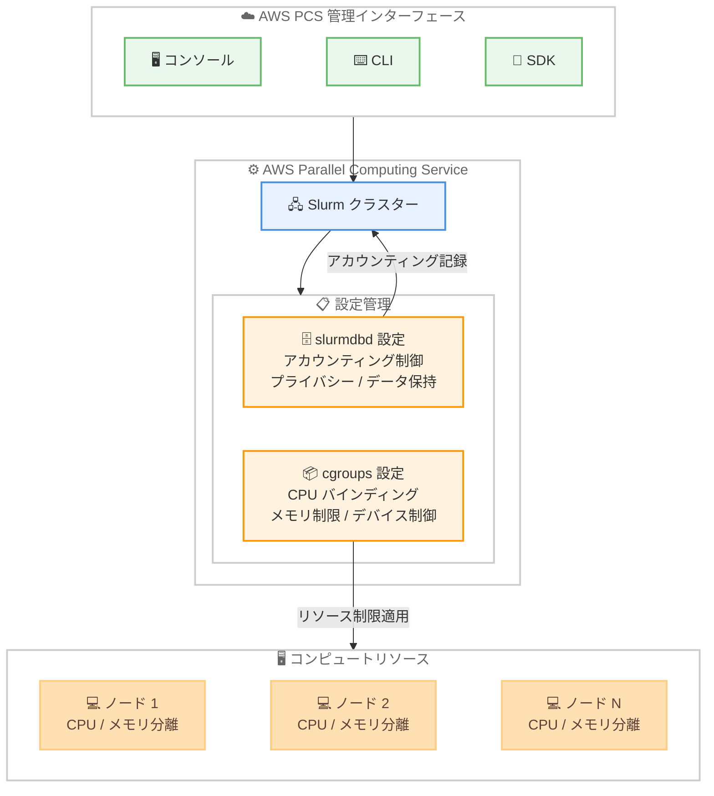

# AWS Parallel Computing Service - slurmdbd および cgroups 設定のサポート

**リリース日**: 2026 年 3 月 26 日
**サービス**: AWS Parallel Computing Service (AWS PCS)
**機能**: slurmdbd および cgroups 設定の管理

📊 [このアップデートのインフォグラフィックを見る](https://takech9203.github.io/aws-news-summary/20260326-aws-pcs-manages-slurmdbd-cgroups-settings.html)

## 概要

AWS Parallel Computing Service (AWS PCS) が Slurm の slurmdbd および cgroups に関する追加設定をサポートした。これにより、AWS PCS コンソール、CLI、または SDK を通じて、アカウンティング動作やリソース分離を直接設定できるようになった。本機能は、プライバシー制御、データ保持ポリシー、リソース管理の強化を伴う本番環境向け HPC 環境の構築を支援する。

slurmdbd 設定では、Slurm のアカウンティング機能の動作を制御できる。具体的には、プライバシー制御、データ保持ポリシー、ワークロード追跡機能の設定が含まれる。cgroups サポートでは、CPU コアのバインディングによるリソースのオーバーサブスクリプション防止、メモリ制限の強制によるノード安定性の維持、デバイスアクセスの制御が可能になった。

AWS PCS は Slurm を使用した HPC ワークロードの実行とスケーリングを簡素化するマネージドサービスである。コンピュート、ストレージ、ネットワーキング、可視化ツールを統合した完全な弾力的環境を構築でき、マネージドアップデートとビルトインのオブザーバビリティ機能によりクラスター運用を支援する。

**アップデート前の課題**

- AWS PCS コンソールや CLI から slurmdbd の設定を直接管理できず、アカウンティングの細かな制御が困難だった
- cgroups の設定を AWS PCS 上で直接行う手段がなく、リソース分離の設定にカスタム構成が必要だった
- CPU コアのバインディングやメモリ制限などのリソース管理を HPC 環境で適用するために追加の手順が必要だった

**アップデート後の改善**

- AWS PCS コンソール、CLI、SDK から slurmdbd 設定を直接構成でき、アカウンティング動作の柔軟な制御が可能になった
- cgroups 設定により CPU コアバインディング、メモリ制限、デバイスアクセス制御をネイティブにサポートし、リソースのオーバーサブスクリプションを防止できるようになった
- 新規クラスター作成時および既存クラスターの変更時に設定を適用でき、本番環境向けの HPC 構成が容易になった

## アーキテクチャ図



AWS PCS の管理インターフェースから slurmdbd と cgroups の設定を行い、Slurm クラスター上のアカウンティングとリソース分離を制御する構成を示している。

## サービスアップデートの詳細

### 主要機能

1. **slurmdbd 設定管理**
   - Slurm アカウンティングデーモンの動作をコンソール、CLI、SDK から設定可能
   - プライバシー制御により、ユーザーやジョブのアカウンティング情報の可視性を管理
   - データ保持ポリシーの設定により、アカウンティングデータの保存期間を制御
   - ワークロード追跡機能の設定により、ジョブの実行状況を詳細に記録

2. **cgroups リソース分離**
   - CPU コアバインディングにより、ジョブが指定された CPU コアのみを使用するよう制限
   - メモリ制限の強制により、ノードの安定性を維持しリソースのオーバーサブスクリプションを防止
   - デバイスアクセス制御により、ワークロードが定義された境界内で実行されることを保証

3. **柔軟な適用タイミング**
   - 新規クラスター作成時に設定を適用可能
   - 既存クラスターの変更時にも設定を適用可能
   - 設定変更はコンソール、CLI、SDK のいずれからでも実行可能

## 技術仕様

### slurmdbd 設定パラメータ

| 項目 | 詳細 |
|------|------|
| プライバシー制御 | ユーザーやジョブのアカウンティング情報の可視性を設定 |
| データ保持ポリシー | アカウンティングデータの保存期間と削除ポリシーを定義 |
| ワークロード追跡 | ジョブの実行状況、リソース使用量などの記録設定 |

### cgroups 設定パラメータ

| 項目 | 詳細 |
|------|------|
| CPU バインディング | 特定の CPU コアへのジョブの固定 |
| メモリ制限 | プロセスごとまたはジョブごとのメモリ使用量上限の設定 |
| デバイスアクセス制御 | GPU やその他のデバイスへのアクセス許可の管理 |

### API 変更履歴

今回のアップデートに関連する API 変更は、調査時点では awsapichanges.com に記録されていなかった。

### 設定インターフェース

| 方法 | 詳細 |
|------|------|
| AWS マネジメントコンソール | AWS PCS コンソールから GUI で設定 |
| AWS CLI | `aws pcs` コマンドで設定を管理 |
| AWS SDK | プログラムからの設定変更に対応 |

## 設定方法

### 前提条件

1. AWS PCS が利用可能なリージョンの AWS アカウント
2. AWS PCS クラスターの作成権限を持つ IAM ロールまたはユーザー
3. AWS CLI v2 がインストール済みであること (CLI 経由で設定する場合)

### 手順

#### ステップ 1: 既存クラスターの確認

```bash
# AWS PCS クラスターの一覧を取得
aws pcs list-clusters
```

利用可能なクラスターの一覧を表示し、設定対象のクラスターを特定する。

#### ステップ 2: slurmdbd 設定の適用

```bash
# クラスターの slurmdbd 設定を更新
aws pcs update-cluster \
  --cluster-identifier <cluster-id> \
  --slurm-configuration '{
    "slurmdbdSettings": {
      "privacySettings": {
        "jobPrivacy": "enabled"
      },
      "dataRetention": {
        "purgeAfterDays": 90
      }
    }
  }'
```

slurmdbd の設定を更新し、プライバシー制御とデータ保持ポリシーを適用する。具体的なパラメータ名は公式ドキュメントを参照すること。

#### ステップ 3: cgroups 設定の適用

```bash
# クラスターの cgroups 設定を更新
aws pcs update-cluster \
  --cluster-identifier <cluster-id> \
  --slurm-configuration '{
    "cgroupsSettings": {
      "constrainCores": true,
      "constrainRAMSpace": true,
      "constrainDevices": true
    }
  }'
```

cgroups の設定を更新し、CPU コアバインディング、メモリ制限、デバイスアクセス制御を有効化する。具体的なパラメータ名は公式ドキュメントを参照すること。

## メリット

### ビジネス面

- **運用コストの削減**: マネージドサービス上で直接設定を管理できるため、カスタム構成スクリプトの開発・保守が不要になる
- **本番環境品質の向上**: プライバシー制御やデータ保持ポリシーにより、コンプライアンス要件に対応した HPC 環境を構築できる
- **リソース効率の最適化**: cgroups によるリソース分離でノードの使用効率が向上し、コスト最適化が可能になる

### 技術面

- **リソースオーバーサブスクリプションの防止**: cgroups による CPU コアバインディングとメモリ制限で、ワークロード間のリソース競合を解消できる
- **ノード安定性の向上**: メモリ制限の強制により、OOM (Out of Memory) によるノード障害のリスクが低減する
- **統一的な設定管理**: コンソール、CLI、SDK のいずれからでも設定を管理でき、Infrastructure as Code との統合が容易になる

## デメリット・制約事項

### 制限事項

- 設定可能なパラメータは AWS PCS がサポートする範囲に限定されており、Slurm のすべての slurmdbd/cgroups パラメータが設定できるわけではない可能性がある
- 設定変更の反映にはクラスターの状態によって時間がかかる場合がある
- cgroups の制限設定が厳しすぎると、正常なジョブが制限に抵触して失敗する可能性がある

### 考慮すべき点

- 既存のワークロードに対する cgroups 設定の影響を事前にテストすることが推奨される
- slurmdbd のプライバシー設定を変更すると、ユーザーが参照できるアカウンティング情報の範囲が変わるため、チーム内での合意が必要
- データ保持ポリシーの設定は、コンプライアンス要件や監査要件と照らし合わせて決定すること

## ユースケース

### ユースケース 1: マルチテナント HPC 環境のリソース分離

**シナリオ**: 複数の研究チームが共有する HPC クラスターで、各チームのジョブが他チームのリソースに影響を与えないようにしたい。

**実装例**:
```json
{
  "cgroupsSettings": {
    "constrainCores": true,
    "constrainRAMSpace": true,
    "constrainDevices": true
  }
}
```

**効果**: CPU コアバインディングとメモリ制限により、各ジョブが割り当てられたリソースのみを使用し、ノイジーネイバー問題を防止できる。

### ユースケース 2: コンプライアンス要件に対応したアカウンティング管理

**シナリオ**: 規制業界で HPC を利用しており、ジョブの実行履歴やリソース使用量のデータ保持期間を規制要件に合わせて管理する必要がある。

**実装例**:
```json
{
  "slurmdbdSettings": {
    "privacySettings": {
      "jobPrivacy": "enabled"
    },
    "dataRetention": {
      "purgeAfterDays": 365
    }
  }
}
```

**効果**: プライバシー制御により機密ジョブ情報へのアクセスを制限し、データ保持ポリシーにより規制要件に準拠したデータライフサイクル管理を実現する。

### ユースケース 3: GPU ワークロードのデバイスアクセス制御

**シナリオ**: 機械学習トレーニングジョブを実行するクラスターで、各ジョブが割り当てられた GPU のみにアクセスするよう制限したい。

**実装例**:
```json
{
  "cgroupsSettings": {
    "constrainDevices": true,
    "constrainCores": true
  }
}
```

**効果**: デバイスアクセス制御により、ジョブが割り当てられた GPU のみを使用し、GPU リソースの競合を防止。CPU コアバインディングとの組み合わせで、一貫したパフォーマンスを確保できる。

## 料金

AWS PCS 自体には追加料金はなく、使用する基盤の EC2 インスタンスやその他の AWS リソースに対してのみ課金される。今回の slurmdbd および cgroups 設定機能の利用に追加料金は発生しない。

### 料金例

| 構成 | 月額料金 (概算) |
|------|------------------|
| c5.xlarge x 10 ノード (オンデマンド、us-east-1) | 約 $1,224 |
| c5.xlarge x 10 ノード (Spot、us-east-1) | 約 $367 - $490 (最大 70% 割引) |

※ 料金は EC2 インスタンスの使用料のみ。実際の料金はリージョンや使用状況により異なる。

## 利用可能リージョン

AWS PCS が利用可能なすべての AWS リージョンで利用可能。AWS PCS の対応リージョンについては [AWS リージョン別サービス一覧](https://aws.amazon.com/about-aws/global-infrastructure/regional-product-services/) を参照。

## 関連サービス・機能

- **AWS Parallel Computing Service (AWS PCS)**: Slurm ベースの HPC ワークロードを実行・スケーリングするためのマネージドサービス
- **Amazon EC2**: AWS PCS クラスターのコンピュートノードとして使用される仮想サーバー
- **Amazon FSx for Lustre**: HPC ワークロード向けの高性能ファイルシステムで、AWS PCS クラスターのストレージとして利用可能
- **AWS Batch**: 代替の HPC ジョブスケジューリングサービスで、Slurm を必要としないバッチ処理に適している

## 参考リンク

- 📊 [インフォグラフィック](https://takech9203.github.io/aws-news-summary/20260326-aws-pcs-manages-slurmdbd-cgroups-settings.html)
- [公式発表 (What's New)](https://aws.amazon.com/about-aws/whats-new/2026/03/aws-pcs-manages-slurmdbd-cgroups-settings/)
- [AWS PCS ドキュメント](https://docs.aws.amazon.com/pcs/)
- [AWS PCS 料金ページ](https://aws.amazon.com/pcs/pricing/)

## まとめ

AWS PCS が slurmdbd と cgroups の設定をネイティブにサポートしたことで、HPC 環境におけるアカウンティング管理とリソース分離の構成が大幅に簡素化された。特にマルチテナント環境やコンプライアンス要件のある環境では、リソースのオーバーサブスクリプション防止やデータ保持ポリシーの適用が容易になる。AWS PCS を利用している場合は、既存クラスターへの cgroups 設定の適用を検討し、ワークロードの安定性とリソース効率の向上を図ることを推奨する。
