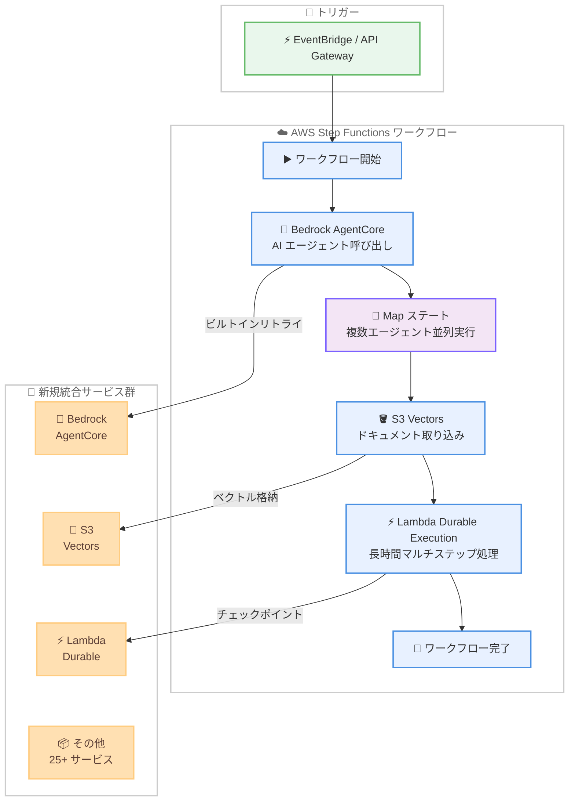

# AWS Step Functions - 28 の新しい AWS SDK サービス統合の追加

**リリース日**: 2026 年 3 月 26 日
**サービス**: AWS Step Functions
**機能**: 28 新規サービス統合 (Amazon Bedrock AgentCore、Amazon S3 Vectors 等)

📊 [このアップデートのインフォグラフィックを見る](https://takech9203.github.io/aws-news-summary/20260326-aws-step-functions-sdk-integrations.html)

## 概要

AWS Step Functions が AWS SDK 統合を大幅に拡張し、28 の追加サービスと 1,100 以上の新しい API アクションをサポートした。この拡張により、Amazon Bedrock AgentCore や Amazon S3 Vectors を含む新規および既存の AWS サービスを、統合コードを記述することなくワークフローから直接オーケストレーションできるようになった。

今回の拡張の中核となるのは Amazon Bedrock AgentCore のサービス統合である。この統合により、AI エージェントランタイムの呼び出しにビルトインリトライを適用したり、Map ステートを使用して複数のエージェントを並列実行したり、エージェントのプロビジョニングワークフローを自動化したりすることが可能になった。加えて、Amazon S3 Vectors の統合によりドキュメント取り込みパイプラインの自動化が実現し、AI アプリケーション向けのナレッジベースを効率的に構築できるようになった。AWS Lambda Durable Execution API のサポートも追加されている。

**アップデート前の課題**

- Step Functions から利用できる AWS SDK 統合が限定的であり、対応していないサービスには Lambda 関数を介したカスタム統合コードの実装が必要だった
- AI エージェントのオーケストレーションにはリトライロジックやエラーハンドリングを独自に実装する必要があり、開発コストが高かった
- ドキュメント取り込みパイプラインの構築において、S3 Vectors との連携を手動で実装する必要があった
- Lambda Durable Execution の制御を Step Functions ワークフローに組み込むためのネイティブな手段がなかった

**アップデート後の改善**

- 28 の新サービスと 1,100 以上の API アクションが直接呼び出し可能になり、カスタム統合コードの記述が不要になった
- Bedrock AgentCore 統合により、AI エージェントの呼び出し、並列実行、プロビジョニングをネイティブにオーケストレーション可能になった
- S3 Vectors 統合により、ナレッジベース向けのドキュメント取り込みパイプラインをノーコードで自動化できるようになった
- Lambda Durable Execution API との統合により、耐障害性のあるマルチステップワークフローの制御が向上した

## アーキテクチャ図



Step Functions が Bedrock AgentCore、S3 Vectors、Lambda Durable Execution を含む新規サービス群をネイティブに統合し、AI エージェントのオーケストレーションからドキュメント取り込みまでを一貫してワークフロー内で制御する構成を示している。

## サービスアップデートの詳細

### 主要機能

1. **Amazon Bedrock AgentCore サービス統合**
   - AI エージェントランタイムを Step Functions から直接呼び出し可能
   - ビルトインリトライにより、エージェント呼び出し時の一時的なエラーを自動的に処理
   - Map ステートを使用して複数の AI エージェントを並列実行可能
   - エージェントのプロビジョニングワークフローを自動化

2. **Amazon S3 Vectors サービス統合**
   - ドキュメント取り込みパイプラインの自動化をネイティブにサポート
   - AI アプリケーション向けナレッジベースの構築を効率化
   - ベクトルデータの格納・検索操作をワークフロー内で直接実行

3. **AWS Lambda Durable Execution API サポート**
   - Lambda Durable Functions のチェックポイントや状態管理を Step Functions から制御
   - 長時間実行のマルチステップ処理との連携が強化
   - 耐障害性ワークフローの構築がより柔軟に

4. **1,100 以上の新しい API アクション**
   - 既存サービスにおいても新しい API アクションが追加
   - 統合コードなしでより広範な AWS サービス操作が可能に

## 技術仕様

### 拡張内容の概要

| 項目 | 詳細 |
|------|------|
| 新規サービス統合数 | 28 サービス |
| 新規 API アクション数 | 1,100 以上 |
| 主要新規サービス | Amazon Bedrock AgentCore、Amazon S3 Vectors |
| Lambda 関連 | Durable Execution API サポート |
| 統合方式 | AWS SDK 統合 (Optimized / AWS SDK) |

### API 変更履歴

| 日付 | サービス | 変更内容 |
|------|----------|----------|
| 2026/03/26 | AWS Step Functions | 28 新規サービス統合、1,100 以上の新規 API アクション追加 |

### Step Functions での Bedrock AgentCore 呼び出し例

```json
{
  "Type": "Task",
  "Resource": "arn:aws:states:::bedrock-agentcore:invokeAgent",
  "Parameters": {
    "AgentId": "agent-xxxxxxxxxxxx",
    "Input": {
      "Text.$": "$.userQuery"
    }
  },
  "Retry": [
    {
      "ErrorEquals": ["States.TaskFailed"],
      "IntervalSeconds": 2,
      "MaxAttempts": 3,
      "BackoffRate": 2.0
    }
  ],
  "Next": "ProcessAgentResponse"
}
```

## 設定方法

### 前提条件

1. AWS アカウントと適切な IAM 権限
2. AWS Step Functions の基本的な理解
3. 統合先サービス (Bedrock AgentCore、S3 Vectors 等) のセットアップ済み環境

### 手順

#### ステップ 1: IAM ロールの更新

```bash
# Step Functions 実行ロールに新しいサービスへのアクセス権限を追加
aws iam put-role-policy \
  --role-name StepFunctionsExecutionRole \
  --policy-name BedrockAgentCoreAccess \
  --policy-document '{
    "Version": "2012-10-17",
    "Statement": [
      {
        "Effect": "Allow",
        "Action": [
          "bedrock-agentcore:InvokeAgent",
          "bedrock-agentcore:ListAgents"
        ],
        "Resource": "*"
      }
    ]
  }'
```

Step Functions の実行ロールに、呼び出し対象サービスの必要な権限を付与する。Bedrock AgentCore を呼び出す場合は上記の例のように `bedrock-agentcore` 関連のアクションを許可する。

#### ステップ 2: ステートマシン定義の作成

```json
{
  "Comment": "Bedrock AgentCore と S3 Vectors を統合したワークフロー",
  "StartAt": "InvokeAgent",
  "States": {
    "InvokeAgent": {
      "Type": "Task",
      "Resource": "arn:aws:states:::bedrock-agentcore:invokeAgent",
      "Parameters": {
        "AgentId": "agent-xxxxxxxxxxxx",
        "Input": {
          "Text.$": "$.query"
        }
      },
      "Next": "StoreVectors"
    },
    "StoreVectors": {
      "Type": "Task",
      "Resource": "arn:aws:states:::aws-sdk:s3vectors:putVectors",
      "Parameters": {
        "BucketName": "my-vector-bucket",
        "Vectors.$": "$.agentOutput.embeddings"
      },
      "End": true
    }
  }
}
```

ステートマシン定義内で、新しい SDK 統合のリソース ARN を指定してタスクステートを構成する。

#### ステップ 3: ステートマシンのデプロイ

```bash
# ステートマシンを作成
aws stepfunctions create-state-machine \
  --name "AgentCoreOrchestration" \
  --definition file://state-machine.json \
  --role-arn arn:aws:iam::123456789012:role/StepFunctionsExecutionRole
```

定義ファイルを指定してステートマシンを作成する。実行ロールには対象サービスへの適切な権限が付与されている必要がある。

## メリット

### ビジネス面

- **開発コストの削減**: 統合コードの記述が不要になり、ワークフロー構築に必要な開発工数が大幅に減少する
- **AI ワークフローの迅速な構築**: Bedrock AgentCore との直接統合により、AI エージェントを活用したビジネスプロセスの自動化を短期間で実現できる
- **運用コストの最適化**: Lambda 関数を介さない直接統合により、関数の実行コストと管理オーバーヘッドが削減される

### 技術面

- **ビルトインリトライ**: Step Functions のネイティブなエラーハンドリング機能を AI エージェント呼び出しに適用でき、信頼性が向上する
- **並列実行の簡素化**: Map ステートによる複数エージェントの並列実行が宣言的に記述でき、コーディング量が削減される
- **サービス統合の一元化**: 1,100 以上の新しい API アクションにより、ほぼすべての AWS サービス操作をワークフロー内で完結できる

## デメリット・制約事項

### 制限事項

- 新規統合されたサービスの全リージョンでの利用可否は、各サービスのリージョン展開状況に依存する
- SDK 統合での呼び出しには Step Functions の状態遷移に伴う料金が発生するため、高頻度の API 呼び出しではコストに注意が必要
- Bedrock AgentCore 統合のパフォーマンス特性は、エージェントの複雑さやモデルの応答時間に依存する

### 考慮すべき点

- 既存の Lambda 関数ベースの統合から SDK 直接統合への移行には、ステートマシン定義の書き換えが必要
- 新しい SDK 統合を利用する場合、Step Functions 実行ロールの IAM ポリシーを適切に更新する必要がある
- S3 Vectors や Bedrock AgentCore など新しいサービスの料金体系も考慮した上でワークフローを設計すること

## ユースケース

### ユースケース 1: マルチエージェント AI ワークフロー

**シナリオ**: カスタマーサポートにおいて、複数の専門エージェントを並列で呼び出し、問い合わせ内容に最適な回答を生成する。

**実装例**:
```json
{
  "Type": "Map",
  "ItemsPath": "$.agents",
  "Iterator": {
    "StartAt": "InvokeSpecialistAgent",
    "States": {
      "InvokeSpecialistAgent": {
        "Type": "Task",
        "Resource": "arn:aws:states:::bedrock-agentcore:invokeAgent",
        "Parameters": {
          "AgentId.$": "$.agentId",
          "Input": {
            "Text.$": "$.customerQuery"
          }
        },
        "End": true
      }
    }
  },
  "Next": "SelectBestResponse"
}
```

**効果**: 複数の専門エージェントの並列呼び出しにより応答時間を短縮し、最適な回答を自動選択することでサポート品質が向上する。

### ユースケース 2: RAG パイプラインの自動化

**シナリオ**: 新しいドキュメントが S3 にアップロードされた際に、自動的にベクトル化して S3 Vectors に格納し、ナレッジベースを更新する。

**実装例**:
```json
{
  "StartAt": "ExtractText",
  "States": {
    "ExtractText": {
      "Type": "Task",
      "Resource": "arn:aws:states:::aws-sdk:textract:detectDocumentText",
      "Next": "GenerateEmbeddings"
    },
    "GenerateEmbeddings": {
      "Type": "Task",
      "Resource": "arn:aws:states:::bedrock:invokeModel",
      "Next": "StoreVectors"
    },
    "StoreVectors": {
      "Type": "Task",
      "Resource": "arn:aws:states:::aws-sdk:s3vectors:putVectors",
      "End": true
    }
  }
}
```

**効果**: ドキュメント取り込みからベクトル格納までの一連の処理をサーバーレスで自動化し、ナレッジベースの鮮度を常に最新に保つ。

### ユースケース 3: エージェントプロビジョニングの自動化

**シナリオ**: 新しい AI エージェントのデプロイ時に、エージェントの作成、設定、テスト、本番環境への昇格を自動化する。

**実装例**:
```json
{
  "StartAt": "CreateAgent",
  "States": {
    "CreateAgent": {
      "Type": "Task",
      "Resource": "arn:aws:states:::bedrock-agentcore:createAgent",
      "Next": "ConfigureAgent"
    },
    "ConfigureAgent": {
      "Type": "Task",
      "Resource": "arn:aws:states:::bedrock-agentcore:updateAgent",
      "Next": "TestAgent"
    },
    "TestAgent": {
      "Type": "Task",
      "Resource": "arn:aws:states:::bedrock-agentcore:invokeAgent",
      "Next": "PromoteToProduction"
    },
    "PromoteToProduction": {
      "Type": "Task",
      "Resource": "arn:aws:states:::bedrock-agentcore:createAgentAlias",
      "End": true
    }
  }
}
```

**効果**: エージェントのライフサイクル管理を完全に自動化し、手動操作によるミスを排除しつつデプロイ速度を向上させる。

## 料金

AWS Step Functions の料金は既存の料金体系に準拠する。新しい SDK 統合の利用自体に追加料金は発生しないが、ワークフロー内での状態遷移ごとに通常の Step Functions 料金が適用される。

### 料金例

| 使用量 | 月額料金 (概算) |
|--------|------------------|
| Standard Workflows: 10,000 状態遷移 | 約 $0.25 |
| Standard Workflows: 1,000,000 状態遷移 | 約 $25.00 |
| Express Workflows: 100,000 リクエスト | 約 $1.00 |

※ 上記は Step Functions 自体の料金であり、呼び出し先サービス (Bedrock AgentCore、S3 Vectors 等) の料金は別途発生する。

## 利用可能リージョン

AWS Step Functions の SDK 統合は、Step Functions が利用可能なすべてのリージョンで提供される。ただし、統合先サービス (Amazon Bedrock AgentCore、Amazon S3 Vectors 等) の利用可否は各サービスのリージョン展開状況に依存する。

## 関連サービス・機能

- **Amazon Bedrock AgentCore**: AI エージェントのランタイム環境を提供し、Step Functions からの直接オーケストレーションが可能になった
- **Amazon S3 Vectors**: ベクトルデータの格納・検索サービスで、RAG パイプラインの自動化に活用できる
- **AWS Lambda Durable Execution**: 長時間実行のマルチステップ処理をサポートし、Step Functions との組み合わせで耐障害性のあるワークフローを構築可能
- **Amazon Bedrock**: 基盤モデルの呼び出しを Step Functions から直接実行でき、AI ワークフローの構築に活用される

## 参考リンク

- 📊 [インフォグラフィック](https://takech9203.github.io/aws-news-summary/20260326-aws-step-functions-sdk-integrations.html)
- [公式発表 (What's New)](https://aws.amazon.com/about-aws/whats-new/2026/03/aws-step-functions-sdk-integrations/)
- [AWS Step Functions ドキュメント](https://docs.aws.amazon.com/step-functions/latest/dg/welcome.html)
- [AWS Step Functions 料金ページ](https://aws.amazon.com/step-functions/pricing/)
- [Amazon Bedrock AgentCore ドキュメント](https://docs.aws.amazon.com/bedrock/latest/userguide/agentcore.html)

## まとめ

AWS Step Functions の 28 新規サービス統合と 1,100 以上の新規 API アクションの追加は、特に AI ワークフローの構築において大きな進展である。Bedrock AgentCore との直接統合により、AI エージェントのオーケストレーションがカスタムコードなしで実現可能になった点が最も注目すべきポイントである。既存の Step Functions ワークフローを活用している場合は、Lambda 関数を介した統合を SDK 直接統合に置き換えることで、コストと複雑さの両面で改善が期待できる。
