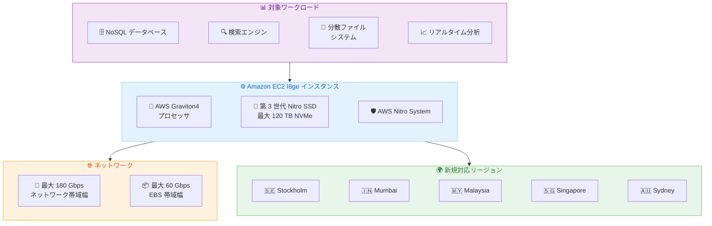

# Amazon EC2 I8ge インスタンス - 追加リージョンでの提供開始

**リリース日**: 2026 年 3 月 26 日
**サービス**: Amazon EC2
**機能**: I8ge ストレージ最適化インスタンスのリージョン拡大

📊 [このアップデートのインフォグラフィックを見る](https://takech9203.github.io/aws-news-summary/20260326-ec2-i8ge-available-new-regions.html)

## 概要

Amazon EC2 I8ge インスタンスが、Europe (Stockholm)、Asia Pacific (Mumbai)、Asia Pacific (Malaysia)、Asia Pacific (Singapore)、Asia Pacific (Sydney) の 5 つの追加リージョンで一般提供 (GA) になりました。I8ge インスタンスは AWS Graviton4 プロセッサを搭載したストレージ最適化インスタンスであり、前世代の Graviton2 ベースのストレージ最適化インスタンスと比較して最大 60% 優れたコンピューティングパフォーマンスを提供します。

I8ge インスタンスは第 3 世代 AWS Nitro SSD を採用しており、TB あたり最大 55% 優れたリアルタイムストレージパフォーマンスを実現します。Im4gn インスタンスと比較して、ストレージ I/O レイテンシーが最大 60% 低減、ストレージ I/O レイテンシーの変動が最大 75% 低減されています。最大 120 TB のローカル NVMe ストレージ、最大 180 Gbps のネットワークパフォーマンス、60 Gbps の EBS 帯域幅を提供し、大規模なストレージ集約型ワークロードに最適です。

**アップデート前の課題**

- I8ge インスタンスは限られたリージョンでのみ利用可能であり、欧州やアジア太平洋の一部リージョンでは最新のストレージ最適化インスタンスを利用できなかった
- 前世代の Im4gn インスタンスではストレージ I/O レイテンシーが高く、レイテンシーの変動も大きかったため、リアルタイムデータ処理のパフォーマンスに制約があった
- Graviton2 ベースのストレージ最適化インスタンスではコンピューティングパフォーマンスに限界があり、大規模なデータ処理ワークロードで十分な性能を発揮できなかった

**アップデート後の改善**

- 5 つの追加リージョンで I8ge インスタンスが利用可能になり、グローバルなストレージ集約型ワークロードの展開の選択肢が拡大した
- Graviton4 プロセッサにより最大 60% 優れたコンピューティングパフォーマンスが得られ、データ処理の高速化を実現できるようになった
- 第 3 世代 Nitro SSD によるストレージ I/O レイテンシーの大幅な低減 (最大 60%) とレイテンシー変動の低減 (最大 75%) により、より安定した高パフォーマンスが実現された

## アーキテクチャ図



I8ge インスタンスが Graviton4 プロセッサと第 3 世代 Nitro SSD を搭載し、5 つの新規リージョンでストレージ集約型ワークロードに対応する構成を示しています。

## サービスアップデートの詳細

### 主要機能

1. **AWS Graviton4 プロセッサによる高性能コンピューティング**
   - 前世代の Graviton2 ベースのストレージ最適化インスタンスと比較して最大 60% 優れたコンピューティングパフォーマンス
   - Arm ベースのプロセッサにより優れた電力効率を実現
   - 大規模なデータ処理やインデックス作成などの CPU 集約的な操作を高速化

2. **第 3 世代 AWS Nitro SSD**
   - TB あたり最大 55% 優れたリアルタイムストレージパフォーマンス
   - Im4gn インスタンスと比較してストレージ I/O レイテンシーが最大 60% 低減
   - ストレージ I/O レイテンシーの変動が最大 75% 低減され、より安定したパフォーマンスを提供
   - 最大 120 TB のローカル NVMe ストレージ

3. **高帯域ネットワーキング**
   - 最大 180 Gbps のネットワークパフォーマンス
   - 最大 60 Gbps の EBS 帯域幅
   - 大規模なデータ転送やレプリケーションに対応

## 技術仕様

### I8ge インスタンスの主要仕様

| 項目 | 詳細 |
|------|------|
| プロセッサ | AWS Graviton4 |
| アーキテクチャ | Arm (aarch64) |
| ローカルストレージ | 最大 120 TB NVMe SSD |
| ストレージ世代 | 第 3 世代 AWS Nitro SSD |
| ネットワーク帯域幅 | 最大 180 Gbps |
| EBS 帯域幅 | 最大 60 Gbps |
| Nitro System | 対応 |

### パフォーマンス比較

| 指標 | I8ge vs Graviton2 ストレージ最適化 | I8ge vs Im4gn |
|------|-----------------------------------|---------------|
| コンピューティングパフォーマンス | 最大 60% 向上 | - |
| リアルタイムストレージパフォーマンス (TB あたり) | - | 最大 55% 向上 |
| ストレージ I/O レイテンシー | - | 最大 60% 低減 |
| ストレージ I/O レイテンシー変動 | - | 最大 75% 低減 |

## 設定方法

### 前提条件

1. AWS アカウントと適切な IAM 権限
2. 対象リージョンへのアクセス (Stockholm、Mumbai、Malaysia、Singapore、Sydney)
3. Arm (Graviton) 対応の AMI (Amazon Linux 2023、Ubuntu など)

### 手順

#### ステップ 1: 利用可能なインスタンスタイプを確認

```bash
# 利用可能な I8ge インスタンスタイプを確認
aws ec2 describe-instance-types \
  --filters "Name=instance-type,Values=i8ge*" \
  --region ap-southeast-1 \
  --query "InstanceTypes[].{Type:InstanceType,vCPU:VCpuInfo.DefaultVCpus,Memory:MemoryInfo.SizeInMiB,Storage:InstanceStorageInfo.TotalSizeInGB}" \
  --output table
```

このコマンドは、Singapore リージョン (ap-southeast-1) で利用可能な I8ge インスタンスタイプとそのスペックを一覧表示します。

#### ステップ 2: I8ge インスタンスを起動

```bash
# Graviton4 対応 AMI で I8ge インスタンスを起動
aws ec2 run-instances \
  --image-id ami-xxxxxxxxxxxxxxxxx \
  --instance-type i8ge.4xlarge \
  --region ap-southeast-1 \
  --subnet-id subnet-xxxxxxxxxxxxxxxxx \
  --security-group-ids sg-xxxxxxxxxxxxxxxxx \
  --key-name my-key-pair
```

このコマンドは、Singapore リージョンで I8ge インスタンスを起動します。Graviton4 は Arm アーキテクチャのため、Arm 対応の AMI を指定する必要があります。

#### ステップ 3: ローカル NVMe ストレージのセットアップ

```bash
# ローカル NVMe デバイスの確認
lsblk

# ファイルシステムの作成とマウント
sudo mkfs.xfs /dev/nvme1n1
sudo mkdir /data
sudo mount /dev/nvme1n1 /data
```

ローカル NVMe SSD はインスタンス起動時に自動的にアタッチされますが、ファイルシステムの作成とマウントは手動で行う必要があります。インスタンスストレージは一時的なものであり、インスタンスの停止や終了時にデータが失われる点に注意が必要です。

## メリット

### ビジネス面

- **コスト効率の向上**: Graviton4 プロセッサの優れた電力効率と高いコンピューティングパフォーマンスにより、ストレージ集約型ワークロードのコストパフォーマンスが向上
- **グローバル展開の拡大**: 5 つの追加リージョンでの提供により、データレジデンシー要件やレイテンシー要件に対応しやすくなった
- **運用コストの削減**: ストレージ I/O レイテンシーの低減と変動の安定化により、パフォーマンスチューニングの負荷が軽減

### 技術面

- **高いストレージパフォーマンス**: 第 3 世代 Nitro SSD により、TB あたり最大 55% 優れたリアルタイムストレージパフォーマンスを実現
- **安定したレイテンシー**: ストレージ I/O レイテンシーの変動が最大 75% 低減され、テールレイテンシーに敏感なワークロードに最適
- **大容量ストレージ**: 最大 120 TB のローカル NVMe ストレージにより、大規模なデータセットをローカルに保持可能
- **高帯域ネットワーク**: 最大 180 Gbps のネットワーク帯域幅により、ノード間のデータレプリケーションを高速化

## デメリット・制約事項

### 制限事項

- Arm (Graviton4) アーキテクチャのため、x86 アーキテクチャ向けにコンパイルされたバイナリはそのまま動作しない
- ローカル NVMe ストレージはインスタンスストレージであり、インスタンスの停止や終了時にデータが失われる
- すべてのリージョンで利用可能ではなく、今回のアップデートで 5 リージョンが追加された段階

### 考慮すべき点

- 既存の x86 ベースのインスタンス (I3、I3en、I4i など) からの移行時には、Arm アーキテクチャへの対応が必要
- ローカルストレージのデータ永続性が不要な場合は EBS ボリュームとの併用を検討
- ストレージ最適化インスタンスはローカルストレージ料金が含まれているため、実際に大容量のローカルストレージを活用するワークロードで最もコスト効果が高い

## ユースケース

### ユースケース 1: NoSQL データベースクラスタ

**シナリオ**: E コマースプラットフォームが、アジア太平洋地域で低レイテンシーの NoSQL データベース (Apache Cassandra や ScyllaDB) を運用したい

**実装例**:
```bash
# Singapore リージョンで I8ge インスタンスを起動して Cassandra ノードを構成
aws ec2 run-instances \
  --image-id ami-xxxxxxxxxxxxxxxxx \
  --instance-type i8ge.8xlarge \
  --region ap-southeast-1 \
  --count 3 \
  --user-data file://cassandra-setup.sh
```

**効果**: ストレージ I/O レイテンシーの最大 60% 低減とレイテンシー変動の最大 75% 低減により、データベースの読み書き性能が安定し、ユーザー体験が大幅に向上

### ユースケース 2: 検索エンジンインデックス

**シナリオ**: メディア企業が、大量のコンテンツに対する全文検索 (Elasticsearch/OpenSearch) を高速に提供したい

**実装例**:
```bash
# Mumbai リージョンで I8ge インスタンスを起動して OpenSearch ノードを構成
aws ec2 run-instances \
  --image-id ami-xxxxxxxxxxxxxxxxx \
  --instance-type i8ge.16xlarge \
  --region ap-south-1 \
  --user-data file://opensearch-setup.sh
```

**効果**: 大容量のローカル NVMe ストレージとコンピューティングパフォーマンスの向上により、インデックス作成とクエリ応答の高速化を実現

### ユースケース 3: 分散ファイルシステム

**シナリオ**: 研究機関が、大規模なゲノムデータやシミュレーションデータを高速に処理するための分散ファイルシステム (HDFS や Lustre) を構築したい

**実装例**:
```bash
# Sydney リージョンで I8ge インスタンスを起動して HDFS データノードを構成
aws ec2 run-instances \
  --image-id ami-xxxxxxxxxxxxxxxxx \
  --instance-type i8ge.24xlarge \
  --region ap-southeast-2 \
  --count 6 \
  --user-data file://hdfs-datanode-setup.sh
```

**効果**: 最大 120 TB のローカル NVMe ストレージと 180 Gbps のネットワーク帯域幅により、大規模データセットの分散処理を効率化し、分析時間を短縮

## 料金

I8ge インスタンスの料金は、選択したインスタンスサイズ、リージョン、購入オプションによって異なります。ローカル NVMe ストレージの料金はインスタンス料金に含まれています。詳細な料金については、[Amazon EC2 料金ページ](https://aws.amazon.com/ec2/pricing/) をご確認ください。

### 料金例

I8ge インスタンスは、以下の購入オプションで利用できます。

| 購入オプション | 説明 |
|---------------|------|
| オンデマンドインスタンス | 使用した分だけ支払い、長期コミットメント不要 |
| Savings Plans | 1 年または 3 年のコミットメントで割引 |
| リザーブドインスタンス | 1 年または 3 年の予約で大幅な割引 |

**注**: 最新の料金については、公式料金ページをご確認ください。

## 利用可能リージョン

今回のアップデートにより、I8ge インスタンスは以下のリージョンで新たに利用可能になりました。

**新規対応リージョン (2026 年 3 月 26 日)**:
- Europe (Stockholm) - eu-north-1
- Asia Pacific (Mumbai) - ap-south-1
- Asia Pacific (Malaysia) - ap-southeast-5
- Asia Pacific (Singapore) - ap-southeast-1
- Asia Pacific (Sydney) - ap-southeast-2

## 関連サービス・機能

- **Amazon EBS**: I8ge インスタンスは最大 60 Gbps の EBS 帯域幅を提供し、永続ストレージとの併用が可能
- **Amazon EC2 Auto Scaling**: I8ge インスタンスを使用してストレージ集約型ワークロードの自動スケーリングを実現
- **AWS Graviton**: I8ge インスタンスは Graviton4 プロセッサを採用しており、Graviton エコシステムの一部として活用可能
- **AWS Nitro System**: セキュリティ、パフォーマンス、ストレージの分離を提供する基盤技術

## 参考リンク

- 📊 [インフォグラフィック](https://takech9203.github.io/aws-news-summary/20260326-ec2-i8ge-available-new-regions.html)
- [公式発表 (What's New)](https://aws.amazon.com/about-aws/whats-new/2026/03/ec2-i8ge-available-new-regions/)
- [Amazon EC2 I8ge インスタンス製品ページ](https://aws.amazon.com/ec2/instance-types/i8ge/)
- [Amazon EC2 料金ページ](https://aws.amazon.com/ec2/pricing/)
- [Amazon EC2 ドキュメント](https://docs.aws.amazon.com/ec2/)

## まとめ

Amazon EC2 I8ge インスタンスが 5 つの追加リージョン (Stockholm、Mumbai、Malaysia、Singapore、Sydney) で利用可能になったことにより、Graviton4 プロセッサと第 3 世代 Nitro SSD による高性能なストレージ最適化インスタンスをより多くの地域で活用できるようになりました。前世代と比較して最大 60% のコンピューティングパフォーマンス向上、最大 60% のストレージ I/O レイテンシー低減、最大 75% のレイテンシー変動低減を実現しており、NoSQL データベース、検索エンジン、分散ファイルシステムなどのストレージ集約型ワークロードで I8ge インスタンスの採用を検討してください。
