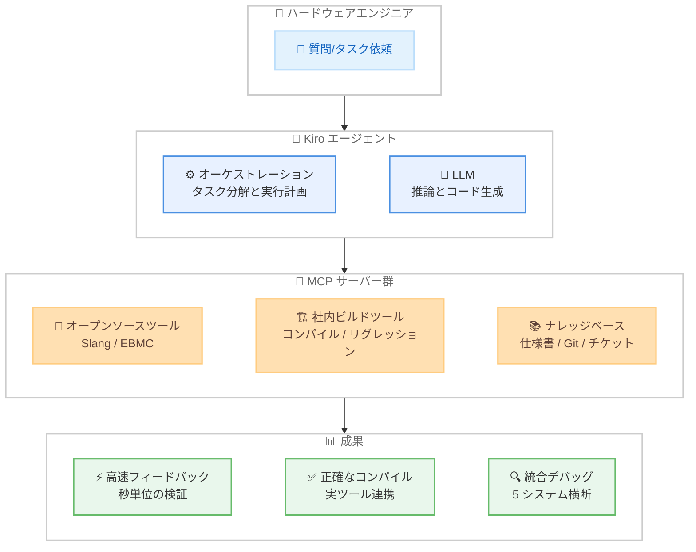

# Kiro - エージェント型 AI をシリコン開発に適用

**リリース日**: 2026 年 3 月 26 日
**サービス**: Kiro
**機能**: Annapurna Labs におけるエージェント型 AI によるハードウェア開発ワークフローの変革

📊 [このアップデートのインフォグラフィックを見る](https://takech9203.github.io/aws-news-summary/20260326-kiro-bringing-agentic-ai-to-silicon-development.html)

## 概要

Kiro が、Amazon の Annapurna Labs における次世代 Trainium チップ開発でのエージェント型 AI 活用事例を紹介する技術ブログを公開した。汎用的な LLM では対応困難なハードウェア開発固有の課題に対し、Model Context Protocol (MCP) を活用したエージェントアーキテクチャがどのように生産性を向上させるかを具体的な事例とともに解説している。

半導体業界では、プロプライエタリな Verilog コード、クローズドな EDA (Electronic Design Automation) ツールチェーン、複数システムに分散したナレッジベースといった固有の制約があり、汎用 AI コーディングアシスタントの効果が限定的であった。本ブログでは、Kiro エージェントが MCP サーバーを介して社内ビルドインフラ、オープンソースツール、分散ナレッジベースに接続することで、テストベンチ開発を 6 倍高速化し、ハードウェアチームの 80% 以上が日常的に利用する成果を達成した事例を報告している。

**アップデート前の課題**

- 汎用 LLM は Verilog コードを生成できるが、商用 EDA ツールでのコンパイル、波形解析、カバレッジレポートの解釈ができなかった
- 商用シミュレータのコールドスタートに数分から数時間かかり、AI とのフィードバックループが極めて遅かった
- 設計仕様、Git リポジトリ、リグレッションログ、チケットシステムなどの情報が複数システムに分散し、手動での横断検索に平均 20 分以上要していた

**アップデート後の改善**

- MCP サーバーを介してエージェントが実際のビルドインフラ、EDA ツール、分散ナレッジベースに直接アクセス可能になった
- オープンソースツール (Slang、EBMC) による高速フィードバックと商用ツールによる本格検証の多段階バリデーションにより、テストベンチ開発が 6 倍高速化された
- 5 つの異なるシステムからのコンテキスト収集が 1 分未満で完了するようになり、エンジニアの生産性が大幅に向上した

## アーキテクチャ図



Kiro エージェントが MCP サーバー群を介してオープンソースツール、社内ビルドインフラ、分散ナレッジベースに接続し、ハードウェア開発の各フェーズを支援するアーキテクチャを示している。

## サービスアップデートの詳細

### 主要機能

1. **オープンソースツールによる高速フィードバックループ**
   - Slang (高速 Verilog コンパイラ) と EBMC (有界モデル検査ツール) を活用し、秒単位でコンパイル結果を取得
   - 商用シミュレータのコールドスタート待ち (数分~数時間) を回避し、基本的なエラーを即座に検出
   - クイックサニティチェックを通過したコードのみ商用ツールでの本格検証に進む多段階バリデーション

2. **社内ツール連携によるインテリジェントコンパイル**
   - チーム固有のビルドフロー、カスタムスクリプト、制度的知識を MCP サーバー経由で提供
   - 詳細なインストラクション Markdown チュートリアルと社内ツールをエージェントに公開
   - 数百万行のリグレッションログから構造化されたエラー情報、スタックトレース、障害パターンを自動抽出

3. **分散リソースへの統合アクセス**
   - 仕様書、Git リポジトリ、リグレッションデータベース、チケットシステムへのシームレスなアクセスを提供
   - 5 つの異なるシステムからのコンテキスト収集を 1 分未満で完了 (従来は手動で約 20 分)
   - 障害原因の仮説立案、関連コード変更の特定、チケット自動起票までを一連のワークフローで実行

## 技術仕様

### エージェントアーキテクチャ

| 項目 | 詳細 |
|------|------|
| 基盤技術 | Model Context Protocol (MCP) |
| エージェント | Kiro (エージェント型 AI IDE) |
| オープンソースツール | Slang (Verilog コンパイラ)、EBMC (有界モデル検査) |
| 対象フェーズ | フロントエンド (仕様策定、RTL 設計、検証) |
| 対象チップ | 次世代 Trainium チップ |
| 統合システム | 仕様書、Git、リグレッション DB、チケットシステム、ライセンスサーバー |

### MCP サーバー構成

| MCP サーバー種別 | 機能 | 用途 |
|-----------------|------|------|
| オープンソースツール | Slang / EBMC の実行 | 高速フィードバック、秒単位の検証 |
| 社内ビルドツール | コンパイル、リグレッション解析 | 正確なビルドとログ分析 |
| ナレッジベース | 仕様書検索、Git 履歴、チケット管理 | 統合的な情報アクセスとデバッグ |

## 設定方法

### 前提条件

1. Kiro のインストールと有効なサブスクリプション
2. MCP サーバーの構築 (社内ツール、オープンソースツールの公開)
3. ハードウェア開発環境 (EDA ツール、シミュレータ) へのアクセス

### 手順

#### ステップ 1: MCP サーバーの構築

ブログで推奨されるアプローチとして、まず 1 つの課題 (テストベンチ生成、リグレッショントリアージ、仕様書検索など) に対応する MCP サーバーを構築する。

```json
{
  "mcpServers": {
    "silicon-tools": {
      "command": "node",
      "args": ["./mcp-servers/silicon-tools/index.js"],
      "env": {
        "EDA_TOOL_PATH": "/opt/eda/tools",
        "BUILD_SCRIPTS_PATH": "/team/build/scripts"
      }
    }
  }
}
```

Kiro の MCP 設定ファイルに社内ビルドツールへの接続情報を定義する。

#### ステップ 2: インストラクションドキュメントの準備

```markdown
# ビルドフロー手順書
## モジュールのコンパイル方法
1. filelist 生成ツールを使用して依存ファイルを解決
2. 社内ビルドスクリプトでコンパイルを実行
3. エラー発生時はログ解析ツールで原因を特定
```

エージェントが参照するチーム固有のビルドフロー手順を Markdown で記述し、MCP サーバーと連携させる。

#### ステップ 3: 段階的な展開

ブログの推奨に従い、1 つの MCP サーバーで効果を検証した後、追加のツールを段階的に統合していく。対象領域を仕様書検索、Git 履歴解析、リグレッションデータベースへと拡張する。

## メリット

### ビジネス面

- **開発速度の大幅向上**: テストベンチ開発が平均 30 分から 5 分に短縮 (6 倍の高速化)
- **高い導入率**: ハードウェアチームの 80% 以上が利用し、30% 以上が毎日利用
- **エンジニアの本質業務への集中**: ビルドシステムとの格闘ではなく、実際の検証課題に時間を投入可能

### 技術面

- **多段階バリデーション**: オープンソースツールで高速チェック後、商用ツールで本格検証する効率的なフロー
- **コンテキスト統合**: 5 つの分散システムからの情報を 1 分未満で統合取得
- **反復品質の向上**: AI エージェントが正確なツールを呼び出すことで、初回から正しいコードを生成し、反復回数が削減

## デメリット・制約事項

### 制限事項

- 本ブログはフロントエンドワークフロー (仕様策定、RTL 設計、検証) に焦点を当てており、バックエンド (物理設計、製造、パッケージング) は対象外
- MCP サーバーの構築には社内ツールの API 化やスクリプト整備が前提となる
- 商用 EDA ツールのライセンス管理やアクセス制御は別途必要

### 考慮すべき点

- 社内のプロプライエタリ Verilog コードやビルドフローをエージェントに公開するため、セキュリティとアクセス制御の設計が重要
- エージェントの効果はツール統合の深さに依存するため、段階的な導入と効果測定が推奨される

## ユースケース

### ユースケース 1: テストベンチの高速生成

**シナリオ**: 中規模モジュール (約 10 ブロック) のローカルテストベンチを生成する必要がある場合。

**実装例**:
```
Kiro に「DMA モジュールのテストベンチを生成して」と指示すると、
エージェントは以下を自動実行する。
1. 社内 filelist 生成ツールで依存ファイルを解決
2. Slang で即座にコンパイルチェック
3. エラーがあれば自動修正して再コンパイル
4. 商用シミュレータで本格検証
```

**効果**: 従来 30 分かかっていた作業が平均 5 分に短縮。エンジニアはビルドエラーの修正ではなく検証ロジックの設計に集中可能。

### ユースケース 2: リグレッション障害の自動デバッグ

**シナリオ**: DMA モジュールのスモークテストが失敗し、原因を特定する必要がある場合。

**実装例**:
```
Kiro に「DMA モジュールのスモークテストが失敗した原因を調べて」と指示すると、
エージェントは以下を自動実行する。
1. リグレッションデータベースで最新のテスト実行結果を照会
2. Git で DMA モジュールおよび関連テストベンチの最近の変更を検索
3. DMA 仕様書を取得して期待動作を確認
4. 原因仮説と修正提案を含むチケットを自動起票
```

**効果**: 5 つのシステムを手動で横断する約 20 分の作業が 1 分未満に短縮。根拠付きの分析結果とアクション可能な次のステップを即座に提供。

### ユースケース 3: プロジェクトステータスの自動集約

**シナリオ**: テープアウトマイルストーンのブロッカーを特定し、プロジェクト全体の状況を把握する必要がある場合。

**実装例**:
```
Kiro に「テープアウトマイルストーンを阻害している要因は何か」と質問すると、
エージェントは以下を自動実行する。
1. 複数ダッシュボードを横断的に分析
2. 未解決チケットとリグレッション合格率を相関分析
3. プロジェクトステータスサマリーを合成して報告
```

**効果**: 人間が数時間かけてコンパイルしていたプロジェクト状況の集約が、数秒で完了。

## 料金

Kiro の料金は以下の通りである。

| プラン | 月額料金 | 主な内容 |
|--------|----------|----------|
| Free | $0 | 基本的な AI アシスタント機能 |
| Pro | $19/月 | 拡張されたエージェント機能、Powers |
| Pro+ | $39/月 | 最大限のエージェント機能、優先アクセス |
| Enterprise | カスタム | SSO、監査ログ、ガバナンス機能 |

MCP サーバーの構築・運用コストは別途発生する。社内 EDA ツールのライセンス費用は既存のものを利用する想定である。

## 利用可能リージョン

グローバル

Kiro はグローバルサービスとして提供されており、世界中からアクセス可能である。

## 関連サービス・機能

- **Kiro Powers**: Kiro のエージェント機能を拡張する仕組みで、カスタム MCP サーバーの統合に利用
- **Kiro Autonomous Agent**: 自律的にタスクを実行するエージェントモードで、本ブログのワークフロー自動化の基盤
- **Model Context Protocol (MCP)**: AI エージェントと外部ツールを接続する標準プロトコルで、本アーキテクチャの中核技術
- **AWS Trainium**: Annapurna Labs が開発する機械学習用チップで、本ブログのエージェント型 AI が支援する開発対象

## 参考リンク

- 📊 [インフォグラフィック](https://takech9203.github.io/aws-news-summary/20260326-kiro-bringing-agentic-ai-to-silicon-development.html)
- [Kiro Blog - Bringing agentic AI to silicon development](https://kiro.dev/blog/bringing-agentic-ai-to-silicon-development/)
- [Kiro 公式サイト](https://kiro.dev/)
- [Kiro 料金ページ](https://kiro.dev/pricing)
- [Kiro ドキュメント](https://kiro.dev/docs)

## まとめ

本ブログは、汎用 LLM の限界を超えて、エージェント型 AI がハードウェア開発ワークフローに実用的な価値をもたらすことを実証した重要な事例報告である。MCP を活用したツール統合により、テストベンチ開発の 6 倍高速化やチーム全体の 80% 以上の利用率達成など、具体的な成果が示されている。ハードウェア開発チームは、まず 1 つの課題に対応する MCP サーバーを構築し、段階的にエージェントとのツール統合を拡張するアプローチが推奨される。
