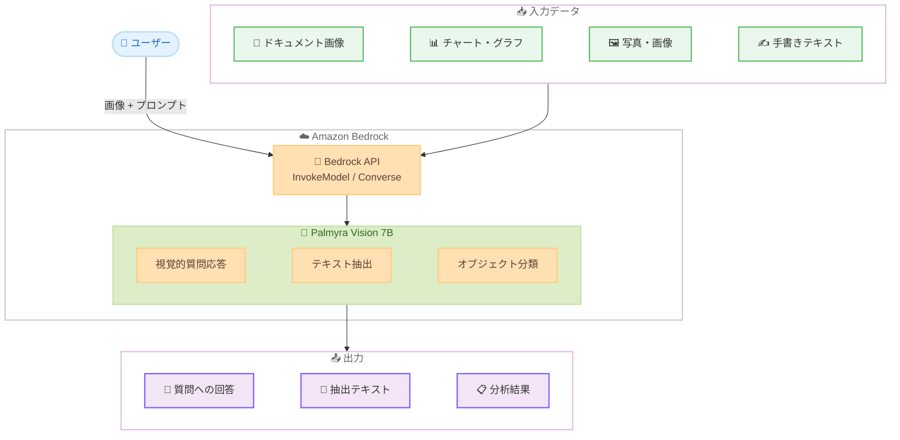

# Amazon Bedrock - Writer Palmyra Vision 7B モデルが利用可能に

**リリース日**: 2026 年 3 月 26 日
**サービス**: Amazon Bedrock
**機能**: Palmyra Vision 7B from Writer

📊 [このアップデートのインフォグラフィックを見る](https://takech9203.github.io/aws-news-summary/20260326-palmyra-vision-7b-writer-bedrock.html)

## 概要

Amazon Bedrock で Writer の Palmyra Vision 7B モデルが利用可能になりました。Palmyra Vision 7B は、画像とテキストの理解に特化したビジョン言語モデル (VLM) であり、推論インフラストラクチャを管理することなく、視覚的理解タスクのための生成 AI アプリケーションを構築できます。

このモデルは、100 万件の高品質な画像 - テキストペアで構成される PixMo データセットで学習されており、視覚的質問応答 (VQA) や画像テキスト理解において優れた性能を発揮します。ドキュメント分析、チャート解釈、画像ベースの質問応答といった視覚的理解タスクに対応しており、手書きテキストの抽出、オブジェクトや色の分類、プロットやダッシュボードの解釈、画像コンテンツに関する自然言語での質問応答が可能です。

**アップデート前の課題**

- 視覚的理解タスクを実行するには、独自のビジョンモデルをデプロイ・管理するか、限られたモデル選択肢から選ぶ必要があった
- ドキュメント分析やチャート解釈などの専門的なビジョンタスクに対応するには、複数のモデルやパイプラインを組み合わせる必要があった
- 手書きテキストの抽出やダッシュボード解釈を単一のモデルで効率的に処理することが困難だった

**アップデート後の改善**

- Amazon Bedrock の API を通じて Palmyra Vision 7B を即座に利用開始でき、推論インフラの管理が不要になった
- 7B パラメータの軽量モデルでありながら、ドキュメント分析からチャート解釈まで幅広い視覚的理解タスクに単一モデルで対応可能になった
- PixMo データセットによる高品質な学習により、手書きテキスト抽出やオブジェクト分類などの精度の高い処理が利用可能になった

## アーキテクチャ図



Palmyra Vision 7B は Amazon Bedrock API を通じて、画像とプロンプトを入力として受け取り、視覚的質問応答、テキスト抽出、オブジェクト分類などのタスクを実行します。

## サービスアップデートの詳細

### 主要機能

1. **視覚的質問応答**
   - 画像コンテンツに関する自然言語での質問に回答
   - 画像内の情報を理解し、文脈に基づいた正確な回答を生成
   - 複雑な視覚的シーンの解釈に対応

2. **ドキュメント分析・テキスト抽出**
   - 手書きテキストの認識と抽出
   - スキャンされたドキュメントからの情報抽出
   - フォームやレシートなどの構造化データの解析

3. **チャート・グラフ解釈**
   - プロットやダッシュボードの視覚的データを解釈
   - グラフのトレンドやパターンを自然言語で説明
   - データビジュアライゼーションからの洞察抽出

4. **オブジェクト分類**
   - 画像内のオブジェクトや色の分類
   - 視覚的属性の識別と説明
   - シーン内の要素の関係性の理解

## 技術仕様

### モデル仕様

| 項目 | 詳細 |
|------|------|
| モデル名 | Palmyra Vision 7B |
| プロバイダー | Writer |
| パラメータ数 | 7B |
| 学習データ | PixMo データセット (100 万件の画像 - テキストペア) |
| モダリティ | テキスト + 画像入力、テキスト出力 |
| 提供方式 | Amazon Bedrock オンデマンド |

### IAM ポリシー例

```json
{
    "Version": "2012-10-17",
    "Statement": [
        {
            "Effect": "Allow",
            "Action": [
                "bedrock:InvokeModel",
                "bedrock:InvokeModelWithResponseStream"
            ],
            "Resource": "arn:aws:bedrock:*::foundation-model/writer.palmyra-vision-7b-*"
        }
    ]
}
```

## 設定方法

### 前提条件

1. AWS アカウントを保有していること
2. Amazon Bedrock へのアクセス権限が設定されていること
3. Bedrock コンソールで Palmyra Vision 7B モデルへのアクセスが有効化されていること

### 手順

#### ステップ 1: モデルアクセスの有効化

Amazon Bedrock コンソールで「モデルアクセス」ページに移動し、Writer の Palmyra Vision 7B モデルへのアクセスをリクエストします。

#### ステップ 2: API による画像分析の実行

```bash
aws bedrock-runtime invoke-model \
    --model-id writer.palmyra-vision-7b \
    --content-type application/json \
    --accept application/json \
    --body '{
        "messages": [
            {
                "role": "user",
                "content": [
                    {
                        "type": "image",
                        "source": {
                            "type": "base64",
                            "media_type": "image/png",
                            "data": "<BASE64_ENCODED_IMAGE>"
                        }
                    },
                    {
                        "type": "text",
                        "text": "この画像に何が写っていますか?"
                    }
                ]
            }
        ]
    }' \
    output.json
```

Bedrock Runtime の InvokeModel API を使用して、画像とプロンプトを送信し、モデルの応答を取得します。

#### ステップ 3: Converse API を使用した対話形式での画像分析

```python
import boto3
import base64

client = boto3.client("bedrock-runtime")

with open("document.png", "rb") as f:
    image_data = base64.b64encode(f.read()).decode("utf-8")

response = client.converse(
    modelId="writer.palmyra-vision-7b",
    messages=[
        {
            "role": "user",
            "content": [
                {
                    "image": {
                        "format": "png",
                        "source": {
                            "bytes": base64.b64decode(image_data)
                        }
                    }
                },
                {
                    "text": "このドキュメントの内容を要約してください。"
                }
            ]
        }
    ]
)

print(response["output"]["message"]["content"][0]["text"])
```

Converse API を使用することで、統一されたインターフェースで画像を含む対話形式のリクエストを送信できます。

## メリット

### ビジネス面

- **迅速な導入**: Amazon Bedrock のマネージドサービスとして提供されるため、インフラ構築なしで即座にビジョン AI 機能を導入可能
- **コスト効率**: 7B パラメータの軽量モデルにより、大規模モデルと比較してコスト効率の高い推論が期待できる
- **幅広い適用範囲**: ドキュメント処理、品質検査、カスタマーサポートなど多様なビジネスシーンに対応

### 技術面

- **マルチモーダル対応**: テキストと画像の両方を入力として受け付け、統合的な理解が可能
- **高品質な学習データ**: PixMo データセット (100 万件の画像 - テキストペア) による学習で、高精度な視覚的理解を実現
- **API 統合の容易さ**: Bedrock の標準 API (InvokeModel, Converse) を通じて利用でき、既存のアプリケーションへの組み込みが容易

## デメリット・制約事項

### 制限事項

- 7B パラメータモデルのため、より大規模なモデルと比較して複雑な推論タスクでは精度が劣る可能性がある
- テキスト出力のみに対応しており、画像生成や編集には非対応
- 利用可能なリージョンが限定される可能性がある (詳細は AWS ドキュメントで確認が必要)

### 考慮すべき点

- モデルへのアクセス有効化が事前に必要であり、承認プロセスに時間がかかる場合がある
- 画像の解像度やフォーマットによっては、認識精度が変動する可能性がある
- 料金体系はトークンベースであるため、画像サイズに応じた入力トークン数の見積もりが重要

## ユースケース

### ユースケース 1: ドキュメント自動処理

**シナリオ**: 保険会社が受け取る大量の申請書類 (手書きフォーム、診断書、レシートなど) を自動的に読み取り、データベースに登録する。

**実装例**:
```python
response = client.converse(
    modelId="writer.palmyra-vision-7b",
    messages=[
        {
            "role": "user",
            "content": [
                {"image": {"format": "png", "source": {"bytes": claim_image}}},
                {"text": "この保険申請書から、申請者名、日付、金額を JSON 形式で抽出してください。"}
            ]
        }
    ]
)
```

**効果**: 手作業によるデータ入力を削減し、処理速度を大幅に向上。入力ミスの低減にも貢献。

### ユースケース 2: ダッシュボード・レポートの自動解釈

**シナリオ**: BI ダッシュボードのスクリーンショットをモデルに入力し、主要な指標やトレンドを自然言語で要約するレポートを自動生成する。

**実装例**:
```python
response = client.converse(
    modelId="writer.palmyra-vision-7b",
    messages=[
        {
            "role": "user",
            "content": [
                {"image": {"format": "png", "source": {"bytes": dashboard_image}}},
                {"text": "このダッシュボードの主要な KPI とトレンドを要約してください。前月比の変化も含めてください。"}
            ]
        }
    ]
)
```

**効果**: 定期レポート作成の工数を削減し、データに基づく意思決定を迅速化。

### ユースケース 3: 製品画像の品質検査

**シナリオ**: 製造ラインで撮影された製品画像を分析し、外観の欠陥や色のばらつきを自動検出する。

**実装例**:
```python
response = client.converse(
    modelId="writer.palmyra-vision-7b",
    messages=[
        {
            "role": "user",
            "content": [
                {"image": {"format": "png", "source": {"bytes": product_image}}},
                {"text": "この製品画像に欠陥や異常はありますか? 色、形状、表面の状態を確認し、問題があれば報告してください。"}
            ]
        }
    ]
)
```

**効果**: 目視検査の負担を軽減し、検査の一貫性と網羅性を向上。

## 料金

Amazon Bedrock でのモデル利用料金は、入力トークン数と出力トークン数に基づく従量課金制です。Palmyra Vision 7B の具体的な料金については、AWS の料金ページで確認が必要です。

| 項目 | 詳細 |
|------|------|
| 課金体系 | 入力トークン + 出力トークンの従量課金 |
| 追加料金 | 画像入力に対するトークン換算が適用される可能性あり |

詳細な料金は [Amazon Bedrock の料金ページ](https://aws.amazon.com/bedrock/pricing/) を参照してください。

## 利用可能リージョン

具体的な利用可能リージョンについては、[Amazon Bedrock のドキュメント](https://docs.aws.amazon.com/bedrock/latest/userguide/models-regions.html)で確認してください。Amazon Bedrock が利用可能なリージョンのうち、Writer モデルが有効化されているリージョンで利用できます。

## 関連サービス・機能

- **Amazon Bedrock**: フルマネージドの生成 AI サービスとして、Palmyra Vision 7B を含む複数のファウンデーションモデルへの統一的な API アクセスを提供
- **Amazon Textract**: ドキュメントからのテキスト抽出に特化した AWS サービス。Palmyra Vision 7B との組み合わせでより高度なドキュメント処理が可能
- **Amazon Rekognition**: 画像・動画分析サービス。オブジェクト検出やラベル付けなどの機能を提供し、Palmyra Vision 7B の視覚的理解機能と補完的に利用可能

## 参考リンク

- 📊 [インフォグラフィック](https://takech9203.github.io/aws-news-summary/20260326-palmyra-vision-7b-writer-bedrock.html)
- [公式発表 (What's New)](https://aws.amazon.com/about-aws/whats-new/2026/03/palmyra-vision-7b-writer-bedrock/)
- [Amazon Bedrock ドキュメント](https://docs.aws.amazon.com/bedrock/latest/userguide/)
- [Amazon Bedrock 料金ページ](https://aws.amazon.com/bedrock/pricing/)
- [Writer Palmyra モデル](https://writer.com/product/palmyra/)

## まとめ

Amazon Bedrock で Writer の Palmyra Vision 7B が利用可能になったことで、インフラ管理なしでビジョン言語モデルによる視覚的理解タスクを実行できるようになりました。ドキュメント分析、チャート解釈、手書きテキスト抽出など、幅広いユースケースに対応しており、特にドキュメント処理の自動化やデータビジュアライゼーションの解釈において大きな価値を提供します。まずは Bedrock コンソールでモデルアクセスを有効化し、自社のビジョン AI ユースケースでの性能評価を開始することを推奨します。
