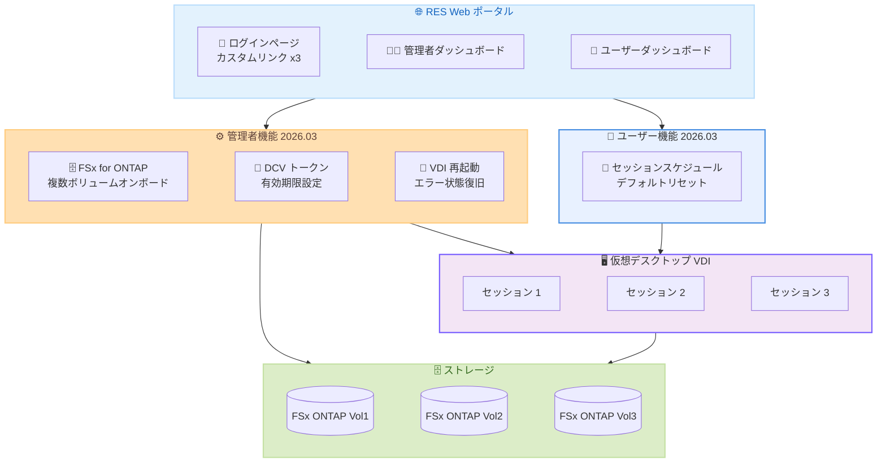

# Research and Engineering Studio on AWS - 2026.03 リリース

**リリース日**: 2026 年 3 月 26 日
**サービス**: Research and Engineering Studio on AWS (RES)
**機能**: 管理者コントロールの強化、ファイルシステムサポートの拡張、セッション管理の改善

## 概要

Research and Engineering Studio (RES) on AWS の 2026.03 バージョンがリリースされました。本リリースでは、管理者向けの新しいコントロール機能、ファイルシステムサポートの拡張、仮想デスクトップインフラストラクチャ (VDI) セッション管理の改善が含まれています。

RES は、管理者がセキュアなクラウドベースの研究およびエンジニアリング環境を作成・管理するためのオープンソースの Web ベースポータルです。科学者やエンジニアは、クラウドの専門知識がなくてもデータの可視化やインタラクティブなアプリケーションの実行が可能です。今回のアップデートにより、管理者の柔軟性が向上し、ユーザーのセッション管理体験が改善されました。

**アップデート前の課題**

- FSx for ONTAP ボリュームを個別に複数オンボードすることができなかった
- DCV トークンの有効期限をカスタマイズできず、長時間セッションへの対応が制限されていた
- RES ログインページにカスタムリンクを追加できず、ユーザーへの案内が限られていた
- エラー状態の VDI を管理者が直接再起動できず、復旧に手間がかかっていた
- ユーザーが VDI セッションスケジュールをシステムデフォルトに簡単にリセットできなかった

**アップデート後の改善**

- 複数の FSx for ONTAP ボリュームを個別に RES ファイルシステムとしてオンボード可能
- DCV トークンの有効期限を管理者が設定でき、長時間セッションに対応
- ログインページに最大 3 つのカスタムリンクを追加可能
- エラー状態の VDI を Sessions ページから直接再起動可能
- ユーザーがワンボタンで VDI セッションスケジュールをデフォルトにリセット可能

## アーキテクチャ図

RES 2026.03 で追加された管理者向け機能とユーザー向け機能の全体像を示しています。管理者はファイルシステム管理、セッション設定、VDI 復旧の柔軟性が向上し、ユーザーはセッションスケジュールの管理が簡素化されました。

## サービスアップデートの詳細

### 主要機能

1. **FSx for ONTAP 複数ボリュームのオンボード**
   - 複数の個別 FSx for ONTAP ボリュームを RES ファイルシステムとしてオンボード可能
   - 研究プロジェクトごとに異なるストレージボリュームを柔軟に割り当て可能
   - 既存のファイルシステム管理ワークフローとの統合が容易

2. **DCV トークン有効期限の設定**
   - 管理者が DCV トークンの有効期限を自由に設定可能
   - 長時間のセッションファイル利用に対応
   - セキュリティ要件に応じた柔軟なトークン管理

3. **ログインページのカスタムリンク**
   - RES ログインページに最大 3 つのカスタムリンクを追加可能
   - アカウント管理ページ、ヘルプドキュメント、利用規約ページなどへのリンクに活用
   - ユーザーのセルフサービス体験を向上

4. **VDI エラー状態の再起動**
   - 管理者が Sessions ページからエラー状態の VDI を直接再起動可能
   - ユーザーの介入を最小限に抑えた障害復旧
   - 起動時の問題解決を効率化

5. **VDI セッションスケジュールのリセット**
   - ユーザーがワンボタンで VDI セッションスケジュールをシステムデフォルトにリセット可能
   - カスタマイズしたスケジュールを簡単に初期状態に戻せる

## 技術仕様

### 対応ファイルシステム

| 項目 | 詳細 |
|------|------|
| 新規対応 | FSx for ONTAP 複数個別ボリューム |
| オンボード方式 | RES 管理コンソールから個別ボリュームを追加 |
| 既存対応 | Amazon EFS、FSx for Lustre、FSx for ONTAP |

### セッション管理

| 項目 | 詳細 |
|------|------|
| DCV トークン | 有効期限をカスタム設定可能 |
| VDI 再起動 | エラー状態の VDI を管理者が直接再起動 |
| スケジュールリセット | ユーザーがデフォルトに 1 クリックでリセット |
| カスタムリンク | ログインページに最大 3 つ追加可能 |

## 設定方法

### 前提条件

1. Research and Engineering Studio on AWS の既存デプロイメントがあること
2. RES 管理者権限を持つ IAM ロールまたはユーザーがあること
3. FSx for ONTAP ボリュームのオンボードには、対象ボリュームが作成済みであること

### 手順

#### ステップ 1: RES 2026.03 へのアップグレード

RES の GitHub リポジトリから最新バージョンを取得し、デプロイメントを更新します。詳細な手順は RES ドキュメントの「Upgrading RES」セクションを参照してください。

#### ステップ 2: FSx for ONTAP ボリュームのオンボード

RES 管理コンソールの Filesystem Management セクションから、個別の FSx for ONTAP ボリュームを追加します。複数のボリュームをそれぞれ独立したファイルシステムとしてオンボードできます。

#### ステップ 3: DCV トークン有効期限の設定

RES 管理コンソールの Settings セクションから DCV トークンの有効期限を設定します。長時間セッションが必要な場合は、適切な有効期限を設定してください。

#### ステップ 4: カスタムリンクの追加

RES 管理コンソールの Settings セクションからログインページに表示するカスタムリンクを最大 3 つまで設定します。

## メリット

### ビジネス面

- **運用効率の向上**: エラー状態の VDI を管理者が直接復旧でき、ダウンタイムを削減
- **ユーザー体験の改善**: ログインページのカスタムリンクやスケジュールリセット機能によりセルフサービスが向上
- **柔軟なストレージ管理**: プロジェクトごとに異なる FSx for ONTAP ボリュームを割り当て可能

### 技術面

- **ファイルシステムの柔軟性**: 複数の FSx for ONTAP ボリュームを個別に管理でき、データ分離とアクセス制御が向上
- **セキュリティ設定の細分化**: DCV トークン有効期限の設定により、セキュリティポリシーに応じた柔軟な構成が可能
- **障害復旧の効率化**: VDI エラー状態からの復旧が管理者ダッシュボードから直接実行可能

## デメリット・制約事項

### 制限事項

- ログインページのカスタムリンクは最大 3 つまで
- VDI の再起動はエラー状態のセッションのみが対象
- FSx for ONTAP ボリュームのオンボードにはボリュームが事前に作成されている必要がある

### 考慮すべき点

- DCV トークンの有効期限を長く設定する場合、セキュリティリスクとのバランスを考慮する必要がある
- 既存の RES デプロイメントからのアップグレード手順を事前に確認し、計画的に実施することを推奨

## ユースケース

### ユースケース 1: 大規模研究機関でのマルチプロジェクトストレージ管理

**シナリオ**: 複数の研究プロジェクトが同時進行しており、各プロジェクトが独自のデータセットを持つ研究機関。プロジェクト間のデータ分離とアクセス制御が必要。

**効果**: プロジェクトごとに個別の FSx for ONTAP ボリュームをオンボードすることで、データの分離を実現しつつ、RES の統一管理インタフェースで効率的に運用できる。

### ユースケース 2: 長時間シミュレーションの実行

**シナリオ**: 流体力学シミュレーションや機械学習モデルのトレーニングなど、数時間から数日かかるワークロードを VDI 上で実行する環境。

**効果**: DCV トークンの有効期限を延長することで、長時間セッション中のトークン期限切れによる中断を防止し、ワークロードの安定実行を実現。

### ユースケース 3: 大学の研究計算環境の運用

**シナリオ**: 多数の研究者がアクセスする大学の研究計算環境で、ログインページからの案内や VDI 障害の迅速な復旧が求められる。

**効果**: ログインページにヘルプデスクや利用規約へのカスタムリンクを設置し、管理者がエラー状態の VDI を迅速に再起動できることで、サポート負荷を軽減しつつユーザー体験を向上。

## 料金

Research and Engineering Studio on AWS はオープンソースソリューションであり、RES 自体に追加料金はかかりません。料金は、RES 環境で使用する AWS リソース (EC2 インスタンス、FSx ストレージ、VPC など) の使用量に基づいて発生します。

## 利用可能リージョン

RES 2026.03 は、RES が利用可能なすべての AWS リージョンで提供されています。

## 関連サービス・機能

- **Amazon FSx for NetApp ONTAP**: RES でオンボード可能なエンタープライズ向け共有ファイルストレージ
- **NICE DCV**: RES の仮想デスクトップセッションで使用される高性能リモートディスプレイプロトコル
- **AWS ParallelCluster**: HPC クラスターの構築と管理を自動化するツール。RES と組み合わせて利用可能
- **Amazon EC2**: RES の仮想デスクトップインスタンスの実行基盤

## 参考リンク

- [公式発表 (What's New)](https://aws.amazon.com/about-aws/whats-new/2026/03/res-2026-03-is-now-available/)
- [Research and Engineering Studio ドキュメント](https://docs.aws.amazon.com/res/latest/userguide/overview.html)
- [RES GitHub リポジトリ](https://github.com/aws/res)

## まとめ

Research and Engineering Studio on AWS 2026.03 は、管理者の運用効率とユーザーの利便性を同時に向上させるアップデートです。FSx for ONTAP 複数ボリュームのサポート、DCV トークン有効期限の設定、VDI エラー復旧の改善により、研究・エンジニアリング環境の管理がより柔軟になりました。RES を利用中の組織は、早期のアップグレードを検討してください。
