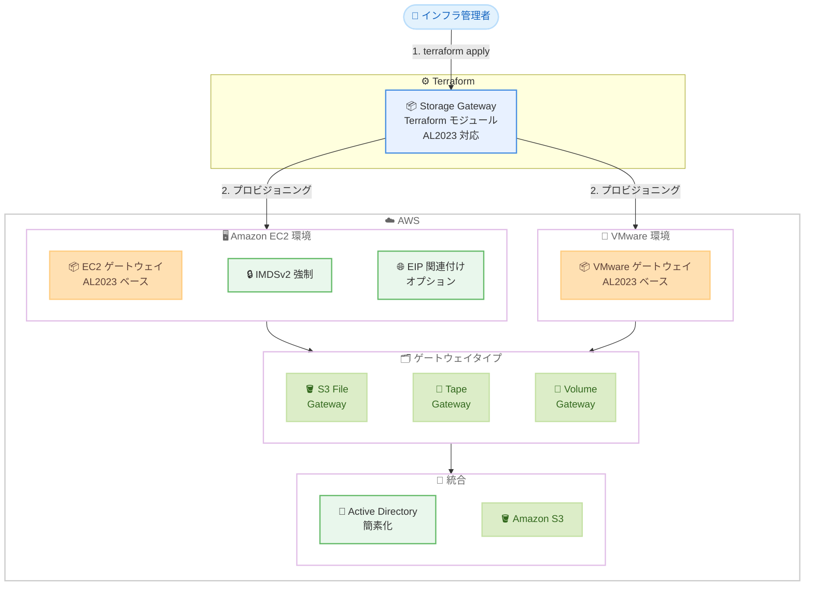

# AWS Storage Gateway - Terraform モジュールが Amazon Linux 2023 をサポート

**リリース日**: 2026 年 3 月 26 日
**サービス**: AWS Storage Gateway
**機能**: Terraform モジュールの Amazon Linux 2023 対応

📊 [このアップデートのインフォグラフィックを見る](https://takech9203.github.io/aws-news-summary/20260326-storage-gateway-terraform-al2023.html)

## 概要

AWS Storage Gateway の Terraform モジュールが Amazon Linux 2023 (AL2023) ベースのデプロイに対応しました。これにより、Infrastructure as Code (IaC) によるゲートウェイのプロビジョニングにおいて、セキュリティ、信頼性、運用の簡素化が向上します。

更新されたモジュールは、Amazon S3 File Gateway、Tape Gateway、Volume Gateway のすべてのゲートウェイタイプをサポートし、Amazon EC2 および VMware 環境の両方で利用できます。AL2023 ベースのゲートウェイは、EC2 デプロイメントにおいて IMDSv2 をデフォルトで強制し、認証情報の窃取や SSRF 攻撃からの保護を強化します。さらに、ルーティンの Terraform 操作中に予期しないゲートウェイの置き換えを防止し、Active Directory 統合を簡素化する機能も提供します。

**アップデート前の課題**

- Storage Gateway の Terraform モジュールは Amazon Linux 2 ベースであり、セキュリティパッチやサポートのライフサイクルに制約があった
- EC2 デプロイメントでは IMDSv1 がデフォルトで有効であり、認証情報の窃取や SSRF 攻撃のリスクがあった
- ルーティンの Terraform 操作 (plan/apply) 時にゲートウェイが意図せず置き換えられる問題が発生する可能性があった
- Active Directory との統合設定が複雑で、手動の設定手順が多かった
- EC2 ベースのゲートウェイで Elastic IP (EIP) の関連付けがサポートされておらず、完全にプライベートなゲートウェイアクティベーションが困難だった

**アップデート後の改善**

- Amazon Linux 2023 ベースのデプロイにより、最新のセキュリティ機能と長期サポートを活用できるようになった
- IMDSv2 がデフォルトで強制され、SSRF 攻撃や認証情報の窃取に対する保護が自動的に適用される
- Terraform 操作時の予期しないゲートウェイ置き換えが防止され、運用の安定性が向上した
- Active Directory 統合が簡素化され、設定の手間が削減された
- EC2 ベースのゲートウェイでオプションの EIP 関連付けがサポートされ、完全にプライベートなゲートウェイアクティベーションが可能になった

## アーキテクチャ図



Terraform モジュールを使用して、AL2023 ベースの Storage Gateway を EC2 環境または VMware 環境にプロビジョニングします。すべてのゲートウェイタイプに対応し、IMDSv2 の強制や EIP 関連付けなどのセキュリティ機能が組み込まれています。

## サービスアップデートの詳細

### 主要機能

1. **Amazon Linux 2023 ベースのデプロイ**
   - すべてのゲートウェイタイプ (S3 File Gateway、Tape Gateway、Volume Gateway) が AL2023 ベースで展開可能
   - Amazon EC2 と VMware の両環境をサポート
   - 最新のセキュリティパッチと長期サポートライフサイクルを活用可能

2. **IMDSv2 のデフォルト強制**
   - EC2 デプロイメントにおいて Instance Metadata Service v2 (IMDSv2) がデフォルトで強制される
   - 認証情報の窃取や Server-Side Request Forgery (SSRF) 攻撃に対する保護を提供
   - 追加の設定なしでセキュリティベストプラクティスに準拠

3. **Terraform 操作の安定性向上**
   - ルーティンの Terraform plan/apply 操作中にゲートウェイが予期せず置き換えられる問題を防止
   - 既存のゲートウェイ構成を維持しながら、安全な差分適用が可能
   - 本番環境での IaC 運用の信頼性が向上

4. **Active Directory 統合の簡素化**
   - File Gateway における Active Directory ドメイン参加の設定が簡素化
   - 手動での設定手順が削減され、Terraform コードによる一貫した構成管理が可能

5. **Elastic IP 関連付けのサポート**
   - EC2 ベースのゲートウェイでオプションの EIP 関連付けが可能
   - 完全にプライベートなゲートウェイアクティベーションを実現
   - パブリック IP アドレスを使用せずにゲートウェイを有効化できる

## 技術仕様

### サポートされる構成

| 項目 | 詳細 |
|------|------|
| ベース OS | Amazon Linux 2023 |
| 対応ゲートウェイ | S3 File Gateway、Tape Gateway、Volume Gateway |
| デプロイ環境 | Amazon EC2、VMware |
| IMDSv2 | EC2 デプロイメントでデフォルト強制 |
| EIP 関連付け | EC2 ベースでオプション対応 |
| Active Directory | 統合設定の簡素化 |

### セキュリティ強化の比較

| セキュリティ項目 | AL2 ベース | AL2023 ベース |
|-----------------|-----------|--------------|
| IMDS バージョン | IMDSv1/v2 | IMDSv2 のみ (デフォルト) |
| SSRF 攻撃対策 | 手動設定が必要 | 自動適用 |
| OS セキュリティパッチ | 2025 年 6 月でサポート終了予定 | 長期サポート |
| ゲートウェイ置き換え防止 | 対応なし | 対応済み |

### Terraform モジュール設定例

```hcl
module "s3_file_gateway" {
  source = "aws-ia/storagegateway/aws//modules/s3-nfs-file-gateway"

  gateway_name       = "my-s3-file-gateway"
  gateway_ip_address = "10.0.1.100"
  gateway_type       = "FILE_S3"

  # AL2023 ベースの AMI を自動使用
  # IMDSv2 がデフォルトで強制される

  # オプション: EIP 関連付け
  associate_eip = true
  eip_allocation_id = "eipalloc-0123456789abcdef0"

  # Active Directory 統合
  domain_name     = "corp.example.com"
  domain_username = "admin"
  domain_password = var.ad_password

  tags = {
    Environment = "production"
  }
}
```

## 設定方法

### 前提条件

1. Terraform v1.0 以上がインストールされている
2. AWS プロバイダーが設定済みで、Storage Gateway の操作に必要な IAM 権限が付与されている
3. デプロイ先の VPC とサブネットが構成されている

### 手順

#### ステップ 1: Terraform モジュールの取得

```bash
# Terraform の初期化と最新モジュールの取得
terraform init -upgrade
```

Storage Gateway の Terraform モジュールを最新バージョンに更新します。AL2023 対応のモジュールが自動的にダウンロードされます。

#### ステップ 2: Terraform 構成ファイルの作成

```hcl
# main.tf
module "sgw_ec2" {
  source = "aws-ia/storagegateway/aws//modules/s3-nfs-file-gateway"

  gateway_name       = "prod-file-gateway"
  gateway_ip_address = "10.0.1.100"
  gateway_type       = "FILE_S3"

  # EIP による完全プライベートアクティベーション
  associate_eip     = true
  eip_allocation_id = aws_eip.gateway.id

  tags = {
    Environment = "production"
    ManagedBy   = "terraform"
  }
}
```

Storage Gateway の構成を Terraform コードで定義します。AL2023 ベースの AMI が自動的に選択され、IMDSv2 がデフォルトで強制されます。

#### ステップ 3: デプロイの実行

```bash
# 変更内容の確認
terraform plan

# デプロイの実行
terraform apply
```

`terraform plan` で変更内容を確認し、`terraform apply` でゲートウェイをデプロイします。AL2023 ベースのモジュールにより、ルーティン操作時の予期しないゲートウェイ置き換えが防止されます。

## メリット

### ビジネス面

- **運用コストの削減**: IaC によるゲートウェイ管理の自動化と AL2023 の長期サポートにより、運用の手間とコストが削減される
- **コンプライアンスの強化**: IMDSv2 のデフォルト強制により、セキュリティ監査の要件を自動的に満たすことができる
- **ダウンタイムリスクの低減**: Terraform 操作時のゲートウェイ置き換え防止により、本番環境の可用性が向上する

### 技術面

- **セキュリティの向上**: IMDSv2 のデフォルト強制と AL2023 の最新セキュリティ機能により、SSRF 攻撃や認証情報窃取のリスクが大幅に低減される
- **IaC 運用の安定性**: ルーティンの Terraform 操作でゲートウェイが意図せず再作成されることがなくなり、安全な差分適用が可能になる
- **デプロイの柔軟性**: EIP 関連付けのサポートにより、完全にプライベートなネットワーク環境でのゲートウェイアクティベーションが実現できる

## デメリット・制約事項

### 制限事項

- 既存の AL2 ベースのゲートウェイから AL2023 ベースへの移行には、ゲートウェイの再作成が必要になる可能性がある
- VMware 環境での EIP 関連付け機能は EC2 環境でのみ利用可能であり、VMware 環境には適用されない
- Terraform モジュールのバージョンアップに伴い、既存の Terraform コードに修正が必要になる場合がある

### 考慮すべき点

- AL2 から AL2023 への移行時には、アプリケーションの互換性テストを事前に実施することが推奨される
- 既存のゲートウェイを使用している場合、移行計画を策定し、段階的に AL2023 ベースに切り替えることが推奨される
- Active Directory 統合の簡素化による設定変更が既存の構成に影響しないか確認が必要

## ユースケース

### ユースケース 1: エンタープライズファイル共有の IaC 管理

**シナリオ**: 複数拠点にまたがる S3 File Gateway を Terraform で一括管理し、Active Directory と統合したファイル共有環境を構築したい。

**実装例**:
```hcl
module "file_gateway" {
  for_each = var.gateway_configs

  source = "aws-ia/storagegateway/aws//modules/s3-nfs-file-gateway"

  gateway_name       = each.value.name
  gateway_ip_address = each.value.ip_address
  gateway_type       = "FILE_S3"

  domain_name     = "corp.example.com"
  domain_username = "svc-gateway"
  domain_password = var.ad_password

  tags = {
    Location = each.value.location
  }
}
```

**効果**: Active Directory 統合の簡素化により、複数拠点のゲートウェイを統一された Terraform コードで管理でき、設定の一貫性と展開の効率性が向上する。

### ユースケース 2: セキュアなバックアップ環境の構築

**シナリオ**: 完全にプライベートなネットワーク環境で Tape Gateway をデプロイし、テープバックアップを S3 Glacier に移行したい。

**実装例**:
```hcl
module "tape_gateway" {
  source = "aws-ia/storagegateway/aws//modules/tape-gateway"

  gateway_name       = "backup-tape-gateway"
  gateway_ip_address = "10.0.2.100"
  gateway_type       = "VTL"

  # プライベートアクティベーション
  associate_eip     = true
  eip_allocation_id = aws_eip.backup_gw.id

  tags = {
    Purpose = "backup"
  }
}
```

**効果**: EIP 関連付けによる完全プライベートアクティベーションと IMDSv2 の強制により、セキュリティ要件の厳しい環境でも安全にバックアップゲートウェイを展開できる。

### ユースケース 3: マルチ環境での Volume Gateway 管理

**シナリオ**: 開発・ステージング・本番環境それぞれに Volume Gateway を Terraform で展開し、環境間の構成を統一管理したい。

**実装例**:
```hcl
locals {
  environments = {
    dev     = { subnet_id = "subnet-dev123",  instance_type = "m5.xlarge" }
    staging = { subnet_id = "subnet-stg456",  instance_type = "m5.2xlarge" }
    prod    = { subnet_id = "subnet-prod789", instance_type = "m5.4xlarge" }
  }
}

module "volume_gateway" {
  for_each = local.environments

  source = "aws-ia/storagegateway/aws//modules/volume-gateway"

  gateway_name  = "${each.key}-volume-gateway"
  gateway_type  = "CACHED"
  instance_type = each.value.instance_type
  subnet_id     = each.value.subnet_id

  tags = {
    Environment = each.key
  }
}
```

**効果**: AL2023 ベースのモジュールにより、Terraform のルーティン操作でゲートウェイが予期せず置き換えられるリスクがなくなり、本番環境を含むマルチ環境での安全な IaC 運用が実現する。

## 料金

Storage Gateway の Terraform モジュール自体は無償で利用できます。料金は使用する Storage Gateway のタイプとリソースに依存します。

### 料金例

| ゲートウェイタイプ | 主な課金要素 |
|------------------|-------------|
| S3 File Gateway | ゲートウェイの時間単価、S3 ストレージ料金 |
| Tape Gateway | ゲートウェイの時間単価、仮想テープストレージ料金 |
| Volume Gateway | ゲートウェイの時間単価、ボリュームストレージ料金 |

詳細については [AWS Storage Gateway 料金ページ](https://aws.amazon.com/storagegateway/pricing/) を参照してください。

## 利用可能リージョン

AWS Storage Gateway が利用可能なすべてのリージョンで、AL2023 対応の Terraform モジュールを使用できます。詳細なリージョンリストは [AWS リージョンとサービス](https://aws.amazon.com/about-aws/global-infrastructure/regional-product-services/) を参照してください。

## 関連サービス・機能

- **AWS Storage Gateway**: オンプレミス環境と AWS クラウドストレージを接続するハイブリッドクラウドストレージサービス。今回の Terraform モジュール更新の対象サービス
- **Amazon S3**: S3 File Gateway のバックエンドストレージとして使用されるオブジェクトストレージサービス
- **Amazon Linux 2023**: AWS が提供する最新の Linux ディストリビューション。長期サポートと最新のセキュリティ機能を提供
- **HashiCorp Terraform**: インフラストラクチャをコードとして管理するための IaC ツール。今回のモジュール更新の基盤

## 参考リンク

- 📊 [インフォグラフィック](https://takech9203.github.io/aws-news-summary/20260326-storage-gateway-terraform-al2023.html)
- [公式発表 (What's New)](https://aws.amazon.com/about-aws/whats-new/2026/03/storage-gateway-terraform-al2023/)
- [ドキュメント - AWS Storage Gateway](https://docs.aws.amazon.com/storagegateway/latest/userguide/WhatIsStorageGateway.html)
- [Terraform モジュール - AWS Storage Gateway](https://registry.terraform.io/modules/aws-ia/storagegateway/aws/latest)
- [AWS Storage Gateway 料金ページ](https://aws.amazon.com/storagegateway/pricing/)

## まとめ

AWS Storage Gateway の Terraform モジュールが Amazon Linux 2023 に対応したことで、IaC によるゲートウェイ管理のセキュリティと運用安定性が大幅に向上します。IMDSv2 のデフォルト強制による SSRF 対策、Terraform 操作時のゲートウェイ置き換え防止、Active Directory 統合の簡素化、EIP によるプライベートアクティベーションなど、実用的な改善が多数含まれています。既存の AL2 ベースのゲートウェイを運用している場合は、AL2 のサポート終了に備えて AL2023 ベースへの移行計画を策定することを推奨します。
