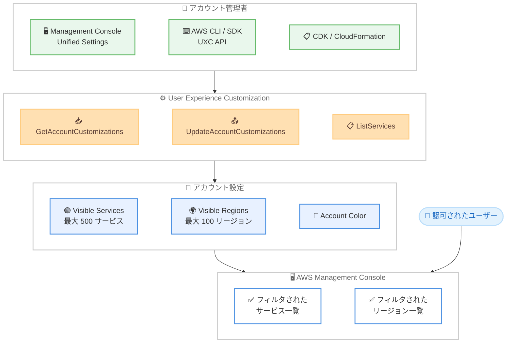

# AWS Management Console - サービスとリージョンの表示制御設定

**リリース日**: 2026 年 3 月 27 日
**サービス**: AWS Management Console
**機能**: Visible services and Visible Regions account settings

📊 [このアップデートのインフォグラフィックを見る](https://takech9203.github.io/aws-news-summary/20260327-account-customizations-console.html)

## 概要

AWS Management Console において、アカウントレベルで表示するサービスとリージョンをカスタマイズできる「Visible services」および「Visible Regions」設定が一般提供 (GA) されました。この機能は AWS User Experience Customization (UXC) API を通じてプログラム的にも設定可能です。

この設定により、アカウント管理者はコンソール上に表示されるサービスとリージョンを制限し、認可されたユーザーが利用可能なリソースを容易に識別できるようになります。大規模な組織やマルチアカウント環境において、コンソールのナビゲーションを簡素化し、ユーザーの生産性向上に貢献します。

**アップデート前の課題**

- AWS Management Console には 200 以上のサービスと 30 以上のリージョンが表示され、ユーザーにとって必要なサービスを見つけにくい状況があった
- アカウント内で利用が許可されていないサービスやリージョンもコンソールに表示され、混乱の原因となっていた
- コンソールの表示をアカウントレベルでカスタマイズするネイティブな手段が存在しなかった

**アップデート後の改善**

- コンソールに表示するサービスとリージョンをアカウントレベルで制御可能に
- AWS Management Console の Unified Settings から GUI で設定可能
- UXC API を通じて AWS CLI、SDK、CDK、CloudFormation からプログラム的に設定を管理可能

## アーキテクチャ図



アカウント管理者が UXC API を通じて表示設定を構成し、認可されたユーザーのコンソール表示がフィルタされる全体フローを示しています。

## サービスアップデートの詳細

### 主要機能

1. **Visible Services 設定**
   - コンソールに表示するサービスをアカウントレベルで制限
   - 最大 500 サービスまで指定可能
   - `null` に設定するとデフォルト動作に戻り、すべてのサービスが表示される
   - `ListServices` API で指定可能なサービス識別子の一覧を取得可能

2. **Visible Regions 設定**
   - コンソールに表示するリージョンをアカウントレベルで制限
   - 最大 100 リージョンまで指定可能
   - `null` に設定するとデフォルト動作に戻り、すべてのリージョンが表示される
   - リージョンコードのパターン: `[a-z]{2}(-[a-z]{1,10}){1,2}-[1-9]`

3. **Account Color 設定**
   - アカウントの識別を容易にするカラー設定
   - 選択可能なカラー: pink、purple、darkBlue、lightBlue、teal、green、yellow、orange、red
   - `none` に設定するとデフォルト動作に戻る

4. **プログラム的な設定管理**
   - UXC API を通じて AWS CLI、SDK、CDK、CloudFormation から設定を管理
   - `UpdateAccountCustomizations` API はべき等であり、リクエストに含まれた設定のみ変更される
   - Infrastructure as Code での一括管理が可能

## 技術仕様

### UXC API の概要

| 項目 | 詳細 |
|------|------|
| サービス名 | AWS User Experience Customization (UXC) |
| API エンドポイント | `aws uxc` |
| visibleServices 上限 | 最大 500 サービス |
| visibleRegions 上限 | 最大 100 リージョン |
| サービス識別子パターン | `[a-z0-9]+(-[a-z0-9]+)*` (1-64 文字) |
| リージョンコードパターン | `[a-z]{2}(-[a-z]{1,10}){1,2}-[1-9]` |
| べき等性 | あり |

### API 変更履歴

直近 7 日間で UXC に関連する API 変更は検出されませんでした。

### UXC API オペレーション

| API オペレーション | 説明 |
|------|------|
| `GetAccountCustomizations` | 現在のアカウントカスタマイズ設定を取得 |
| `UpdateAccountCustomizations` | アカウントカスタマイズ設定を更新 |
| `ListServices` | visibleServices で使用可能なサービス識別子の一覧を取得 |

### IAM ポリシー例

```json
{
    "Version": "2012-10-17",
    "Statement": [
        {
            "Effect": "Allow",
            "Action": [
                "uxc:GetAccountCustomizations",
                "uxc:UpdateAccountCustomizations",
                "uxc:ListServices"
            ],
            "Resource": "*"
        }
    ]
}
```

## 設定方法

### 前提条件

1. AWS アカウントと適切な IAM 権限
2. AWS CLI v2 がインストール済みであること
3. UXC API に対する IAM 権限が付与されていること

### 手順

#### ステップ 1: 現在の設定を確認

```bash
aws uxc get-account-customizations
```

現在のアカウントカスタマイズ設定を取得するコマンドです。未設定の場合、visibleServices と visibleRegions は `null`、accountColor は `none` が返されます。

#### ステップ 2: 利用可能なサービス識別子を確認

```bash
aws uxc list-services
```

visibleServices に指定可能なサービス識別子の一覧を取得するコマンドです。パーティションによって利用可能なサービスが異なります。

#### ステップ 3: 表示するサービスとリージョンを設定

```bash
aws uxc update-account-customizations \
    --visible-services "ec2" "s3" "lambda" "dynamodb" "cloudformation" \
    --visible-regions "us-east-1" "us-west-2" "ap-northeast-1" \
    --account-color "teal"
```

表示するサービスを EC2、S3、Lambda、DynamoDB、CloudFormation の 5 つに、表示するリージョンをバージニア北部、オレゴン、東京の 3 つに制限し、アカウントカラーを teal に設定するコマンドです。

#### ステップ 4: 設定をリセット

```bash
aws uxc update-account-customizations \
    --visible-services \
    --visible-regions \
    --account-color "none"
```

visibleServices と visibleRegions に空のリストを渡すことで `null` に戻し、すべてのサービスとリージョンを表示するデフォルト動作に戻すコマンドです。

## メリット

### ビジネス面

- **ユーザーの生産性向上**: 利用可能なサービスとリージョンのみ表示することで、ユーザーが必要なリソースを素早く見つけられる
- **ガバナンスの強化**: 組織のポリシーに沿ったサービスとリージョンのみを表示し、意図しない操作のリスクを低減
- **オンボーディングの効率化**: 新しいチームメンバーが使用すべきサービスを容易に識別できるため、学習コストを削減

### 技術面

- **Infrastructure as Code 対応**: CDK や CloudFormation を通じた一括設定管理が可能
- **べき等な API 設計**: `UpdateAccountCustomizations` API はべき等であり、自動化パイプラインでの安全な実行が可能
- **追加コスト不要**: 既存の AWS アカウントで追加費用なく利用可能

## デメリット・制約事項

### 制限事項

- visibleServices の上限は 500 サービス、visibleRegions の上限は 100 リージョンまで
- コンソールの表示制御のみであり、CLI、SDK、その他の API からのアクセスは制限されない
- アクセス制御としては機能しないため、IAM ポリシーによる適切な権限管理は引き続き必要

### 考慮すべき点

- 表示制御はアカウントレベルの設定であり、ユーザーごとやグループごとの個別設定はできない
- 新しいサービスがリリースされた場合、visibleServices に手動で追加する必要がある
- IAM のアクセス制御とコンソール表示制御を混同しないよう、運用ルールの明確化が必要

## ユースケース

### ユースケース 1: マルチアカウント環境での開発者向けコンソール簡素化

**シナリオ**: AWS Organizations で複数のアカウントを管理しており、開発チーム用アカウントでは使用するサービスが限定されている。開発者がコンソールで必要なサービスを素早く見つけられるよう、表示を制限したい。

**実装例**:
```bash
aws uxc update-account-customizations \
    --visible-services "ec2" "s3" "lambda" "dynamodb" "cloudwatch" \
        "cloudformation" "iam" "codepipeline" "codecommit" "codebuild" \
    --visible-regions "ap-northeast-1" "us-east-1"
```

**効果**: 開発者がコンソールにアクセスした際、使用する 10 サービスと 2 リージョンのみが表示され、ナビゲーションが大幅に簡素化される

### ユースケース 2: コンプライアンス要件に基づくリージョン制限

**シナリオ**: データレジデンシー要件により、特定のリージョンのみでリソースを管理する必要がある。コンソール上でも対象リージョンのみを表示し、運用ミスを防止したい。

**実装例**:
```bash
aws uxc update-account-customizations \
    --visible-regions "eu-west-1" "eu-central-1" "eu-west-2" \
    --account-color "purple"
```

**効果**: EU リージョンのみがコンソールに表示され、誤って他のリージョンでリソースを作成するリスクを低減。アカウントカラーにより本番環境であることを視覚的に識別可能

### ユースケース 3: CloudFormation を使用した組織全体の一括設定

**シナリオ**: AWS Organizations 配下の複数アカウントに対して、CloudFormation StackSets を使用して表示設定を一括適用したい。

**実装例**:
```yaml
AWSTemplateFormatVersion: '2010-09-09'
Resources:
  AccountCustomizations:
    Type: AWS::UXC::AccountCustomizations
    Properties:
      VisibleServices:
        - ec2
        - s3
        - lambda
        - rds
        - cloudwatch
      VisibleRegions:
        - ap-northeast-1
        - us-east-1
        - eu-west-1
      AccountColor: teal
```

**効果**: 組織全体で統一されたコンソール表示設定を維持し、ガバナンスの一貫性を確保

## 料金

Visible services および Visible Regions 設定は、AWS 商用リージョンにおいて追加費用なしで利用可能です。

### 料金例

| 項目 | 料金 |
|------|------|
| Visible services 設定 | 無料 |
| Visible Regions 設定 | 無料 |
| Account Color 設定 | 無料 |
| UXC API 呼び出し | 無料 |

## 利用可能リージョン

すべての AWS 商用リージョンで利用可能です。

## 関連サービス・機能

- **AWS Management Console**: ウェブベースの AWS リソース管理インターフェース
- **AWS Organizations**: マルチアカウント環境の管理と StackSets を通じた一括設定
- **AWS IAM**: サービスとリージョンへのアクセスを制御する権限管理サービス
- **AWS CloudFormation**: Infrastructure as Code による UXC 設定の自動化
- **AWS CDK**: プログラム的なインフラストラクチャ定義を通じた UXC 設定の管理

## 参考リンク

- 📊 [インフォグラフィック](https://takech9203.github.io/aws-news-summary/20260327-account-customizations-console.html)
- [公式発表 (What's New)](https://aws.amazon.com/about-aws/whats-new/2026/03/account-customizations-console/)
- [AWS User Experience Customization ドキュメント](https://docs.aws.amazon.com/awsconsolehelpdocs/latest/userguide/getting-started-uxc.html)
- [UXC API ガイド](https://docs.aws.amazon.com/cli/latest/reference/uxc/index.html)

## まとめ

AWS Management Console の Visible services および Visible Regions 設定により、アカウント管理者はコンソールに表示するサービスとリージョンをカスタマイズできるようになりました。UXC API を通じたプログラム的な管理が可能であり、CloudFormation や CDK による自動化にも対応しています。マルチアカウント環境でのガバナンス強化やユーザーの生産性向上を目的に、まずは開発アカウントや特定用途のアカウントから設定を試すことを推奨します。
