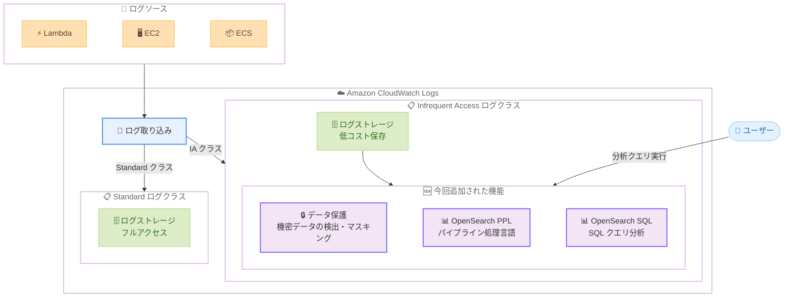

# Amazon CloudWatch Logs - Infrequent Access ログクラスでデータ保護と OpenSearch PPL/SQL をサポート

**リリース日**: 2026 年 3 月 27 日
**サービス**: Amazon CloudWatch Logs
**機能**: Infrequent Access 取り込みクラスにおけるデータ保護、OpenSearch PPL、OpenSearch SQL のサポート

📊 [このアップデートのインフォグラフィックを見る](https://takech9203.github.io/aws-news-summary/20260327-amazon-cloudwatch-infrequent-access-log-class.html)

## 概要

Amazon CloudWatch Logs の Infrequent Access (Logs IA) 取り込みクラスにおいて、データ保護機能、OpenSearch Piped Processing Language (PPL)、および OpenSearch SQL のサポートが追加されました。これにより、コスト効率の高い Logs IA クラスでも、柔軟な分析クエリと機密データの保護が可能になります。

Logs IA は、フォレンジック調査やトラブルシューティングなど、頻繁にはクエリされないログをコスト効率よく統合するための取り込みクラスです。今回のアップデートにより、Standard ログクラスで利用可能だった高度な分析機能とデータ保護機能が Logs IA クラスにも拡張され、すべてのログを AWS 上でネイティブに一元管理しながら、柔軟な分析とコンプライアンス対応を実現できるようになりました。

**アップデート前の課題**

- Logs IA クラスでは CloudWatch Logs Insights のクエリ言語のみが利用可能で、SQL や PPL による柔軟な分析ができなかった
- Logs IA クラスにはデータ保護ポリシーを適用できず、機密データを含むログの取り込みにはコストの高い Standard クラスを使用する必要があった
- コスト最適化のために Logs IA を使用したいが、分析機能やデータ保護機能の制限により Standard クラスを選択せざるを得ないケースがあった

**アップデート後の改善**

- Logs IA クラスで OpenSearch PPL と OpenSearch SQL を使用した高度な分析クエリが可能になった
- Logs IA クラスにデータ保護ポリシーを適用でき、機密データの自動検出とマスキングが可能になった
- ログクラスの選択においてコストと機能のトレードオフが軽減され、より多くのログを Logs IA に統合できるようになった

## アーキテクチャ図



Logs IA クラスに取り込まれたログに対して、データ保護ポリシーによる機密データのマスキングと、OpenSearch PPL/SQL による柔軟な分析クエリを実行できるようになりました。

## サービスアップデートの詳細

### 主要機能

1. **データ保護機能の Logs IA 対応**
   - Logs IA クラスのロググループにデータ保護ポリシーを適用可能
   - クレジットカード番号、社会保障番号、メールアドレスなどの機密データを自動的に検出してマスキング
   - Standard クラスと同様のデータ保護ルールを適用でき、コンプライアンス要件への対応が容易に

2. **OpenSearch PPL サポート**
   - Piped Processing Language による直感的なパイプラインベースのクエリが可能
   - `source`, `where`, `stats`, `sort` などのコマンドをパイプでつなぐことで柔軟なデータ分析を実現
   - ログデータに対するフィルタリング、集計、変換をシンプルな構文で記述可能

3. **OpenSearch SQL サポート**
   - 標準的な SQL 構文によるログデータのクエリが可能
   - `SELECT`, `WHERE`, `GROUP BY`, `ORDER BY` などの馴染みのある SQL 文でログを分析
   - SQL に慣れた開発者やアナリストが追加の学習コストなしにログ分析を開始可能

## 技術仕様

### Logs IA クラスの機能比較

| 機能 | アップデート前 | アップデート後 |
|------|---------------|---------------|
| CloudWatch Logs Insights クエリ | 対応済み | 対応済み |
| OpenSearch PPL | 未対応 | 対応 |
| OpenSearch SQL | 未対応 | 対応 |
| データ保護ポリシー | 未対応 | 対応 |
| ライブテール | 対応済み | 対応済み |
| メトリクスフィルター | 未対応 | 未対応 |
| サブスクリプションフィルター | 未対応 | 未対応 |

### API 変更履歴

| 日付 | サービス | 変更内容 |
|------|----------|----------|
| 2026/03/26 | [Amazon CloudWatch Logs](https://awsapichanges.com/archive/changes/a42e6c-logs.html) | 6 updated methods - Logs Insights のパラメータサポートを追加。名前付きプレースホルダーによる再利用可能なクエリテンプレートの定義が可能に |

### データ保護ポリシーの設定例

```json
{
  "Name": "DataProtectionPolicy",
  "Description": "Logs IA ロググループのデータ保護ポリシー",
  "Version": "2021-06-01",
  "Statement": [
    {
      "Sid": "audit-policy",
      "DataIdentifier": [
        "arn:aws:dataprotection::aws:data-identifier/CreditCardNumber",
        "arn:aws:dataprotection::aws:data-identifier/EmailAddress",
        "arn:aws:dataprotection::aws:data-identifier/SocialSecurityNumber"
      ],
      "Operation": {
        "Audit": {
          "FindingsDestination": {
            "CloudWatchLogs": {
              "LogGroup": "/aws/data-protection/audit"
            }
          }
        }
      }
    },
    {
      "Sid": "redact-policy",
      "DataIdentifier": [
        "arn:aws:dataprotection::aws:data-identifier/CreditCardNumber",
        "arn:aws:dataprotection::aws:data-identifier/EmailAddress"
      ],
      "Operation": {
        "Deidentify": {
          "MaskConfig": {}
        }
      }
    }
  ]
}
```

## 設定方法

### 前提条件

1. AWS アカウントと CloudWatch Logs へのアクセス権限
2. Logs IA クラスのロググループが作成済み、または新規作成するための IAM 権限
3. データ保護ポリシーを設定する場合は `logs:PutDataProtectionPolicy` 権限

### 手順

#### ステップ 1: Logs IA クラスのロググループ作成

```bash
aws logs create-log-group \
  --log-group-name "/app/my-application" \
  --log-group-class INFREQUENT_ACCESS
```

Logs IA クラスを指定してロググループを作成します。`--log-group-class INFREQUENT_ACCESS` パラメータにより、低コストの IA クラスが適用されます。

#### ステップ 2: データ保護ポリシーの適用

```bash
aws logs put-data-protection-policy \
  --log-group-identifier "/app/my-application" \
  --policy-document file://data-protection-policy.json
```

作成した Logs IA ロググループにデータ保護ポリシーを適用します。ポリシーで指定した機密データパターンが自動的に検出され、マスキングされます。

#### ステップ 3: OpenSearch SQL によるクエリ実行

```bash
aws logs start-query \
  --log-group-names "/app/my-application" \
  --start-time $(date -d '1 hour ago' +%s) \
  --end-time $(date +%s) \
  --query-language SQL \
  --query-string "SELECT @timestamp, @message FROM \`/app/my-application\` WHERE @message LIKE '%ERROR%' ORDER BY @timestamp DESC LIMIT 100"
```

OpenSearch SQL を使用して Logs IA ロググループに対するクエリを実行します。`--query-language SQL` パラメータで SQL クエリ言語を指定します。

#### ステップ 4: OpenSearch PPL によるクエリ実行

```bash
aws logs start-query \
  --log-group-names "/app/my-application" \
  --start-time $(date -d '1 hour ago' +%s) \
  --end-time $(date +%s) \
  --query-language PPL \
  --query-string "source = \`/app/my-application\` | where @message like '%ERROR%' | stats count() by bin(@timestamp, 5m) | sort -count()"
```

OpenSearch PPL を使用してパイプラインベースのクエリを実行します。PPL はパイプでコマンドをつなげる直感的な構文でログデータを分析できます。

## メリット

### ビジネス面

- **コスト削減**: データ保護や高度な分析が必要なログでも Logs IA クラスを選択でき、Standard クラスと比較して大幅なコスト削減が可能
- **コンプライアンス対応の簡素化**: Logs IA クラスのログに対しても機密データの自動検出とマスキングが可能になり、規制要件への対応コストを削減
- **ログ統合の促進**: 機能制限の軽減により、より多くのログを AWS ネイティブで一元管理でき、サードパーティツールへの依存を低減

### 技術面

- **クエリ言語の選択肢拡大**: CloudWatch Logs Insights に加えて OpenSearch PPL と SQL が利用可能になり、チームのスキルセットに合わせた分析が可能
- **既存 SQL スキルの活用**: SQL に慣れたエンジニアが追加学習なしにログ分析を開始可能
- **統一的なデータ保護**: Standard クラスと同じデータ保護ポリシーを Logs IA にも適用でき、ログクラスを横断した一貫したセキュリティポリシーを実現

## デメリット・制約事項

### 制限事項

- Logs IA クラスではメトリクスフィルターやサブスクリプションフィルターは引き続き利用不可
- ロググループの作成後にログクラスを変更することはできない
- データ保護ポリシーの検出パターンは AWS が提供するマネージドデータ識別子に限定される

### 考慮すべき点

- Logs IA クラスはクエリ時にスキャン料金が発生するため、頻繁にクエリを実行するログには Standard クラスの方が適切な場合がある
- OpenSearch PPL/SQL の構文は CloudWatch Logs Insights のクエリ構文とは異なるため、既存のクエリの移行が必要

## ユースケース

### ユースケース 1: セキュリティフォレンジック調査

**シナリオ**: セキュリティインシデントが発生した際に、過去のアクセスログやアプリケーションログを詳細に調査する必要がある。通常時はクエリされないが、調査時には SQL による柔軟な分析が求められる。

**実装例**:
```sql
SELECT @timestamp, sourceIPAddress, userIdentity, eventName,
       errorCode, requestParameters
FROM `/aws/cloudtrail/logs`
WHERE eventName = 'ConsoleLogin'
  AND errorCode IS NOT NULL
  AND @timestamp BETWEEN '2026-03-20' AND '2026-03-27'
ORDER BY @timestamp DESC
```

**効果**: 低コストの Logs IA クラスに保存したセキュリティログを、馴染みのある SQL 構文で効率的に調査できる。

### ユースケース 2: コンプライアンス対応のログ管理

**シナリオ**: 規制要件により、アプリケーションログに含まれる個人情報を保護する必要がある。ただし、ログへのアクセスは監査時に限られるため、コストを抑えたい。

**実装例**:
```bash
# Logs IA ロググループにデータ保護ポリシーを適用
aws logs put-data-protection-policy \
  --log-group-identifier "/app/customer-service" \
  --policy-document '{
    "Version": "2021-06-01",
    "Statement": [{
      "Sid": "redact-pii",
      "DataIdentifier": [
        "arn:aws:dataprotection::aws:data-identifier/EmailAddress",
        "arn:aws:dataprotection::aws:data-identifier/PhoneNumber"
      ],
      "Operation": {
        "Deidentify": { "MaskConfig": {} }
      }
    }]
  }'
```

**効果**: Logs IA の低コストでログを保持しながら、個人情報の自動マスキングによりコンプライアンス要件を満たせる。

### ユースケース 3: 運用ログの集約分析

**シナリオ**: 複数のマイクロサービスからの運用ログを Logs IA に統合し、定期的なレポート作成時に PPL で集計分析を行う。

**実装例**:
```
source = `/app/microservices`
| where level = 'ERROR'
| stats count() as error_count by serviceName
| sort -error_count
| head 10
```

**効果**: PPL のパイプライン構文で直感的にエラー傾向を集計でき、運用レポートの作成を効率化できる。

## 料金

Logs IA クラスの料金体系は Standard クラスと比較して低コストに設定されています。

### 料金例

| 項目 | Standard クラス | Infrequent Access クラス |
|------|----------------|--------------------------|
| ログ取り込み | $0.50/GB | $0.25/GB |
| ログストレージ | $0.03/GB/月 | $0.03/GB/月 |
| Logs Insights クエリ | $0.0050/GB スキャン | $0.0050/GB スキャン |
| データ保護 | $0.12/GB | $0.12/GB |

※ 料金は us-east-1 リージョンの例です。最新の料金は AWS 公式料金ページを参照してください。

## 利用可能リージョン

CloudWatch Logs の Infrequent Access クラスが提供されているすべての AWS リージョンで利用可能です。具体的なリージョン一覧については AWS 公式ドキュメントを参照してください。

## 関連サービス・機能

- **Amazon CloudWatch Logs Insights**: CloudWatch Logs のネイティブクエリエンジン。Logs IA では Insights に加えて PPL/SQL も利用可能に
- **Amazon OpenSearch Service**: OpenSearch PPL と SQL の元となるクエリ言語を提供するフルマネージド検索・分析サービス
- **AWS CloudTrail**: セキュリティ監査ログの記録サービス。CloudTrail ログを Logs IA に送信してコスト効率よく保持可能

## 参考リンク

- 📊 [インフォグラフィック](https://takech9203.github.io/aws-news-summary/20260327-amazon-cloudwatch-infrequent-access-log-class.html)
- [公式発表 (What's New)](https://aws.amazon.com/about-aws/whats-new/2026/03/amazon-cloudwatch-infrequent-access-log-class/)
- [ドキュメント - CloudWatch Logs ログクラス](https://docs.aws.amazon.com/AmazonCloudWatch/latest/logs/CloudWatch-Logs-Log-Classes.html)
- [ドキュメント - データ保護](https://docs.aws.amazon.com/AmazonCloudWatch/latest/logs/protect-sensitive-log-data.html)
- [料金ページ](https://aws.amazon.com/cloudwatch/pricing/)

## まとめ

今回のアップデートにより、CloudWatch Logs の Infrequent Access クラスでデータ保護、OpenSearch PPL、OpenSearch SQL がサポートされ、コスト効率の高いログ管理と高度な分析の両立が可能になりました。フォレンジック調査やコンプライアンス対応が必要なログを Logs IA クラスに統合することで、ログ管理コストの削減と機能性の向上を同時に実現できます。Logs IA クラスを活用していない場合は、この機会にログクラスの見直しを検討することを推奨します。
