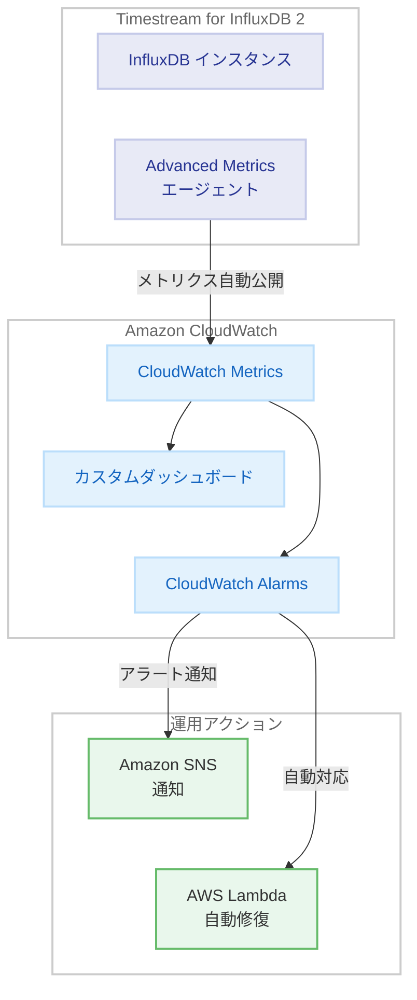

# Amazon Timestream for InfluxDB - Advanced Metrics による包括的なデータベース監視

**リリース日**: 2026 年 3 月 27 日
**サービス**: Amazon Timestream for InfluxDB
**機能**: Advanced Metrics

[このアップデートのインフォグラフィックを見る](https://takech9203.github.io/aws-news-summary/20260327-amazon-timestream-for-influxdb-advanced-metrics.html)

## 概要

Amazon Timestream for InfluxDB に Advanced Metrics 機能が追加された。この新機能により、Timestream for InfluxDB 2 インスタンスの詳細な運用メトリクスが自動的に Amazon CloudWatch に公開され、データベースのパフォーマンスと健全性をリアルタイムで包括的に監視できるようになった。

Advanced Metrics は、追加の設定を必要とせずに有効化でき、重要なデータベースパフォーマンス指標の追跡、カスタムダッシュボードの作成、自動アラートの設定が可能となる。これにより、時系列データベースの運用において、問題の早期検出とプロアクティブな対応が実現できる。Timestream for InfluxDB が提供されているすべてのリージョンで利用可能である。

**アップデート前の課題**

- Timestream for InfluxDB インスタンスの詳細な運用メトリクスを取得するには、独自の監視ソリューションを構築する必要があった
- データベースのパフォーマンス指標をリアルタイムで把握することが困難だった
- CloudWatch との統合が限定的で、カスタムダッシュボードやアラートの設定に手間がかかっていた
- パフォーマンスの劣化や障害の予兆を早期に検出する仕組みが不十分だった

**アップデート後の改善**

- 詳細な運用メトリクスが自動的に CloudWatch に公開され、追加設定なしで監視を開始できるようになった
- リアルタイムでデータベースのパフォーマンスと健全性を把握できるようになった
- CloudWatch の機能を活用したカスタムダッシュボードの作成と自動アラートの設定が容易になった
- パフォーマンス問題の早期検出とプロアクティブな運用が可能になった

## アーキテクチャ図



Timestream for InfluxDB 2 インスタンスから詳細なメトリクスが自動的に CloudWatch に送信され、ダッシュボードやアラームを通じてリアルタイムの監視と自動対応が可能になる。

## サービスアップデートの詳細

### 主要機能

1. **自動メトリクス公開**
   - Timestream for InfluxDB 2 インスタンスの詳細な運用メトリクスが自動的に CloudWatch に公開される
   - 追加の設定やエージェントのインストールが不要
   - メトリクスはリアルタイムで利用可能

2. **カスタムダッシュボード作成**
   - CloudWatch ダッシュボードを使用して、データベースのパフォーマンスを視覚的に監視
   - 複数のメトリクスを組み合わせた包括的なビューの構築が可能
   - チーム間での共有とコラボレーションに対応

3. **自動アラート設定**
   - CloudWatch Alarms を使用して、メトリクスの閾値に基づくアラートを設定
   - Amazon SNS と連携した通知の送信が可能
   - Lambda 関数をトリガーした自動修復アクションの実装が可能

## 技術仕様

### 想定されるメトリクスカテゴリ

| カテゴリ | 説明 |
|----------|------|
| クエリパフォーマンス | クエリの応答時間、スループット、エラー率 |
| 書き込みパフォーマンス | 書き込みレイテンシ、書き込みスループット |
| リソース使用率 | CPU 使用率、メモリ使用率、ディスク I/O |
| ストレージ | ストレージ使用量、データポイント数 |
| 接続 | アクティブ接続数、接続エラー |

### API 変更履歴

直近の API 変更として、メンテナンススケジュール関連の更新が確認された。

| 日付 | サービス | 変更内容 |
|------|----------|----------|
| 2026/03/26 | [Timestream InfluxDB](https://awsapichanges.com/archive/changes/a42e6c-timestream-influxdb.html) | 8 updated methods - メンテナンスウィンドウのカスタム定義をサポート |

### IAM ポリシー例

Advanced Metrics の CloudWatch メトリクスにアクセスするための IAM ポリシー例。

```json
{
  "Version": "2012-10-17",
  "Statement": [
    {
      "Effect": "Allow",
      "Action": [
        "cloudwatch:GetMetricData",
        "cloudwatch:GetMetricStatistics",
        "cloudwatch:ListMetrics",
        "cloudwatch:PutMetricAlarm",
        "cloudwatch:DescribeAlarms"
      ],
      "Resource": "*"
    },
    {
      "Effect": "Allow",
      "Action": [
        "timestream-influxdb:GetDbInstance",
        "timestream-influxdb:ListDbInstances"
      ],
      "Resource": "arn:aws:timestream-influxdb:*:*:db-instance/*"
    }
  ]
}
```

## 設定方法

### 前提条件

1. Amazon Timestream for InfluxDB 2 インスタンスが作成済みであること
2. CloudWatch へのアクセス権限を持つ IAM ユーザーまたはロールがあること
3. AWS CLI がインストールおよび設定済みであること

### 手順

#### ステップ 1: 既存のインスタンス情報を確認

```bash
aws timestream-influxdb list-db-instances
```

現在の Timestream for InfluxDB インスタンスの一覧と状態を確認する。Advanced Metrics はインスタンスから自動的に CloudWatch にメトリクスを公開するため、特別な有効化手順は不要である。

#### ステップ 2: CloudWatch でメトリクスを確認

```bash
aws cloudwatch list-metrics \
  --namespace "AWS/Timestream-InfluxDB"
```

Timestream for InfluxDB の名前空間で利用可能なメトリクスの一覧を確認する。Advanced Metrics により、従来よりも多くの詳細メトリクスが表示される。

#### ステップ 3: CloudWatch アラームを設定

```bash
aws cloudwatch put-metric-alarm \
  --alarm-name "InfluxDB-HighCPU" \
  --namespace "AWS/Timestream-InfluxDB" \
  --metric-name "CPUUtilization" \
  --dimensions Name=DbInstanceIdentifier,Value=my-influxdb-instance \
  --statistic Average \
  --period 300 \
  --threshold 80 \
  --comparison-operator GreaterThanThreshold \
  --evaluation-periods 3 \
  --alarm-actions "arn:aws:sns:us-east-1:123456789012:my-topic"
```

CPU 使用率が 80% を超えた状態が 3 回連続で検出された場合に SNS トピックに通知を送信するアラームを設定する。

## メリット

### ビジネス面

- **運用コストの削減**: 独自の監視ソリューションを構築・維持する必要がなくなり、運用コストを削減できる
- **ダウンタイムの最小化**: パフォーマンス問題を早期に検出し、ダウンタイムを未然に防止できる
- **データドリブンな意思決定**: 詳細なメトリクスに基づいて、インスタンスサイズやストレージの最適化を判断できる

### 技術面

- **ゼロコンフィグ**: 追加設定なしでメトリクスの収集が開始され、導入の手間がかからない
- **CloudWatch 統合**: 既存の CloudWatch ダッシュボードやアラーム設定のワークフローをそのまま活用できる
- **自動化対応**: CloudWatch Alarms と Lambda を組み合わせた自動修復ワークフローを構築できる

## デメリット・制約事項

### 制限事項

- Advanced Metrics は Timestream for InfluxDB 2 インスタンスが対象であり、InfluxDB 3 系統との互換性は確認が必要
- CloudWatch メトリクスの保持期間は CloudWatch の標準ポリシーに従う (高解像度メトリクスは 3 時間、1 分間隔は 15 日間、5 分間隔は 63 日間、1 時間間隔は 455 日間)
- メトリクスの粒度や種類に関する詳細な仕様は公式ドキュメントでの確認が必要

### 考慮すべき点

- CloudWatch メトリクスの利用量に応じた追加コストが発生する可能性がある
- 大量のメトリクスを長期保持する場合は、CloudWatch のコストを考慮した保持ポリシーの設定が推奨される

## ユースケース

### ユースケース 1: IoT データプラットフォームの運用監視

**シナリオ**: 数千台の IoT デバイスからの時系列データを Timestream for InfluxDB に収集している環境で、データ取り込みのパフォーマンスとストレージ使用量を監視する。

**実装例**:
```bash
# 書き込みスループットの監視ダッシュボードウィジェットを作成
aws cloudwatch put-dashboard \
  --dashboard-name "IoT-InfluxDB-Monitor" \
  --dashboard-body '{
    "widgets": [
      {
        "type": "metric",
        "properties": {
          "metrics": [
            ["AWS/Timestream-InfluxDB", "WriteLatency", "DbInstanceIdentifier", "iot-influxdb"]
          ],
          "period": 60,
          "title": "Write Latency"
        }
      }
    ]
  }'
```

**効果**: データ取り込みのボトルネックを早期に検出し、IoT データの欠損を防止できる。

### ユースケース 2: 金融データ分析基盤のパフォーマンス最適化

**シナリオ**: リアルタイムの市場データをクエリするアプリケーションで、クエリのレスポンスタイムを継続的に監視し、SLA を維持する。

**実装例**:
```bash
# クエリレイテンシが閾値を超えた場合のアラーム設定
aws cloudwatch put-metric-alarm \
  --alarm-name "InfluxDB-QueryLatency-High" \
  --namespace "AWS/Timestream-InfluxDB" \
  --metric-name "QueryLatency" \
  --dimensions Name=DbInstanceIdentifier,Value=finance-influxdb \
  --statistic p99 \
  --period 60 \
  --threshold 500 \
  --comparison-operator GreaterThanThreshold \
  --evaluation-periods 5 \
  --alarm-actions "arn:aws:sns:us-east-1:123456789012:finance-alerts"
```

**効果**: クエリパフォーマンスの劣化を即座に検知し、SLA 違反が発生する前に対処できる。

### ユースケース 3: マルチリージョン展開のキャパシティプランニング

**シナリオ**: 複数リージョンに展開された Timestream for InfluxDB インスタンスのリソース使用率を一元的に監視し、スケーリングの判断材料とする。

**実装例**:
```bash
# 複数リージョンのメトリクスを集約するクロスリージョンダッシュボードの作成
aws cloudwatch put-dashboard \
  --dashboard-name "Global-InfluxDB-Capacity" \
  --dashboard-body '{
    "widgets": [
      {
        "type": "metric",
        "properties": {
          "metrics": [
            [{"expression": "METRICS(\"m1\")", "label": "CPU Usage", "id": "e1"}],
            ["AWS/Timestream-InfluxDB", "CPUUtilization", "DbInstanceIdentifier", "influxdb-us-east-1", {"id": "m1", "region": "us-east-1"}],
            ["AWS/Timestream-InfluxDB", "CPUUtilization", "DbInstanceIdentifier", "influxdb-eu-west-1", {"id": "m2", "region": "eu-west-1"}]
          ],
          "period": 300,
          "title": "Global CPU Utilization"
        }
      }
    ]
  }'
```

**効果**: グローバルなキャパシティの傾向を可視化し、コスト効率の高いスケーリング計画を策定できる。

## 料金

Advanced Metrics 機能自体の追加料金は発表されていない。ただし、CloudWatch に公開されるメトリクスに対して、CloudWatch の標準料金が適用される。

### 料金例

| 項目 | 月額料金 (概算) |
|------|-----------------|
| カスタムメトリクス (10 メトリクス) | 約 3.00 USD |
| CloudWatch ダッシュボード (1 ダッシュボード) | 約 3.00 USD |
| CloudWatch Alarms (10 アラーム) | 約 1.00 USD |
| GetMetricData API (100 万リクエスト) | 約 10.00 USD |

※ 料金はリージョンや使用量により異なる。最新の料金は [CloudWatch 料金ページ](https://aws.amazon.com/cloudwatch/pricing/)を参照。

## 利用可能リージョン

Timestream for InfluxDB が提供されているすべてのリージョンで利用可能。2026 年 3 月時点で、以下のリージョンを含む。

- 米国東部 (バージニア北部、オハイオ)
- 米国西部 (オレゴン)
- アジアパシフィック (シンガポール、シドニー、東京、大阪、ムンバイ)
- 欧州 (フランクフルト、アイルランド、ロンドン、ストックホルム)
- カナダ (中部)
- 南米 (サンパウロ)
- メキシコ (メキシコ中部)

※ 最新のリージョン対応状況は [AWS リージョン表](https://aws.amazon.com/about-aws/global-infrastructure/regional-product-services/)を参照。

## 関連サービス・機能

- **Amazon CloudWatch**: メトリクスの保存、可視化、アラーム設定に使用される中核的な監視サービス
- **Amazon SNS**: CloudWatch Alarms からの通知送信に使用
- **AWS Lambda**: アラームをトリガーとした自動修復アクションの実装に使用
- **Amazon Timestream for InfluxDB マルチノードクラスター**: 2026 年 3 月に発表された InfluxDB 3 Enterprise のマルチノード構成と組み合わせた高度な運用監視

## 参考リンク

- [インフォグラフィック](https://takech9203.github.io/aws-news-summary/20260327-amazon-timestream-for-influxdb-advanced-metrics.html)
- [公式発表 (What's New)](https://aws.amazon.com/about-aws/whats-new/2026/03/amazon-timestream-for-influxdb-advanced-metrics/)
- [Amazon Timestream for InfluxDB ドキュメント](https://docs.aws.amazon.com/timestream/latest/influxdb-developerguide/)
- [Amazon CloudWatch 料金ページ](https://aws.amazon.com/cloudwatch/pricing/)
- [Amazon Timestream for InfluxDB 料金ページ](https://aws.amazon.com/timestream/pricing/)

## まとめ

Amazon Timestream for InfluxDB の Advanced Metrics は、時系列データベースの運用監視を大幅に簡素化する重要なアップデートである。追加設定なしで詳細なメトリクスが CloudWatch に自動公開されるため、既存の監視ワークフローにシームレスに統合できる。Timestream for InfluxDB を運用しているユーザーは、CloudWatch コンソールで新しいメトリクスを確認し、パフォーマンス監視ダッシュボードとアラームの設定を行うことを推奨する。
