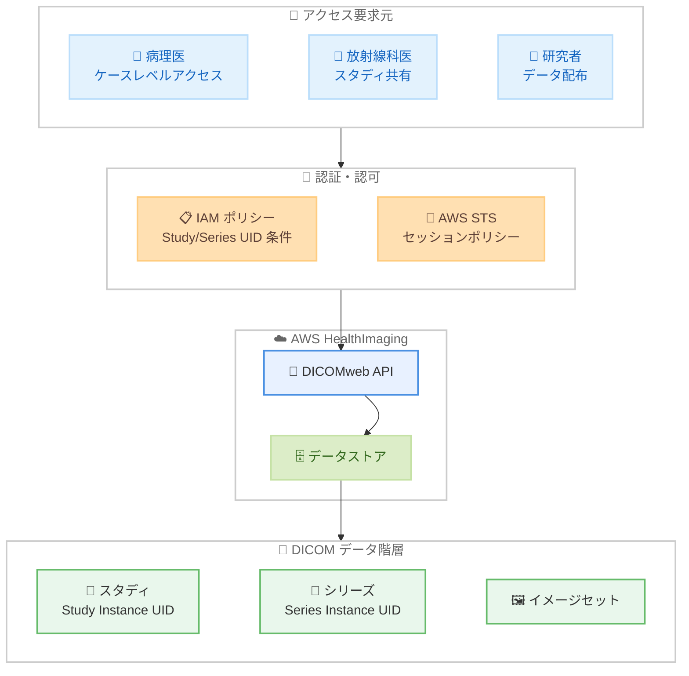

# AWS HealthImaging - スタディレベルのきめ細かなアクセス制御

**リリース日**: 2026 年 3 月 27 日
**サービス**: AWS HealthImaging
**機能**: Study-level fine-grained access control

📊 [このアップデートのインフォグラフィックを見る](https://takech9203.github.io/aws-news-summary/20260327-aws-healthimaging-study-level-access-control.html)

## 概要

AWS HealthImaging が DICOM スタディおよびシリーズレベルでのきめ細かなアクセス制御をサポートしました。医療画像ワークフローは通常 DICOM スタディを中心に構成されており、AWS HealthImaging では 1 つ以上のイメージセットリソースとして保存されます。今回のアップデートにより、IAM ポリシーで DICOM Study Instance UID や Series Instance UID を直接指定してアクセス権限を管理できるようになりました。

これにより、個々のイメージセット ARN を列挙する必要がなくなり、ポリシー管理が大幅に簡素化されます。また、AWS Security Token Service (STS) セッションポリシーを使用した動的な一時的アクセス許可の発行が可能となり、低レイテンシーの認証を実現します。データストア全体ではなく特定のスタディやシリーズにアクセスをスコープすることで、保護対象医療情報 (PHI) のセキュリティが強化されます。

**アップデート前の課題**

- DICOMweb API のアクセス制御には個々のイメージセット ARN を IAM ポリシーに列挙する必要があり、ポリシーの管理が煩雑だった
- DICOM スタディやシリーズ単位でのアクセス制御ができず、データストア全体へのアクセス許可が必要だった
- 外部パートナーとの画像共有や研究データ配布において、必要最小限のアクセス権限を付与することが困難だった

**アップデート後の改善**

- DICOM Study Instance UID および Series Instance UID を IAM ポリシーの条件キーとして直接使用可能に
- AWS STS セッションポリシーによる動的な一時的アクセス許可の発行で、低レイテンシーの認証を実現
- スタディやシリーズ単位でのスコープされたアクセス制御により、PHI の保護が強化

## アーキテクチャ図



IAM ポリシーまたは STS セッションポリシーで DICOM Study Instance UID や Series Instance UID を条件として指定し、DICOMweb API を経由して特定のスタディやシリーズにスコープされたアクセスを実現する全体フローを示しています。

## サービスアップデートの詳細

### 主要機能

1. **DICOM UID ベースの IAM ポリシー条件**
   - DICOM Study Instance UID および Series Instance UID を IAM ポリシーの条件キーとして使用可能
   - 個々のイメージセット ARN を列挙する必要がなく、ポリシー管理が大幅に簡素化
   - DICOMweb API に対するアクセス許可を DICOM の標準的な識別子で制御

2. **STS セッションポリシーによる動的アクセス許可**
   - AWS STS を使用して一時的なアクセス許可を動的に発行
   - 低レイテンシーの認証で、リアルタイムなアクセス制御を実現
   - セッション単位でスタディやシリーズレベルのスコープを設定可能

3. **PHI の保護強化**
   - データストア全体ではなく、特定のスタディやシリーズにアクセスをスコープ
   - 最小権限の原則に基づいた医療画像データのアクセス管理
   - HIPAA 適格サービスとしてのコンプライアンス要件を強化

## 技術仕様

### アクセス制御の概要

| 項目 | 詳細 |
|------|------|
| 対象 API | DICOMweb API |
| 条件キー | DICOM Study Instance UID、Series Instance UID |
| 認証方式 | IAM ポリシー、AWS STS セッションポリシー |
| アクセススコープ | スタディレベル、シリーズレベル |
| コンプライアンス | HIPAA 適格 |
| 従来方式 | イメージセット ARN ベース |

### API 変更履歴

直近 30 日間で HealthImaging に関連する API 変更は検出されませんでした。

### IAM ポリシー設定例

```json
{
    "Version": "2012-10-17",
    "Statement": [
        {
            "Effect": "Allow",
            "Action": [
                "medical-imaging:SearchImageSets",
                "medical-imaging:GetImageSet",
                "medical-imaging:GetImageFrame"
            ],
            "Resource": "arn:aws:medical-imaging:us-east-1:123456789012:datastore/datastoreId/*",
            "Condition": {
                "StringEquals": {
                    "medical-imaging:StudyInstanceUID": "1.2.840.113619.2.55.3.604688119.969.1234567890.123"
                }
            }
        }
    ]
}
```

### STS セッションポリシーの使用例

```json
{
    "Version": "2012-10-17",
    "Statement": [
        {
            "Effect": "Allow",
            "Action": [
                "medical-imaging:SearchImageSets",
                "medical-imaging:GetImageSet",
                "medical-imaging:GetImageFrame"
            ],
            "Resource": "arn:aws:medical-imaging:us-east-1:123456789012:datastore/datastoreId/*",
            "Condition": {
                "StringEquals": {
                    "medical-imaging:SeriesInstanceUID": "1.2.840.113619.2.55.3.604688119.969.1234567890.456"
                }
            }
        }
    ]
}
```

## 設定方法

### 前提条件

1. AWS アカウントと AWS HealthImaging データストアの作成
2. DICOM データがデータストアにインポート済み
3. IAM ポリシーの作成権限

### 手順

#### ステップ 1: スタディレベルのアクセスを許可する IAM ポリシーを作成

特定の DICOM Study Instance UID に対するアクセスを許可する IAM ポリシーを作成します。

```bash
aws iam create-policy \
    --policy-name HealthImagingStudyAccess \
    --policy-document '{
        "Version": "2012-10-17",
        "Statement": [
            {
                "Effect": "Allow",
                "Action": [
                    "medical-imaging:SearchImageSets",
                    "medical-imaging:GetImageSet",
                    "medical-imaging:GetImageFrame"
                ],
                "Resource": "arn:aws:medical-imaging:us-east-1:123456789012:datastore/datastoreId/*",
                "Condition": {
                    "StringEquals": {
                        "medical-imaging:StudyInstanceUID": "1.2.840.113619.2.55.3.604688119.969.1234567890.123"
                    }
                }
            }
        ]
    }'
```

IAM ポリシーを作成し、DICOMweb API のアクセスを特定の Study Instance UID にスコープするコマンドです。`Condition` ブロックで `medical-imaging:StudyInstanceUID` 条件キーを指定しています。

#### ステップ 2: STS を使用して一時的なアクセス認証情報を発行

外部パートナーや一時的なアクセスが必要なユーザーに対して、STS セッションポリシーでスコープされた一時認証情報を発行します。

```bash
aws sts assume-role \
    --role-arn arn:aws:iam::123456789012:role/HealthImagingAccess \
    --role-session-name radiologist-session \
    --policy '{
        "Version": "2012-10-17",
        "Statement": [
            {
                "Effect": "Allow",
                "Action": [
                    "medical-imaging:SearchImageSets",
                    "medical-imaging:GetImageSet",
                    "medical-imaging:GetImageFrame"
                ],
                "Resource": "arn:aws:medical-imaging:us-east-1:123456789012:datastore/datastoreId/*",
                "Condition": {
                    "StringEquals": {
                        "medical-imaging:StudyInstanceUID": "1.2.840.113619.2.55.3.604688119.969.1234567890.123"
                    }
                }
            }
        ]
    }'
```

`aws sts assume-role` コマンドでセッションポリシーを指定し、特定のスタディにスコープされた一時認証情報を発行するコマンドです。これにより、外部パートナーに対して必要最小限のアクセス権限を付与できます。

#### ステップ 3: DICOMweb API でスタディデータにアクセス

発行された一時認証情報を使用して、DICOMweb API 経由でスタディデータにアクセスします。

```bash
# 一時認証情報を環境変数に設定後、DICOMweb API で検索
aws medical-imaging search-image-sets \
    --datastore-id datastoreId \
    --search-criteria '{
        "filters": [
            {
                "operator": "EQUAL",
                "values": [
                    {
                        "DICOMStudyInstanceUID": "1.2.840.113619.2.55.3.604688119.969.1234567890.123"
                    }
                ]
            }
        ]
    }'
```

STS で取得した一時認証情報を使用して、スコープされたスタディのイメージセットを検索するコマンドです。IAM ポリシーの条件キーにより、許可されたスタディのデータのみが返されます。

## メリット

### ビジネス面

- **コンプライアンス強化**: 最小権限の原則に基づく PHI アクセス管理により、HIPAA コンプライアンスの遵守を支援
- **外部パートナーとの安全な連携**: STS セッションポリシーによる一時的かつスコープされたアクセス許可で、外部の放射線科医や研究機関との安全な画像共有が可能
- **運用コスト削減**: イメージセット ARN の個別管理が不要になり、IAM ポリシーの管理工数を大幅に削減

### 技術面

- **ポリシー管理の簡素化**: DICOM 標準の UID を条件キーとして使用することで、イメージセット ARN の列挙が不要に
- **低レイテンシー認証**: STS セッションポリシーによる動的なアクセス許可で、リアルタイムなアクセス制御を実現
- **DICOM ワークフローとの親和性**: DICOM の標準的な識別体系に沿ったアクセス制御により、既存の医療画像ワークフローとの統合が容易

## デメリット・制約事項

### 制限事項

- 利用可能リージョンが 5 リージョンに限定されており、アジア太平洋では東京リージョンが未対応
- DICOM Study Instance UID および Series Instance UID の管理はユーザー側の責任であり、UID の正確な把握が必要
- IAM ポリシーの条件キーで指定できる UID の数にはポリシーサイズの上限が適用される

### 考慮すべき点

- 既存の IAM ポリシーをイメージセット ARN ベースから UID ベースに移行する場合、段階的な移行計画が必要
- STS セッションポリシーの有効期限管理を適切に行い、期限切れによるアクセス中断を防止する必要がある
- 複数のスタディやシリーズにまたがるアクセスが必要な場合、ポリシー設計の複雑さが増す可能性がある

## ユースケース

### ユースケース 1: 病理医のケースレベルアクセス

**シナリオ**: 病理診断において、特定の患者のケースを担当する病理医に対し、該当するスタディのみへのアクセスを許可したい。他の患者データへの不正アクセスを防ぎながら、必要な画像データに効率的にアクセスさせる。

**実装例**:
```json
{
    "Version": "2012-10-17",
    "Statement": [
        {
            "Effect": "Allow",
            "Action": [
                "medical-imaging:SearchImageSets",
                "medical-imaging:GetImageSet",
                "medical-imaging:GetImageFrame"
            ],
            "Resource": "arn:aws:medical-imaging:us-east-1:123456789012:datastore/datastoreId/*",
            "Condition": {
                "StringEquals": {
                    "medical-imaging:StudyInstanceUID": [
                        "1.2.840.113619.2.55.3.604688119.969.1234567890.100",
                        "1.2.840.113619.2.55.3.604688119.969.1234567890.101"
                    ]
                }
            }
        }
    ]
}
```

**効果**: 担当ケースのスタディのみにアクセスを限定することで、PHI の保護を強化しつつ、病理医の業務効率を維持

### ユースケース 2: 外部放射線科医とのスタディ共有

**シナリオ**: 遠隔読影のために外部の放射線科医と特定のスタディを共有する必要がある。STS セッションポリシーで一時的なアクセス許可を発行し、読影完了後にアクセスを自動的に失効させたい。

**実装例**:
```bash
aws sts assume-role \
    --role-arn arn:aws:iam::123456789012:role/ExternalRadiologistAccess \
    --role-session-name external-radiologist-001 \
    --duration-seconds 3600 \
    --policy '{
        "Version": "2012-10-17",
        "Statement": [
            {
                "Effect": "Allow",
                "Action": [
                    "medical-imaging:SearchImageSets",
                    "medical-imaging:GetImageSet",
                    "medical-imaging:GetImageFrame"
                ],
                "Resource": "arn:aws:medical-imaging:us-east-1:123456789012:datastore/datastoreId/*",
                "Condition": {
                    "StringEquals": {
                        "medical-imaging:StudyInstanceUID": "1.2.840.113619.2.55.3.604688119.969.1234567890.200"
                    }
                }
            }
        ]
    }'
```

**効果**: 1 時間の有効期限付き一時認証情報により、外部放射線科医に対して特定のスタディのみへの時限アクセスを安全に提供

### ユースケース 3: 研究データの制御された配布

**シナリオ**: 医療研究プロジェクトにおいて、研究者に対して特定のシリーズレベルでデータアクセスを許可したい。研究対象の画像シリーズのみにアクセスを限定し、同一スタディ内の他のシリーズへのアクセスを制限する。

**実装例**:
```json
{
    "Version": "2012-10-17",
    "Statement": [
        {
            "Effect": "Allow",
            "Action": [
                "medical-imaging:SearchImageSets",
                "medical-imaging:GetImageSet",
                "medical-imaging:GetImageFrame"
            ],
            "Resource": "arn:aws:medical-imaging:us-east-1:123456789012:datastore/datastoreId/*",
            "Condition": {
                "StringEquals": {
                    "medical-imaging:SeriesInstanceUID": [
                        "1.2.840.113619.2.55.3.604688119.969.1234567890.300",
                        "1.2.840.113619.2.55.3.604688119.969.1234567890.301"
                    ]
                }
            }
        }
    ]
}
```

**効果**: シリーズレベルのアクセス制御により、研究目的に必要な画像データのみを提供し、患者の PHI 保護と研究データの適切な管理を両立

## 料金

AWS HealthImaging のきめ細かなアクセス制御機能自体に追加料金はありません。AWS HealthImaging の標準料金および AWS STS の標準料金が適用されます。

### 料金例

| 項目 | 料金 |
|------|------|
| データストレージ | $0.026 / GB / 月 |
| DICOMweb API リクエスト | API リクエスト数に基づく従量課金 |
| AWS STS API 呼び出し | 追加料金なし |

詳細は [AWS HealthImaging 料金ページ](https://aws.amazon.com/healthimaging/pricing/) を参照してください。

## 利用可能リージョン

以下の 5 リージョンで利用可能です。

| リージョン | リージョンコード |
|------------|------------------|
| 米国東部 (バージニア北部) | us-east-1 |
| 米国西部 (オレゴン) | us-west-2 |
| アジア太平洋 (シドニー) | ap-southeast-2 |
| 欧州 (アイルランド) | eu-west-1 |
| 欧州 (ロンドン) | eu-west-2 |

## 関連サービス・機能

- **AWS HealthImaging**: HIPAA 適格な医療画像の保存、分析、共有サービス
- **AWS IAM**: アクセス制御ポリシーの管理。今回の条件キーを使用したきめ細かなアクセス制御の基盤
- **AWS STS**: 一時的なセキュリティ認証情報の発行。動的なアクセス許可の発行に使用
- **AWS CloudTrail**: API 呼び出しの監査ログ。医療画像データへのアクセス監査に活用
- **DICOM 標準**: 医療画像の国際標準規格。Study Instance UID および Series Instance UID はこの標準に基づく識別子

## 参考リンク

- 📊 [インフォグラフィック](https://takech9203.github.io/aws-news-summary/20260327-aws-healthimaging-study-level-access-control.html)
- [公式発表 (What's New)](https://aws.amazon.com/about-aws/whats-new/2026/03/aws-healthimaging-study-level-access-control/)
- [AWS HealthImaging デベロッパーガイド](https://docs.aws.amazon.com/healthimaging/latest/devguide/what-is.html)
- [AWS HealthImaging 料金](https://aws.amazon.com/healthimaging/pricing/)

## まとめ

AWS HealthImaging のスタディレベルきめ細かなアクセス制御により、DICOM Study Instance UID および Series Instance UID を IAM ポリシーの条件キーとして使用し、医療画像データへのアクセスをスタディやシリーズ単位でスコープできるようになりました。AWS STS セッションポリシーとの組み合わせにより、外部パートナーへの一時的なアクセス許可発行も低レイテンシーで実現できます。病理診断、遠隔読影、研究データ配布など、医療画像の共有が求められるユースケースにおいて、PHI の保護と業務効率の両立を実現する重要なアップデートです。
