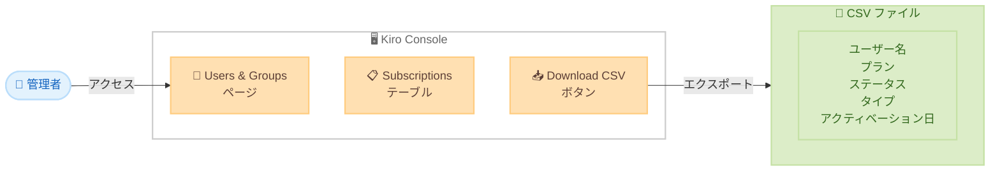

# Kiro Console - サブスクリプションデータの CSV ダウンロード

**リリース日**: 2026年3月27日
**サービス**: Kiro
**機能**: Download subscription data as CSV

[このアップデートのインフォグラフィックを見る](https://takech9203.github.io/aws-news-summary/20260327-kiro-changelog-2026-03-27.html)

## 概要

Kiro Console の Users & Groups ページに、サブスクリプションデータを CSV ファイルとしてエクスポートする機能が追加されました。管理者は Subscriptions テーブルに新しく追加された「Download CSV」ボタンをクリックするだけで、ユーザー名、サブスクリプションプラン、ステータス、タイプ、アクティベーション日などの情報を CSV 形式でダウンロードできます。

この機能は、組織内の Kiro サブスクリプション利用状況を外部ツールで分析・管理する必要がある管理者を主な対象としています。CSV 形式でのエクスポートにより、Excel やスプレッドシートアプリケーションでのデータ加工、社内レポートの作成、ライセンス管理の効率化が可能になります。

**アップデート前の課題**

- サブスクリプションデータは Kiro Console の画面上でのみ確認可能で、外部ツールへのエクスポート手段がなかった
- ライセンス利用状況のレポートを作成する際に、画面の情報を手動で転記する必要があった
- 大規模な組織ではユーザー数が多く、画面上でのデータ確認や管理が煩雑だった

**アップデート後の改善**

- Subscriptions テーブルから「Download CSV」ボタンで即座にデータをエクスポート可能に
- ユーザー名、プラン、ステータス、タイプ、アクティベーション日を含む構造化データを CSV 形式で取得可能に
- エクスポートしたデータを Excel やスプレッドシートで加工・分析でき、管理業務の効率が向上

## アーキテクチャ図

この図は、管理者が Kiro Console の Users & Groups ページにアクセスし、Subscriptions テーブルから CSV ファイルをダウンロードするまでの流れを示しています。

## サービスアップデートの詳細

### 主要機能

1. **CSV ダウンロードボタン**
   - Users & Groups ページの Subscriptions テーブルに「Download CSV」ボタンが追加
   - ワンクリックでサブスクリプションデータをエクスポート可能

2. **エクスポートされるデータフィールド**
   - ユーザー名 (User Name)
   - サブスクリプションプラン (Subscription Plan)
   - ステータス (Status)
   - タイプ (Type)
   - アクティベーション日 (Activation Date)

## 技術仕様

### CSV エクスポート項目

| フィールド | 説明 |
|-----------|------|
| User Name | サブスクリプションに紐づくユーザーの名前 |
| Subscription Plan | ユーザーが利用しているプラン |
| Status | サブスクリプションの現在のステータス |
| Type | サブスクリプションのタイプ |
| Activation Date | サブスクリプションの有効化日 |

## 設定方法

### 前提条件

1. Kiro Console への管理者権限でのアクセスが可能であること
2. 組織にサブスクリプションが存在すること

### 手順

#### ステップ 1: Kiro Console にアクセス

Kiro Console にログインし、左側のナビゲーションから「Users & Groups」ページに移動します。

#### ステップ 2: CSV ファイルのダウンロード

Subscriptions テーブルに表示されている「Download CSV」ボタンをクリックします。ブラウザのダウンロード機能によりサブスクリプションデータを含む CSV ファイルが保存されます。

#### ステップ 3: データの活用

ダウンロードした CSV ファイルを Excel、Google Sheets、その他のスプレッドシートアプリケーションで開き、フィルタリング、ソート、ピボットテーブルなどを活用してデータを分析します。

## メリット

### ビジネス面

- **ライセンス管理の効率化**: サブスクリプションデータを CSV で一括取得することで、ライセンスの棚卸しやコスト分析が迅速に実施可能
- **レポート作成の簡素化**: 手動でのデータ転記が不要となり、社内向けの利用状況レポートを効率的に作成可能
- **監査対応の改善**: サブスクリプション情報をエクスポートして保存することで、監査やコンプライアンス対応に活用可能

### 技術面

- **データの二次利用**: CSV 形式により、既存の分析ツールやスクリプトでの処理が容易
- **操作のシンプルさ**: API を使用せずにブラウザ上のボタン操作のみでデータ取得が完了

## デメリット・制約事項

### 制限事項

- エクスポートされるフィールドはユーザー名、プラン、ステータス、タイプ、アクティベーション日の 5 項目に限定
- Kiro Console の管理者権限が必要

### 考慮すべき点

- 大規模な組織の場合、CSV ファイルのサイズが大きくなる可能性がある
- エクスポートされたデータには個人情報が含まれるため、適切なアクセス管理と保管が必要

## ユースケース

### ユースケース 1: 月次ライセンスレポートの作成

**シナリオ**: IT 管理部門が毎月のライセンス利用状況を経営層に報告する必要がある。

**実装例**:
Kiro Console の Users & Groups ページから CSV をダウンロードし、Excel でピボットテーブルを作成してプラン別のユーザー数やアクティブ率を集計する。

**効果**: 手動でのデータ収集が不要となり、毎月のレポート作成にかかる時間を大幅に削減できる。

### ユースケース 2: ライセンスコストの最適化

**シナリオ**: 組織内で未使用または非アクティブなサブスクリプションを特定し、ライセンスコストを最適化したい。

**実装例**:
CSV データをダウンロードし、ステータスフィールドでフィルタリングして非アクティブなサブスクリプションを抽出する。

**効果**: 未使用ライセンスを迅速に特定でき、不要なサブスクリプションの整理によるコスト削減が可能になる。

## 料金

CSV ダウンロード機能は Kiro Console の管理機能の一部として提供されており、追加料金は発生しません。

## 利用可能リージョン

グローバル (Kiro はグローバルサービスとして提供)

## 関連サービス・機能

- **Kiro Console**: Kiro の管理コンソール。サブスクリプション、ユーザー、グループの管理を提供するウェブインターフェース
- **Kiro Enterprise**: 組織向けの Kiro プラン。管理者機能やユーザー管理を含むエンタープライズ向け機能を提供

## 参考リンク

- [このアップデートのインフォグラフィック](https://takech9203.github.io/aws-news-summary/20260327-kiro-changelog-2026-03-27.html)
- [公式発表 (Kiro Changelog)](https://kiro.dev/changelog/)
- [Kiro ドキュメント](https://kiro.dev/docs/)

## まとめ

Kiro Console の Users & Groups ページに CSV ダウンロード機能が追加され、管理者はサブスクリプションデータを簡単にエクスポートできるようになりました。ユーザー名、プラン、ステータス、タイプ、アクティベーション日の 5 つのフィールドを含む CSV ファイルをワンクリックで取得でき、ライセンス管理やレポート作成の効率化に活用できます。組織内の Kiro サブスクリプションを管理している管理者は、この機能を活用してライセンスの可視化と最適化を進めることを推奨します。
